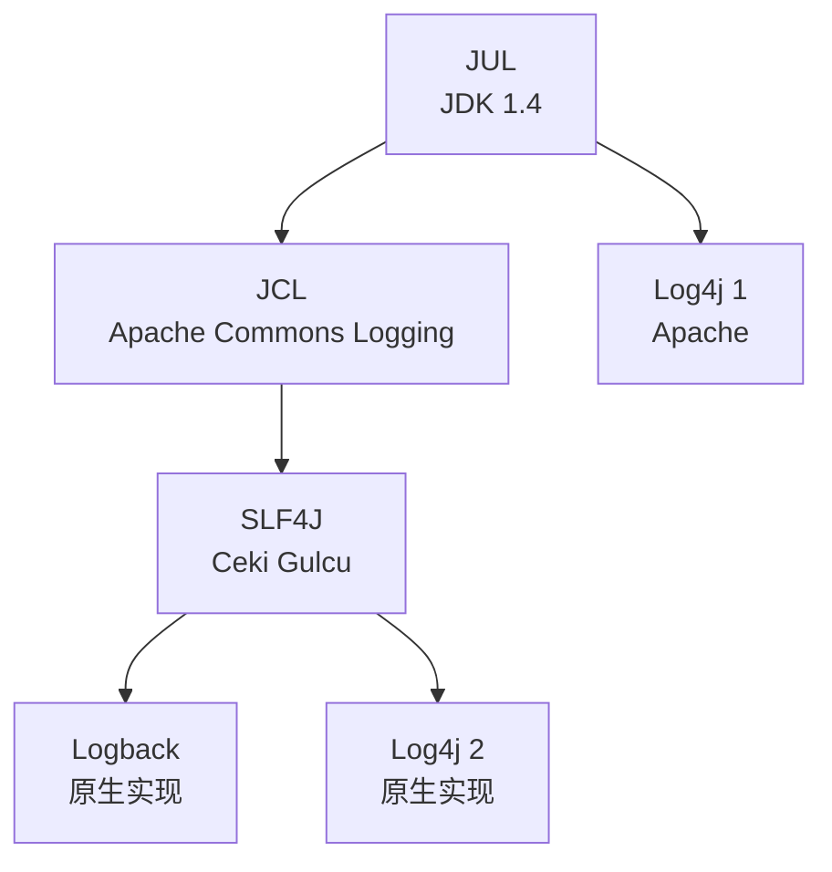

# Java 日志框架

面试官问："Java 有哪些日志框架？"

候选人小陶答："有 Log4j、SLF4J、Logback。"

面试官追问："这些框架之间的关系是什么？"

小陶说："SLF4J 是门面？"

面试官追问："为什么要用门面？直接用 Log4j 不行吗？"

小陶答不上来。

【面试官心理】
这道题考查的是候选人对 Java 日志框架生态的理解。能说出"门面模式"和"JUL/Log4j/Logback"关系的候选人，说明对设计模式和框架选型有理解。

## 一、日志框架演进 🔴



| 框架 | 类型 | 特点 |
| --- | --- | --- |
| JUL | 实现 | JDK 内置，无需依赖 |
| Log4j 1 | 实现 | Apache，早期主流，已废弃 |
| Logback | 实现 | Log4j 作者重写，性能更好 |
| Log4j 2 | 实现 | Apache，性能最强 |
| JCL | 门面 | 已过时 |
| SLF4J | **门面** | 主流选择 |

## 二、SLF4J 门面 🔴

### 2.1 为什么用门面

```java
// ❌ 直接使用实现框架
// 如果项目依赖 Log4j，后来想换成 Logback？
// 需要改所有代码！

import org.apache.log4j.Logger;
Logger log = Logger.getLogger(MyClass.class);

// ✅ 使用 SLF4J 门面
// 代码不变，切换实现只需改依赖
import org.slf4j.Logger;
import org.slf4j.LoggerFactory;

Logger log = LoggerFactory.getLogger(MyClass.class);
// 需要 slf4j-api + 某个实现（如 logback-classic）
```

### 2.2 SLF4J 的优势

```java
// 优势一：延迟计算日志参数
log.debug("User {} logged in at {}", username, time);
// 参数延迟计算，只有 debug 开启时才计算
// 比 String.format() 或 + 拼接更高效

// 优势二：统一 API
// 一套代码，对接所有日志框架

// 优势三：桥接旧框架
// jcl-over-slf4j：桥接 JCL
// log4j-over-slf4j：桥接 Log4j 1
// jul-to-slf4j：桥接 JUL
```

## 三、日志级别 🔴

```java
// 日志级别（从低到高）
logger.trace("trace");  // 追踪
logger.debug("debug");  // 调试
logger.info("info");    // 信息
logger.warn("warn");    // 警告
logger.error("error");  // 错误

// 配置级别
// Logback: <root level="INFO">
// Log4j 2: <Root level="INFO">
```

## 四、Logback 配置 🟡

```xml
<!-- logback.xml -->
<configuration>
    <appender name="CONSOLE" class="ch.qos.logback.core.ConsoleAppender">
        <encoder>
            <pattern>%d{HH:mm:ss} [%thread] %-5level %logger{36} - %msg%n</pattern>
        </encoder>
    </appender>

    <appender name="FILE" class="ch.qos.logback.core.rolling.RollingFileAppender">
        <file>app.log</file>
        <rollingPolicy class="ch.qos.logback.core.rolling.TimeBasedRollingPolicy">
            <fileNamePattern>app-%d{yyyy-MM-dd}.log</fileNamePattern>
            <maxHistory>30</maxHistory>
        </rollingPolicy>
        <encoder>
            <pattern>%d{yyyy-MM-dd HH:mm:ss} %-5level %logger - %msg%n</pattern>
        </encoder>
    </appender>

    <root level="INFO">
        <appender-ref ref="CONSOLE"/>
        <appender-ref ref="FILE"/>
    </root>

    <logger name="com.example" level="DEBUG"/>
</configuration>
```

## 五、生产选型 🟡

```java
// 生产推荐：
// slf4j-api（门面）
// + logback-classic（实现）

// 或：
// slf4j-api
// + log4j-slf4j-impl + log4j-core（Log4j 2）

// 不推荐：
// slf4j-api + slf4j-simple（功能太少）
// 直接使用实现框架（失去门面优势）
```

## 六、追问升级

**面试官**："日志框架的性能差异在哪里？"

```java
// Logback vs Log4j 1：
// Logback 的 autoConfig 自动重载配置
// Logback 的条件处理（<if>）减少无用日志
// Logback 的日志滤波器

// Log4j 2 vs Logback：
// Log4j 2 的异步日志器性能最好
// Log4j 2 的 Disruptor 无锁队列
// Log4j 2 的插件系统

// 生产推荐 Log4j 2 的异步日志
```
