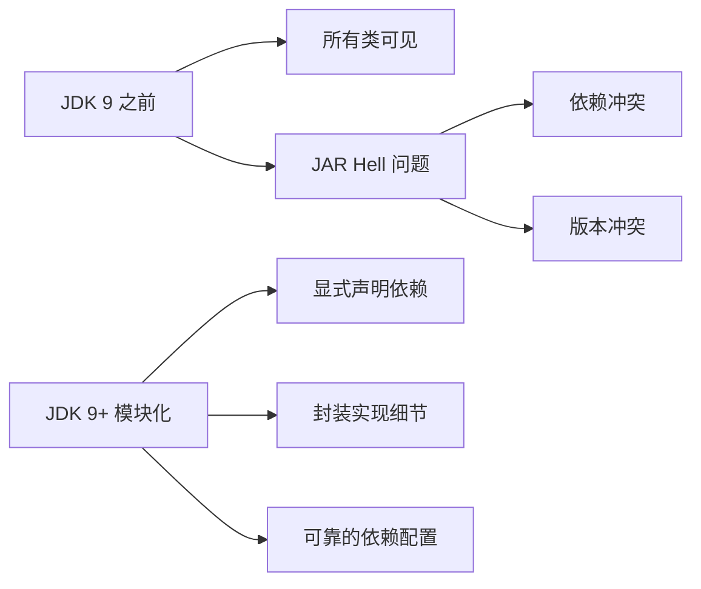

# Java 9 模块化

> **目标级别**：P5/P6
> **面试频率**：🟢 低频了解（`<` 40%）

## 快速自测

面试官最关心的 3 个问题：

1. 什么是 Java 模块化？
2. module-info.java 的作用是什么？
3. 模块化解决了什么问题？

如果这三个问题你都能完整回答，可以跳过本文。

## 一、模块化的概念

### 1.1 什么是 JPMS

> JPMS（Java Platform Module System）是 Java 9 引入的模块化系统，通过 `module-info.java` 声明模块的依赖和导出。

### 1.2 模块化的目标



---

## 二、module-info.java

### 2.1 基本结构

```java title="module-info.java"
module com.example.myapp {  // [!code highlight] 模块名

    // 依赖其他模块
    requires com.example.utils;  // [!code highlight]
    requires org.springframework.core;

    // 导出包（其他模块可访问）
    exports com.example.myapp.api;  // [!code highlight]
    exports com.example.myapp.dto;

    // 导出并指定可访问者
    exports com.example.internal to org.springframework.core;  // [!code highlight]
}
```

### 2.2 关键字对照表

| 关键字 | 说明 | 示例 |
|--------|------|------|
| module | 定义模块 | `module com.example {}` |
| requires | 声明依赖 | `requires java.sql;` |
| exports | 导出包 | `exports com.example.api;` |
| exports...to | 限定导出 | `exports com.example to org.springframework;` |
| provides | 提供服务 | `provides MyService with MyServiceImpl;` |
| uses | 使用服务 | `uses com.example.MyService;` |
| opens | 开放包（反射） | `opens com.example.internal;` |

---

## 三、模块化解决的问题

### 3.1 封装实现细节

```java title="module-info.java"
module com.example.internal {
    // 只导出 API 包
    exports com.example.internal.api;

    // internal.impl 不导出，外部无法访问
}
```

### 3.2 可靠的依赖配置

```java title="module-info.java"
module com.example.app {
    // 明确声明依赖，缺失会在启动时报错
    requires com.example.library;

    // 声明使用的 SPI
    uses com.example.spi.Service;
}
```

---

## 四、高频追问链

> **第一层**：什么是 Java 模块化？
>
> **第二层**：module-info.java 有什么作用？
>
> **第三层**：模块化和 JAR 包有什么区别？

---

## 五、常见错误与陷阱

### ⚠️ 陷阱 1：访问未导出的包

```java
// 模块 A
module com.example.internal {
    // 只导出 api 包
    exports com.example.internal.api;

    // internal 包未导出
}

// 模块 B
module com.example.app {
    requires com.example.internal;

    // [!code error] 无法访问未导出的包
    import com.example.internal.impl.Impl;  // [!code error]
}
```

### ⚠️ 陷阱 2：循环依赖

```java
// [!code error] 编译错误：模块之间不允许循环依赖
module A { requires B; }
module B { requires A; }
```

---

## 六、加分回答

💡 **超出预期的深度**：

### 1. JDK 自身的模块化

```bash
# 查看 JDK 模块
java --list-modules

# 输出
java.base@17
java.sql@17
java.xml@17
...
```

### 2. 迁移策略

```java title="module-info.java (自动模块)
// 自动模块：从 JAR 自动生成
// 模块名从 JAR 名推导
// 默认导出所有包
// 默认可传递依赖
```

---

## 七、扩展思考

1. **模块化对应用开发有什么影响？** —— 大多数应用不需要关心，除非构建可插拔系统
2. **为什么不推荐在业务代码中使用模块化？** —— 增加复杂度，Spring 等框架已经做了封装
3. **Java 17 的模块化有什么改进？** —— 增强了封装性，支持更多场景
