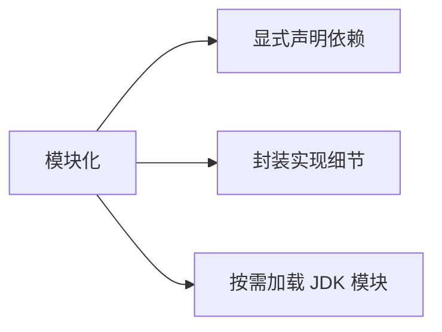

# Java 9 模块化

面试官问："Java 9 有什么新特性？"

候选人小肖答："接口私有方法、Stream API 增强..."

面试官追问："那 Java 9 的模块化是什么？为什么要引入模块化？"

小肖说："呃... 就是把代码组织成模块？"

面试官追问："模块化和 JAR 包有什么区别？`requires` 和 `exports` 是干什么的？"

小肖彻底答不上来。

【面试官心理】
这道题考查的是候选人对 Java 演进历史的理解。模块化是 Java 9 最重要的特性，能说清楚它的前世今生和核心概念，说明真正理解 Java 平台的演进方向。

---

## 一、为什么需要模块化？🔴

### 1.1 JAR 包的局限性

在没有模块化之前，Java 使用 JAR 包来组织代码。但 JAR 包有这些问题：

```java
// JAR 包的问题：
// 1. 无法显式声明依赖关系
// 2. 无法控制哪些类可以对外暴露
// 3. 同一个类名可能出现在多个 JAR 中（类路径顺序决定加载哪个）
```

### 1.2 JDK 太大

在 Java 9 之前，整个 JDK 是一个巨大的类路径：
- `rt.jar` 包含 3 万多个类
- 应用只需要其中一小部分
- 启动慢，内存占用大

### 1.3 模块化的目标



---

## 二、模块的定义 🔴

### 2.1 module-info.java

模块通过 `module-info.java` 文件定义：

```java
// 位置：模块根目录下
// 编译后生成 module-info.class
module com.example.myapp {
    // 声明依赖
    requires com.example.utils;

    // 声明对外暴露的包
    exports com.example.myapp.api;

    // 条件化导出
    exports com.example.myapp.internal to com.example.foo;
}
```

### 2.2 核心关键字

| 关键字 | 作用 |
| --- | --- |
| `module` | 定义模块 |
| `requires` | 声明依赖其他模块 |
| `exports` | 导出包（对外可见） |
| `opens` / `open` | 允许反射访问 |
| `provides` / `uses` | 服务提供/发现 |

### 2.3 示例：定义一个模块

```java
// module-info.java
module com.example.greetings {
    // 依赖 Java 标准库
    requires java.base;  // 隐式依赖，可省略

    // 导出 API 包
    exports com.example.greetings.api;

    // 仅限特定模块可访问内部包
    exports com.example.greetings.internal to com.example.foo;
}
```

---

## 三、模块之间的依赖 🔴

### 3.1 requires 子句

```java
module com.example.app {
    // 依赖其他模块
    requires com.example.library;

    // 依赖传递（默认不包括）
    // A requires B, B requires C → A 不能用 C
}
```

### 3.2 transitive 关键字（可传递依赖）

```java
module com.example.library {
    requires transitive com.example.utils;
}
```

这样 `com.example.app` 依赖 `com.example.library` 时，也自动获得 `com.example.utils` 的依赖。

### 3.3 exports 与 exports ... to

```java
module com.example.greetings {
    // 导出整个包
    exports com.example.greetings.api;

    // 导出给特定模块
    exports com.example.greetings.internal to com.example.foo, com.example.bar;
}
```

---

## 四、服务发现与提供 🔴

### 4.1 uses 和 provides

```java
// 定义服务接口
module com.example.greetings {
    exports com.example.greetings.spi;

    // 声明可以使用某个服务
    uses com.example.greetings.spi.GreetingService;
}
```

```java
// 实现服务
module com.example.english {
    // 提供服务的实现
    provides com.example.greetings.spi.GreetingService
        with com.example.english.EnglishGreetingService;
}
```

### 4.2 ServiceLoader 加载服务

```java
// 使用 ServiceLoader 加载服务实现
ServiceLoader<GreetingService> loader = ServiceLoader.load(GreetingService.class);
for (GreetingService service : loader) {
    service.greet();  // 调用实际实现
}
```

---

## 五、反射访问与 open 模块 🟡

### 5.1 为什么需要 open？

很多框架（如 Spring、Hibernate）需要通过反射访问类的私有成员。

在没有模块化之前，反射可以访问任意类。模块化后，私有成员默认不可访问。

### 5.2 opens 关键字

```java
module com.example.myapp {
    // 允许反射访问整个包
    opens com.example.myapp.internal;

    // 允许特定模块反射访问
    opens com.example.myapp.internal to com.example.spring;
}
```

### 5.3 --add-opens 启动参数

```bash
# 启动时添加开放权限
java --add-opens com.example.myapp/com.example.myapp.internal=ALL-UNNAMED
```

---

## 六、模块路径 vs 类路径 🟡

### 6.1 两者的区别

| 维度 | 类路径 (Class-Path) | 模块路径 (Module-Path) |
| --- | --- | --- |
| 组织单位 | JAR | JAR 或目录 |
| 依赖声明 | Manifest 文件（可选） | module-info.java（必需） |
| 可见性控制 | 无 | exports/opens |
| 启动参数 | -cp | --module-path |

### 6.2 启动命令对比

```bash
# 类路径方式（Java 8）
java -cp lib/a.jar:lib/b.jar com.example.Main

# 模块路径方式（Java 9+）
java --module-path lib -m com.example.app/com.example.Main
```

### 6.3 混合使用

Java 9 允许混合使用模块路径和类路径：
- 类路径上的 JAR 被视为**自动模块**
- 自动模块可以访问所有其他自动模块和显式模块

---

## 七、JDK 9+ 的模块化 JDK 🔴

### 7.1 JDK 模块列表

Java 9 将 JDK 拆分成多个模块：

```bash
# 列出所有模块
java --list-modules

# 输出示例：
# java.base@17
# java.compiler@17
# java.xml@17
# jdk.jshell@17
# ...
```

### 7.2 按需编译

```bash
# 只加载需要的 JDK 模块
java --module-path $JAVA_HOME/jmods \
     --add-modules java.base,java.sql \
     -m com.example.app
```

---

## 八、面试官追问 🔴

**面试官**："模块化和 JAR 包有什么区别？"

**标准回答**：
- JAR 包没有显式依赖声明，模块化有
- JAR 包没有可见性控制，模块化有 `exports`
- 模块化可以实现按需加载 JDK 模块

**面试官追问**："`exports` 和 `opens` 有什么区别？"

**标准回答**：
- `exports`：编译时和运行时都可见
- `opens`：仅运行时反射可见（运行时可以访问私有成员）

**面试官追问**："Java 9 模块化对 Spring 有什么影响？"

**标准回答**：
- Spring 5+ 支持模块化
- 需要使用 `--add-opens` 参数开放特定包
- 部分 Spring 注解需要额外配置

---

## 九、常见问题 ⚠️

### ❌ 问题一：JAR 放在类路径上变成自动模块

```java
// 没有 module-info.java 的 JAR
// 放在模块路径上时，自动成为自动模块
// 模块名 = JAR 文件名
```

### ❌ 问题二：循环依赖

```java
// 不允许
module A { requires B; }
module B { requires A; }  // 编译错误
```

### ❌ 问题三：服务实现分离

```java
// 服务接口和实现不能在同一个模块中 provides
// 必须分开成两个模块
```

---

## 十、总结

| 概念 | 说明 |
| --- | --- |
| 模块定义 | `module-info.java` |
| 声明依赖 | `requires` |
| 导出包 | `exports` |
| 反射访问 | `opens` |
| 服务提供 | `provides ... with` |
| 服务使用 | `uses` |
| 优点 | 显式依赖、封装、按需加载 |
