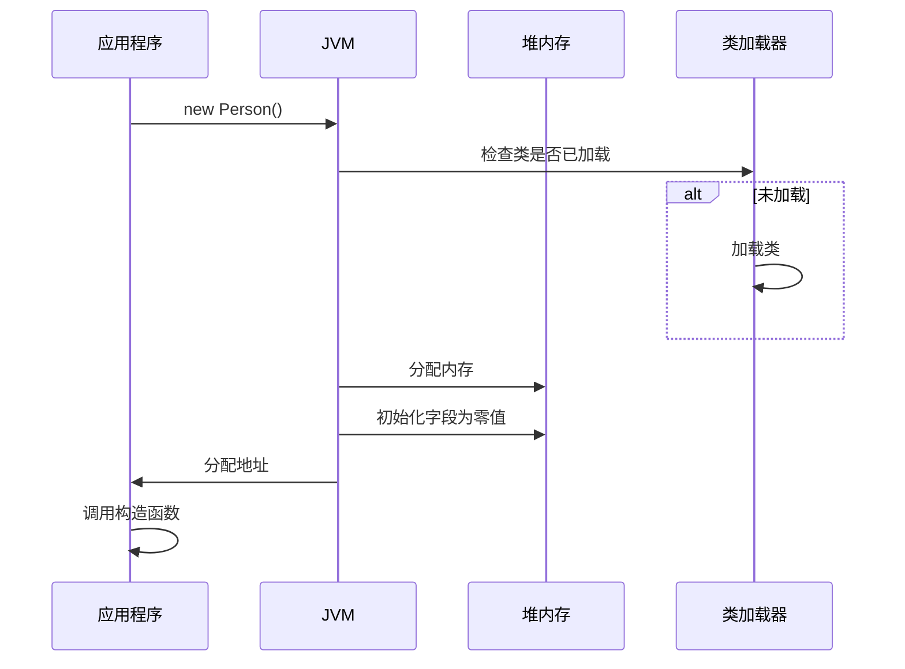

# Java 对象创建方式

> **目标级别**：P5/P6
> **面试频率**：🟡 中频常考（40%-70%）

## 快速自测

面试官最关心的 3 个问题：

1. Java 创建对象有几种方式？
2. new 和反射创建对象有什么区别？
3. 反序列化创建的对象和原对象是什么关系？

如果这三个问题你都能完整回答，可以跳过本文。

---

## 场景切入

面试官问：「Java 创建对象有几种方式？」你说「new」——然后面试官追问「那反射、克隆、序列化呢？」你愣了一下。

Java 创建对象不仅仅是 new，还有多种方式，每种方式都有其适用场景。

## 一、创建对象的 5 种方式

### 1.1 方式一览表

| 方式 | 关键字/方法 | 说明 |
|------|-------------|------|
| new | `new` | 最常用 |
| 反射 | `Class.newInstance()` / `Constructor.newInstance()` | 动态创建 |
| 克隆 | `Object.clone()` | 复制对象 |
| 反序列化 | `ObjectInputStream.readObject()` | 从字节流恢复 |
| Unsafe | `Unsafe.allocateInstance()` | 绕过构造函数 |

---

## 二、new 关键字

### 2.1 基本语法

```java
// 标准创建方式
Person person = new Person();

// 带参数
Person person = new Person("张三", 25);
```

### 2.2 创建过程



---

## 三、反射创建对象

### 3.1 Class.newInstance()

```java
// 方式1：Class.newInstance()（Java 9 已过时）
Class<?> clazz = Class.forName("com.example.Person");
Person person = (Person) clazz.newInstance();  // [!code warning] 只调用无参构造器

// 调用有参构造器
Constructor<?> constructor = clazz.getConstructor(String.class, int.class);
Person person = (Person) constructor.newInstance("张三", 25);  // [!code highlight]
```

### 3.2 Constructor.newInstance()

```java
// 推荐方式（Java 9+）
Constructor<Person> constructor = Person.class.getConstructor(String.class, int.class);
Person person = constructor.newInstance("张三", 25);  // [!code highlight]

// 私有构造器
Constructor<Person> privateConstructor = clazz.getDeclaredConstructor();
privateConstructor.setAccessible(true);
Person person = privateConstructor.newInstance();  // [!code highlight]
```

### 3.3 反射 vs new

| 特性 | new | 反射 |
|------|-----|------|
| 性能 | 快 | 慢（约 3-10 倍） |
| 调用时机 | 编译时确定 | 运行时确定 |
| 灵活性 | 低 | 高 |
| 异常处理 | 编译时检查 | 运行时抛出 |

---

## 四、克隆创建对象

### 4.1 基本语法

```java
class Person implements Cloneable {
    @Override
    protected Person clone() throws CloneNotSupportedException {
        return (Person) super.clone();  // [!code highlight] 浅拷贝
    }
}

Person p1 = new Person();
Person p2 = p1.clone();  // [!code highlight] 创建新对象
```

### 4.2 克隆的注意事项

```java
class Person implements Cloneable {
    String name;

    @Override
    protected Person clone() throws CloneNotSupportedException {
        Person cloned = (Person) super.clone();
        // [!code warning] 如果有引用类型，需要手动深拷贝
        // cloned.name = this.name; // 基本类型已经复制
        return cloned;
    }
}
```

:::tip 克隆的限制
1. 必须实现 Cloneable 接口
2. clone() 方法可能抛出 CloneNotSupportedException
3. 默认是浅拷贝
4. 访问权限可能受限
:::

---

## 五、反序列化创建对象

### 5.1 基本语法

```java
// 序列化
Person original = new Person("张三", 25);
ObjectOutputStream out = new ObjectOutputStream(new FileOutputStream("person.ser"));
out.writeObject(original);

// [!code highlight] 反序列化创建新对象
ObjectInputStream in = new ObjectInputStream(new FileInputStream("person.ser"));
Person restored = (Person) in.readObject();  // [!code highlight] 新对象！
```

### 5.2 反序列化的特点

```java
// 特点1：创建新对象，不调用构造函数
// 特点2：构造函数中的代码不会执行
// 特点3：单例对象反序列化后会破坏单例性

class Singleton implements Serializable {
    private static final Singleton INSTANCE = new Singleton();
    public static Singleton getInstance() { return INSTANCE; }

    // [!code highlight] 防止反序列化破坏单例
    protected Object readResolve() {
        return INSTANCE;
    }
}
```

:::warning 反序列化的特殊行为
反序列化会绕过构造函数创建对象，这可能导致：
1. 构造函数中的初始化逻辑不执行
2. 单例被破坏
3. transient 字段为默认值
:::

---

## 六、Unsafe 创建对象

### 6.1 基本语法

```java
import sun.misc.Unsafe;

Unsafe unsafe = Unsafe.getUnsafe();
Person person = (Person) unsafe.allocateInstance(Person.class);  // [!code highlight]
```

### 6.2 Unsafe 的特点

```java
// [!code warning] Unsafe.allocateInstance 特点：
// 1. 不调用构造函数
// 2. 不初始化字段
// 3. 性能最快
// 4. 只推荐用于基准测试或特殊框架
```

:::danger Unsafe 的限制
Unsafe 直接操作内存，有以下风险：
1. 字段为默认值（0, null, false）
2. 构造函数中的初始化不执行
3. 可能导致对象状态不一致
:::

---

## 七、高频追问链

> **第一层**：Java 创建对象有几种方式？
>
> **第二层**：反射创建对象和 new 有什么区别？
>
> **第三层**：反序列化创建的对象有什么特点？
>
> **第四层**：为什么说 clone 是创建对象但又不调用构造函数？

---

## 八、创建方式对比

### 8.1 性能对比

| 方式 | 相对性能 | 说明 |
|------|----------|------|
| new | 1x（基准） | 最快 |
| Constructor.newInstance | 3-10x | 反射开销 |
| Class.newInstance | 3-10x | 反射开销 |
| clone | ~1x | 内存拷贝 |
| 反序列化 | 最慢 | 字符串解析 |
| Unsafe | ~1x | 内存分配 |

### 8.2 使用场景

| 方式 | 典型场景 |
|------|----------|
| new | 日常开发 |
| 反射 | 框架（Spring、MyBatis） |
| clone | 复制已有对象 |
| 反序列化 | 网络传输、持久化 |
| Unsafe | 基准测试、高性能框架 |

---

## 九、常见错误与陷阱

### ⚠️ 陷阱 1：克隆时忘记实现 Cloneable

```java
class Person {
    @Override
    protected Person clone() {
        return new Person();  // [!code warning] 没有实现 Cloneable
    }
}

// [!code error] 调用时抛出 CloneNotSupportedException
```

### ⚠️ 陷阱 2：反序列化破坏单例

```java
class Singleton implements Serializable {
    private static final Singleton INSTANCE = new Singleton();
}

// [!code warning] 反序列化会创建新对象！

// 解决方案
protected Object readResolve() {
    return INSTANCE;  // [!code highlight]
}
```

### ⚠️ 陷阱 3：克隆为浅拷贝

```java
class Person implements Cloneable {
    Address address;  // 引用类型

    @Override
    protected Person clone() {
        return (Person) super.clone();  // [!code warning] 浅拷贝！
    }
}
```

---

## 十、加分回答

💡 **超出预期的深度**：

### 1. 对象创建的内存分配

```java
// TLAB（Thread Local Allocation Buffer）
// JVM 为每个线程预分配一块内存区域
// 对象分配在 TLAB 中，无需同步

// 对象头结构
// | Mark Word (8 bytes) | Klass Pointer (4/8 bytes) | padding |
// | 对象哈希码 | GC 分代年龄 | 锁状态 | 类型指针 |
```

### 2. 逃逸分析

```java
// JIT 编译器的逃逸分析
public class EscapeAnalysis {
    public static void main(String[] args) {
        // [!code highlight] 如果对象不逃逸，JIT 可以优化为栈上分配
        Point p = new Point(1, 2);
        System.out.println(p.x + p.y);
    }

    static class Point {
        int x, y;
        Point(int x, int y) {
            this.x = x;
            this.y = y;
        }
    }
}
```

### 3. 构造器链

```java
class Parent {
    Parent() { System.out.println("Parent"); }
}

class Child extends Parent {
    Child() {
        super();  // [!code highlight] 隐式调用父类构造器
        System.out.println("Child");
    }
}

// 输出：
// Parent
// Child
```

---

## 十一、扩展思考

面试结束前的延伸问题：

1. **JVM 如何保证 new 和反序列化创建的对象不同？** —— 内存分配位置不同
2. **什么是逃逸分析？有什么作用？** —— 分析对象是否逃逸出方法，优化栈上分配
3. **如何防止对象被克隆？** —— 不实现 Cloneable，或重写 clone 抛出异常
