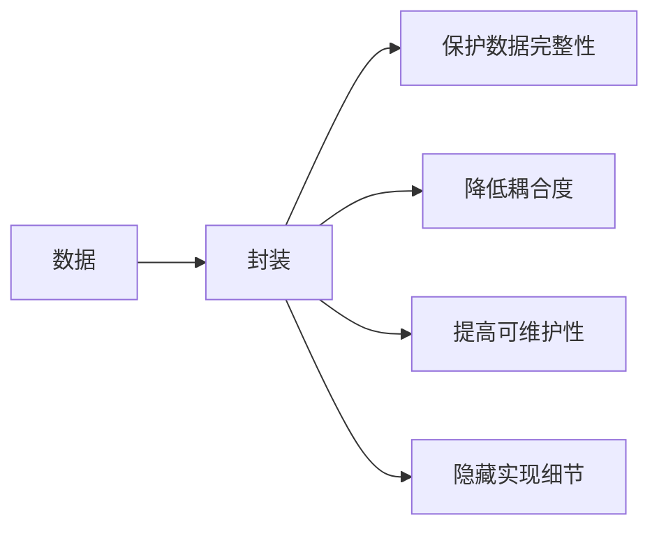
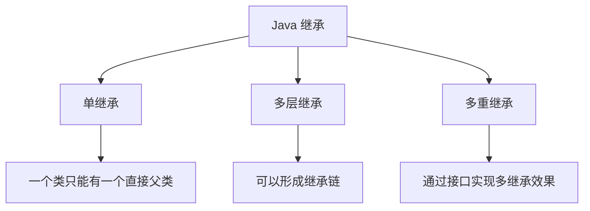
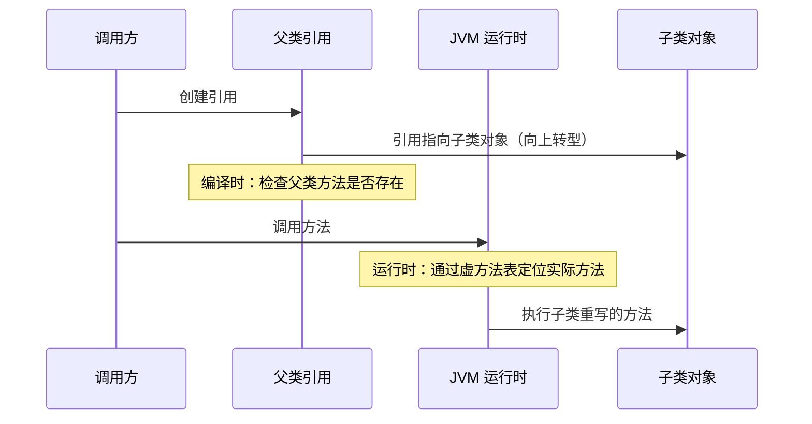
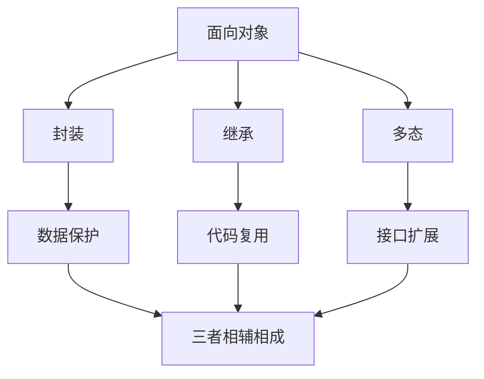

# 面向对象的三大特性是什么？

> **目标级别**：P5/P6
> **面试频率**：🔴 高频必考（>70%）

## 快速自测

面试官最关心的 3 个问题：

1. 封装、继承、多态的定义是什么？
2. 多态的实现原理是什么？向上转型有什么代价？
3. 为什么说「组合优于继承」？

如果这三个问题你都能完整回答，可以跳过本文。

---

## 场景切入

面试官问：「面向对象的三大特性是什么？」你脱口而出「封装、继承、多态」——然后面试官紧接着追问「多态是怎么实现的？父类引用指向子类对象时，调用的方法是哪个？」你沉默了。

这不是因为你不努力，而是因为大多数教材只告诉你「是什么」，却不告诉你「为什么」和「怎么用」。今天我们从面试官的角度，把这三个特性彻底讲透。

## 一、封装：信息的保护与暴露

### 1.1 什么是封装？

封装是将数据和操作数据的方法绑定在一起，对外隐藏实现细节，只暴露必要的接口。

### 1.2 封装的三个层次

| 层次 | 关键字 | 说明 | 面试频率 |
|------|--------|------|----------|
| public | public | 完全公开 | 🔴 高频 |
| 受保护 | protected | 本包及子类可见 | 🟡 中频 |
| 私有 | private | 仅本类可见 | 🔴 高频 |

### 1.3 封装的核心价值



### 1.4 面试回答模板

> **问题**：什么是封装？封装有什么好处？
>
> **回答**：封装是将数据和操作数据的方法组织在一起，对外提供统一的访问接口，隐藏内部的实现细节。好处有三个：第一，保护数据不被随意修改，通过访问控制符限制外部直接访问；第二，降低类之间的耦合度，外部只依赖接口而非实现；第三，提高代码的可维护性，内部逻辑改变时只要接口不变就不影响调用方。

---

## 二、继承：代码的复用与扩展

### 2.1 什么是继承？

继承是从已有类创建新类的机制，子类继承父类的属性和行为，可以直接使用父类的非私有成员。

### 2.2 Java 继承的特点



### 2.3 继承的面试陷阱

:::warning 常见错误
很多人以为 Java 支持多继承，这是错误的。Java 只支持**单继承**，即每个类只能有一个直接父类。但可以通过**接口**实现「多重继承」的效果。
:::

### 2.4 继承的构造器调用顺序

```java
class Parent {
    public Parent() {
        System.out.println("Parent 构造器");
    }
}

class Child extends Parent {
    public Child() {
        System.out.println("Child 构造器");
    }
}

// new Child() 输出：
// Parent 构造器
// Child 构造器
```

:::tip 构造器执行顺序
创建子类对象时，**先执行父类构造器，再执行子类构造器**。这是因为子类构造函数的第一行默认调用 `super()`。
:::

---

## 三、多态：同一个接口，不同的表现

### 3.1 什么是多态？

多态是同一个行为具有多种不同表现形式的能力。在 Java 中，主要通过**继承**和**接口**实现。

### 3.2 多态的两种形式

| 类型 | 实现方式 | 面试频率 |
|------|----------|----------|
| 编译时多态（静态多态） | 方法重载（Overload） | 🔴 高频 |
| 运行时多态（动态多态） | 方法重写（Override） | 🔴 高频 |

### 3.3 运行时多态的实现原理



### 3.4 向上转型与向下转型

```java
// 向上转型：子类对象赋值给父类引用
Animal animal = new Dog();  // 自动转型
animal.eat();  // 调用的是 Dog 的 eat 方法

// 向下转型：父类引用强制转换为子类引用
Animal animal = new Dog();
Dog dog = (Dog) animal;  // 需要强制转型
dog.bark();  // 可以调用 Dog 特有方法
```

:::warning ⚠️ 向下转型的坑
向下转型前必须使用 `instanceof` 检查类型，否则会抛出 `ClassCastException`。
:::

### 3.5 多态的代价

```java
// 面试官追问：多态有什么代价？
// 回答要点：
// 1. 运行时需要通过虚方法表查找实际方法，有轻微性能开销
// 2. 无法访问子类特有的成员（需要向下转型）
// 3. 构造器中的多态调用可能导致问题
```

---

## 四、三大特性的关联与对比

### 4.1 特性关系图



### 4.2 三大特性对比表

| 特性 | 核心作用 | 实现方式 | 关键字 |
|------|----------|----------|--------|
| 封装 | 数据保护 | 访问控制符 | private/protected/public |
| 继承 | 代码复用 | 类扩展 | extends |
| 多态 | 接口扩展 | 重写/重载 | override/overload |

---

## 五、高频追问链

> **第一层**：面向对象的三大特性是什么？
>
> **第二层**：多态是怎么实现的？父类引用指向子类对象时调用的是哪个方法？
>
> **第三层**：为什么 Java 只支持单继承而不支持多继承？
>
> **第四层**：组合和继承各适合什么场景？

---

## 六、常见错误与陷阱

### ⚠️ 陷阱 1：混淆重载与重写

很多人把重载（Overload）和重写（Override）混为一谈：

| 对比 | 重载 | 重写 |
|------|------|------|
| 发生时期 | 编译时 | 运行时 |
| 方法名 | 相同 | 相同 |
| 参数列表 | 必须不同 | 必须相同 |
| 返回类型 | 可以不同 | 必须相同或协变 |
| 访问修饰符 | 无限制 | 不能比父类更严格 |

### ⚠️ 陷阱 2：构造器中的多态调用

```java
class Parent {
    public Parent() {
        System.out.println("Parent 构造器");
        method();  // [!code warning]
    }
    public void method() {
        System.out.println("Parent method");
    }
}

class Child extends Parent {
    public Child() {
        System.out.println("Child 构造器");
    }
    @Override
    public void method() {
        System.out.println("Child method");  // [!code warning]
    }
}

new Child();
// 输出：
// Parent 构造器
// Child method  // [!code warning] 调用的其实是子类方法！
// Child 构造器
```

:::warning 构造器中的多态调用
在构造器中调用被子类重写的方法是危险的，因为此时子类对象可能还没完全初始化。**永远不要在构造器中调用可被重写的方法**。
:::

---

## 七、加分回答

💡 **超出预期的深度**：

1. **里氏替换原则**：所有引用父类的地方必须能透明地使用子类对象。子类必须满足：
   - 子类必须实现父类的抽象方法
   - 子类可以扩展功能，但不能改变父类原有的功能
   - 子类可以重载父类的方法，但参数列表必须不同

2. **组合优于继承**：继承虽然简单，但耦合度较高。Effective Java 建议「复合优先于继承」，因为继承打破了封装性。

```java
// 组合实现
class Engine {
    public void start() { /* ... */ }
}

class Car {
    private Engine engine;  // 组合
    public Car(Engine engine) {
        this.engine = engine;
    }
    public void start() {
        engine.start();
    }
}
```

---

## 八、扩展思考

面试结束前，面试官可能会问：

- 「为什么 String 类要被设计成 final？」
- 「接口和抽象类有什么区别？」
- 「你说的组合优于继承，那什么时候用继承？」

这些追问都是对三大特性的深度延伸。理解透这里的基础，后面的问题就能举一反三。
