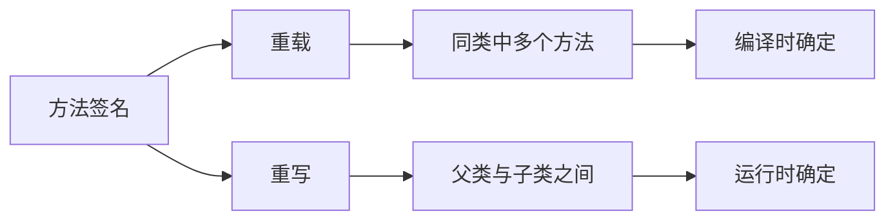
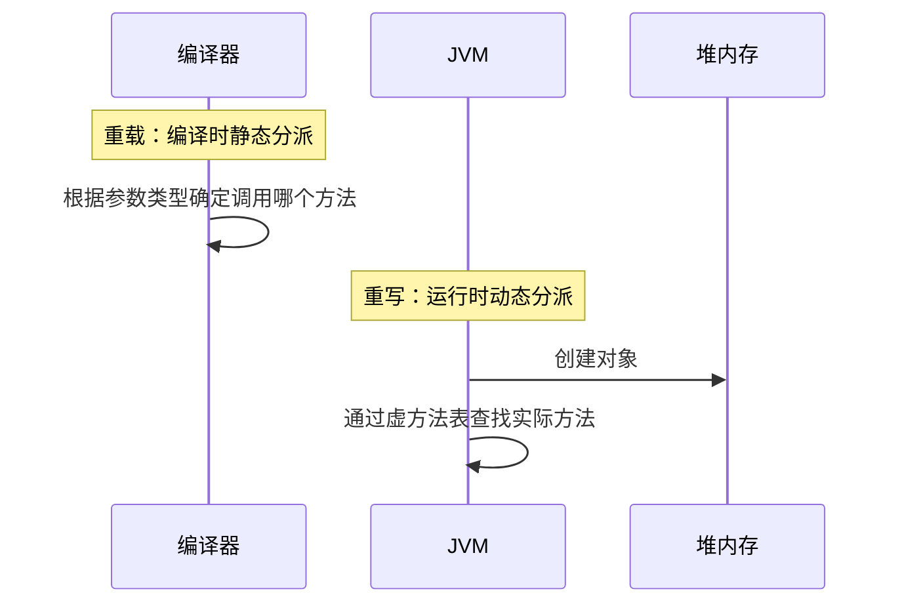

# 重载与重写有什么区别？

> **目标级别**：P5/P6
> **面试频率**：🔴 高频必考（>70%）

## 快速自测

面试官最关心的 3 个问题：

1. 重载（Overload）和重写（Override）的核心区别是什么？
2. 为什么重载不能通过返回值类型来区分？
3. 重写时，子类方法的访问修饰符有什么限制？

如果这三个问题你都能完整回答，可以跳过本文。

---

## 场景切入

面试官问：「重载和重写有什么区别？」你说「方法名相同，参数不同是重载；方法名和参数都相同是重写」——然后面试官追问「那为什么不能通过返回值类型来区分重载？」你愣了一下。

这个问题看似简单，但很多人只知其然不知其所以然。今天我们把重载和重写讲透。

## 一、基本定义

### 1.1 重载（Overload）

**同一作用域**内，**方法名相同**而**参数列表不同**的方法之间的关系。

### 1.2 重写（Override）

**子类**重新定义**父类**中**已有**的方法，要求方法签名完全相同。



---

## 二、核心区别对比表

| 对比维度 | 重载（Overload） | 重写（Override） |
|----------|------------------|-------------------|
| 发生位置 | 同一类中 | 父类与子类之间 |
| 方法签名 | 方法名相同，参数列表不同 | 方法名和参数列表都相同 |
| 返回类型 | 可以不同 | 必须相同或是协变类型 |
| 访问修饰符 | 无限制 | 不能比父类更严格 |
| 异常声明 | 无限制 | 不能抛出新的或更宽的检查异常 |
| static 方法 | static 方法也可以重载 | static 方法不能重写（隐藏） |
| 发生时期 | 编译时（静态绑定） | 运行时（动态绑定） |

---

## 三、重载详解

### 3.1 重载的判定条件

在 Java 中，方法重载的判定只看：

1. 方法名必须相同
2. 参数列表必须不同（参数个数、参数类型、参数顺序至少有一项不同）

```java
public class OverloadExample {

    // 方法1：无参
    public void method() {
        System.out.println("method()");
    }

    // 方法2：int 参数（参数个数不同）
    public void method(int a) {
        System.out.println("method(int)");
    }

    // 方法3：两个 int 参数（参数个数不同）
    public void method(int a, int b) {
        System.out.println("method(int, int)");
    }

    // 方法4：String 参数（参数类型不同）
    public void method(String s) {
        System.out.println("method(String)");
    }

    // 方法5：参数顺序不同
    public void method(int a, String s) {
        System.out.println("method(int, String)");
    }

    // 方法6：String 在前（参数顺序不同）
    public void method(String s, int a) {
        System.out.println("method(String, int)");
    }
}
```

### 3.2 为什么不能通过返回值区分重载？

```java
// 编译错误！仅返回值不同不能构成重载
public class CompileError {
    int method() { return 1; }
    // [!code error]
    void method() { }  // [!code error] 编译失败：与上一个方法仅返回类型不同
}
```

:::warning 编译器的视角
编译器在解析方法调用时，需要确定调用哪个方法。如果只通过返回值区分，编译器无法在编译期确定你的意图：
```java
obj.method();  // [!code error] 调用返回 int 还是 void 的 method？
```
:::

### 3.3 重载与类型自动转换

```java
public class OverloadWithConversion {

    public void method(short s) {
        System.out.println("short");
    }

    public void method(int i) {
        System.out.println("int");
    }

    public static void main(String[] args) {
        short s = 1;
        method(s);  // 输出：short
        method(1);  // 输出：int
        method('a'); // char -> int，输出：int
    }
}
```

:::tip 类型转换优先级
当没有精确匹配的方法时，Java 按以下顺序尝试转换：
1. 精确匹配
2. 基本类型自动提升
3. 自动装箱
4. varargs（可变参数）
:::

---

## 四、重写详解

### 4.1 重写的规则清单

| 规则 | 说明 | 能否违反 |
|------|------|----------|
| 方法名 | 必须与父类方法完全相同 | ❌ |
| 参数列表 | 必须与父类方法完全相同 | ❌ |
| 返回类型 | 必须相同或是父类返回类型的子类型（协变返回） | ✅ |
| 访问修饰符 | 不能比父类更严格 | ❌ |
| 抛出异常 | 不能抛出新的检查异常，不能抛出比父类更宽的异常 | ❌ |
| static 方法 | static 方法不能重写，只能隐藏 | ❌ |

### 4.2 协变返回类型

```java
class Parent {
    public Number getValue() {
        return 0;
    }
}

class Child extends Parent {
    @Override
    public Integer getValue() {  // [!code highlight] 返回 Integer 是 Number 的子类
        return 42;
    }
}
```

### 4.3 访问修饰符的限制

```java
class Parent {
    protected void method() { }  // [!code highlight]
}

class Child extends Parent {
    // 正确：protected >= protected
    @Override
    protected void method() { }

    // 正确：public > protected
    @Override
    public void method() { }

    // 错误：private < protected，编译失败
    // [!code error]
    @Override
    private void method() { }  // [!code error] 编译错误
}
```

### 4.4 重写与 static 方法

```java
class Parent {
    public static void staticMethod() {
        System.out.println("Parent static method");
    }

    public void instanceMethod() {
        System.out.println("Parent instance method");
    }
}

class Child extends Parent {
    // 隐藏（不是重写）
    public static void staticMethod() {
        System.out.println("Child static method");
    }

    // 重写
    @Override
    public void instanceMethod() {
        System.out.println("Child instance method");
    }
}

public class Test {
    public static void main(String[] args) {
        Parent p = new Child();

        // 静态方法：编译时确定，调用的是引用类型的方法
        p.staticMethod();  // 输出：Parent static method

        // 实例方法：运行时确定，调用的是实际对象的方法
        p.instanceMethod();  // 输出：Child instance method
    }
}
```

:::warning static 方法的特殊性
static 方法不参与多态，没有「重写」的概念，只有「隐藏」。调用哪个 static 方法取决于编译时的引用类型。
:::

---

## 五、高频追问链

> **第一层**：重载和重写的核心区别是什么？
>
> **第二层**：为什么不能通过返回值类型来区分重载方法？
>
> **第三层**：重写时，子类方法的访问修饰符为什么不能比父类更严格？
>
> **第四层**：构造器能否被重写？static 方法能否被重写？

---

## 六、常见错误与陷阱

### ⚠️ 陷阱 1：忽略 @Override 注解

```java
class Parent {
    void method() { }  // 注意：拼写错误，是 method 不是 metod
}

class Child extends Parent {
    @Override
    void metod() { }  // [!code warning] 编译通过！因为你以为你在重写，实际上是新方法
}
```

:::tip 始终使用 @Override
在重写方法前加 `@Override` 注解，编译器会帮你检查方法签名是否正确。如果父类没有这个方法，编译会失败。
:::

### ⚠️ 陷阱 2：重写 private 方法

```java
class Parent {
    private void privateMethod() {
        System.out.println("Parent private method");
    }

    public void publicMethod() {
        privateMethod();  // 调用的是父类的版本
    }
}

class Child extends Parent {
    private void privateMethod() {  // [!code highlight] 这不是重写！
        System.out.println("Child private method");
    }

    @Override
    public void publicMethod() {
        super.publicMethod();
        privateMethod();  // 调用的是子类的版本
    }
}
```

:::warning private 方法的特殊性
private 方法对子类不可见，所以子类中声明的同名方法是一个全新的方法，不是重写。父类的 private 方法无法被继承。
:::

### ⚠️ 陷阱 3：异常限制的误解

```java
class Parent {
    void method() throws IOException { }  // [!code highlight]
}

class Child extends Parent {
    // 正确：抛出更具体的异常
    @Override
    void method() throws FileNotFoundException { }  // [!code highlight]

    // 错误：抛出更宽的异常
    // [!code error]
    void method() throws Exception { }  // [!code error] 编译错误
}
```

---

## 七、加分回答

💡 **超出预期的深度**：

### 1. 方法分派的时机



### 2. 虚方法表（Virtual Method Table）

JVM 为每个类维护一个虚方法表，存储类中所有可重写方法的实际入口地址。重写的方法在子类虚方法表中指向子类的实现。

### 3. 重写的实际应用：模板方法模式

```java
abstract class Game {
    // 模板方法：定义算法骨架
    public final void play() {
        initialize();
        startPlay();
        endPlay();
    }

    abstract void initialize();
    abstract void startPlay();
    abstract void endPlay();
}

class Cricket extends Game {
    @Override
    void initialize() { System.out.println("Cricket Game Initialized!"); }
    @Override
    void startPlay() { System.out.println("Cricket Game Started!"); }
    @Override
    void endPlay() { System.out.println("Cricket Game Finished!"); }
}
```

---

## 八、扩展思考

面试结束前的延伸问题：

1. **为什么 Java 不支持重载操作符？** —— 为了保持语言的简洁性，避免语言过于复杂
2. **构造器重载算不算重载？** —— 算！构造器之间也可以重载
3. **main 方法能否被重写？** —— 可以，但调用的是子类的 main 方法（实际应用中不常见）
