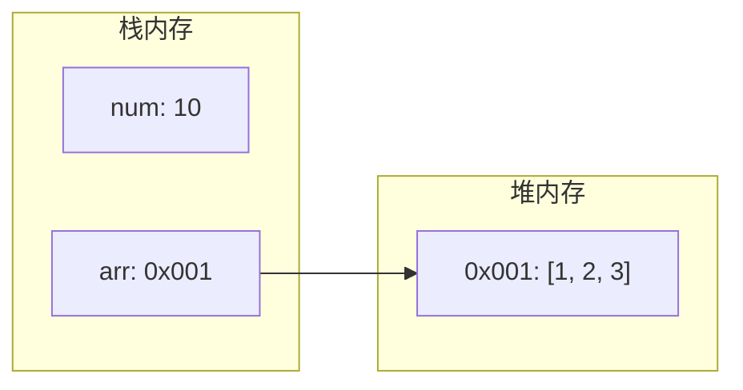

# 值传递与引用传递

> **目标级别**：P5/P6
> **面试频率**：🔴 高频必考（>70%）

## 快速自测

面试官最关心的 3 个问题：

1. Java 是值传递还是引用传递？
2. 为什么说「Java 没有引用传递」？
3. 对象作为参数传递时，方法内修改对象属性会生效吗？

如果这三个问题你都能完整回答，可以跳过本文。

---

## 场景切入

面试官问：「Java 是值传递还是引用传递？」你说「引用传递」——然后面试官追问「那为什么 swap 方法不起作用？」你愣住了。

这是 Java 面试中最经典的问题之一，90% 的程序员都理解错了。

## 一、核心结论

> **Java 永远是值传递，没有引用传递。**

### 1.1 两种传递方式

| 方式 | 说明 | Java 支持吗 |
|------|------|------------|
| 值传递 | 传递参数的副本 | ✅ 是 |
| 引用传递 | 传递参数的引用本身 | ❌ 否 |

### 1.2 为什么容易混淆？

```java
// 容易混淆的例子
StringBuilder sb = new StringBuilder("Hello");
modify(sb);
System.out.println(sb);  // 输出什么？
```

---

## 二、基本类型 vs 引用类型

### 2.1 基本类型参数

```java
public class Main {
    public static void main(String[] args) {
        int num = 10;
        modifyPrimitive(num);
        System.out.println(num);  // [!code highlight] 输出 10
    }

    static void modifyPrimitive(int value) {
        value = 20;  // [!code highlight] 只修改了副本
    }
}
```

:::warning 传递的是副本
基本类型传递的是值的副本，修改副本不会影响原变量。
:::

### 2.2 引用类型参数

```java
public class Main {
    public static void main(String[] args) {
        int[] arr = {1, 2, 3};
        modifyArray(arr);
        System.out.println(Arrays.toString(arr));  // [!code highlight] [10, 2, 3]
    }

    static void modifyArray(int[] array) {
        array[0] = 10;  // [!code highlight] 修改的是对象内容
    }
}
```

### 2.3 内存模型图



---

## 三、关键理解：引用类型传递的也是值

### 3.1 「引用」是什么？

```java
// 引用类型的变量存储的是对象的地址
StringBuilder sb = new StringBuilder("Hello");
// sb 变量存储的是对象的地址（0x1234）
```

### 3.2 传递的是引用的副本

```java
public class Main {
    public static void main(String[] args) {
        StringBuilder sb = new StringBuilder("Hello");

        // [!code warning] 传递的是 sb 的副本（也是 0x1234）
        modifyReference(sb);

        System.out.println(sb);  // [!code highlight] Hello
    }

    static void modifyReference(StringBuilder sb) {
        // [!code warning] 这里修改的是参数的副本指向的对象
        sb.append(" World");  // [!code highlight] 生效！
    }
}
```

:::tip 关键理解
1. **引用类型传递的是引用的值**（即对象地址）
2. **副本和原变量指向同一个对象**
3. **修改对象内容会生效**
4. **但重新赋值参数不会影响原变量**
:::

---

## 四、容易出错的情况

### 4.1 重新赋值不生效

```java
public class Main {
    public static void main(String[] args) {
        StringBuilder sb = new StringBuilder("Hello");
        reassign(sb);
        System.out.println(sb);  // [!code warning] Hello，不是 World！
    }

    static void reassign(StringBuilder sb) {
        sb = new StringBuilder("World");  // [!code warning] 重新赋值，只影响副本
    }
}
```

### 4.2 交换对象不生效

```java
public class Main {
    public static void main(String[] args) {
        StringBuilder a = new StringBuilder("A");
        StringBuilder b = new StringBuilder("B");
        swap(a, b);
        System.out.println(a + ", " + b);  // [!code warning] A, B，没有交换！
    }

    static void swap(StringBuilder x, StringBuilder y) {
        StringBuilder temp = x;
        x = y;  // [!code warning] 只交换了副本
        y = temp;  // [!code warning] 原变量没有影响
    }
}
```

:::warning 交换不生效的原因
swap 方法交换的是参数副本的指向，原变量（a、b）没有受到影响。
:::

---

## 五、图解分析

### 5.1 调用前

```mermaid
graph TD
    subgraph 栈内存
        A["main: a -> 0x001"]
        B["main: b -> 0x002"]
    end
    subgraph 堆内存
        C["0x001: StringBuilder(\"A\")"]
        D["0x002: StringBuilder(\"B\")"]
    end
    A --> C
    B --> D
```

### 5.2 调用 swap 方法时

```mermaid
graph TD
    subgraph 栈内存
        A["main: a -> 0x001"]
        B["main: b -> 0x002"]
        C["swap: x -> 0x001"]
        D["swap: y -> 0x002"]
    end
    subgraph 堆内存
        E["0x001: StringBuilder(\"A\")"]
        F["0x002: StringBuilder(\"B\")"]
    end
    A --> E
    B --> F
    C --> E
    D --> F
```

### 5.3 交换后

```mermaid
graph TD
    subgraph 栈内存
        A["main: a -> 0x001"]
        B["main: b -> 0x002"]
        C["swap: x -> 0x002"]
        D["swap: y -> 0x001"]
    end
    subgraph 堆内存
        E["0x001: StringBuilder(\"A\")"]
        F["0x002: StringBuilder(\"B\")"]
    end
    A --> E
    B --> F
    C --> F
    D --> E
```

:::warning 交换不生效
swap 方法中 x 和 y 交换了，但 main 方法中的 a 和 b 没有受到影响。
:::

---

## 六、高频追问链

> **第一层**：Java 是值传递还是引用传递？
>
> **第二层**：为什么对象作为参数传递时，修改属性会生效？
>
> **第三层**：为什么 swap 方法不起作用？
>
> **第四层**：String 作为参数传递时，为什么修改内容不会生效？

---

## 七、String 的特殊情况

### 7.1 String 的不可变性

```java
public class Main {
    public static void main(String[] args) {
        String str = "Hello";
        modifyString(str);
        System.out.println(str);  // [!code highlight] Hello，没有变化
    }

    static void modifyString(String s) {
        s = "World";  // [!code warning] 重新赋值，只影响副本
    }
}
```

:::tip String vs 普通对象
String 的「不可修改」特性和 Java 值传递是两回事：
1. 对象内容的修改：取决于对象是否可变
2. 变量重新赋值：取决于是否重新赋值

String 内容不可变，所以只有重新赋值一种情况。
:::

---

## 八、常见错误与陷阱

### ⚠️ 陷阱 1：混淆引用传递和值传递引用

```java
// 错误理解：Java 传递引用
void swap(Object a, Object b) {
    Object temp = a;
    a = b;  // [!code warning] 交换的是副本
    b = temp;  // [!code warning] 原变量不受影响
}

// 正确理解：Java 传递引用的值
// 相当于
void swap(String a_ref, String b_ref) {
    String temp = a_ref;
    a_ref = b_ref;  // [!code warning] 交换的是引用的副本
    b_ref = temp;  // [!code warning] 原引用不受影响
}
```

### ⚠️ 陷阱 2：以为修改对象内容不生效

```java
class Person {
    String name;
}

void modifyPerson(Person p) {
    p.name = "张三";  // [!code highlight] 生效！
}

void reassignPerson(Person p) {
    p = new Person();  // [!code warning] 不生效！
    p.name = "李四";
}
```

---

## 九、加分回答

💡 **超出预期的深度**：

### 1. 为什么 Java 选择值传递？

```java
// 值传递的优势：
// 1. 简单明确：每个参数都是独立副本
// 2. 线程安全：天然避免共享数据问题
// 3. 可靠性：方法无法意外修改调用者数据
```

### 2. 如何在 Java 中实现「引用传递」效果？

```java
// 方法1：使用数组包装
public class Main {
    public static void main(String[] args) {
        StringBuilder[] swap = new StringBuilder[]{new StringBuilder("A"), new StringBuilder("B")};
        swap(swap);
        System.out.println(swap[0] + ", " + swap[1]);  // [!code highlight] B, A
    }

    static void swap(StringBuilder[] arr) {
        StringBuilder temp = arr[0];
        arr[0] = arr[1];
        arr[1] = temp;
    }
}
```

### 3. 方法引用作为参数

```java
// Consumer 是引用类型，传递的是引用的副本
Consumer<String> consumer = System.out::println;
process(consumer);

void process(Consumer<String> c) {
    c.accept("Hello");  // [!code highlight] 生效
}
```

---

## 十、扩展思考

面试结束前的延伸问题：

1. **C++ 的引用传递和 Java 有什么区别？** —— C++ 可以真正交换变量值
2. **如何实现对象交换？** —— 使用数组包装或返回新值
3. **JavaScript 是值传递还是引用传递？** —— 原始类型是值传递，对象是共享传递
