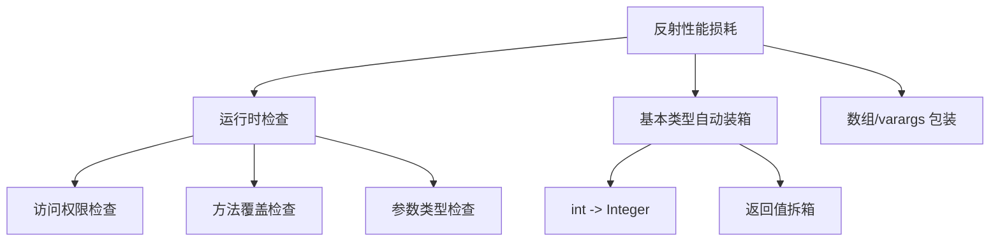

# 反射的性能问题与优化

> **目标级别**：P5/P6
> **面试频率**：🟡 中频常考（40%-70%）

## 快速自测

面试官最关心的 3 个问题：

1. 反射为什么慢？主要性能损耗在哪里？
2. 如何优化反射性能？
3. 什么是 MethodHandle？与反射有什么区别？

如果这三个问题你都能完整回答，可以跳过本文。

---

## 场景切入

面试官问：「反射的性能损耗在哪里？」你说「每次调用都要检查」——然后面试官追问「具体是怎么检查的？JIT 编译后会有优化吗？」你愣了一下。

反射性能是 Java 面试中的进阶问题，考察的是对 JVM 底层机制的理解深度。

## 一、反射性能损耗分析

### 1.1 性能对比数据

```java
// 性能测试数据（来自 JVM 专家博客）
普通方法调用：      ~0.5 纳秒
反射方法调用：       ~25-50 纳秒  // [!code warning] 50-100 倍差距
MethodHandle 调用： ~5 纳秒       // 优化后约 10 倍差距
```

### 1.2 性能损耗的三个来源



### 1.3 源码分析

```java
// JDK 源码：Method.invoke()
public Object invoke(Object obj, Object... args) throws IllegalAccessException, InvocationTargetException {
    // [!code highlight] 1. 检查方法可访问性
    if (!memberAccess.isAccessible()) {
        throw new IllegalAccessException();
    }

    // [!code highlight] 2. 检查参数个数
    if (args.length != parameterCount) {
        throw new IllegalArgumentException();
    }

    // [!code highlight] 3. 基本类型自动装箱/拆箱
    Object[] actualArgs = new Object[args.length];
    for (int i = 0; i < args.length; i++) {
        actualArgs[i] = parameterTypes[i].cast(args[i]);  // [!code highlight] 类型转换
    }

    // [!code highlight] 4. 调用底层 native 方法
    return invoker(this, obj, actualArgs);
}
```

---

## 二、性能优化策略

### 2.1 缓存优化（最有效）

```java
// 错误写法：每次都获取 Method
public Object invoke(String methodName, Object obj) {
    try {
        Method method = obj.getClass().getMethod(methodName);  // [!code warning] 每次查找
        return method.invoke(obj);
    } catch (Exception e) {
        throw new RuntimeException(e);
    }
}

// [!code highlight] 优化写法：缓存 Method 对象
private Map<String, Method> methodCache = new ConcurrentHashMap<>();

public Object invoke(String methodName, Object obj) {
    Class<?> clazz = obj.getClass();
    String key = clazz.getName() + "#" + methodName;

    Method method = methodCache.computeIfAbsent(key, k -> {
        try {
            return clazz.getMethod(methodName);  // 首次获取并缓存
        } catch (NoSuchMethodException e) {
            throw new RuntimeException(e);
        }
    });

    try {
        return method.invoke(obj);  // 使用缓存的 Method
    } catch (IllegalAccessException e) {
        throw new RuntimeException(e);
    } catch (InvocationTargetException e) {
        throw RuntimeException.unwrap(e.getCause());
    }
}
```

### 2.2 setAccessible 优化

```java
// 优化：提前设置可访问性
public class ReflectInvoker {
    private final Method method;
    private final boolean accessible;

    public ReflectInvoker(Method method) {
        this.method = method;
        this.accessible = method.isAccessible();
        if (!accessible) {
            method.setAccessible(true);  // [!code highlight] 提前设置
        }
    }

    public Object invoke(Object obj, Object... args) {
        try {
            return method.invoke(obj, args);
        } catch (IllegalAccessException e) {
            throw new RuntimeException(e);
        } catch (InvocationTargetException e) {
            throw RuntimeException.unwrap(e.getCause());
        }
    }

    @Override
    protected void finalize() throws Throwable {
        if (!accessible) {
            method.setAccessible(false);  // [!code highlight] 恢复状态
        }
    }
}
```

### 2.3 构造器缓存

```java
// 优化：缓存 Constructor
public class ObjectFactory {
    private final Constructor<?> constructor;

    public ObjectFactory(Class<?> clazz) throws NoSuchMethodException {
        this.constructor = clazz.getDeclaredConstructor();  // [!code highlight] 获取默认构造器
        this.constructor.setAccessible(true);
    }

    public Object createInstance() {
        try {
            return constructor.newInstance();
        } catch (InstantiationException | IllegalAccessException |
                 InvocationTargetException e) {
            throw new RuntimeException(e);
        }
    }
}
```

---

## 三、MethodHandle 替代方案

### 3.1 MethodHandle 简介

MethodHandle 是 Java 7 引入的轻量级反射替代，性能接近直接调用：

```java
import java.lang.invoke.MethodHandles;
import java.lang.invoke.MethodType;

// 获取 MethodHandle
MethodHandles.Lookup lookup = MethodHandles.lookup();
MethodHandle mh = lookup.findVirtual(
    MyClass.class,           // 目标类
    "myMethod",             // 方法名
    MethodType.methodType(String.class, int.class)  // 方法签名
);

// 调用
String result = (String) mh.invokeExact(obj, 42);  // [!code highlight] 高性能调用
```

### 3.2 MethodHandle vs 反射

| 特性 | MethodHandle | 反射 |
|------|--------------|------|
| 性能 | 快（接近直接调用） | 慢 |
| 安全性检查 | Lookup 时检查 | 每次调用时检查 |
| 功能 | 有限 | 丰富 |
| Java 版本 | 7+ | 1.1+ |
| 可调试性 | 困难 | 容易 |

### 3.3 性能对比

```java
// 性能测试
public class PerformanceTest {

    public String hello(String name) {
        return "Hello, " + name;
    }

    public static void main(String[] args) throws Throwable {
        PerformanceTest obj = new PerformanceTest();
        int iterations = 10_000_000;

        // 直接调用
        long start = System.nanoTime();
        for (int i = 0; i < iterations; i++) {
            obj.hello("world");
        }
        System.out.println("Direct: " + (System.nanoTime() - start) / 1_000_000 + " ms");

        // 反射调用
        Method method = PerformanceTest.class.getMethod("hello", String.class);
        start = System.nanoTime();
        for (int i = 0; i < iterations; i++) {
            method.invoke(obj, "world");
        }
        System.out.println("Reflect: " + (System.nanoTime() - start) / 1_000_000 + " ms");

        // MethodHandle 调用
        MethodHandle mh = MethodHandles.lookup()
            .findVirtual(PerformanceTest.class, "hello",
                MethodType.methodType(String.class, String.class));
        start = System.nanoTime();
        for (int i = 0; i < iterations; i++) {
            mh.invoke(obj, "world");
        }
        System.out.println("MethodHandle: " + (System.nanoTime() - start) / 1_000_000 + " ms");
    }
}
```

---

## 四、高频追问链

> **第一层**：反射为什么慢？性能损耗在哪里？
>
> **第二层**：如何优化反射性能？
>
> **第三层**：什么是 MethodHandle？比反射快在哪里？
>
> **第四层**：JIT 编译后会对反射做优化吗？

---

## 五、常见错误与陷阱

### ⚠️ 陷阱 1：在循环中使用反射

```java
// 错误：每次循环都获取 Method
for (Item item : items) {
    Method method = item.getClass().getMethod("process");  // [!code warning] 循环中查找
    method.invoke(item);
}

// 正确：循环外获取
Method method = itemClass.getMethod("process");  // [!code highlight] 循环外
for (Item item : items) {
    method.invoke(item);
}
```

### ⚠️ 陷阱 2：每次调用都检查权限

```java
// 错误：每次都检查
for (int i = 0; i < 1000; i++) {
    method.invoke(obj, args);  // [!code warning] 每次都检查可访问性
}

// 正确：提前设置
method.setAccessible(true);  // [!code highlight]
for (int i = 0; i < 1000; i++) {
    method.invoke(obj, args);
}
```

### ⚠️ 陷阱 3：忽视异常处理开销

```java
// 反射调用的异常处理有额外开销
try {
    method.invoke(obj);
} catch (IllegalAccessException e) {
    // [!code warning] 每次调用都要处理这些可能的异常
} catch (InvocationTargetException e) {
    //
}
```

---

## 六、加分回答

💡 **超出预期的深度**：

### 1. JIT 对反射的优化

Java 8+ 的 JVM 会对反射进行 JIT 优化：

```java
// JVM 会进行"inflation"优化
// 多次调用同一方法后，JVM 会生成一个native stub
// 使得后续反射调用接近直接调用性能
```

### 2. Spring 的反射优化

Spring 框架使用 CGLIB 生成代理类，避免反射：

```java
// Spring 默认使用 CGLIB（如果目标对象不是 final）
// CGLIB 生成子类字节码，方法调用是直接调用而非反射
```

### 3. 最佳实践总结

| 优化策略 | 效果 | 复杂度 |
|----------|------|--------|
| 缓存 Method 对象 | ★★★★★ | 低 |
| 提前 setAccessible | ★★★ | 低 |
| MethodHandle | ★★★★ | 中 |
| 生成字节码 | ★★★★★ | 高 |

---

## 七、扩展思考

面试结束前的延伸问题：

1. **Java 9 模块系统对反射有什么限制？** —— `setAccessible` 可能失败
2. **什么是 inflation 机制？** —— JIT 生成的 native stub
3. **FastJSON 如何优化反射？** —— ASM 生成字节码
