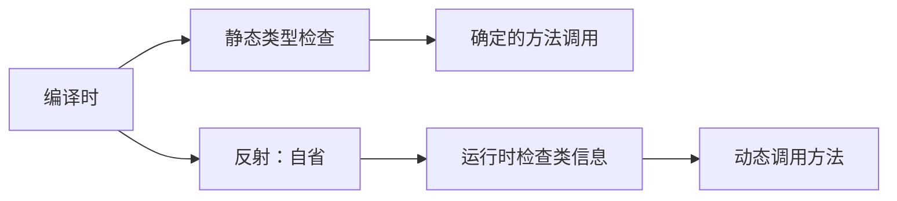
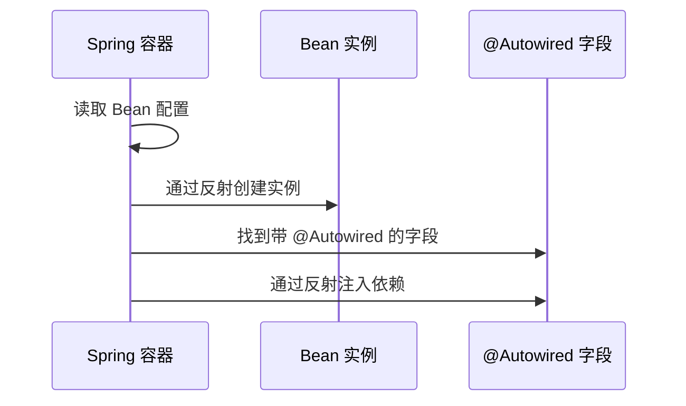

# 反射原理与应用场景

> **目标级别**：P5/P6
> **面试频率**：🔴 高频必考（>70%）

## 快速自测

面试官最关心的 3 个问题：

1. 什么是反射？核心 API 有哪些？
2. 反射为什么慢？性能损耗在哪里？
3. 反射在框架中是如何应用的？

如果这三个问题你都能完整回答，可以跳过本文。

---

## 场景切入

面试官问：「你在项目里用过反射吗？」你说「用过，Spring 用反射创建 Bean」——然后面试官追问「那你说说反射为什么慢？慢在哪里？」你愣了一下。

反射是 Java 最强大的特性之一，也是面试中的高频考点。它让程序在运行时「自省」，但这把双刃剑也有性能和安全性代价。

## 一、反射的概念

### 1.1 什么是反射

> 反射是 Java 在运行时动态获取类的信息、操作对象的机制。



### 1.2 反射的核心能力

| 能力 | 说明 | API |
|------|------|-----|
| 获取类信息 | 获取 Class 对象 | `Class.forName()`、`getClass()` |
| 检查成员 | 查看字段、方法、构造器 | `getFields()`、`getMethods()` |
| 动态调用 | 运行时调用方法 | `Method.invoke()` |
| 动态创建 | 运行时创建实例 | `Constructor.newInstance()` |
| 动态修改 | 运行时修改字段 | `Field.set()` |

---

## 二、核心 API

### 2.1 获取 Class 对象

```java
// 方式1：.class 字面量（最常用）
Class<?> clazz1 = String.class;

// 方式2：getClass()
Class<?> clazz2 = "hello".getClass();

// 方式3：forName（动态加载）
Class<?> clazz3 = Class.forName("java.lang.String");

// 方式4：ClassLoader
Class<?> clazz4 = classLoader.loadClass("java.lang.String");
```

### 2.2 获取类信息

```java
Class<?> clazz = Class.forName("com.example.User");

// 获取类名
System.out.println(clazz.getName());        // com.example.User
System.out.println(clazz.getSimpleName());   // User
System.out.println(clazz.getPackage().getName()); // com.example

// 获取修饰符
int mod = clazz.getModifiers();
System.out.println(Modifier.isPublic(mod));  // true/false
System.out.println(Modifier.isFinal(mod));   // true/false

// 获取父类
Class<?> superClass = clazz.getSuperclass();

// 获取接口
Class<?>[] interfaces = clazz.getInterfaces();

// 获取成员
Field[] fields = clazz.getDeclaredFields();   // 所有字段
Method[] methods = clazz.getDeclaredMethods(); // 所有方法
Constructor<?>[] constructors = clazz.getDeclaredConstructors(); // 所有构造器
```

### 2.3 动态创建对象

```java
// 方式1：使用默认构造器
Class<?> clazz = Class.forName("com.example.User");
Object obj = clazz.newInstance();  // [!code warning] 已过时，使用 Constructor

// 方式2：使用 Constructor（推荐）
Constructor<?> constructor = clazz.getDeclaredConstructor(String.class, int.class);
Object obj = constructor.newInstance("张三", 25);
```

### 2.4 动态调用方法

```java
Class<?> clazz = Class.forName("com.example.User");
Object obj = clazz.newInstance();

// 获取方法
Method setName = clazz.getDeclaredMethod("setName", String.class);
Method getName = clazz.getDeclaredMethod("getName");

// 调用方法
setName.invoke(obj, "李四");  // [!code highlight] 等价于 obj.setName("李四")
Object result = getName.invoke(obj);  // [!code highlight] 等价于 obj.getName()
```

### 2.5 动态访问字段

```java
Class<?> clazz = Class.forName("com.example.User");
Object obj = clazz.newInstance();

// 获取字段
Field nameField = clazz.getDeclaredField("name");
nameField.setAccessible(true);  // [!code highlight] 访问私有字段

// 读取字段
Object value = nameField.get(obj);  // 等价于 obj.name

// 修改字段
nameField.set(obj, "王五");  // 等价于 obj.name = "王五"
```

---

## 三、应用场景

### 3.1 框架核心：依赖注入



Spring 框架的核心原理：

```java
// Spring 伪代码：简化版的依赖注入
public class SimpleSpring {
    private Map<String, Object> beans = new HashMap<>();

    public void processAutowired(Object bean, Class<?> clazz) {
        for (Field field : clazz.getDeclaredFields()) {
            if (field.isAnnotationPresent(Autowired.class)) {
                Object dependency = beans.get(field.getType().getName());
                field.setAccessible(true);  // [!code highlight] 访问私有字段
                field.set(bean, dependency);  // [!code highlight] 注入依赖
            }
        }
    }
}
```

### 3.2 ORM 框架

MyBatis/Hibernate 通过反射实现：
- 自动将数据库结果集映射为对象
- 自动将对象属性转换为 SQL 参数

```java
// MyBatis 伪代码
public <T> T resultSetToObject(ResultSet rs, Class<T> clazz) throws Exception {
    T obj = clazz.newInstance();
    ResultSetMetaData metaData = rs.getMetaData();

    for (int i = 1; i <= metaData.getColumnCount(); i++) {
        String columnName = metaData.getColumnName(i);
        Field field = clazz.getDeclaredField(columnName);  // [!code highlight]
        field.setAccessible(true);
        field.set(obj, rs.getObject(columnName));
    }
    return obj;
}
```

### 3.3 序列化与反序列化

```java
// JSON 序列化框架原理
public class JsonSerializer {
    public String serialize(Object obj) throws Exception {
        StringBuilder sb = new StringBuilder();
        sb.append("{");

        for (Field field : obj.getClass().getDeclaredFields()) {
            if (isSerializable(field)) {
                field.setAccessible(true);
                Object value = field.get(obj);
                sb.append("\"").append(field.getName()).append("\":");
                sb.append(serializeValue(value));
                sb.append(",");
            }
        }

        sb.append("}");
        return sb.toString();
    }
}
```

---

## 四、高频追问链

> **第一层**：什么是反射？核心 API 有哪些？
>
> **第二层**：反射为什么慢？性能损耗在哪里？
>
> **第三层**：Spring 为什么大量使用反射？
>
> **第四层**：如何优化反射性能？

---

## 五、常见错误与陷阱

### ⚠️ 陷阱 1：忘记 setAccessible(true)

```java
// 错误：访问私有字段/方法
Field field = clazz.getDeclaredField("name");
field.get(obj);  // [!code error] IllegalAccessException

// 正确：先设置可访问
field.setAccessible(true);  // [!code highlight]
field.get(obj);
```

### ⚠️ 陷阱 2：缓存 Class 对象

```java
// 错误：每次都 forName
public Object createObject(String className) {
    Class<?> clazz = Class.forName(className);  // [!code warning] 每次都加载类
    return clazz.newInstance();
}

// 正确：缓存 Class 对象
private Map<String, Class<?>> classCache = new ConcurrentHashMap<>();

public Object createObject(String className) {
    return classCache.computeIfAbsent(className, name -> {
        try {
            return Class.forName(name);
        } catch (ClassNotFoundException e) {
            throw new RuntimeException(e);
        }
    }).newInstance();
}
```

### ⚠️ 陷阱 3：反射调用私有方法

```java
Method privateMethod = clazz.getDeclaredMethod("privateMethod", String.class);
privateMethod.setAccessible(true);  // [!code highlight] 必须调用
privateMethod.invoke(obj, "param");
```

---

## 六、加分回答

💡 **超出预期的深度**：

### 1. 反射的性能损耗分析

```java
// 性能对比：普通调用 vs 反射调用
public class ReflectBenchmark {
    public String method(String s) { return s; }

    public static void main(String[] args) throws Exception {
        Method m = ReflectBenchmark.class.getMethod("method", String.class);

        // 普通调用：纳秒级
        long start = System.nanoTime();
        for (int i = 0; i < 1000000; i++) {
            obj.method("test");
        }
        System.out.println("Direct: " + (System.nanoTime() - start) + " ns");

        // 反射调用：微秒级
        start = System.nanoTime();
        for (int i = 0; i < 1000000; i++) {
            m.invoke(obj, "test");
        }
        System.out.println("Reflect: " + (System.nanoTime() - start) + " ns");
    }
}
```

### 2. MethodHandle（Java 7+）

```java
// MethodHandle 是反射的性能优化替代
import java.lang.invoke.MethodHandles;

MethodHandle handle = MethodHandles.lookup()
    .findVirtual(ReflectBenchmark.class, "method", MethodType.methodType(String.class, String.class));

String result = (String) handle.invoke(obj, "test");  // [!code highlight] 比反射快
```

---

## 七、扩展思考

面试结束前的延伸问题：

1. **反射与直接调用的性能差异有多大？** —— 约 10-100 倍
2. **什么是 MethodHandle？与反射的区别？** —— 更轻量、性能更好、功能更少
3. **为什么 setAccessible(true) 在某些环境下可能失败？** —— Java 9+ 模块系统限制
