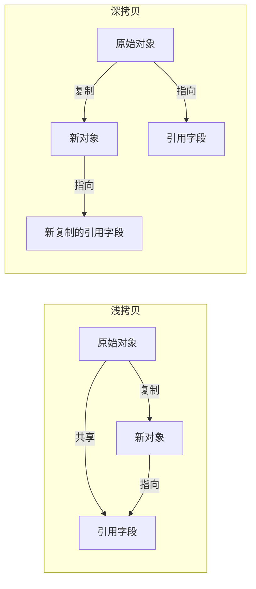

# 浅拷贝与深拷贝

> **目标级别**：P5/P6
> **面试频率**：🔴 高频必考（>70%）

## 快速自测

面试官最关心的 3 个问题：

1. 浅拷贝和深拷贝的区别是什么？
2. 如何实现深拷贝？有哪些方式？
3. 什么场景下需要使用深拷贝？

如果这三个问题你都能完整回答，可以跳过本文。

---

## 场景切入

面试官问：「HashMap 的 clone 是浅拷贝还是深拷贝？」你说「浅拷贝」——然后面试官追问「那如果 HashMap 里面嵌套了 HashMap，clone 之后修改内层 Map 会有什么后果？」你愣住了。

拷贝是 Java 中的重要概念，理解深浅拷贝的区别对于避免 bug 至关重要。

## 一、基本概念

### 1.1 浅拷贝 vs 深拷贝



### 1.2 核心区别表

| 维度 | 浅拷贝 | 深拷贝 |
|------|--------|--------|
| 基本类型字段 | ✅ 复制值 | ✅ 复制值 |
| 引用类型字段 | ❌ 复制引用 | ✅ 复制对象 |
| 修改原对象 | 影响原始对象 | 不影响原始对象 |
| 性能 | 快 | 慢 |
| 实现难度 | 简单 | 复杂 |

---

## 二、浅拷贝

### 2.1 实现方式

```java
// 方式1：Object.clone()
class Person implements Cloneable {  // [!code highlight] 必须实现 Cloneable
    String name;
    int age;

    @Override
    protected Person clone() throws CloneNotSupportedException {
        return (Person) super.clone();  // [!code highlight] 浅拷贝
    }
}
```

### 2.2 浅拷贝的问题

```java
class Address {
    String city;
}

class Person implements Cloneable {
    String name;
    Address address;  // 引用类型字段

    @Override
    protected Person clone() throws CloneNotSupportedException {
        return (Person) super.clone();  // [!code warning] 浅拷贝
    }
}

public class Main {
    public static void main(String[] args) throws CloneNotSupportedException {
        Person p1 = new Person();
        p1.name = "张三";
        p1.address = new Address();
        p1.address.city = "北京";

        Person p2 = p1.clone();
        p2.name = "李四";
        p2.address.city = "上海";  // [!code warning] 修改了 p1 的 address！

        System.out.println(p1.address.city);  // [!code warning] 上海！
    }
}
```

:::warning 浅拷贝的问题
引用类型字段只复制引用，不复制对象本身。修改新对象的引用字段会影响原对象。
:::

---

## 三、深拷贝

### 3.1 方式一：重写 clone 方法

```java
class Person implements Cloneable {
    String name;
    Address address;  // 引用类型字段

    @Override
    protected Person clone() throws CloneNotSupportedException {
        Person cloned = (Person) super.clone();
        // [!code highlight] 手动深拷贝引用字段
        cloned.address = this.address.clone();
        return cloned;
    }
}

class Address implements Cloneable {
    String city;

    @Override
    protected Address clone() throws CloneNotSupportedException {
        return (Address) super.clone();
    }
}
```

### 3.2 方式二：序列化

```java
import java.io.*;

public class DeepCopyUtil {
    // [!code highlight] 通过序列化实现深拷贝
    @SuppressWarnings("unchecked")
    public static <T extends Serializable> T deepCopy(T object) {
        try {
            ByteArrayOutputStream bos = new ByteArrayOutputStream();
            ObjectOutputStream oos = new ObjectOutputStream(bos);
            oos.writeObject(object);

            ByteArrayInputStream bis = new ByteArrayInputStream(bos.toByteArray());
            ObjectInputStream ois = new ObjectInputStream(bis);
            return (T) ois.readObject();
        } catch (IOException | ClassNotFoundException e) {
            throw new RuntimeException("Deep copy failed", e);
        }
    }
}

// 使用
Person p2 = DeepCopyUtil.deepCopy(p1);  // [!code highlight]
```

### 3.3 方式三：JSON 序列化

```java
import com.fasterxml.jackson.databind.ObjectMapper;

public class JsonCopyUtil {
    private static final ObjectMapper mapper = new ObjectMapper();

    public static <T> T deepCopy(T object, Class<T> clazz) throws IOException {
        return mapper.readValue(mapper.writeValueAsString(object), clazz);  // [!code highlight]
    }
}
```

### 3.4 方式四：构造器拷贝

```java
class Person {
    String name;
    Address address;

    // 拷贝构造器  // [!code highlight]
    public Person(Person other) {
        this.name = other.name;
        this.address = new Address(other.address);  // [!code highlight] 创建新对象
    }
}

class Address {
    String city;

    // 拷贝构造器
    public Address(Address other) {
        this.city = other.city;
    }
}
```

---

## 四、拷贝构造器 vs Cloneable

### 4.1 对比表

| 特性 | Cloneable | 拷贝构造器 |
|------|-----------|------------|
| 接口实现 | 需要 | 不需要 |
| 类型安全 | ❌ 需要类型转换 | ✅ 编译期检查 |
| final 字段 | ❌ 无法拷贝 | ✅ 可以 |
| 继承 | ❌ 复杂 | ✅ 简单 |
| 代码可读性 | 一般 | 好 |

### 4.2 拷贝构造器优势

```java
// 优势1：类型安全
class Person {
    Person(Person other) { }  // [!code highlight] 只能接受 Person
}

// 优势2：可以拷贝 final 字段
class Person {
    private final String name;  // [!code highlight] final 字段
    Person(Person other) {
        this.name = other.name;  // [!code highlight] 可以赋值
    }
}
```

---

## 五、高频追问链

> **第一层**：浅拷贝和深拷贝的区别是什么？
>
> **第二层**：如何实现深拷贝？有哪些方式？
>
> **第三层**：为什么推荐使用拷贝构造器而不是 Cloneable？
>
> **第四层**：集合的 clone 是浅拷贝还是深拷贝？

---

## 六、常见错误与陷阱

### ⚠️ 陷阱 1：没有实现 Cloneable

```java
class Person {
    @Override
    protected Person clone() {  // [!code warning] 没有实现 Cloneable
        return new Person();
    }
}

// [!code error] CloneNotSupportedException
```

### ⚠️ 陷阱 2：集合的 clone

```java
List<Person> list1 = new ArrayList<>();
List<Person> list2 = list1.clone();  // [!code warning] 浅拷贝

// list2 中的 Person 对象与 list1 共享！
```

### ⚠️ 陷阱 3：多层嵌套深拷贝

```java
class Company {
    List<Department> departments;
}

class Department {
    List<Person> employees;
}

// [!code warning] 深拷贝需要递归拷贝所有嵌套对象
class Company implements Cloneable {
    @Override
    protected Company clone() {
        Company cloned = (Company) super.clone();
        cloned.departments = new ArrayList<>();
        for (Department d : this.departments) {
            cloned.departments.add(d.clone());  // [!code highlight] 递归拷贝
        }
        return cloned;
    }
}
```

---

## 七、加分回答

💡 **超出预期的深度**：

### 1. Apache Commons Lang 的 SerializationUtils

```java
import org.apache.commons.lang3.SerializationUtils;

Person p2 = SerializationUtils.clone(p1);  // [!code highlight] 简洁的序列化深拷贝
```

### 2. Immutables 框架

```java
// 使用 Immutables 框架自动生成不可变对象
@Value.Immutable
interface Person {
    String name();
    Address address();
}

// 生成的对象天然线程安全，无需深拷贝
```

### 3. 深拷贝的性能考量

```java
// 深拷贝 vs 不可变对象
// 如果对象设计为不可变，就不需要深拷贝

final class ImmutablePerson {
    private final String name;
    private final Address address;  // [!code highlight] Address 也必须不可变

    public ImmutablePerson(String name, Address address) {
        this.name = name;
        this.address = address;  // [!code highlight] 直接引用，无需拷贝
    }
}
```

---

## 八、扩展思考

面试结束前的延伸问题：

1. **Java 为什么不默认实现深拷贝？** —— 性能开销、循环引用问题
2. **如何处理循环引用的深拷贝？** —— 使用引用表记录已拷贝对象
3. **CopyOnWriteArrayList 是深拷贝还是浅拷贝？** —— 浅拷贝，但内部数组元素是新数组
