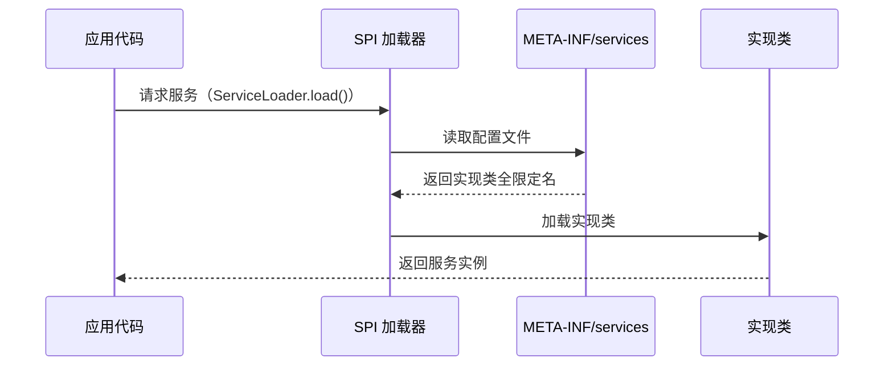

# SPI 机制原理

> **目标级别**：P5/P6
> **面试频率**：🟡 中频常考（40%-70%）

## 快速自测

面试官最关心的 3 个问题：

1. 什么是 SPI？它解决了什么问题？
2. SPI 和 API 有什么区别？
3. JDBC 是如何利用 SPI 实现驱动的？

如果这三个问题你都能完整回答，可以跳过本文。

---

## 场景切入

面试官问：「你用过数据库驱动吗？」你说「用过 MySQL 驱动」——然后面试官追问「为什么只需要导入驱动 jar 包，不用手动注册驱动？」你愣住了。

这就是 SPI（Service Provider Interface）的魔力——一种 JDK 内置的**服务发现机制**。

## 一、SPI 的概念

### 1.1 什么是 SPI

> SPI 全称 Service Provider Interface，是 JDK 内置的一种**服务发现机制**。通过在 `META-INF/services` 目录声明实现类，让框架在运行时自动发现和加载。

### 1.2 SPI vs API

| 对比 | API | SPI |
|------|-----|-----|
| 定义方向 | 应用调用框架 | 框架调用应用 |
| 调用关系 | 应用 → 框架 | 框架 → 应用 |
| 配置位置 | 代码调用 | 配置文件 |
| 扩展方式 | 继承/重写 | 实现接口+配置文件 |

### 1.3 SPI 流程图



---

## 二、SPI 的使用步骤

### 2.1 定义接口

```java
// com.example.service.MessageService
public interface MessageService {
    void send(String message);
}
```

### 2.2 实现接口

```java
// com.example.service.impl.EmailService
public class EmailService implements MessageService {
    @Override
    public void send(String message) {
        System.out.println("发送邮件: " + message);
    }
}
```

### 2.3 注册实现

```properties title="META-INF/services/com.example.service.MessageService"
com.example.service.impl.EmailService
com.example.service.impl.SmsService
```

### 2.4 使用 SPI 加载

```java
public class SpiDemo {
    public static void main(String[] args) {
        // [!code highlight] 使用 ServiceLoader 加载服务
        ServiceLoader<MessageService> loader = ServiceLoader.load(MessageService.class);

        for (MessageService service : loader) {
            service.send("Hello SPI");
        }
    }
}
```

---

## 三、JDBC 中的 SPI

### 3.1 传统方式

```java
// JDBC 4.0 之前：需要手动注册驱动
Class.forName("com.mysql.jdbc.Driver");  // [!code warning]
Connection conn = DriverManager.getConnection(url, user, password);
```

### 3.2 SPI 方式（JDBC 4.0+）

```properties title="META-INF/services/java.sql.Driver"
com.mysql.cj.jdbc.Driver
com.mysql.fabric.jdbc.FabricMySQLDriver
```

```java
// JDBC 4.0+：自动发现驱动
Connection conn = DriverManager.getConnection(url, user, password);
// [!code highlight] DriverManager 内部使用 SPI 自动加载驱动
```

### 3.3 源码分析

```java
// DriverManager.java
static {
    loadInitialDrivers();  // [!code highlight] 静态代码块自动执行
}

private static void loadInitialDrivers() {
    // [!code highlight] 使用 ServiceLoader 加载 Driver
    ServiceLoader<Driver> loadedDrivers = ServiceLoader.load(Driver.class);
    Iterator<Driver> driversIterator = loadedDrivers.iterator();
    // ...
}
```

---

## 四、常见 SPI 框架

### 4.1 SLF4J 日志门面

```properties title="META-INF/services/org.slf4j.spi.SLF4JServiceProvider"
org.slf4j.log4j12.Log4jLoggerFactory
ch.qos.logback.classic.LogbackServiceProvider
```

### 4.2 Servlet 容器

```properties title="META-INF/services/javax.servlet.ServletContainerInitializer"
org.springframework.web.SpringServletContainerInitializer
```

### 4.3 Spring Boot 自动配置

```properties title="META-INF/spring.factories"
org.springframework.boot.autoconfigure.EnableAutoConfiguration=\
com.example.config.MyAutoConfiguration
```

---

## 五、高频追问链

> **第一层**：什么是 SPI？它解决了什么问题？
>
> **第二层**：SPI 和 API 有什么区别？
>
> **第三层**：JDBC 4.0 为什么不需要手动注册驱动？
>
> **第四层**：SPI 的缺点是什么？如何避免？

---

## 六、常见错误与陷阱

### ⚠️ 陷阱 1：配置文件名错误

```java
// [!code error] 错误：文件名不完整
// META-INF/services/com.example.service

// [!code highlight] 正确：文件名是接口全限定名
// META-INF/services/com.example.service.MessageService
```

### ⚠️ 陷阱 2：没有无参构造器

```java
// [!code error] SPI 只能调用无参构造器
public class EmailService implements MessageService {
    public EmailService(String config) { }  // [!code error]
}

// [!code highlight] 正确：提供无参构造器
public class EmailService implements MessageService {
    public EmailService() { }  // SPI 使用
    public EmailService(String config) { }  // 其他场景使用
}
```

### ⚠️ 陷阱 3：性能问题

```java
// ServiceLoader 每次调用都会重新加载
for (MessageService service : ServiceLoader.load(MessageService.class)) {
    // [!code warning] 每次迭代都重新扫描
}

// [!code highlight] 建议：缓存实例
private static final ServiceLoader<MessageService> LOADER =
    ServiceLoader.load(MessageService.class);
```

---

## 七、加分回答

💡 **超出预期的深度**：

### 1. SPI 的双亲委派

```java
// ServiceLoader 使用线程上下文的类加载器
public static <S> ServiceLoader<S> load(Class<S> service) {
    ClassLoader cl = Thread.currentThread().getContextClassLoader();
    return new ServiceLoader<>(service, cl);  // [!code highlight]
}
```

### 2. JDK 6+ 的 ServiceLoader 改进

```java
// JDK 6+ 支持直接迭代
ServiceLoader<MessageService> loader = ServiceLoader.load(MessageService.class);

// JDK 9+ 支持懒加载
Iterator<MessageService> iterator = loader.iterator();
```

### 3. SPI 与依赖注入

SPI 本质上是一种**松耦合**的服务发现机制，被 Spring、Guice 等框架广泛用于实现依赖注入。

---

## 八、扩展思考

面试结束前的延伸问题：

1. **SPI 和反射创建对象有什么区别？** —— SPI 通过配置文件发现，反射通过类名
2. **Dubbo 中是如何使用 SPI 的？** —— 扩展了 JDK 的 SPI，增加了参数注入
3. **为什么说 SPI 是解耦的？** —— 调用方不需要知道具体实现类
