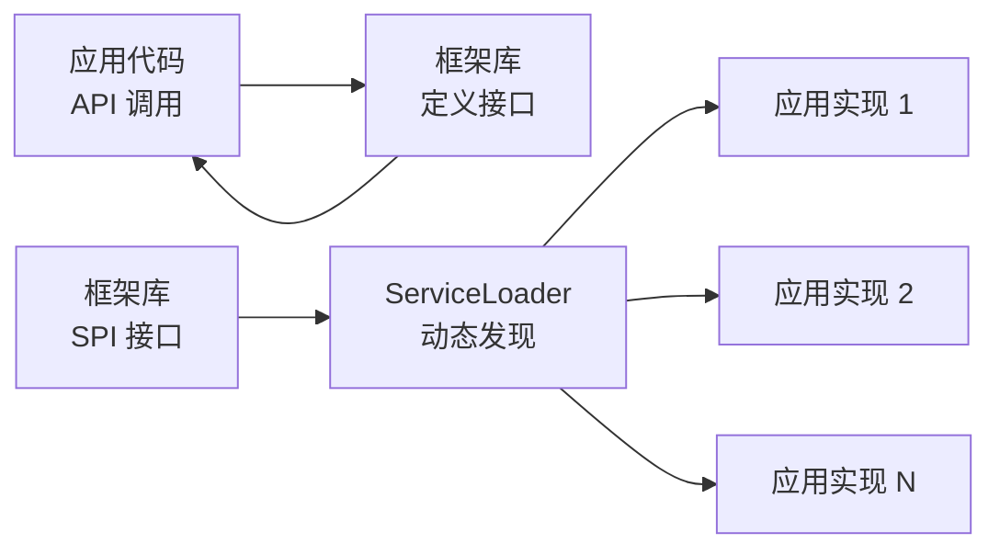

# SPI 机制原理

面试官问："什么是 SPI 机制？"

候选人小谢答："SPI 是服务提供接口，用于框架扩展。"

面试官追问："具体是怎么实现的？"

小谢说："用 ServiceLoader 加载？"

面试官追问："SPI 和 API 有什么区别？"

小谢答不上来。

【面试官心理】
这道题考查的是候选人对 Java 框架扩展机制的理解。能说出 SPI 机制用于解耦和插件化、以及 JDBC 驱动注册的候选人，说明对 Java 框架生态有了解。

## 一、SPI 与 API 的区别 🔴

| 维度 | API | SPI |
| --- | --- | --- |
| 全称 | Application Programming Interface | Service Provider Interface |
| 调用方向 | 应用调用框架 | 框架调用应用 |
| 接口定义 | 框架提供 | 框架提供 |
| 实现方 | 框架实现 | 应用实现 |
| 加载方式 | 应用代码直接调用 | 服务加载器动态发现 |
| 解耦程度 | 紧耦合 | 松耦合 |



## 二、SPI 的核心：ServiceLoader 🔴

### 2.1 工作流程

```java
// 1. 定义 SPI 接口（框架提供）
public interface Logger {
    void log(String message);
}

// 2. 应用提供实现
public class FileLogger implements Logger {
    @Override
    public void log(String message) {
        // 写入文件
    }
}

// 3. 在 META-INF/services/ 下注册
// 文件名：com.example.Logger（SPI 接口全限定名）
// 文件内容：com.example.impl.FileLogger

// 4. 框架使用 ServiceLoader 加载
ServiceLoader<Logger> loader = ServiceLoader.load(Logger.class);
for (Logger logger : loader) {
    logger.log("message"); // 调用实际实现
}
```

### 2.2 ServiceLoader 源码（简化）

```java
public final class ServiceLoader<S>
        implements Iterable<S> {

    private final Class<S> service;        // SPI 接口
    private final ClassLoader loader;       // 类加载器
    private LinkedHashMap<String, S> providers; // 缓存实例

    public static <S> ServiceLoader<S> load(Class<S> service) {
        return new ServiceLoader<>(service,
            Thread.currentThread().getContextClassLoader());
    }

    public Iterator<S> iterator() {
        return new Iterator<S>() {
            Iterator<Map.Entry<String, S>> iterator = providers.entrySet().iterator();

            public S next() {
                if (!hasNext()) throw new NoSuchElementException();
                return iterator.next().getValue();
            }
        };
    }
}
```

## 三、SPI 的实际应用 🔴

### 3.1 JDBC 驱动的 SPI 加载

```java
// JDBC 4.0+ 不需要 Class.forName()
// 驱动在 META-INF/services/java.sql.Driver 中注册：
// 文件：META-INF/services/java.sql.Driver
// 内容：
// com.mysql.cj.jdbc.Driver
// org.postgresql.Driver

// 驱动自动加载原理：
// ServiceLoader.load(Driver.class)

// MySQL 驱动中：
// 文件：META-INF/services/java.sql.Driver
// 内容：com.mysql.cj.jdbc.Driver
```

### 3.2 SLF4J 日志门面

```java
// SLF4J 通过 SPI 加载具体的日志实现
// META-INF/services/org.slf4j.spi.SLF4JServiceProvider

// 可能的实现：
// ch.qos.logback.classic.spi.LogbackServiceProvider
// org.apache.logging.slf4j.Log4jServiceProvider
```

### 3.3 Dubbo 的 SPI 扩展

```java
// Dubbo 在 JDK SPI 基础上扩展了自己的 SPI 机制
// 支持更多加载策略：JDK SPI、Dubbo SPI、自适应扩展

@SPI("dubbo")
public interface Protocol {
    @Adaptive
    <T> Exporter<T> export(Invoker<T> invoker) throws RpcException;
}

// 使用
Protocol protocol = ExtensionLoader.getExtensionLoader(Protocol.class)
    .getExtension("dubbo"); // 获取 dubbo 协议实现
```

## 四、SPI 的优点与缺点 🟡

### 4.1 优点

1. **解耦**：框架不需要硬编码实现类
2. **可插拔**：运行时动态添加/替换实现
3. **插件化**：第三方可以提供实现而不修改框架代码

### 4.2 缺点

```java
// 缺点一：只能实例化无参构造器
// 如果实现类需要依赖注入，需要手动处理

// 缺点二：加载是同步的
// 如果某个实现加载很慢，会阻塞

// 缺点三：没有指定加载顺序
// 可能导致不确定行为

// 缺点四：不能懒加载
// ServiceLoader.load() 会一次性加载所有实现
```

## 五、追问升级

**面试官**："Dubbo 的 SPI 和 JDK 原生 SPI 有什么区别？"

```java
// JDK SPI：一次性加载所有实现
// Dubbo SPI：
// 1. 支持带参数的 SPI（@SPI("dubbo")）
// 2. 支持自适应扩展（@Adaptive）
// 3. 支持 IoC（依赖注入）
// 4. 支持 AOP（包装扩展）

// Dubbo 的实现：
// 1. 缓存实现实例（LazyLoading）
// 2. 自动注入依赖（set 方法反射注入）
// 3. 包装类自动包装（Wrapper 模式）
```

【面试官心理】
能说出 Dubbo SPI 的改进点（自适应扩展、IoC、AOP）的候选人，说明对 Dubbo 框架有源码级了解。这是 P6+ 的加分点。
