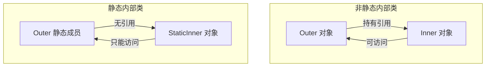

# 静态内部类与非静态内部类

> **目标级别**：P5/P6
> **面试频率**：🔴 高频必考（>70%）

## 快速自测

面试官最关心的 3 个问题：

1. 静态内部类和非静态内部类的核心区别是什么？
2. 静态内部类有什么优势？
3. 什么场景适合用静态内部类？

如果这三个问题你都能完整回答，可以跳过本文。

---

## 场景切入

面试官问：「HashMap 中 Entry 是什么？为什么要用静态内部类？」你说「Entry 是键值对」——然后面试官追问「如果 Entry 不是静态内部类，会有什么问题？」你愣住了。

这个问题考察的是对静态内部类应用场景的理解。HashMap、LinkedList 等 JDK 源码都大量使用了静态内部类。

## 一、核心区别

### 1.1 关键对比表

| 特性 | 非静态内部类 | 静态内部类 |
|------|--------------|------------|
| 关键字 | 无 | static |
| 外部类引用 | 持有（隐式） | 不持有 |
| 创建方式 | outer.new Inner() | new Outer.Inner() |
| 访问外部成员 | 所有成员（直接访问） | 只能访问静态成员 |
| 生命周期 | 依赖外部类对象 | 独立于外部类 |
| 内存管理 | 可能导致外部类无法被 GC | 不影响外部类 GC |

### 1.2 内存模型图



---

## 二、非静态内部类

### 2.1 基本特性

```java
class Outer {
    private int outerField = 1;

    class Inner {
        public void accessOuter() {
            // [!code highlight] 直接访问外部类成员
            System.out.println(outerField);
            System.out.println(Outer.this.outerField);  // [!code highlight] 显式引用
        }
    }
}

// [!code warning] 创建方式：必须通过外部类实例
Outer outer = new Outer();
Outer.Inner inner = outer.new Inner();  // [!code warning] outer.new Inner()
```

### 2.2 编译器生成的字节码

```java
// 编译后（伪代码）
class Outer$Inner {
    final Outer this$0;  // [!code highlight] 编译器生成外部类引用

    Outer$Inner(Outer this$0) {  // [!code highlight] 构造器参数是外部类
        this.this$0 = this$0;
    }
}
```

:::warning 持有外部类引用的问题
非静态内部类持有外部类引用，这可能导致外部类对象无法被 GC 回收，造成内存泄漏。
:::

---

## 三、静态内部类

### 3.1 基本特性

```java
class Outer {
    private static int staticField = 1;
    private int instanceField = 2;

    static class StaticInner {
        public void accessOuter() {
            System.out.println(staticField);  // [!code highlight] OK
            // System.out.println(instanceField);  // [!code error] 编译错误
        }
    }
}

// [!code highlight] 创建方式：直接通过类名
Outer.StaticInner inner = new Outer.StaticInner();  // [!code highlight]
```

### 3.2 编译器生成的字节码

```java
// 编译后（伪代码）
class Outer$StaticInner {
    // [!code highlight] 没有外部类引用
    Outer$StaticInner() {
        super();
    }
}
```

:::tip 静态内部类的优势
1. 不持有外部类引用，不影响 GC
2. 创建不需要外部类实例
3. 访问外部类静态成员更清晰
:::

---

## 四、实战应用：JDK 源码中的静态内部类

### 4.1 HashMap.Node

```java
// JDK 源码：HashMap.java
public class HashMap<K,V> extends AbstractMap<K,V>
    implements Map<K,V>, Cloneable, Serializable {

    // [!code highlight] 静态内部类：Entry 是键值对的抽象
    static class Node<K,V> implements Map.Entry<K,V> {
        final int hash;
        final K key;
        V value;
        Node<K,V> next;  // [!code highlight] 链表next指针

        Node(int hash, K key, V value, Node<K,V> next) {
            this.hash = hash;
            this.key = key;
            this.value = value;
            this.next = next;
        }
    }
}
```

:::tip 为什么 HashMap 用静态内部类？
Node 不需要访问 HashMap 的实例成员，只需要访问 hash、key、value。使用静态内部类可以：
1. 避免持有外部类引用
2. 语义上与 HashMap 紧密关联
3. 节省内存
:::

### 4.2 LinkedList.Node

```java
// JDK 源码：LinkedList.java
public class LinkedList<E> extends AbstractSequentialList<E>
    implements List<E>, Deque<E>, Cloneable, Serializable {

    // [!code highlight] 非静态内部类：需要访问 LinkedList 实例
    private class Node {
        E item;
        Node prev;
        Node next;

        Node(Node prev, E item, Node next) {
            this.item = item;
            this.prev = prev;
            this.next = next;
        }
    }
}
```

:::tip 为什么 LinkedList 用非静态内部类？
Node 需要访问 LinkedList 的实例成员（如 first、last 指针）。使用非静态内部类可以：
1. 直接访问 LinkedList 的成员
2. 节点与链表紧密耦合
3. 节点离开链表后失去意义
:::

### 4.3 对比总结

| 类 | 内部类类型 | 原因 |
|----|-----------|------|
| HashMap.Node | 静态 | 不需要访问 HashMap 实例成员 |
| LinkedList.Node | 非静态 | 需要访问 LinkedList 实例成员 |
| TreeMap.Entry | 静态 | 不需要访问 TreeMap 实例成员 |
| ArrayList.Itr | 非静态 | 需要访问 ArrayList 实例成员 |

---

## 五、适用场景

### 5.1 静态内部类的适用场景

| 场景 | 示例 | 说明 |
|------|------|------|
| 工具类 | `Map.Entry` | 与外部类语义关联但不需要外部类实例 |
| 配置类 | `Builder` | 用于构建外部类实例 |
| 常量类 | `MyClass.Constants` | 分组管理常量 |
| 单一职责类 | `Comparator` 实现 | 功能单一，与外部类关联 |

### 5.2 非静态内部类的适用场景

| 场景 | 示例 | 说明 |
|------|------|------|
| 迭代器 | `ArrayList.Itr` | 需要访问容器实例成员 |
| 监听器 | `View.OnClickListener` | 回调需要访问 View 实例 |
| 策略 | 需要访问外部类状态的策略 | 策略依赖外部类状态 |
| 节点 | `LinkedList.Node` | 节点与链表紧密关联 |

---

## 六、高频追问链

> **第一层**：静态内部类和非静态内部类的核心区别是什么？
>
> **第二层**：为什么 HashMap 用静态内部类而 LinkedList 用非静态内部类？
>
> **第三层**：静态内部类会导致内存泄漏吗？
>
> **第四层**：什么情况下用静态内部类比普通类更好？

---

## 七、常见错误与陷阱

### ⚠️ 陷阱 1：误用非静态内部类

```java
class Outer {
    class HeavyInner {  // [!code warning] 持有外部类引用
        byte[] data = new byte[10 * 1024 * 1024];  // 10MB
    }
}

// 使用
Outer outer = new Outer();
Outer.HeavyInner inner = outer.new HeavyInner();
// [!code warning] 持有 inner 引用时，outer 可能无法被 GC
```

### ⚠️ 陷阱 2：非静态内部类的序列化问题

```java
class Outer implements Serializable {
    class Inner {  // [!code warning] 非静态内部类
        int value;
    }
}

// [!code error] 序列化时需要外部类也实现 Serializable
// 或者将 Inner 改为静态内部类
```

### ⚠️ 陷阱 3：静态内部类访问实例成员

```java
class Outer {
    private int instanceField = 1;

    static class StaticInner {
        public void method() {
            // [!code error] 编译错误
            System.out.println(instanceField);
        }
    }
}
```

---

## 八、加分回答

💡 **超出预期的深度**：

### 1. 静态内部类的单例模式

```java
public class Singleton {
    private Singleton() { }

    // [!code highlight] 静态内部类实现延迟加载单例
    private static class Holder {
        private static final Singleton INSTANCE = new Singleton();
    }

    public static Singleton getInstance() {
        return Holder.INSTANCE;  // [!code highlight] 线程安全，由 JVM 保证
    }
}
```

### 2. 静态内部类的枚举单例

```java
public enum Singleton {
    INSTANCE;  // [!code highlight] 最简洁的线程安全单例

    public void doSomething() { }
}
```

### 3. 静态内部类的泛型应用

```java
// 利用静态内部类实现泛型参数化
class Container<T> {
    // [!code highlight] 静态内部类持有容器引用，但不需要泛型参数
    static class Node {
        T value;  // [!code warning] 编译错误：静态内部类不能使用外部类的泛型
    }
}

// 如果需要泛型，定义为成员非静态内部类
class Container<T> {
    class Node {  // [!code highlight] 非静态内部类可以使用 T
        T value;
    }
}
```

---

## 九、扩展思考

面试结束前的延伸问题：

1. **为什么非静态内部类不能有 static 成员？** —— 因为非静态内部类依赖于外部类实例
2. **什么是内部类的序列化问题？** —— 需要外部类也实现序列化
3. **静态内部类和普通类的区别是什么？** —— 仅仅是命名空间和组织方式的区别
