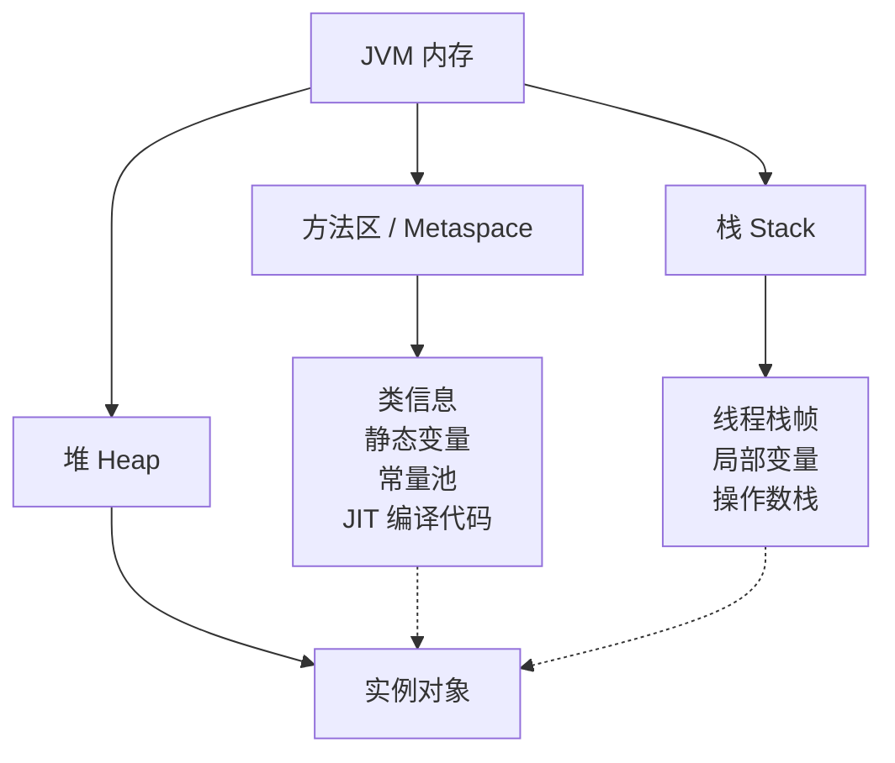
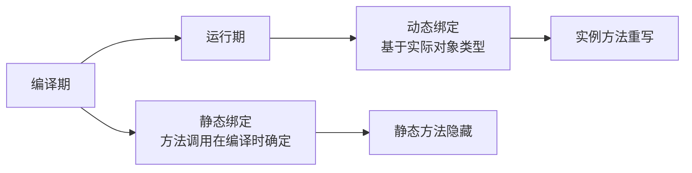

# static 关键字作用

面试官问："static 关键字有什么作用？"

候选人小魏答："static 修饰的成员属于类，不属于实例。"

面试官点点头，又问："static 变量在内存中放在哪里？"

小魏说："堆？"

面试官："static 方法能被子类重写吗？"

小魏说："不能...吧？"

面试官追问："为什么 static 方法不能被重写？"

小魏答不上来。

【面试官心理】
这道题看似简单，但能说出"静态方法没有多态"、"属于类而非实例"、"在方法区/元空间"三个核心点的候选人不多。追问 static 重写问题，是测试候选人对 Java 多态机制的理解。

## 一、static 修饰变量 🔴

### 1.1 类变量 vs 实例变量

```java
class Student {
    static String schoolName = "X University"; // 类变量（所有对象共享）
    String name;                               // 实例变量（每个对象独立）

    Student(String name) {
        this.name = name;
    }
}

Student s1 = new Student("Alice");
Student s2 = new Student("Bob");

s1.schoolName = "Y University"; // 修改的是类变量，影响所有对象

System.out.println(s2.schoolName); // Y University
System.out.println(Student.schoolName); // Y University（推荐写法）
```

### 1.2 内存位置



- **静态变量**：存储在**方法区/元空间**（JDK 8+）
- **实例变量**：存储在**堆**中，随对象一起分配

:::tip 💡
JDK 8 将永久代（PermGen）移除，静态变量从"方法区"移到了"堆"中（但仍然受类加载器管理）。这是 JDK 7 到 JDK 8 的重要变化。
:::

## 二、static 修饰方法 🔴

### 2.1 静态方法的特性

```java
class MathUtils {
    static int add(int a, int b) {
        return a + b;
    }

    static int multiply(int a, int b) {
        return a * b;
    }
}

// 调用方式：类名.方法名（推荐）
int result = MathUtils.add(3, 4);

// 也可以通过对象调用（不推荐）
MathUtils u = new MathUtils();
u.add(3, 4); // 编译通过，但不规范
```

### 2.2 静态方法的限制

```java
class Parent {
    static void staticMethod() { }

    void instanceMethod() { }
}

class Child extends Parent {
    // ❌ 这不是重写，是隐藏（hiding）
    // 静态方法没有多态，没有 @Override 注解
    static void staticMethod() { }
}

// 调用：
Parent p = new Child();
p.staticMethod(); // 调用 Parent.staticMethod（编译时静态绑定）
Child.staticMethod(); // 调用 Child.staticMethod
```

**为什么 static 方法不能被重写？**

1. **重写（Override）**需要运行时动态分派，基于对象的实际类型
2. **静态方法**属于类，在编译时就确定了调用版本（基于声明类型）
3. 子类的"static 方法"是**隐藏（hiding）**父类的方法，不是重写



### 2.3 静态方法的使用原则

```java
// ✅ 适合用 static 的场景：
// 1. 工具方法（不依赖实例状态）
public static boolean isPrime(int n) { }

// 2. 工厂方法
public static User create(String name) {
    return new User(name);
}

// 3. 单例的 getInstance
public static User getInstance() { }

// ❌ 不适合用 static 的场景：
// 需要子类多态行为的方法
// 需要访问实例变量的方法
```

## 三、static 修饰代码块 🔴

### 3.1 静态代码块

```java
class Config {
    static Map<String, String> settings;

    static {
        settings = new HashMap<>();
        settings.put("db.url", "localhost");
        settings.put("db.name", "test");
        // 类加载时执行一次，用于初始化静态资源
    }
}
```

执行顺序：按代码顺序执行，**只在类第一次加载时执行一次**。

### 3.2 静态代码块的执行时机

```java
class Parent {
    static { System.out.println("Parent static"); }
    { System.out.println("Parent instance"); }
    Parent() { System.out.println("Parent constructor"); }
}

class Child extends Parent {
    static { System.out.println("Child static"); }
    { System.out.println("Child instance"); }
    Child() { System.out.println("Child constructor"); }
}

new Child();
```

输出：
```
Parent static      ← 父类静态代码块（类加载时）
Child static       ← 子类静态代码块（类加载时）
Parent instance    ← 父类实例初始化块
Parent constructor ← 父类构造器
Child instance     ← 子类实例初始化块
Child constructor  ← 子类构造器
```

## 四、static 修饰内部类 🔴

详见[静态内部类与非静态内部类](/questions/java-basic/static-inner)

## 五、常见面试陷阱 🔴

### 5.1 static 变量线程安全问题

```java
class Counter {
    static int count = 0;

    static void increment() {
        count++; // ❌ 不是原子操作！多线程不安全
    }
}
```

```java
// 反编译后的 increment：
// getstatic count     // 读取
// iconst_1            // 常量1
// iadd                // 加法
// putstatic count     // 写回
// 这三步之间可能被其他线程打断
```

:::warning ⚠️
**static 变量在多线程环境下是不安全的**。多个线程同时修改同一个 static 变量，会产生竞态条件。如果需要线程安全，使用 `AtomicInteger` 或加锁。
:::

### 5.2 静态变量导致的内存泄漏

```java
class LeakyClass {
    static List<Connection> connections = new ArrayList<>();

    void addConnection(Connection conn) {
        connections.add(conn); // static 集合永远不会被 GC
    }
}
```

静态集合持有对象引用 → 对象永远不会被 GC → 内存泄漏。

### 5.3 static 不能使用的场景

```java
// ❌ 不能修饰局部变量
void method() {
    static int x = 10; // 编译错误
}

// ❌ 不能修饰构造器
static User() { } // 编译错误

// ❌ 不能与 this/super 一起使用
static void method() {
    this.name = "test"; // ❌ 编译错误
    super.toString();   // ❌ 编译错误
}
```

原因：static 方法和 static 变量属于类，不属于实例，而 `this`/`super` 是实例相关的概念。

## 六、追问升级

**面试官**："main 方法为什么是 static 的？"

```java
public static void main(String[] args) { }

// 原因：
// 1. JVM 调用 main 时，不需要创建对象
// 2. 如果 main 不是 static，JVM 需要先 new MainClass()，再调用 main()
// 3. 这会导致"鸡和蛋"问题：创建对象时需要先执行构造器，但入口 main 还没运行
```

**面试官**："静态内部类和静态变量，谁先加载？"

```java
class Outer {
    static int outerStatic = 1;
    static class Inner { static int innerStatic = 2; }
}

// 加载顺序：
// 1. 加载 Outer.class
// 2. 执行 Outer 的静态变量初始化和静态代码块
// 3. （如果访问了 Inner）加载 Inner.class
// 4. 执行 Inner 的静态初始化

// Inner 类只有在第一次主动使用时才加载（懒加载）
```
