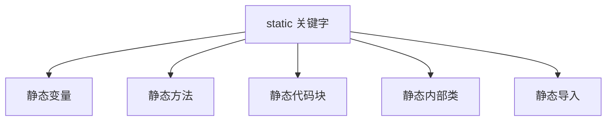
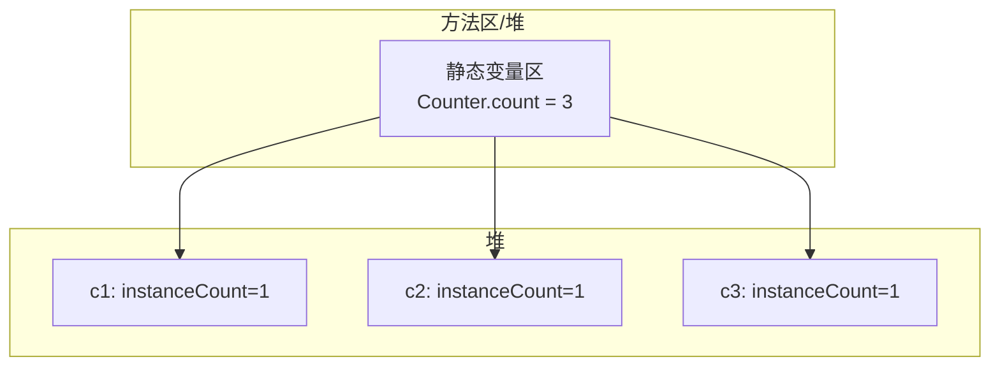

# static 关键字作用

> **目标级别**：P5/P6
> **面试频率**：🔴 高频必考（>70%）

## 快速自测

面试官最关心的 3 个问题：

1. static 可以修饰哪些成员？各自的特点是什么？
2. static 变量和实例变量的区别是什么？
3. static 方法能访问实例变量吗？为什么？

如果这三个问题你都能完整回答，可以跳过本文。

---

## 场景切入

面试官问：「static 关键字有什么用？」你说「可以修饰变量和方法」——然后面试官追问「那 static 代码块呢？什么时候执行？」你愣了一下。

static 是 Java 中最基础也最重要的关键字之一，理解它是理解 JVM 内存模型的基础。

## 一、static 可以修饰的内容

### 1.1 修饰成员一览



### 1.2 修饰对象对比表

| 修饰内容 | 说明 | 生命周期 | 访问方式 |
|----------|------|----------|----------|
| 静态变量 | 类变量，所有对象共享 | 类加载到卸载 | 类名.变量 或 对象.变量 |
| 静态方法 | 类方法，无需对象调用 | 类加载到卸载 | 类名.方法() 或 对象.方法() |
| 静态代码块 | 类初始化代码 | 类加载时执行一次 | 自动执行 |
| 静态内部类 | 嵌套类的静态成员 | 类加载到卸载 | 外部类.内部类 |
| 静态导入 | 导入静态成员 | 编译时 | 直接使用 |

---

## 二、静态变量

### 2.1 基本语法

```java
class Counter {
    // [!code highlight] 静态变量：所有对象共享
    static int count = 0;

    // 实例变量：每个对象独立
    int instanceCount = 0;

    public Counter() {
        count++;
        instanceCount++;
    }
}

public class Main {
    public static void main(String[] args) {
        Counter c1 = new Counter();
        Counter c2 = new Counter();
        Counter c3 = new Counter();

        System.out.println(Counter.count);         // [!code highlight] 3
        System.out.println(c1.instanceCount);      // 1
        System.out.println(c2.instanceCount);      // 1
    }
}
```

### 2.2 内存模型图



---

## 三、静态方法

### 3.1 基本语法

```java
class MathUtils {
    // [!code highlight] 静态方法：不需要创建对象
    public static int add(int a, int b) {
        return a + b;
    }

    // 实例方法：需要对象调用
    public int multiply(int a, int b) {
        return a * b;
    }
}

public class Main {
    public static void main(String[] args) {
        // [!code highlight] 直接通过类名调用
        int result = MathUtils.add(1, 2);

        // [!code highlight] 也可以通过对象调用（不推荐）
        MathUtils utils = new MathUtils();
        int result2 = utils.add(1, 2);  // [!code warning]
    }
}
```

### 3.2 静态方法的限制

```java
class Example {
    int instanceField;  // 实例变量
    static int staticField;  // 静态变量

    // [!code error] 编译错误：静态方法不能使用 this
    public static void staticMethod() {
        System.out.println(this.instanceField);  // [!code error]
    }

    // [!code error] 编译错误：静态方法不能访问实例成员
    public static void accessInstance() {
        System.out.println(instanceField);  // [!code error]
        instanceMethod();  // [!code error]
    }

    public void instanceMethod() {
        // 实例方法可以访问所有成员
        System.out.println(instanceField);
        System.out.println(staticField);
        staticMethod();
    }
}
```

:::warning 静态方法的限制
1. **不能使用 this/super**
2. **不能访问实例成员**（实例变量、实例方法）
3. **不能被重写**（只能被隐藏）
:::

---

## 四、静态代码块

### 4.1 基本语法

```java
class DatabaseConfig {
    // [!code highlight] 静态代码块：在类加载时执行一次
    static {
        System.out.println("初始化数据库配置...");
        // 加载数据库驱动
        // 初始化连接池
    }

    public DatabaseConfig() {
        System.out.println("构造函数");
    }
}

public class Main {
    public static void main(String[] args) {
        // 第一次使用类时触发类加载
        DatabaseConfig config = new DatabaseConfig();  // [!code highlight] 先输出静态代码块
    }
}

// 输出：
// 初始化数据库配置...
// 构造函数
```

### 4.2 多个静态代码块

```java
class Example {
    static {
        System.out.println("静态代码块 1");
    }

    static int field = init();

    static {
        System.out.println("静态代码块 2");
    }

    static int init() {
        System.out.println("静态变量初始化");
        return 10;
    }
}

// 执行顺序：
// 1. 静态代码块 1
// 2. 静态变量初始化
// 3. 静态代码块 2
```

---

## 五、静态内部类

### 5.1 基本语法

```java
class Outer {
    static class StaticInner {
        public void method() {
            System.out.println("静态内部类方法");
        }
    }

    class Inner {
        public void method() {
            System.out.println("非静态内部类方法");
        }
    }
}

public class Main {
    public static void main(String[] args) {
        // 静态内部类：不需要外部类实例
        Outer.StaticInner staticInner = new Outer.StaticInner();  // [!code highlight]
        staticInner.method();

        // 非静态内部类：需要外部类实例
        Outer outer = new Outer();
        Outer.Inner inner = outer.new Inner();  // [!code highlight]
        inner.method();
    }
}
```

---

## 六、高频追问链

> **第一层**：static 可以修饰哪些内容？各自特点是什么？
>
> **第二层**：静态变量和实例变量的区别是什么？
>
> **第三层**：静态方法为什么不能访问实例成员？
>
> **第四层**：静态代码块在什么时候执行？执行几次？

---

## 七、常见错误与陷阱

### ⚠️ 陷阱 1：静态变量共享导致线程安全问题

```java
class Counter {
    static int count = 0;  // [!code warning] 多线程下不安全

    public static void increment() {
        count++;  // [!code warning] 非原子操作
    }
}
```

:::tip 线程安全方案
```java
// 方案1：synchronized
public static synchronized void increment() {
    count++;
}

// 方案2：AtomicInteger
private static AtomicInteger count = new AtomicInteger(0);

public static void increment() {
    count.incrementAndGet();
}
```
:::

### ⚠️ 陷阱 2：静态变量内存泄漏

```java
class Cache {
    static Map<String, Object> cache = new HashMap<>();

    public static void put(String key, Object value) {
        cache.put(key, value);  // [!code warning] 静态集合永不释放
    }
}
```

### ⚠️ 陷阱 3：在静态方法中返回实例

```java
class Singleton {
    private static Singleton instance;

    public static Singleton getInstance() {
        if (instance == null) {  // [!code warning] 线程不安全
            instance = new Singleton();
        }
        return instance;
    }
}
```

---

## 八、加分回答

💡 **超出预期的深度**：

### 1. 静态变量的内存布局

```java
// JDK 8+：静态变量存储在堆内存的「类对象」中
// JDK 6-：静态变量存储在方法区

// HotSpot JVM 实现
class Class {
    static int staticField;  // 存储在 Klass 对象中
}
```

### 2. 类加载时机

```java
// 以下情况会触发类加载：
// 1. new 创建对象
// 2. 访问静态成员
// 3. Class.forName()
// 4. 子类加载（触发父类加载）
// 5. main 方法所在类
```

### 3. 静态导数

```java
// 普通导入
import static java.lang.Math.PI;  // [!code highlight]

// 使用
double area = PI * r * r;  // [!code highlight] 不需要 Math.PI

// 导入静态方法
import static java.lang.Math.sqrt;

double root = sqrt(2);  // [!code highlight] 不需要 Math.sqrt
```

---

## 九、扩展思考

面试结束前的延伸问题：

1. **静态变量和实例变量的内存位置有什么区别？** —— 静态变量在方法区/堆，实例变量在堆
2. **什么情况下类会被卸载？** —— 无实例、无引用、ClassLoader 可被卸载
3. **为什么 main 方法必须是 static？** —— JVM 调用时无需创建对象
