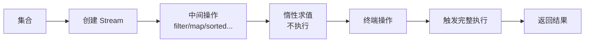

# Stream 流操作

面试官问："Java Stream 是什么？"

候选人小贺答："Stream 是对集合的流式操作。"

面试官追问："中间操作和终端操作有什么区别？"

小贺说："中间操作返回 Stream，终端操作返回结果？"

面试官追问："Stream 是惰性求值的吗？为什么？"

小贺答不上来。

【面试官心理】
这道题考查的是候选人对 Stream 执行模型的深层理解。能说出"惰性求值"和"短路操作"的候选人，说明对函数式编程的执行机制有理解。

## 一、Stream 的核心概念 🔴

### 1.1 惰性求值（Lazy Evaluation）

```java
// ❌ 不是立即执行
Stream<String> stream = list.stream()
    .filter(s -> {
        System.out.println("filter: " + s);
        return s.length() > 3;
    })
    .map(s -> {
        System.out.println("map: " + s);
        return s.toUpperCase();
    });

// ✅ 只有终端操作触发执行
List<String> result = stream.collect(Collectors.toList());
// 现在才开始执行！
```

### 1.2 中间操作 vs 终端操作

```java
// 中间操作（返回 Stream，惰性）：
stream.filter()  // 过滤
stream.map()     // 映射
stream.sorted()  // 排序
stream.distinct() // 去重
stream.limit(n)  // 截断

// 终端操作（触发执行，返回结果）：
stream.collect()  // 收集
stream.count()   // 计数
stream.forEach() // 遍历
stream.reduce()  // 聚合
stream.toArray() // 转数组
```

### 1.3 执行流程



## 二、常用中间操作 🔴

### 2.1 filter - 过滤

```java
List<Integer> numbers = Arrays.asList(1, 2, 3, 4, 5);

numbers.stream()
    .filter(n -> n % 2 == 0) // 过滤偶数
    .collect(Collectors.toList()); // [2, 4]
```

### 2.2 map - 映射

```java
List<String> names = Arrays.asList("Alice", "Bob", "Charlie");

names.stream()
    .map(String::toUpperCase) // 转大写
    .map(s -> s.length())     // 转长度
    .collect(Collectors.toList()); // [5, 3, 7]
```

### 2.3 flatMap - 扁平化

```java
// 扁平化嵌套集合
List<List<Integer>> nested = Arrays.asList(
    Arrays.asList(1, 2),
    Arrays.asList(3, 4),
    Arrays.asList(5)
);

nested.stream()
    .flatMap(list -> list.stream()) // 扁平化
    .collect(Collectors.toList()); // [1, 2, 3, 4, 5]
```

### 2.4 短路操作

```java
// limit：限制数量（短路）
Stream.iterate(1, i -> i + 1)
    .filter(n -> n % 2 == 0)
    .limit(5) // 只取前 5 个
    .forEach(System.out::println); // 2, 4, 6, 8, 10

// takeWhile / dropWhile（JDK 9+）
Stream.of(1, 2, 3, 4, 1, 2)
    .takeWhile(n -> n < 3) // 取直到不满足条件
    .forEach(System.out::println); // 1, 2
```

## 三、常用终端操作 🔴

### 3.1 collect - 收集

```java
List<String> list = stream.collect(Collectors.toList());
Set<String> set = stream.collect(Collectors.toSet());

// 分组
Map<String, List<User>> byCity = users.stream()
    .collect(Collectors.groupingBy(User::getCity));

// 分区（按条件）
Map<Boolean, List<User>> byAge = users.stream()
    .collect(Collectors.partitioningBy(u -> u.getAge() >= 18));

// 拼接
String names = stream.map(User::getName)
    .collect(Collectors.joining(", "));
```

### 3.2 reduce - 聚合

```java
// 求和
int sum = numbers.stream()
    .reduce(0, Integer::sum); // 初始值 0

// 最大值
Optional<Integer> max = numbers.stream()
    .reduce(Integer::max);

// 不用初始值（返回 Optional）
Optional<Integer> sum2 = numbers.stream()
    .reduce(Integer::sum);
```

## 四、并行流 🟡

### 4.1 ForkJoinPool

```java
// parallelStream 使用公共的 ForkJoinPool
List<String> result = list.parallelStream()
    .filter(s -> s.length() > 3)
    .map(String::toUpperCase)
    .collect(Collectors.toList());

// 默认线程数 = CPU 核心数
// ForkJoinPool.commonPool().getParallelism()
```

### 4.2 注意事项

```java
// ❌ 并行流不一定快
// 小数据量、简单操作：顺序流更快（无线程切换开销）
// 大数据量、复杂计算：并行流更快

// ❌ 并行流可能有线程安全问题
List<Long> list = new ArrayList<>(); // 非线程安全
list.parallelStream().forEach(Long::new); // 数据丢失！

// ✅ 使用线程安全的集合
List<Long> list = Collections.synchronizedList(new ArrayList<>());
// 或者用 toList() / toSet()
```

### 4.3 自定义线程池

```java
// JDK 不支持直接指定并行流的线程池
// 只能用系统属性（全局影响，不推荐）
// System.setProperty("java.util.concurrent.ForkJoinPool.common.parallelism", "4");

// ✅ 推荐：使用 CompletableFuture 或自定义 Executor
ExecutorService executor = Executors.newFixedThreadPool(4);
List<String> result = list.stream()
    .parallel()
    .map(s -> {
        // ...
    })
    .collect(Collectors.toList());
```

## 五、性能优化 🟡

### 5.1 顺序影响

```java
// ✅ 好的顺序：先过滤减少数据量
list.stream()
    .filter(x -> x > 100)  // 过滤（减少）
    .map(x -> x * 2)        // 映射
    .collect(toList());

// ❌ 不好的顺序：先映射再过滤
list.stream()
    .map(x -> x * 2)        // 映射（不减少）
    .filter(x -> x > 100)  // 过滤
    .collect(toList());
```

### 5.2 避免自动装箱

```java
// ❌ 频繁装箱
list.stream()
    .filter(n -> n > 100) // n 是 int，自动装箱为 Integer
    .map(n -> n * 2)       // 再装箱
    .collect(toList());

// ✅ 使用基本类型流
list.stream()
    .mapToInt(n -> n)    // 转 IntStream
    .filter(n -> n > 100)
    .map(n -> n * 2)
    .boxed()              // 转回 Integer
    .collect(toList());
```

## 六、追问升级

**面试官**："Stream 是线程安全的吗？"

```java
// ❌ Stream 本身不是线程安全的
// 多个线程同时操作同一个 Stream 会有问题
Stream<Integer> stream = list.stream();
stream.forEach(...); // 可能 ConcurrentModificationException

// ✅ 正确做法：每个线程有自己的 Stream
list.parallelStream().forEach(...); // 内部会分区处理
```

【面试官心理】
能说出并行流内部如何分区处理数据的候选人，说明对 ForkJoinPool 有了解。这是 P6+ 的加分点。
