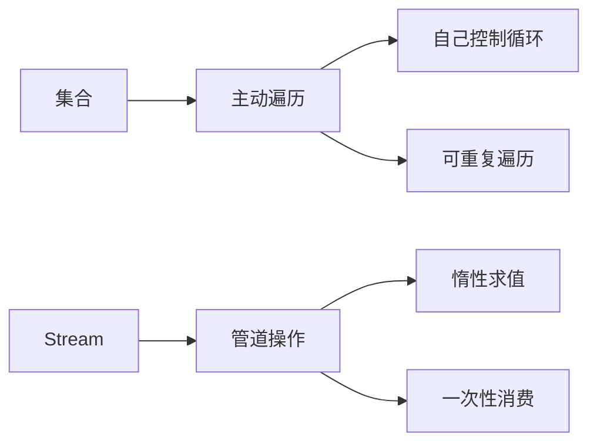

# Stream 流操作

> **目标级别**：P5/P6
> **面试频率**：🔴 高频必考（>70%）

## 快速自测

面试官最关心的 3 个问题：

1. Stream 和集合的区别是什么？
2. 中间操作和终止操作有什么区别？
3. 什么场景下 Stream 性能比 for 循环差？

如果这三个问题你都能完整回答，可以跳过本文。

---

## 场景切入

面试官问：「你用过 Stream 吗？」你说「用过，filter、map 这些」——然后面试官追问「那你说说 Stream 是惰性求值的吗？什么时候开始执行？」你愣住了。

Stream 是 Java 8 最强大的特性之一，但很多人只停留在表面用法，不理解其惰性求值机制。

## 一、Stream vs 集合

### 1.1 基本对比

| 特性 | 集合 | Stream |
|------|------|--------|
| 存储 | 存储数据 | 不存储数据 |
| 操作 | 主动遍历 | 惰性求值 |
| 次数 | 可多次遍历 | 只能消费一次 |
| 源头 | 自己创建 | 从集合/数组生成 |
| 并行 | 手动实现 | 一行代码实现 |

### 1.2 图解



---

## 二、创建 Stream

### 2.1 各种创建方式

```java
// 从集合创建
List<String> list = Arrays.asList("a", "b", "c");
Stream<String> stream1 = list.stream();

// 从数组创建
String[] array = {"a", "b", "c"};
Stream<String> stream2 = Arrays.stream(array);

// Stream.of
Stream<String> stream3 = Stream.of("a", "b", "c");

// 无限流
Stream<Integer> stream4 = Stream.iterate(0, n -> n + 1);
Stream<Double> stream5 = Stream.generate(Math::random);

// 并行流
Stream<String> parallelStream = list.parallelStream();
```

---

## 三、中间操作

### 3.1 常用中间操作

| 操作 | 说明 | 示例 |
|------|------|------|
| filter | 过滤 | `stream.filter(x -> x > 0)` |
| map | 转换 | `stream.map(String::toUpperCase)` |
| flatMap | 扁平化 | `stream.flatMap(List::stream)` |
| distinct | 去重 | `stream.distinct()` |
| sorted | 排序 | `stream.sorted()` |
| limit | 限制数量 | `stream.limit(10)` |
| skip | 跳过 | `stream.skip(5)` |
| peek | 窥视 | `stream.peek(System.out::println)` |

### 3.2 惰性求值

```java
List<Integer> numbers = Arrays.asList(1, 2, 3, 4, 5);

// [!code warning] 不会输出任何内容！
Stream<Integer> stream = numbers.stream()
    .filter(n -> {
        System.out.println("filter: " + n);
        return n > 2;
    });

// [!code highlight] 调用终止操作才开始执行
List<Integer> result = stream.collect(Collectors.toList());
// 输出：filter: 1, filter: 2, filter: 3, filter: 4, filter: 5
```

:::tip 惰性求值
中间操作不会执行，只有调用终止操作时才会触发计算。这就是 Stream 的「惰性求值」机制。
:::

---

## 四、终止操作

### 4.1 常用终止操作

| 操作 | 返回类型 | 说明 |
|------|----------|------|
| forEach | void | 遍历 |
| collect | 集合 | 收集结果 |
| reduce | Optional/值 | 聚合 |
| count | long | 计数 |
| sum/avg | 基本类型 | 数学运算 |
| anyMatch | boolean | 任意匹配 |
| allMatch | boolean | 全部匹配 |
| noneMatch | boolean | 无匹配 |
| findFirst | Optional | 找第一个 |
| findAny | Optional | 找任意一个 |

### 4.2 collect 收集

```java
List<String> names = Arrays.asList("Alice", "Bob", "Charlie");

// 收集为 List
List<String> list = names.stream().collect(Collectors.toList());

// 收集为 Set
Set<String> set = names.stream().collect(Collectors.toSet());

// 收集为 Map
Map<String, Integer> map = names.stream()
    .collect(Collectors.toMap(name -> name, name -> name.length()));

// 分组
Map<Integer, List<String>> grouped = names.stream()
    .collect(Collectors.groupingBy(String::length));

// 分区
Map<Boolean, List<String>> partitioned = names.stream()
    .collect(Collectors.partitioningBy(name -> name.length() > 3));
```

---

## 五、并行流

### 5.1 基本用法

```java
// 顺序流
List<Integer> result = list.stream()
    .map(x -> x * 2)
    .collect(Collectors.toList());

// [!code highlight] 并行流
List<Integer> result = list.parallelStream()  // [!code highlight]
    .map(x -> x * 2)
    .collect(Collectors.toList());

// 或
List<Integer> result = list.stream()
    .parallel()  // [!code highlight]
    .map(x -> x * 2)
    .collect(Collectors.toList());
```

### 5.2 性能对比

```java
// 性能测试
long start = System.nanoTime();
list.stream().reduce(0, Integer::sum);
System.out.println("Sequential: " + (System.nanoTime() - start));

start = System.nanoTime();
list.parallelStream().reduce(0, Integer::sum);
System.out.println("Parallel: " + (System.nanoTime() - start));
```

:::warning 并行流的注意事项
1. 数据量小不值得并行
2. 有状态操作不适合并行
3. 并行不保证顺序
4. 线程安全问题
:::

---

## 六、高频追问链

> **第一层**：Stream 和集合有什么区别？
>
> **第二层**：Stream 是惰性求值的，什么意思？
>
> **第三层**：并行流有什么注意事项？
>
> **第四层**：什么场景下 Stream 性能比 for 循环差？

---

## 七、常见错误与陷阱

### ⚠️ 陷阱 1：多次消费

```java
Stream<String> stream = list.stream()
    .filter(s -> s.length() > 3);

List<String> result1 = stream.collect(Collectors.toList());  // OK
List<String> result2 = stream.collect(Collectors.toList());  // [!code error] IllegalStateException
```

### ⚠️ 陷阱 2：顺序不保证

```java
// 并行流不保证顺序
list.parallelStream()
    .forEach(System.out::println);  // [!code warning] 顺序不确定

// 需要保证顺序
list.parallelStream()
    .forEachOrdered(System.out::println);  // [!code highlight]
```

### ⚠️ 陷阱 3：性能开销

```java
// 错误：为小数据量使用并行流
list.parallelStream()  // [!code warning] 小数据量开销大于收益
    .filter(x -> x > 0)
    .collect(Collectors.toList());

// 正确：数据量大才用并行流
```

---

## 八、加分回答

💡 **超出预期的深度**：

### 1. 短路操作

```java
// [!code highlight] 使用短路操作避免全量计算
list.stream()
    .filter(x -> x > 0)
    .limit(10)  // [!code highlight] 找到 10 个就停止
    .forEach(System.out::println);
```

### 2. 调试 peek

```java
// [!code highlight] 使用 peek 调试
list.stream()
    .filter(x -> x > 0)
    .peek(x -> System.out.println("After filter: " + x))  // [!code highlight]
    .map(x -> x * 2)
    .forEach(System.out::println);
```

### 3. 自定义 Collector

```java
// 自定义收集器：连接字符串
Collector<String, ?, String> joining = Collector.of(
    StringBuilder::new,
    StringBuilder::append,
    (b1, b2) -> b1.append(b2),
    StringBuilder::toString
);

String result = names.stream().collect(joining);
```

---

## 九、扩展思考

面试结束前的延伸问题：

1. **Stream 的实现原理是什么？** —— 管道+分治+归约
2. **forEach 和 for 循环哪个更快？** —— 大多数场景 for 循环更快
3. **如何处理有状态的操作？** —— 使用 reduce 而非 collect
