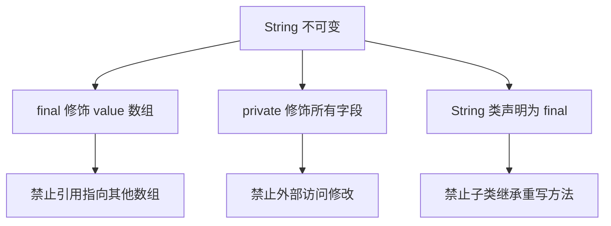
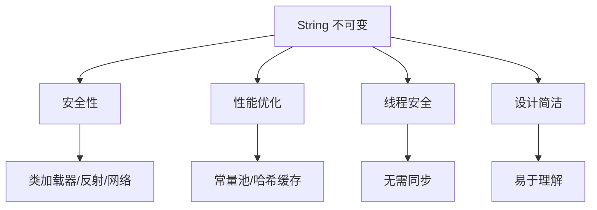

# String 为什么是不可变的？

> **目标级别**：P5/P6
> **面试频率**：🔴 高频必考（>70%）

## 快速自测

面试官最关心的 3 个问题：

1. String 为什么设计成不可变？有什么好处？
2. String 不可变的实现原理是什么？
3. String 不可变在哪些场景下是缺点？

如果这三个问题你都能完整回答，可以跳过本文。

---

## 场景切入

面试官问：「String 为什么设计成不可变？」你说「因为 value 是 final 的」——然后面试官追问「既然数组是 final 的，为什么只把 value 声明为 final 不足以保证 String 不可变？还需要什么？」你愣住了。

这个问题看似简单，实际上考察的是你对 Java 内存模型和设计模式的理解深度。让我彻底讲清楚。

## 一、String 不可变的实现原理

### 1.1 三个关键设计



### 1.2 String 源码解析

```java
// JDK 源码：String.java
public final class String  // [!code highlight] 1. final 修饰类，禁止继承
    implements java.io.Serializable, Comparable<String>, CharSequence {

    private final byte[] value;  // [!code highlight] 2. final 修饰数组引用
    private final byte coder;     // [!code highlight] 2. final 修饰编码器
    private int hash;             // hashCode 缓存，默认为 0（未计算）

    // [!code highlight] 3. 私有化构造器和方法，禁止外部修改
    private String(byte[] value, byte coder, int hash) {
        this.value = value;
        this.coder = coder;
        this.hash = hash;
    }

    // [!code highlight] 4. 所有修改方法都返回新 String 对象
    public String concat(String str) {
        // ...
        return new String(result, 0, resultLen);  // [!code highlight] 创建新对象
    }
}
```

:::warning 常见误解
很多人认为「只要 value 是 final，String 就不可变了」。这是不完整的理解。还需要：
1. String 类本身是 final（防止继承）
2. 所有字段都是 private（防止直接访问）
3. 所有修改方法都返回新对象（防止引用逃逸）
:::

---

## 二、不可变性的三个层面

### 2.1 类层面：final 修饰类

```java
public final class String { /* ... */ }

// [!code warning] 编译错误
class MyString extends String { }  // [!code error] 无法继承
```

:::tip final 类的意义
String 类声明为 final 防止被子类继承，避免子类重写方法破坏不可变性。
:::

### 2.2 引用层面：final 修饰字段

```java
private final byte[] value;  // [!code highlight] value 引用不能改变
```

:::tip final 数组的意义
数组引用 value 不能指向其他数组，但**数组内容本身可以被修改**！
这就是为什么 String 还需要其他保护措施。
:::

### 2.3 访问层面：private 修饰字段 + 不提供修改方法

```java
private final byte[] value;

// [!code warning] 如果提供公共修改方法
public void modifyValue(byte[] newValue) {
    this.value = newValue;  // 编译错误：final 引用不能重新赋值
}

// [!code warning] 如果通过索引修改
public void setChar(int index, char c) {
    this.value[index] = c;  // [!code warning] 编译器不阻止！危险！
}
```

---

## 三、为什么 String 要设计成不可变？

### 3.1 安全性

```java
// 场景：作为方法参数传递
public void process(String data) {
    // 如果 String 可变，data 可能被调用方修改
    // 但由于 String 不可变，调用方无法修改，参数安全
}

public void malicious() {
    String s = "safe";
    process(s);
    // s 仍然是 "safe"，不会被修改
}
```

#### 安全性场景

| 场景 | 问题 | 不可变如何解决 |
|------|------|----------------|
| 类加载器 | 加载的类名可能被修改 | 防止类名被篡改 |
| 网络连接 | URL/域名可能被修改 | 防止连接被劫持 |
| 反射参数 | Method.invoke 传入的参数可能被修改 | 保护参数完整性 |
| 缓存 key | 如果 key 被修改，HashMap 无法找到 | 保证缓存 key 不变 |

### 3.2 字符串常量池

```java
String s1 = "hello";
String s2 = "hello";

System.out.println(s1 == s2);  // true
```

:::tip 常量池原理
String 不可变使得 JVM 可以将字面量字符串缓存到常量池中，相同内容的字符串可以共享同一块内存。如果 String 可变，就没有这个优化了。
:::

### 3.3 哈希值缓存

```java
String s = "hello";
int h1 = s.hashCode();  // 计算并缓存
int h2 = s.hashCode();  // 直接返回缓存值，O(1)
```

:::tip hashCode 缓存
由于 String 不可变，hashCode 计算一次后可以永久缓存。如果 String 可变，字符串修改后 hashCode 就会失效，需要每次重新计算。
:::

### 3.4 线程安全

```java
// 多线程共享 String 对象不需要同步
String key = "cache_key";
// 多个线程可以安全地使用 key 作为 HashMap 的 key
```

:::tip 线程安全的意义
不可变对象天然线程安全，因为状态不会改变，不需要额外的同步机制。
:::

---

## 四、String 不可变性的代价

### 4.1 内存开销

```java
String s = "hello";
s = s + " world";  // [!code warning] 创建了两个对象：新的 "hello world" 和 StringBuilder
```

| 操作 | String | StringBuilder |
|------|--------|---------------|
| 拼接 | 创建新对象 | 原地修改 |
| 内存 | 每次创建新对象 | 可预分配容量 |
| GC 压力 | 高 | 低 |

### 4.2 解决方案：StringBuilder/StringBuffer

```java
StringBuilder sb = new StringBuilder("hello");
sb.append(" world");
String result = sb.toString();  // 只创建一个对象
```

---

## 五、不可变性的实现细节

### 5.1 JDK 8 vs JDK 9

```java
// JDK 8
private final char[] value;  // char[] 占 2 byte/字符

// JDK 9+
private final byte[] value;  // byte[] 占 1-2 byte/字符，节省内存
private final byte coder;   // 编码器：LATIN1 或 UTF16
```

:::tip 编码优化
JDK 9 开始，根据字符内容选择编码：
- Latin-1 字符（英文、数字、标点）：1 byte
- 其他 Unicode 字符：2 byte

这样可以节省约 50% 的内存。
:::

### 5.2 String 的修改方法

```java
// concat - 创建新 String
public String concat(String str) {
    if (str.isEmpty()) {
        return this;
    }
    int len = str.length();
    byte buf[] = new byte[count + len];
    // ...
    return new String(buf, 0, bufLen, coder);  // [!code highlight] 返回新对象
}

// substring - 共享底层数组（延迟复制）
public String substring(int beginIndex, int endIndex) {
    // JDK 7u6+：不再共享数组，创建新数组
    // 因为 substring 可能导致内存泄漏（持有大数组的引用）
    byte[] buf = new byte[endIndex - beginIndex];
    // ...
    return new String(buf, 0, bufLen, coder);
}
```

---

## 六、高频追问链

> **第一层**：String 为什么设计成不可变？
>
> **第二层**：String 不可变的实现原理是什么？为什么三个设计缺一不可？
>
> **第三层**：String 不可变有什么缺点？如何优化？
>
> **第四层**：JDK 9 为什么把 char[] 改成 byte[]？

---

## 七、常见错误与陷阱

### ⚠️ 陷阱 1：误以为 StringBuilder 是不可变的

```java
StringBuilder sb = new StringBuilder("hello");
System.out.println(sb.toString());  // "hello"

sb.append(" world");
System.out.println(sb.toString());  // "hello world"  // [!code warning] 修改了原对象！

// StringBuilder 的 value 不是 final
// StringBuilder sb = new StringBuilder();
// byte[] value = sb.value;  // [!code warning] 可以通过反射修改
```

### ⚠️ 陷阱 2：String 的 intern 陷阱

```java
String s1 = new String("hello");
String s2 = s1.intern();  // 将 s1 加入常量池
String s3 = "hello";

System.out.println(s1 == s2);  // false：s1 在堆，s2 在常量池
System.out.println(s2 == s3);  // true：都指向常量池
```

### ⚠️ 陷阱 3：反射修改 String（JDK 17 禁止）

```java
// JDK 8-11：可以通过反射修改 String 内部数组
Field valueField = String.class.getDeclaredField("value");
valueField.setAccessible(true);
byte[] value = (byte[]) valueField.get("hello");
value[0] = 'H';  // [!code warning] "Hello" 被修改了！

// JDK 17+：禁止修改
// [!code error] 抛出 InaccessibleObjectException
```

---

## 八、加分回答

💡 **超出预期的深度**：

### 1. String 不可变与内存泄漏

```java
// JDK 6 的 substring 问题
String big = new char[100000];  // "大" 字符串
String small = big.substring(0, 5);  // 只用了 5 个字符

// 问题：small 持有整个 big 数组的引用，导致内存泄漏

// JDK 7u6+ 的修复：substring 创建新数组
String small = big.substring(0, 5);  // 复制需要的 5 个字符
```

### 2. 不可变对象的设计模式：享元模式

```java
// Integer 的缓存就是享元模式
Integer a = 127;
Integer b = 127;
System.out.println(a == b);  // true：使用缓存

// String 常量池也是享元模式
String c = "hello";
String d = "hello";
System.out.println(c == d);  // true：共享常量池中的对象
```

### 3. 如何创建「可控可变」的 String？

```java
// 使用 StringBuilder 实现「可控可变」
class MutableString {
    private final StringBuilder sb;  // [!code highlight]

    public MutableString(String s) {
        this.sb = new StringBuilder(s);
    }

    public void append(String s) {
        sb.append(s);
    }

    public String toString() {
        return sb.toString();
    }

    // 获取不可变的 String
    public String immutable() {
        return sb.toString();
    }
}
```

---

## 九、扩展思考

面试结束前的延伸问题：

1. **为什么所有包装类都设计成不可变？** —— 安全性、缓存、线程安全
2. **如何创建一个「可变 String」？** —— 使用 StringBuilder 或自定义类
3. **Java 14 的 Text Blocks 对 String 有什么影响？** —— 更易读的多行字符串

---

## 十、总结

String 不可变性的核心价值：



记住：**不可变性是设计选择，而非技术限制**。Java 选择 String 不可变，是在安全性、性能和简洁性之间的权衡。
