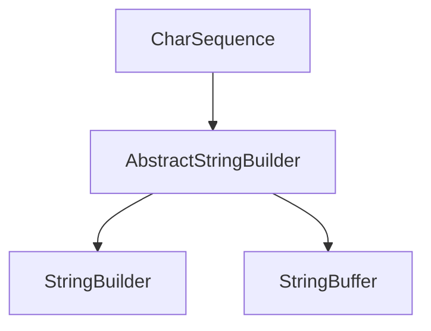
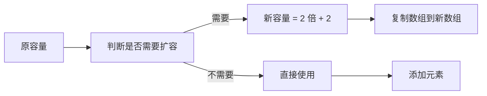

# String/StringBuilder/StringBuffer 区别

> **目标级别**：P5/P6
> **面试频率**：🔴 高频必考（>70%）

## 快速自测

面试官最关心的 3 个问题：

1. String、StringBuilder、StringBuffer 三者的核心区别是什么？
2. 为什么 String 执行拼接操作效率低？
3. StringBuilder 和 StringBuffer 哪个是线程安全的？为什么？

如果这三个问题你都能完整回答，可以跳过本文。

---

## 场景切入

面试官问：「String、StringBuilder、StringBuffer 有什么区别？」你说「String 不可变，后两个可变」——然后面试官追问「既然 String 不可变，为什么不所有场景都用 StringBuilder？」你愣了一下。

这不是简单背背就能答好的问题。三个类的选择背后是性能、线程安全、可变性的权衡。

## 一、三者基本对比

### 1.1 核心特性对比表

| 特性 | String | StringBuilder | StringBuffer |
|------|--------|---------------|--------------|
| 可变性 | 不可变 | 可变 | 可变 |
| 线程安全 | 安全 | 不安全 | 安全 |
| 性能 | 低（每次创建新对象） | 高 | 中（同步有开销��� |
| JDK 版本 | 1.0 | 1.5 | 1.0 |

### 1.2 继承关系



- StringBuilder 和 StringBuffer 都继承自 **AbstractStringBuilder**
- AbstractStringBuilder 实现了 CharSequence 接口
- String 直接实现了 CharSequence、Comparable、Serializable

---

## 二、String 的不可变特性

### 2.1 String 源码结构

```java
// JDK 源码：String.java
public final class String
    implements java.io.Serializable, Comparable<String>, CharSequence {
    // [!code highlight] value 是 String 存储字符的数组
    private final byte[] value;  // [!code highlight] JDK 9+ 使用 byte[]
    private final byte coder;
    private int hash;  // 缓存的 hashCode，默认为 0

    // [!code highlight] 私有构造器，禁止外部修改
    private String(byte[] value, byte coder, int hash) {
        this.value = value;
        this.coder = coder;
        this.hash = hash;
    }
}
```

### 2.2 String 拼接的代价

```java
// 反编译后的字节码
String s = "a" + "b" + "c" + "d";

// 等价于（每一步都创建新对象）
String s1 = new StringBuilder().append("a").append("b").toString();
String s2 = new StringBuilder().append(s1).append("c").toString();
String s3 = new StringBuilder().append(s2).append("d").toString();
// ...
```

:::warning String 拼接的问题
每次 `+` 拼接都会创建新的 StringBuilder 对象并调用 toString()，生成新的 String 对象。大量拼接时会产生大量中间对象，增加 GC 压力。
:::

---

## 三、StringBuilder 工作原理

### 3.1 内部结构

```java
// JDK 源码：AbstractStringBuilder.java
abstract class AbstractStringBuilder {
    byte[] value;  // 存储字符的数组
    int count;     // 已使用的字符数量

    // 扩容逻辑
    public AbstractStringBuilder append(String str) {
        if (str == null) {
            return appendNull();
        }
        int len = str.length();
        ensureCapacityInternal(count + len);
        str.getBytes(0, len, value, count);
        count += len;
        return this;
    }

    private void ensureCapacityInternal(int minimumCapacity) {
        // 如果容量不够，扩容到 2 倍 + 2
        if (minimumCapacity > value.length) {
            expandCapacity(minimumCapacity);
        }
    }
}
```

### 3.2 扩容机制



:::tip 扩容公式
`newCapacity = (oldCapacity << 1) + 2`
- 初始容量 16
- 第一次扩容：34
- 第二次扩容：70
- ...

频繁扩容会影响性能，预估大小时建议使用 `new StringBuilder(capacity)` 预分配。
:::

---

## 四、StringBuffer 的线程安全

### 4.1 StringBuffer 源码

```java
// JDK 源码：StringBuffer.java
public final class StringBuffer
    extends AbstractStringBuilder
    implements java.io.Serializable {

    // [!code highlight] 同步锁对象
    private final char[] toStringCache;

    @Override
    public synchronized StringBuffer append(String str) {
        toStringCache = null;  // [!code highlight] 清除缓存
        super.append(str);
        return this;
    }

    @Override
    public synchronized StringBuffer reverse() {
        toStringCache = null;
        super.reverse();
        return this;
    }

    @Override
    public synchronized int indexOf(String str) {
        return super.indexOf(str);
    }
}
```

### 4.2 为什么 StringBuffer 要加 synchronized？

```java
// 多线程场景示例
StringBuffer sb = new StringBuffer();

new Thread(() -> sb.append("A")).start();
new Thread(() -> sb.append("B")).start();
new Thread(() -> sb.append("C")).start();

// 如果没有 synchronized，三个线程的 append 可能交织在一起
// "ABC" 可能变成 "ACB" 或 "BAC" 等各种情况
```

:::tip synchronized 的作用
StringBuffer 的每个修改方法都加了 synchronized，保证同一时刻只有一个线程能修改实例。**但这也导致了性能下降**。
:::

---

## 五、性能对比与选择

### 5.1 性能测试

```java
public class PerformanceTest {
    public static void main(String[] args) {
        int times = 100000;

        // String：耗时最长
        long start = System.currentTimeMillis();
        String s = "";
        for (int i = 0; i < times; i++) {
            s += "a";
        }
        System.out.println("String: " + (System.currentTimeMillis() - start));

        // StringBuilder：耗时最短
        start = System.currentTimeMillis();
        StringBuilder sb = new StringBuilder();
        for (int i = 0; i < times; i++) {
            sb.append("a");
        }
        System.out.println("StringBuilder: " + (System.currentTimeMillis() - start));

        // StringBuffer：耗时居中
        start = System.currentTimeMillis();
        StringBuffer sbf = new StringBuffer();
        for (int i = 0; i < times; i++) {
            sbf.append("a");
        }
        System.out.println("StringBuffer: " + (System.currentTimeMillis() - start));
    }
}
```

### 5.2 选择建议

| 场景 | 推荐选择 | 原因 |
|------|----------|------|
| 单线程字符串拼接 | StringBuilder | 性能最优 |
| 多线程字符串拼接 | StringBuffer | 线程安全 |
| 字符串常量拼接 | String | 编译器优化+JIT |
| 日志拼接 | StringBuilder | 通常单线程 |
| 配置文件构建 | StringBuilder | 预分配容量 |

---

## 六、高频追问链

> **第一层**：String、StringBuilder、StringBuffer 的区别是什么？
>
> **第二层**：为什么 String 拼接效率低？底层发生了什么？
>
> **第三层**：StringBuilder 的扩容机制是什么？每次扩容多少？
>
> **第四层**：如果既要高性能又要线程安全，有什么替代方案？

---

## 七、常见错误与陷阱

### ⚠️ 陷阱 1：循环内使用 String 拼接

```java
// 错误写法
String result = "";
for (String item : list) {
    result += item + ",";  // [!code warning] 每次循环创建新对象
}

// 正确写法
StringBuilder sb = new StringBuilder();
for (String item : list) {
    sb.append(item).append(",");
}
String result = sb.toString();
```

### ⚠️ 陷阱 2：StringBuilder 初始化容量不当

```java
// 错误：频繁扩容
StringBuilder sb = new StringBuilder();
for (int i = 0; i < 10000; i++) {
    sb.append(i);
}

// 正确：预估容量
StringBuilder sb = new StringBuilder(50000);  // [!code highlight] 预估总容量
for (int i = 0; i < 10000; i++) {
    sb.append(i);
}
```

### ⚠️ 陷阱 3：混淆 toString 和 String 的值

```java
StringBuilder sb = new StringBuilder("hello");
sb.append(" world");

String s1 = sb.toString();  // "hello world"
String s2 = sb.toString();  // [!code warning] 每次都创建新对象！

// JDK 9+ 的优化：toStringCache
// 如果 StringBuffer 没有被修改，多次 toString() 返回同一个对象
sb.append("!");  // 修改后，缓存失效
```

---

## 八、加分回答

💡 **超出预期的深度**：

### 1. JDK 9+ 的 String 实现变化

JDK 9 开始，String 内部存储从 `char[]` 改为 `byte[]`：

```java
// JDK 9+
private final byte[] value;
private final byte coder;  // LATIN1=0 或 UTF16=1

// 根据字符集选择编码，节省内存
// Latin-1 字符（ASCII）只需 1 byte
// 其他字符使用 2 byte
```

### 2. 字符串拼接的编译器优化

```java
String a = "hello";
String b = "world";
String c = a + b;  // 编译器优化为 new StringBuilder().append(a).append(b).toString()

// 但常量折叠优化
String d = "hello" + "world";  // 编译器直接优化为 "helloworld"
```

### 3. StringJoiner 的使用

```java
// Java 8+ 推荐：使用 StringJoiner
StringJoiner joiner = new StringJoiner(", ", "[", "]");
for (String item : list) {
    joiner.add(item);
}
String result = joiner.toString();  // [a, b, c]
```

---

## 九、扩展思考

面试结束前的延伸问题：

1. **String 为什么设计成不可变？** —— 安全性、哈希缓存、字符串常量池、类加载器安全
2. **StringBuilder 和 StringBuffer 的扩容阈值是多少？** —— 2 倍 + 2
3. **Java 14 有什么字符串处理的新特性？** —— Text Blocks（预览）
