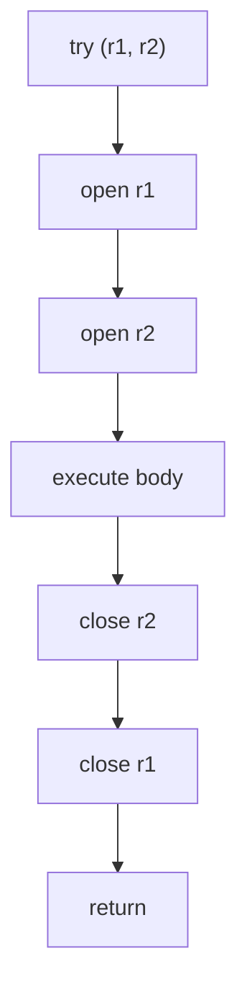

# try-with-resources 原理

面试官问："try-with-resources 是什么？和 try-finally 相比有什么优势？"

候选人小马答："资源会自动关闭，不用手动写 finally。"

面试官追问："如果 try 和 close 都抛异常，返回哪个？"

小马说："close 的异常？"

面试官又问："如果多个资源都抛异常呢？"

小马彻底不知道了。

【面试官心理】
这道题问的是候选人有没有深入理解过 Java 的 suppress 异常机制。这是 JDK 7 引入的重要特性，但 90% 的候选人只知道"会自动关闭"，不知道异常处理的细节。

## 一、基本原理 🔴

### 1.1 AutoCloseable 接口

```java
// AutoCloseable 是 try-with-resources 的基础
public interface AutoCloseable {
    void close() throws Exception;
}

// 所有需要资源管理的类都实现这个接口
// Connection, InputStream, OutputStream, Scanner, BufferedReader 等
```

### 1.2 自动关闭机制

```java
// 编译前
try (BufferedReader br = new BufferedReader(new FileReader("file.txt"))) {
    return br.readLine();
}

// 编译后等价于
BufferedReader br = new BufferedReader(new FileReader("file.txt"));
Throwable primaryException = null;
try {
    return br.readLine();
} catch (Throwable t) {
    primaryException = t;
    throw t;
} finally {
    if (br != null) {
        if (primaryException != null) {
            try {
                br.close();
            } catch (Throwable closeException) {
                primaryException.addSuppressed(closeException);
            }
            throw primaryException;
        } else {
            br.close();
        }
    }
}
```

:::tip 💡
finally 中如果 close 也抛异常，JDK 7+ 会用 `addSuppressed()` 把 close 的异常附加到 primary 异常上，而不是覆盖。
:::

## 二、Suppress 异常链 🔴

### 2.1 单个资源的异常场景

```java
try (Connection conn = getConnection()) {
    conn.execute("UPDATE ..."); // 抛出 SQLException A
}
// conn.close() 也抛出 SQLException B

// JDK 7+: 抛出的是 A，B 被附加为 A 的 suppress 异常
// 获取方式：
try {
    // ...
} catch (SQLException e) {
    System.out.println(e.getMessage()); // primary 异常信息
    for (Throwable t : e.getSuppressed()) {
        System.out.println("Suppressed: " + t.getMessage()); // close 异常
    }
}
```

### 2.2 多个资源都抛异常

```java
try (InputStream in = new FileInputStream("a.txt");
     OutputStream out = new FileOutputStream("b.txt")) {
    // 两个资源都抛异常
}
// 只抛出第一个抛出的异常
// 其他资源的 close 异常作为 suppress 附加
```

顺序：
1. `in.read()` 抛异常 → 记录为 primary
2. `in.close()` 抛异常 → 作为 `suppress` 附加
3. `out.close()` 抛异常 → 作为 `suppress` 附加

:::warning ⚠️
try-with-resources 的异常抑制顺序取决于资源声明的**反向顺序**（先声明的后 close）。这是 JDK 7 就设计好的行为，和 try-finally 中手动 close 的顺序不同，容易搞混。
:::

## 三、多资源声明顺序 🔴

```java
try (Resource1 r1 = new Resource1();
     Resource2 r2 = new Resource2()) {
    // ...
}

// close 顺序：r2 先 close，r1 后 close（反向声明顺序）
// 因为栈的特性：后进先出
```



## 四、隐藏的陷阱 🔴

### 4.1 资源初始化异常

```java
try (Scanner s1 = new Scanner(new File("a.txt"));
     Scanner s2 = new Scanner(new File("NOT_EXIST.txt"))) {
    // s2 构造时抛异常
    // s1 能被正确关闭吗？
}
```

答案：**能**。编译器生成的字节码会确保每个成功初始化的资源都被正确关闭。

```java
// 编译器生成的等价代码
Scanner s1 = null, s2 = null;
try {
    s1 = new Scanner(new File("a.txt"));
    s2 = new Scanner(new File("NOT_EXIST.txt")); // 这里抛异常
} catch (Throwable t) {
    if (s1 != null) {
        try { s1.close(); } catch (Throwable suppress) { t.addSuppressed(suppress); }
    }
    throw t;
}
```

### 4.2 close 方法的性能要求

```java
// ❌ 糟糕的 close 实现
@Override
public void close() throws IOException {
    // 关闭 IO 之前做不必要的校验
    if (!closed) {
        flush(); // 可能又抛异常
        // ...
    }
}

// ✅ 好的 close 实现
@Override
public void close() throws IOException {
    if (closed) return; // 先检查，快速返回
    try {
        flush();
    } finally {
        closed = true;
        // 真正关闭资源
    }
}
```

### 4.3 变量类型必须实现 AutoCloseable

```java
// ❌ 编译错误：FileInputStream 不是 AutoCloseable
// (FileInputStream 实现了 AutoCloseable，所以这条不会错)

// 但如果自己写的类：
class MyResource {
    void close() {} // 注意：这个 close 方法不会自动被调用
}

try (MyResource r = new MyResource()) { // ❌ 编译错误
    // close() 方法签名不匹配
}

// ✅ 正确：必须实现 AutoCloseable
class MyResource implements AutoCloseable {
    @Override
    public void close() {} // 必须 throws Exception
}
```

## 五、自定义资源的最佳实践 🔴

```java
public class DatabaseConnection implements AutoCloseable {
    private Connection conn;
    private boolean closed = false;

    public DatabaseConnection(String url) throws SQLException {
        this.conn = DriverManager.getConnection(url);
    }

    public void execute(String sql) throws SQLException {
        if (closed) throw new IllegalStateException("Connection already closed");
        conn.createStatement().execute(sql);
    }

    @Override
    public void close() {
        if (closed) return; // 幂等：多次 close 不抛异常
        try {
            if (conn != null && !conn.isClosed()) {
                conn.close();
            }
        } catch (SQLException e) {
            // 记录日志，但不要抛异常（close 方法不应抛异常）
            // 或包装为非受检异常
            throw new UncheckedSQLException(e);
        } finally {
            closed = true;
        }
    }
}
```

:::tip 💡
自定义资源的 `close()` 方法建议：
1. **幂等**：多次 close 不抛异常
2. **不抛受检异常**：因为 close 通常在 try-with-resources 末尾调用，抛出的异常可能被 suppress
3. **设置状态标志**：方便后续操作做校验
:::

## 六、追问升级

**面试官**："JDK 9 之后 try-with-resources 有什么改进？"

JDK 9 引入了" Effectively Final"变量的支持：

```java
// JDK 7/8：必须在 try 括号内声明
try (BufferedReader br = new BufferedReader(...)) {
    // ...
}

// JDK 9+：可以使用 effectively final 的外部变量
BufferedReader br = new BufferedReader(...);
try (br) { // ✅ 编译通过
    br.readLine();
}
```

【面试官心理】
能说出 JDK 9 改进的候选人，说明有关注 Java 版本演进的习惯。这种细节是 P6/P7 的加分点。
