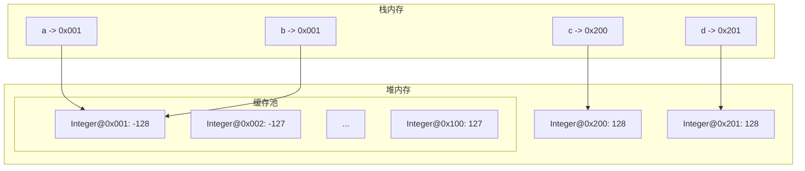

# 包装类与缓存池

> **目标级别**：P5/P6
> **面试频率**：🔴 高频必考（>70%）

## 快速自测

面试官最关心的 3 个问题：

1. Integer 缓存池的范围是多少？
2. 为什么 Integer a = 127 和 Integer b = 127 返回 true？
3. 哪些包装类有缓存池？

如果这三个问题你都能完整回答，可以跳过本文。

---

## 场景切入

面试官问：「`Integer a = 127; Integer b = 127; System.out.println(a == b);` 输出什么？」你说「false」——面试官说「不对，是 true」。你愣住了。

这是一个经典面试题，考察的是 Java 对包装类的缓存优化机制。

## 一、包装类缓存池

### 1.1 缓存范围

```java
// 源码位置：IntegerCache.java
class IntegerCache {
    static final int low = -128;  // [!code highlight] 最小值固定
    static final int high;
    static final Integer[] cache;

    static {
        // high 可通过 -XX:AutoBoxCacheMax=<size> 设置
        int h = 127;
        high = h;
        cache = new Integer[(high - low) + 1];  // 256 个整数
        int j = low;
        for(int k = 0; k < cache.length; k++)
            cache[k] = new Integer(j++);
    }
}
```

### 1.2 缓存池表

| 包装类 | 缓存范围 | 默认最大值 |
|--------|----------|------------|
| Boolean | true, false | 固定 |
| Byte | -128 ~ 127 | 固定 |
| Short | -128 ~ 127 | 固定 |
| Character | 0 ~ 127 | 固定 |
| Integer | -128 ~ 127 | 可配置 |
| Long | -128 ~ 127 | 固定 |
| Float | 无 | - |
| Double | 无 | - |

---

## 二、Integer 缓存示例

### 2.1 基本行为

```java
Integer a = 127;
Integer b = 127;
System.out.println(a == b);  // [!code highlight] true

Integer c = 128;
Integer d = 128;
System.out.println(c == d);  // [!code warning] false
```

### 2.2 源码分析

```java
// Integer.valueOf()
public static Integer valueOf(int i) {
    if (i >= IntegerCache.low && i <= IntegerCache.high)
        return IntegerCache.cache[i + (-IntegerCache.low)];  // [!code highlight] 返回缓存对象
    return new Integer(i);  // [!code highlight] 超出范围则创建新对象
}
```

### 2.3 内存模型图



---

## 三、自动装箱与缓存

### 3.1 自动装箱行为

```java
Integer a = 127;  // 自动装箱，调用 valueOf(127)
Integer b = 127;  // 自动装箱，返回缓存对象
System.out.println(a == b);  // [!code highlight] true

Integer c = new Integer(127);  // 直接创建新对象
System.out.println(a == c);  // [!code warning] false
```

:::warning new 的问题
使用 `new Integer()` 会绕过缓存池，直接创建新对象。**不要使用这种写法**。
:::

### 3.2 算术运算

```java
Integer a = 127;
Integer b = 127;
a++;  // [!code warning] 自动拆箱，执行 ++，再自动装箱

System.out.println(a == b);  // [!code warning] false！
```

:::warning 运算导致拆箱
算术运算（++、+=）会导致自动拆箱，运算后再自动装箱。拆箱后装箱可能创建新对象。
:::

---

## 四、== vs equals

### 4.1 数值比较

```java
Integer a = 127;
Integer b = 127;
System.out.println(a == b);        // true（缓存）
System.out.println(a.equals(b));   // true（值相等）

Integer c = 128;
Integer d = 128;
System.out.println(c == d);        // false（超出缓存）
System.out.println(c.equals(d));   // true（值相等）
```

### 4.2 与基本类型比较

```java
Integer a = 127;
int b = 127;
System.out.println(a == b);  // [!code highlight] true！

// a 自动拆箱为 int，然后比较
```

:::tip 与基本类型比较
包装类与基本类型比较时，包装类会自动拆箱，所以 `==` 比较的是数值。
:::

---

## 五、高频追问链

> **第一层**：Integer 缓存池的范围是多少？在哪里定义的？
>
> **第二层**：为什么 `Integer a = 127; Integer b = 127; a == b` 返回 true？
>
> **第三层**：哪些包装类有缓存池？哪些没有？
>
> **第四层**：如何避免 Integer 缓存带来的问题？

---

## 六、常见错误与陷阱

### ⚠️ 陷阱 1：使用 new Integer()

```java
// [!code warning] 错误：绕过缓存
Integer a = new Integer(127);
Integer b = new Integer(127);
System.out.println(a == b);  // false

// [!code highlight] 正确：使用自动装箱
Integer a = 127;
Integer b = 127;
System.out.println(a == b);  // true
```

### ⚠️ 陷阱 2：运算导致的新对象

```java
Integer a = 100;
a += 10;  // [!code warning] 拆箱 -> 运算 -> 装箱，创建新对象

System.out.println(a == 110);  // [!code warning] false！a 指向新对象
```

### ⚠️ 陷阱 3：Long 缓存问题

```java
Long a = 127L;
Long b = 127L;
System.out.println(a == b);  // [!code highlight] true

Long c = 128L;
Long d = 128L;
System.out.println(c == d);  // [!code warning] false
```

### ⚠️ 陷阱 4：字符串比较

```java
Integer a = 127;
String s = "127";
System.out.println(a.equals(s));  // [!code warning] false！类型不同
```

---

## 七、加分回答

💡 **超出预期的深度**：

### 1. 缓存池的原理

```java
// 为什么使用缓存？
// 1. 避免频繁创建销毁小整数对象
// 2. 提升性能（小整数使用频繁）
// 3. 节省内存

// 缓存范围的选择：
// -128 到 127 是绝大多数场景的常用范围
// Integer 的最大值可配置，适合特定场景
```

### 2. JVM 参数配置

```bash
# 设置 Integer 缓存最大值
java -XX:AutoBoxCacheMax=1000 MyClass

# 这样 0-999 都会被缓存
Integer a = 999;
Integer b = 999;
System.out.println(a == b);  // [!code highlight] true
```

### 3. 其他缓存机制

```java
// String 也有缓存池
String s1 = "hello";  // 常量池
String s2 = "hello";
System.out.println(s1 == s2);  // [!code highlight] true

String s3 = new String("hello");  // 堆内存
System.out.println(s1 == s3);  // [!code warning] false
```

---

## 八、扩展思考

面试结束前的延伸问题：

1. **为什么 Double 和 Float 没有缓存池？** —— 浮点数太多，无法有效缓存
2. **如何选择 Integer 和 int？** —— 基本类型用于局部变量、算术运算；包装类用于泛型、null 表示
3. **缓存池会影响 == 比较吗？** —— 会，需要注意自动装箱的范围
