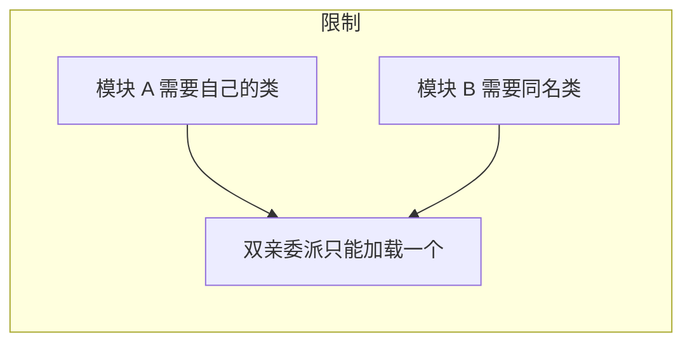
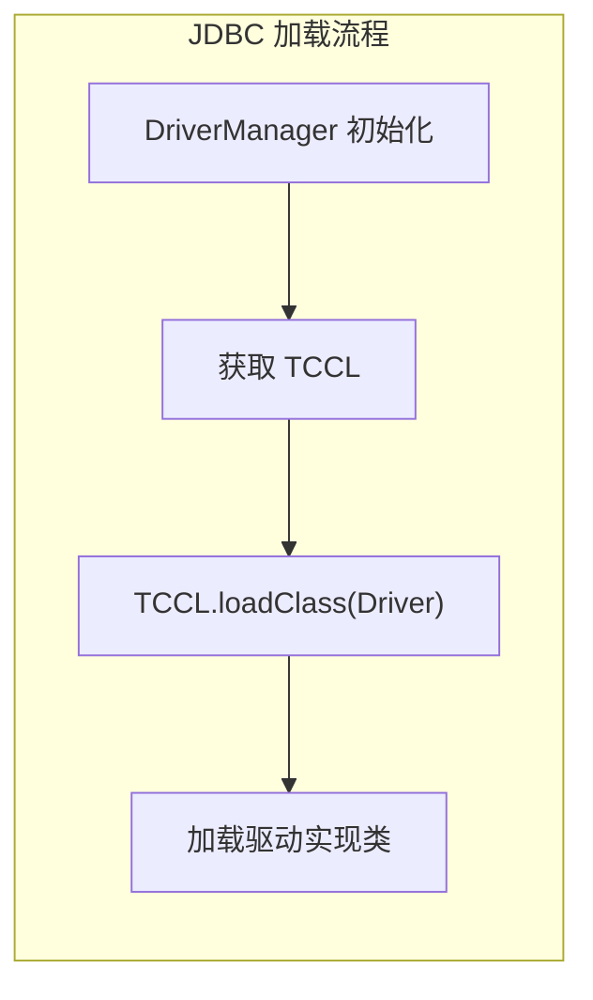
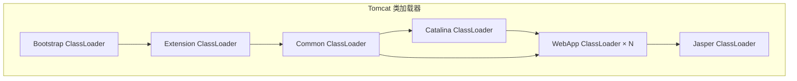
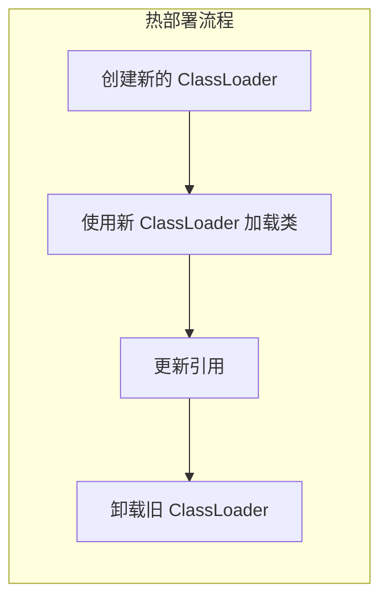

# 打破双亲委派场景

**目标级别**：P6/P7

## 面试官最关心的 3 个问题

1. 什么情况下需要打破双亲委派？
2. JDK 的哪些功能打破了双亲委派？
3. Tomcat 如何实现 Web 应用隔离？

---

## 一、为什么需要打破双亲委派

面试官问：「你见过哪些打破双亲委派的场景？」你说「JDBC」——然后面试官追问「JDBC 为什么要打破双亲委派？它是怎么实现的？」你愣住了。打破双亲委派是高级 Java 开发的必备知识。

### 双亲委派的限制



| 问题 | 说明 |
|------|------|
| **类冲突** | 不同模块需要不同版本的同名类 |
| **热部署** | Web 应用更新后无法重新加载 |
| **SPI 加载** | 需要加载用户实现的接口实现类 |

---

## 二、JDK 中的打破场景

### 1. JDBC 的打破

#### 问题

JDBC 的 `DriverManager` 需要加载用户实现的数据库驱动（如 MySQL、PostgreSQL 驱动）。

#### 解决方案：Thread Context ClassLoader

```java
// DriverManager 源码简化
public class DriverManager {
    static {
        // 使用 Thread Context ClassLoader 加载驱动
        ClassLoader loader = Thread.currentThread().getContextClassLoader();
        if (loader != null) {
            // 使用线程上下文类加载器加载
            loadInitialDrivers();
        }
    }
}
```



#### 为什么需要打破

| 问题 | 原因 |
|------|------|
| Bootstrap 加载 rt.jar | 无法加载用户 jar 包 |
| Extension 加载 ext/*.jar | 无法加载 classpath 中的驱动 |
| Application 加载 classpath | 但需要加载其他 classloader 中的类 |

### 2. JNDI 的打破

JNDI 需要在 Bootstrap ClassLoader 的管理下，访问由 Application ClassLoader 加载的资源。

```java
// JNDI 使用 Thread Context ClassLoader
Context context = new InitialContext();
Object obj = context.lookup("java:comp/env/jdbc/mydb");
```

### 3. XML 解析的打破

JAXP 使用 Thread Context ClassLoader 加载用户配置的 XML 解析器实现。

```java
// XML 解析器加载
ClassLoader loader = Thread.currentThread().getContextClassLoader();
DocumentBuilder builder = factory.newDocumentBuilder();
```

---

## 三、Tomcat 的打破

### Tomcat 类加载器架构



### Tomcat 的打破策略

```java
// WebAppClassLoader 源码简化
public Class<?> loadClass(String name, boolean resolve) {
    // 1. 先检查是否已加载
    Class<?> clazz = findLoadedClass(name);
    
    // 2. 先尝试自己加载（打破双亲委派）
    clazz = findClassInternal(name);
    
    // 3. 委派给父加载器
    if (clazz == null) {
        clazz = super.loadClass(name, resolve);
    }
    
    return clazz;
}
```

### Tomcat 打破的原因

| 场景 | 问题 | 解决方案 |
|------|------|----------|
| **Web 应用隔离** | 不同应用需要同名类 | 各自 WebAppClassLoader |
| **热部署** | 更新应用后类版本变化 | 卸载旧 ClassLoader |
| **第三方库冲突** | 应用自带不同版本库 | 应用优先加载 |

---

## 四、热部署的实现

### 热部署原理



### 实现示例

```java
public class HotDeployDemo {
    private ClassLoader loader;
    
    public void reload() throws Exception {
        // 1. 创建新的 ClassLoader
        URL[] urls = { new URL("file:target/classes/") };
        ClassLoader newLoader = new URLClassLoader(urls, this.getClass().getParent());
        
        // 2. 切换 ClassLoader
        this.loader = newLoader;
        
        // 3. 更新后续加载
        // 注意：已加载的类不受影响
    }
    
    public Object newInstance() throws Exception {
        Class<?> clazz = loader.loadClass("com.example.MyClass");
        return clazz.newInstance();
    }
}
```

---

## 五、高频面试题

### 🔴 第一层：什么情况下需要打破双亲委派

**问题**：什么情况下需要打破双亲委派模型？

**标准答案**：

1. **模块隔离**：不同模块需要加载不同版本的同名类
2. **热部署**：应用更新后需要重新加载类
3. **SPI 加载**：需要加载非核心类加载器路径下的实现类
4. **第三方库冲突**：应用自带与容器不同版本的库

> **第二层追问**：JDBC 为什么要打破双亲委派？
>
> JDBC 使用 SPI 机制，核心 API 由 Bootstrap 加载，但实现类（如 MySQL Driver）由 Application 加载。如果不打破双亲委派，DriverManager 无法找到用户实现的驱动类。

> **第三层追问**：Tomcat 是如何打破的？
>
> Tomcat 的 WebAppClassLoader 先使用自己的 `findClass()` 加载类，找不到再委派给父加载器。这是典型的打破策略。

---

### 🟡 Thread Context ClassLoader

**问题**：什么是 Thread Context ClassLoader？它有什么用？

**标准答案**：

Thread Context ClassLoader（线程上下文类加载器）是每个线程持有的类加载器引用，默认继承父线程的 ClassLoader。

**用途**：

1. **打破双亲委派**：让子加载器能够访问父加载器的类
2. **SPI 加载**：JDBC、JNDI 等使用 TCCL 加载实现类
3. **框架集成**：Spring、Hibernate 等使用 TCCL 加载资源

---

### 🟢 SPI 机制

**问题**：什么是 SPI？它是如何工作的？

**标准答案**：

SPI（Service Provider Interface）是 JDK 提供的插件机制：

1. 在 `META-INF/services/` 目录下配置接口实现类
2. 使用 `ServiceLoader.load(Class)` 加载实现类
3. 通过 Thread Context ClassLoader 动态加载

```java
// SPI 示例
ServiceLoader<Driver> loader = ServiceLoader.load(Driver.class);
for (Driver driver : loader) {
    driver.connect(...);  // 使用用户实现的驱动
}
```

---

## 六、常见错误与陷阱

### ⚠️ 陷阱 1：打破后忘记恢复

自定义 ClassLoader 加载完成后，应该恢复线程的 TCCL：

```java
ClassLoader oldLoader = Thread.currentThread().getContextClassLoader();
try {
    Thread.currentThread().setContextClassLoader(newLoader);
    // 使用新加载器
} finally {
    Thread.currentThread().setContextClassLoader(oldLoader);
}
```

### ⚠️ 陷阱 2：忽略类卸载

打破双亲委派后，需要手动卸载旧 ClassLoader：

```java
// 标记 ClassLoader 可卸载
// 1. 断开所有引用
// 2. 触发 GC
// 3. ���用 ClassLoader.close()（JDK9+）
```

### ⚠️ 陷阱 3：混淆打破和覆盖

打破双亲委派是修改加载逻辑，覆盖 `findClass()` 是补充加载路径。两者有本质区别。

---

## 七、对比总结表

| 打破场景 | 解决方案 | 实现方式 |
|----------|----------|----------|
| **JDBC** | ThreadContextClassLoader | 使用 TCCL 加载驱动 |
| **JNDI** | ThreadContextClassLoader | 使用 TCCL 访问资源 |
| **Tomcat** | 自定义 WebAppClassLoader | 先自己加载，再委派 |
| **OSGi** | 模块化类加载器 | 每个模块独立加载器 |
| **热部署** | 动态 ClassLoader | 替换 ClassLoader |

---

## 八、加分回答

### 💡 Spring 的打破策略

Spring 使用 `ContextClassLoader` 进行类加载：

```java
// Spring 加载资源
public class PathMatchingResourcePatternResolver {
    public Resource[] getResources(String locationPattern) throws IOException {
        ClassLoader cl = this.getClass().getClassLoader();
        if (cl == null) {
            // 使用 TCCL
            cl = Thread.currentThread().getContextClassLoader();
        }
        // 加载资源
    }
}
```

### 💡 阿里面试常问

```java
// 阿里面试题：如何让一个类被多个 ClassLoader 加载？
ClassLoader loader1 = new URLClassLoader(urls);
ClassLoader loader2 = new URLClassLoader(urls);

Class<?> c1 = loader1.loadClass("com.example.User");
Class<?> c2 = loader2.loadClass("com.example.User");

System.out.println(c1 == c2);  // false
// 不同 ClassLoader 加载的类不同
```

---

## 九、扩展思考

OSGi 和 Tomcat 的类加载策略有什么不同？

> **答案**：
>
> | 方面 | Tomcat | OSGi |
> |------|--------|------|
> | **��载策略** | 先子类后父类 | 先父类后子类（可选） |
> | **模块化** | Web 应用级别 | Bundle 级别 |
> | **动态更新** | 卸载 ClassLoader | Bundle 生命周期管理 |
> | **依赖管理** | 简单 | 复杂（Import-Package） |
> | **标准** | 非标准 | OSGi 标准 |
>
> Tomcat 的策略更适合 Web 应用，OSGi 的策略更适合插件化应用。
