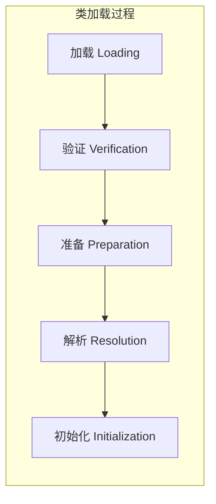
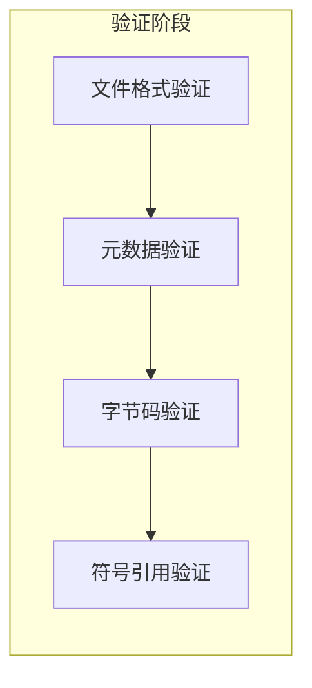
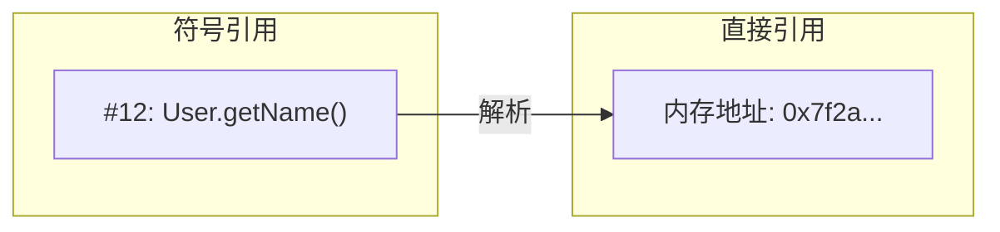
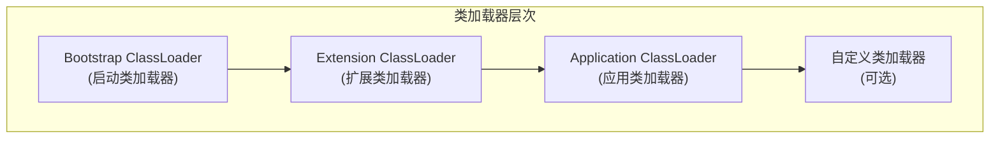
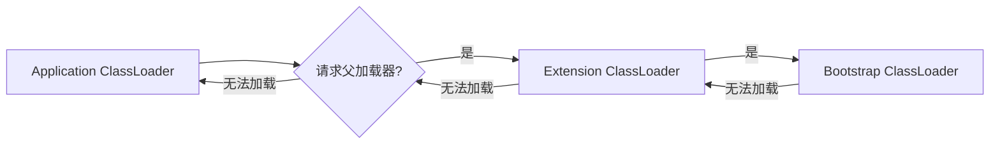

# 类加载机制

**目标级别**：P5/P6

## 面试官最关心的 3 个问题

1. 类加载的过程是什么？
2. 类加载器有哪些？
3. 什么是双亲委派模型？

---

## 一、类加载概述

面试官问：「类加载的过程是什么？」你说「加载、验证、准备」——然后面试官追问「准备阶段做了什么？解析阶段是什么时候进行的？」你愣住了。类加载是 JVM 的核心机制，理解它才能理解 Java 的动态性和安全性。



---

## 二、类加载的五个阶段

### 1. 加载（Loading）

**主要任务**：

1. 通过类的全限定名获取类的二进制字节流
2. 将字节流转换为方法区的运行时数据结构
3. 在堆中生成 `java.lang.Class` 对象

```java
// Class 对象的创建
Class<?> clazz = Class.forName("com.example.User");
Class<?> clazz2 = User.class;
Class<?> clazz3 = classLoader.loadClass("com.example.User");
```

### 2. 验证（Verification）

**主要任务**：确保字节流符合 JVM 规范



| 验证 | 说明 |
|------|------|
| **文件格式验证** | 魔数、版本号、常量池等 |
| **元数据验证** | 继承关系、语法正确性 |
| **字节码验证** | 数据流、控制流分析 |
| **符号引用验证** | 类、方法、字段是否存在 |

### 3. 准备（Preparation）

**主要任务**：为类变量分配内存并设置初始值

```java
public class PrepareDemo {
    // 准备阶段: value = 0 (初始零值)
    // 初始化阶段: value = 10 (赋值)
    public static int value = 10;
    
    // 准备阶段: CONST = "hello" (常量，编译期已知)
    // 准备阶段: CONST = "hello" (直接赋值)
    public static final String CONST = "hello";
    
    // 准备阶段: OBJ = null (初始零值)
    public static Object OBJ = new Object();
}
```

### 4. 解析（Resolution）

**主要任务**：将符号引用替换为直接引用



| 符号引用类型 | 说明 |
|-------------|------|
| **类和接口** | CONSTANT_Class_info |
| **字段** | CONSTANT_Fieldref_info |
| **方法** | CONSTANT_Methodref_info |
| **接口方法** | CONSTANT_InterfaceMethodref_info |

### 5. 初始化（Initialization）

**主要任务**：执行 `<clinit>` 方法初始化类变量

```java
public class InitDemo {
    static {
        value = 20;  // <clinit> 中的代码
    }
    public static int value = 10;
}
```

**`<clinit>` 执行顺序**：


:::warning 初始化时机
类加载不等于初始化。初始化是**惰性的**，只在以下情况触发：
1. `new` 实例化
2. 访问静态字段或方法
3. 反射调用
4. 启动类（main 方法所在类）
5. 子类加载时父类未初始化
:::

---

## 三、类加载器

### 三种默认类加载器



| 类加载器 | 负责加载 | 路径 |
|----------|----------|------|
| **Bootstrap** | Java 核心类 | `$JAVA_HOME/jre/lib/rt.jar` |
| **Extension** | 扩展类 | `$JAVA_HOME/jre/lib/ext/*.jar` |
| **Application** | 应用类 | `classpath` |

### 类加载器代码

```java
public class ClassLoaderDemo {
    public static void main(String[] args) {
        // 获取 ClassLoader
        ClassLoader loader = ClassLoaderDemo.class.getClassLoader();
        
        // 打印加载器链
        while (loader != null) {
            System.out.println(loader);
            loader = loader.getParent();
        }
        // 输出:
        // sun.misc.Launcher$AppClassLoader@123456
        // sun.misc.Launcher$ExtClassLoader@654321
        // null (Bootstrap ClassLoader)
    }
}
```

---

## 四、高频面试题

### 🔴 第一层：类加载过程

**问题**：请描述类加载的完整过程。

**标准答案**：

类加载分为五个阶段：

1. **加载**：通过全限定名获取二进制字节流，在堆中生成 Class 对象
2. **验证**：验证字节流符合 JVM 规范
3. **准备**：为静态变量分配内存并设置初始零值
4. **解析**：将符号引用替换为直接引用
5. **初始化**：执行 `<clinit>` 方法，初始化类变量

> **第二层追问**：准备阶段和初始化阶段的区别是什么？
>
> 准备阶段设置**初始零值**，初始化阶段执行**赋值的代码**。

> **第三层追问**：解析阶段是什么时候进行的？
>
> 解析阶段可以在加载后进行（early resolution），也可以在符号引用被使用时进行（late resolution）。JVM 规范允许灵活实现。

---

### 🟡 类加载器有哪些

**问题**：Java 有哪些类加载器？

**标准答案**：

| 类加载器 | 加载范围 |
|----------|----------|
| **Bootstrap ClassLoader** | Java 核心类（`rt.jar`） |
| **Extension ClassLoader** | 扩展类（`jre/lib/ext`） |
| **Application ClassLoader** | 应用类（`classpath`） |
| **自定义类加载器** | 自定义路径 |

---

### 🟢 类的主动使用 vs 被动使用

**问题**：什么时候会触发类的初始化？

**标准答案**：

**主动使用（会初始化）**：
1. `new` 实例化对象
2. 访问类的静态字段（final 常量除外）
3. 调用类的静态方法
4. 反射调用（`Class.forName()`）
5. 启动类（main 方法所在类）
6. 子类加载时父类未初始化

**被动使用（不初始化）**：
1. 访问子类的静态字段（只初始化父类）
2. 定义数组：`User[] users = new User[10]`
3. 访问 final 常量（在编译期内联）

---

## 五、常见错误与陷阱

### ⚠️ 陷阱 1：混淆加载和初始化

加载只是读取字节流，初始化才执行代码。static 字段的赋值是在初始化阶段进行的。

### ⚠️ 陷阱 2：忘记父类初始化

子类加载时，如果父类未初始化，会先初始化父类。这可能导致意料之外的初始化。

### ⚠️ 陷阱 3：忽略 static final 和 static 的区别

`static final` 常量在编译期已知，可以在准备阶段赋值；`static` 变量需要在初始化阶段赋值。

---

## 六、对比总结表

| 阶段 | 任务 | 是否初始化 | 异常 |
|------|------|-----------|------|
| **加载** | 获取字节流 | ❌ | ClassNotFoundException |
| **验证** | 检查字节流 | ❌ | VerifyError |
| **准备** | 分配内存 | ❌（零值） | - |
| **解析** | 解析引用 | ❌ | IllegalAccessError |
| **初始化** | 执行代码 | ✅ | ExceptionInInitializerError |

---

## 七、加分回答

### 💡 类加载的双亲委派模型

JVM 使用双亲委派模型保证类的安全加载：



**核心原则**：类加载时，先委托父加载器加载，只有父加载器无法加载时，才自己加载。

### 💡 为什么需要双亲委派

1. **安全性**：防止核心类被篡改
2. **避免重复加载**：父加载器加载后子类无需加载
3. **保证类的唯一性**：同一个类不会被多次加载
