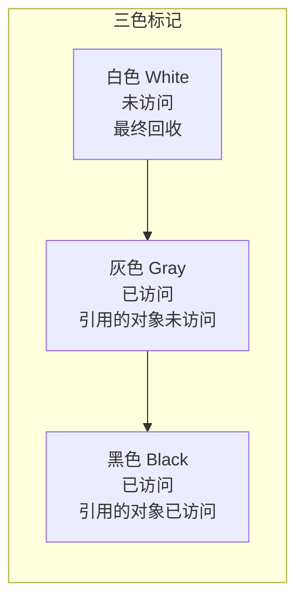
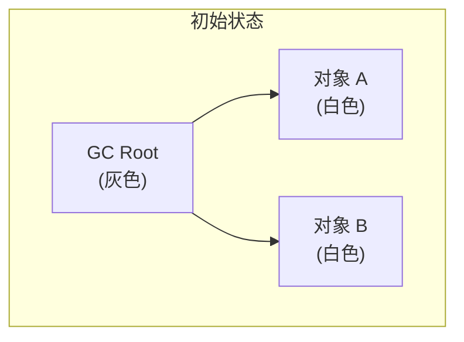
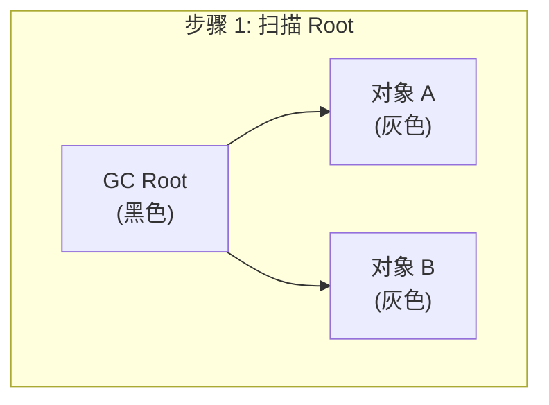
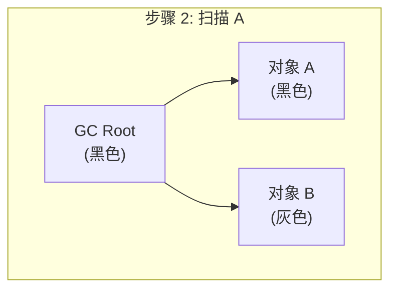
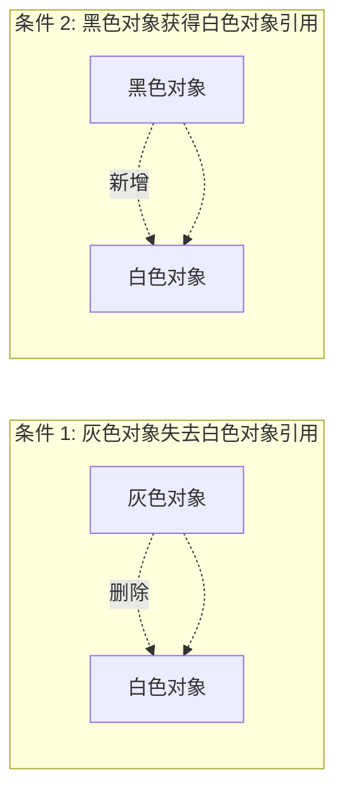
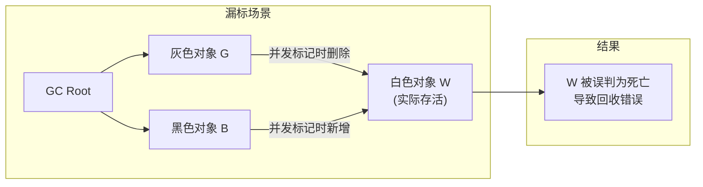
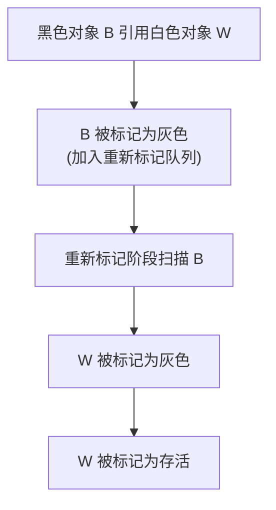

# CMS 并发标记与三色标记

**目标级别**：P6/P7

## 面试官最关心的 3 个问题

1. 什么是三色标记算法？白、灰、黑分别代表什么？
2. 并发标记期间，对象引用变化会产生什么问题？
3. CMS 如何解决并发标记中的漏标问题？

---

## 一、三色标记算法

面试官问：「CMS 的并发标记是怎么实现的？」你说「三色标记」——然后面试官追问「黑色对象可以指向白色对象吗？漏标是怎么产生的？」你愣住了。三色标记是理解并发 GC 的核心算法。

### 三种颜色



| 颜色 | 含义 | 对象状态 |
|------|------|----------|
| **白色** | 未访问 | 可能被回收 |
| **灰色** | 已扫描，引用未处理 | 中间状态 |
| **黑色** | 已扫描，引用已处理 | 不能回收 |

---

## 二、三色标记过程

### 正常标记流程








### 结果

- **黑色对象**：存活，不回收
- **白色对象**：无引用，回收

---

## 三、并发标记的问题：漏标

### 漏标条件

并发标记期间（应用线程和 GC 线程同时运行），发生以下情况会导致漏标：



**漏标 = 灰色对象丢失白色对象引用 + 黑色对象获得白色对象引用**

### 漏标后果



---

## 四、CMS 的解决方案

### 两种解决方案

| 方案 | 原理 | CMS 使用 |
|------|------|----------|
| **增量更新（Incremental Update）** | 黑色对象新增白色引用时，将其标记为灰色 | CMS 重新标记阶段使用 |
| **原始快照（Snapshot At The Beginning, SATB）** | 灰色对象删除白色引用时，记录删除的引用 | G1 使用 |

### CMS：增量更新



**写屏障**：当黑色对象写入白色对象引用时，记录这个变化。

### 增量更新的问题

```java
// 增量更新的问题：可能产生浮动垃圾
class Example {
    Object a = new Object();  // 白色
    Object b = new Object();  // 灰色
    
    void concurrentModify() {
        // 线程 1: GC 标记
        b = null;  // 灰色对象失去白色对象引用
        
        // 线程 2: 应用修改
        a = null;  // 黑色对象失去白色对象引用
        
        // 结果: 白色对象被误标为存活（误报）
        // 这是可接受的（浮动垃圾），但不是漏标
    }
}
```

---

## 五、三色标记与 GC Roots

### GC Roots 初始状态

GC Roots 初始为黑色，表示已处理。

```java
// GC Roots 示例
public void process() {
    Object root = new Object();  // GC Root 引用
    Object a = new Object();     // 通过 GC Root 可达
    
    // ...
}
```

### 黑色对象的约束

**黑色对象不能指向白色对象**（如果有，需要在写屏障中处理）。

```java
// 错误认知：黑色对象的引用一定是正确的
// 正确认知：并发标记期间，黑色对象可能丢失白色对象引用

// 写屏障会捕获这个变化：
void write(Object obj, Field field, Object newValue) {
    // 记录旧值
    oldValue = obj.field;
    
    // 执行写入
    obj.field = newValue;
    
    // 写屏障：如果是黑色对象写入白色引用，记录
    if (isBlack(obj) && isWhite(newValue)) {
        incrementUpdate(obj, newValue);
    }
}
```

---

## 六、高频面试题

### 🔴 第一层：三色标记算法

**问题**：什么是三色标记算法？请描述白色、灰色、黑色的含义。

**标准答案**：

三色标记算法将对象分为三种颜色：

| 颜色 | 含义 | 说明 |
|------|------|------|
| **白色** | 未访问 | 最终可能被回收 |
| **灰色** | 已访问，引用未处理 | 中间状态 |
| **黑色** | 已访问，引用已处理 | 存活对象 |

**标记过程**：

1. 从 GC Roots 出发，所有直接引用对象标记为灰色
2. 从灰色对象出发，将其引用的对象标记为灰色，自身变为黑色
3. 重复步骤 2，直到没有灰色对象
4. 白色对象即为不可达，回收

> **第二层追问**：并发标记时为什么会漏标？
>
> 漏标需要两个条件同时满足：灰色对象删除白色对象引用 + 黑色对象获得白色对象引用。漏标会导致存活对象被回收，是严重错误。

> **第三层追问**：CMS 如何解决漏标问题？
>
> CMS 使用**增量更新**。当黑色对象新增白色对象引用时，通过写屏障记录这个变化，在重新标记阶段将黑色对象标记为灰色，确保白色对象被扫描。

---

### 🟡 增量更新 vs 原始快照

**问题**：CMS 和 G1 分别使用什么方案解决漏标？

**标准答案**：

| 方案 | GC 收集器 | 原理 |
|------|-----------|------|
| **增量更新（Incremental Update）** | CMS | 记录黑色对象新增的白色引用，重新标记时扫描 |
| **原始快照（SATB）** | G1 | 记录灰色对象删除的白色引用，保留删除的引用 |

**两种方案的权衡**：

| 方案 | 浮动垃圾 | 扫描完整性 |
|------|----------|------------|
| 增量更新 | 少 | 完整 |
| 原始快照 | 多 | 完整 |

---

### 🟢 写屏障的作用

**问题**：什么是写屏障？它在 GC 中起什么作用？

**标准答案**：

写屏障是**引用写入时执行的钩子代码**，用于记录 GC 相关信息。

```java
// 写屏障伪代码
void writeBarrier(Object obj, Field field, Object newValue) {
    // 1. 记录变化（用于三色标记）
    if (gc.isConcurrentMarking()) {
        if (isBlack(obj) && isWhite(newValue)) {
            // 增量更新：记录黑色对象的新引用
            incrementUpdateQueue.add(obj);
        }
    }
    
    // 2. 更新 Card Table
    cardTable[cardIndex] = DIRTY;
}
```

---

## 七、常见错误与陷阱

### ⚠️ 陷阱 1：误以为黑色对象一定正确

并发标记期间，黑色对象可能被应用线程修改（新增白色对象引用）。需要通过写屏障捕获这些变化。

### ⚠️ 陷阱 2：混淆漏标和浮动垃圾

- **漏标**：存活对象被误判为死亡（严重错误）
- **浮动垃圾**：死亡对象被误判为存活（可接受）

CMS 的增量更新减少了漏标，但可能增加浮动垃圾。

### ⚠️ 陷阱 3：忽略重新标记阶段的重要性

重新标记阶段是修正并发标记错误的最后机会。如果重新标记不完整，可能导致漏标。

---

## 八、对比总结表

| 问题 | 原因 | 解决方案 | CMS | G1 |
|------|------|----------|-----|-----|
| **漏标** | 并发修改 | 记录变化 | ✅ | ✅ |
| **浮动垃圾** | 并发修改 | 下次 GC 清理 | ✅ | ✅ |
| **黑色新增白** | 引用写入 | 增量更新 | ✅ | |
| **灰色删除白** | 引用删除 | 原始快照 | | ✅ |

---

## 九、加分回答

### 💡 为什么 G1 选择 SATB 而不是增量更新？

1. **SATB 实现更简单**：只需记录删除的引用，无需追踪新增引用
2. **G1 的 Region 结构**：SATB 更适合分区收集器
3. **G1 停顿时间可控**：SATB 的开销更可预测

### 💡 写屏障的性能开销

写屏障在每次引用写入时执行，会带来一定的性能开销：

```bash
# 写屏障类型
-XX:+UseCondCardMark  # 减少不必要的写屏障
```

使用条件写屏障可以减少伪共享问题，提高性能。

---

## 十、扩展思考

如果三色标记算法在单线程下执行，还会漏标吗？

> **答案**：
> 不会。
>
> 漏标的两个条件（灰色删除白色 + 黑色新增白色）只有在并发场景下才可能同时发生。单线程下，标记和修改是串行的，不会有竞态条件。
>
> 这就是为什么三色标记需要和 STW 配合，或者通过写屏障在并发场景下保证正确性。
