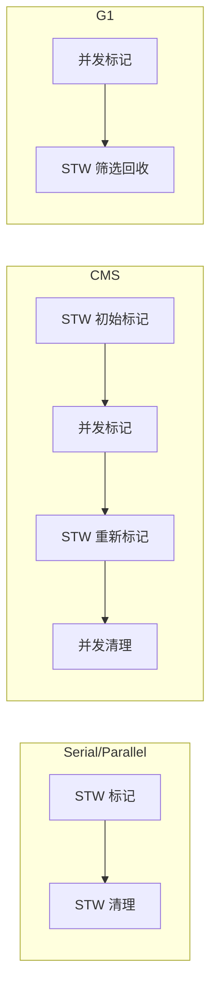
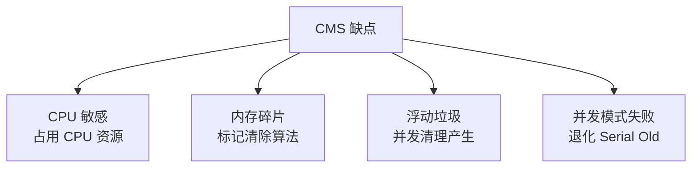
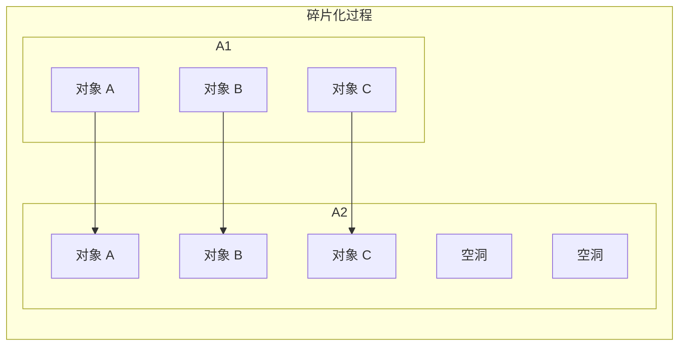
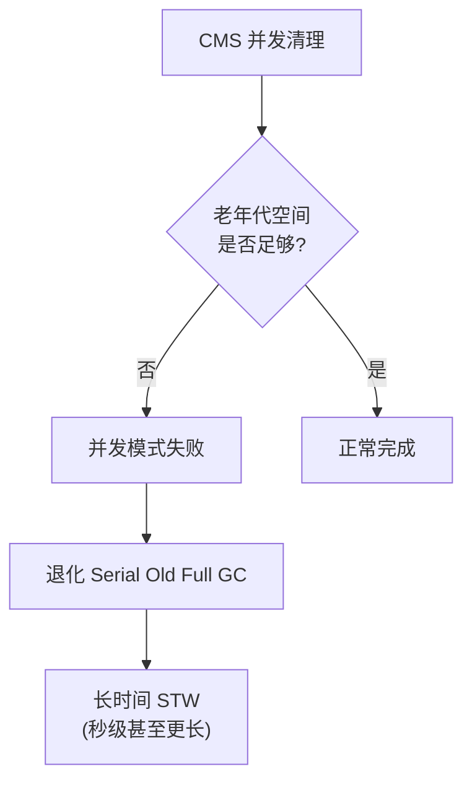
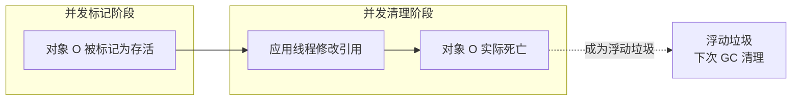

# CMS 优缺点与碎片问题

**目标级别**：P6

## 面试官最关心的 3 个问题

1. CMS 的主要缺点是什么？
2. 为什么 CMS 会产生内存碎片？如何解决？
3. 什么是浮动垃圾？它有什么影响？

---

## 一、CMS 的优势

面试官问：「CMS 有什么优点？」你说「并发回收」——然后面试官追问「具体并发带来了什么好处？为什么它后来被 G1 取代？」你愣住了。理解 CMS 的优缺点，才能理解 GC 演进的动力。

### CMS 的核心优势



| 优势 | 说明 |
|------|------|
| **低停顿时间** | 并发标记、并发清理，用户线程几乎不停顿 |
| **适合响应时间敏感的应用** | Web 服务、RPC 等 |
| **CPU 利用率高** | 多核 CPU 并发回收 |

---

## 二、CMS 的缺点

### 四大缺点



### 1. CPU 敏感

CMS 在并发阶段占用 CPU 资源：

```bash
# CMS 并发线程数计算
ConcGCThreads = (ParallelGCThreads + 2) / 4
# 默认：8 核机器，ConcGCThreads = 2
```

| 应用类型 | CMS 建议 | 说明 |
|----------|----------|------|
| **多核服务器** | CMS 适合 | CPU 资源充足 |
| **单核/双核** | 不建议使用 | CMS 可能拖慢应用 |
| **容器环境** | 谨慎使用 | 需要考虑 CPU 限制 |

### 2. 内存碎片

CMS 使用**标记清除**算法，不移动存活对象：



### 3. 浮动垃圾

并发清理期间产生的垃圾无法清理，只能下次 GC 时处理：

```java
// 浮动垃圾示例
Object obj = findObject(); // 对象被标记为存活

// 并发清理阶段
obj.field = null; // 对象死亡，但已被标记
// obj 成为浮动垃圾，下次 GC 才能清理
```

### 4. 并发模式失败

当老年代空间不足以容纳新晋升的对象时：



---

## 三、内存碎片问题详解

### 碎片的成因

CMS 使用标记清除算法，不移动存活对象：

```java
// 碎片化示例
public class FragmentationDemo {
    public static void main(String[] args) {
        // 创建对象 A、B、C
        Object a = new Object(); // 分配到地址 0x100
        Object b = new Object(); // 分配到地址 0x108
        Object c = new Object(); // 分配到地址 0x110
        
        // 释放 A、C
        a = null;
        c = null;
        
        // 创建大对象 D（需要 16 字节）
        Object d = new Object(); // 可能失败！
    }
}
```

### 碎片的影响

| 影响 | 说明 |
|------|------|
| **分配失败** | 大对象无法分配，触发 Full GC |
| **并发模式失败** | 老年代碎片化严重 |
| **Full GC 频繁** | 需要整理内存 |

### 碎片解决方案

```bash
# 方案1：定期 Full GC 整理
-XX:CMSFullGCsBeforeCompaction=5      # 5 次 Full GC 后整理
-XX:+UseCMSCompactAtFullCollection   # Full GC 时整理

# 方案2：降低触发阈值
-XX:CMSInitiatingOccupancyFraction=70  # 老年代 70% 时触发

# 方案3：迁移到 G1
-XX:+UseG1GC                         # JDK9+ 默认
```

---

## 四、浮动垃圾详解

### 浮动垃圾的产生



### 浮动垃圾的影响

| 影响 | 说明 |
|------|------|
| **内存占用增加** | 浮动垃圾占用空间 |
| **GC 频率可能增加** | 空间不足时触发 GC |
| **分配担保失败风险** | 年轻代对象晋升受阻 |

### 浮动垃圾数量控制

```bash
# 减少浮动垃圾的方法
# 1. 增加老年代容量
-Xmx4g -Xms4g

# 2. 降低触发阈值
-XX:CMSInitiatingOccupancyFraction=70

# 3. 减少并发清理时间
-XX:ConcGCThreads=4
```

---

## 五、高频面试题

### 🔴 第一层：CMS 的缺点

**问题**：CMS 收集器有哪些缺点？

**标准答案**：

1. **CPU 敏感**：并发阶段占用 CPU 资源
2. **内存碎片**：使用标记清除算法，产生内存碎片
3. **浮动垃圾**：并发清理产生的垃圾无法及时回收
4. **并发模式失败**：老年代空间不足时退化为 Serial Old Full GC

> **第二层追问**：为什么 CMS 会产生内存碎片？
>
> CMS 使用标记清除算法，只清理死亡对象，不移动存活对象。随着时间推移，存活对象之间会出现空洞，导致碎片化。

> **第三层追问**：如何解决内存碎片问题？
>
> 1. 设置 `-XX:CMSFullGCsBeforeCompaction=N`，N 次 Full GC 后整理
> 2. 设置 `-XX:+UseCMSCompactAtFullCollection`，Full GC 时整理
> 3. 迁移到 G1 收集器

---

### 🟡 并发模式失败

**问题**：什么是并发模式失败？如何避免？

**标准答案**：

并发模式失败发生在 CMS 老年代空间不足以容纳新晋升的对象时，JVM 会退化使用 **Serial Old** 进行 Full GC。

**避免方法**：

```bash
# 1. 降低触发阈值
-XX:CMSInitiatingOccupancyFraction=70

# 2. 增加老年代容量
-Xmx4g -Xms4g

# 3. 使用 G1 代替 CMS
-XX:+UseG1GC
```

---

### 🟢 CMS vs G1 对比

**问题**：为什么 G1 是 CMS 的替代者？

**标准答案**：

| 维度 | CMS | G1 |
|------|-----|-----|
| **算法** | 标记清除 | 标记整理 |
| **内存结构** | 新生代/老年代 | Region |
| **碎片问题** | 有碎片 | 无碎片 |
| **停顿时间** | 无法精确控制 | 可指定目标 |
| **分区并发** | 整代并发 | Region 并发 |
| **JDK 版本** | JDK5-14（已移除） | JDK9+ 默认 |

---

## 六、常见错误与陷阱

### ⚠️ 陷阱 1：CMS 不需要调优

CMS 看似简单，但如果参数设置不当，可能导致频繁 Full GC 或并发模式失败。

### ⚠️ 陷阱 2：CMS 可以完全并发

CMS 只有并发标记和并发清理是并发的。初始标记和重新标记仍需要 STW。

### ⚠️ 陷阱 3：碎片化不影响性能

碎片化会导致分配失败和 Full GC 频繁，最终影响应用性能。

---

## 七、对比总结表

| 缺点 | 影响 | 解决方案 |
|------|------|----------|
| **CPU 敏感** | 低配置机器性能下降 | 评估 CPU 核心数 |
| **内存碎片** | 分配失败、Full GC | 定期整理 |
| **浮动垃圾** | 内存占用增加 | 增加老年代容量 |
| **并发模式失败** | 长时间 STW | 降低触发阈值 |

---

## 八、加分回答

### 💡 CMS 已被移除

JDK14 正式移除了 CMS 收集器。如果还在使用 JDK8，建议逐步迁移到 G1 或 ZGC。

```bash
# JDK8 检查 CMS 是否启用
java -XX:+PrintFlagsFinal -version | grep CMS

# JDK9+ 迁移建议
-XX:+UseG1GC  # G1 替代 CMS
# 或
-XX:+UseZGC   # ZGC（亚毫秒级停顿）
```

### 💡 JDK8 CMS 最佳配置

```bash
java -Xmx4g -Xms4g \
     -XX:+UseConcMarkSweepGC \
     -XX:CMSInitiatingOccupancyFraction=70 \
     -XX:+UseCMSCompactAtFullCollection \
     -XX:CMSFullGCsBeforeCompaction=5 \
     -XX:+CMSParallelRemarkEnabled \
     -XX:CMSClassUnloadingEnabled \
     -XX:MetaspaceSize=256m \
     Application
```

---

## 九、扩展思考

如果一个应用同时存在高吞吐和低延迟需求，应该选择什么收集器？

> **答案**：
>
> CMS 和 G1 都无法同时满足高吞吐和低延迟：
>
> | 收集器 | 吞吐量 | 延迟 | 适用场景 |
> |--------|--------|------|----------|
> | Parallel | 最高 | 高 | 批处理、离线计算 |
> | CMS | 中等 | 低 | 响应时间敏感 |
> | G1 | 中等 | 可控 | 通用场景 |
> | ZGC | 较高 | 亚毫秒 | 超低延迟 |
>
> 如果确实需要同时满足，建议：
> 1. 使用 ZGC（如果 JDK11+）
> 2. 考虑架构调整（分离高吞吐和低延迟服务）
