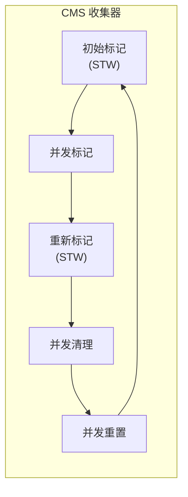
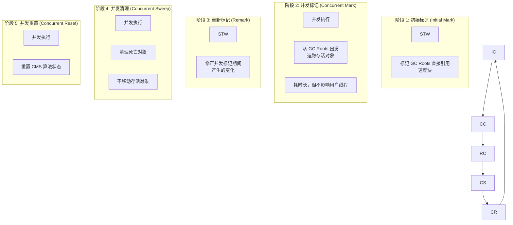
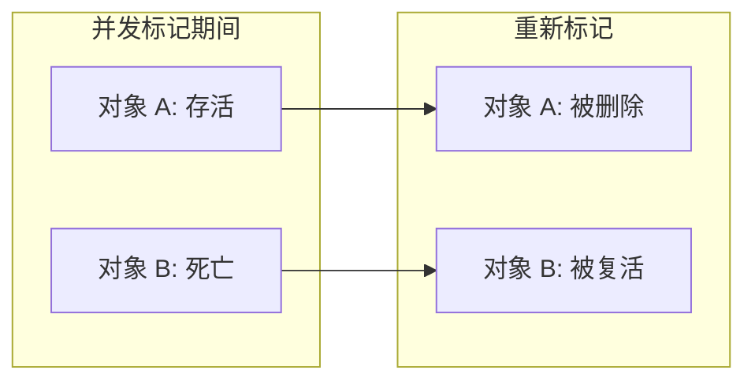
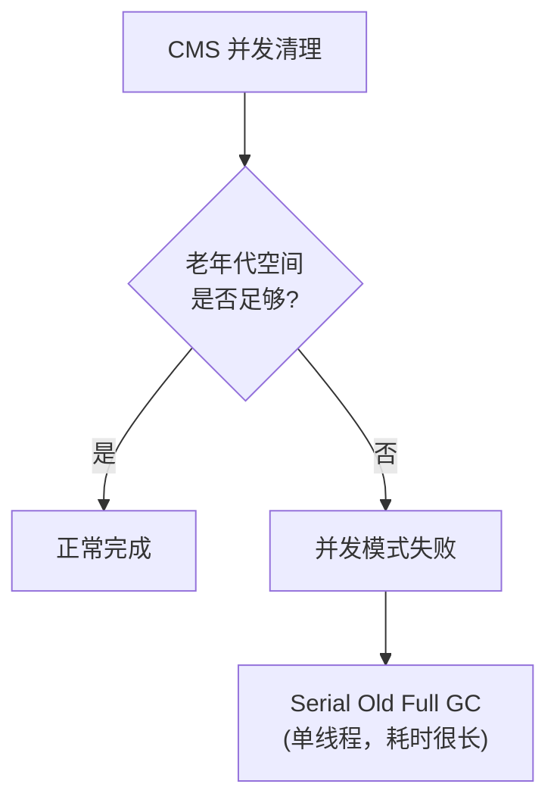

# CMS 收集器原理

**目标级别**：P6/P7

## 面试官最关心的 3 个问题

1. CMS 的工作原理是什么？为什么能降低停顿时间？
2. CMS 有哪几个阶段？哪些阶段需要 STW？
3. CMS 的并发模式失败是什么？

---

## 一、CMS 概述

面试官问：「CMS 收集器是怎么工作的？」你说「并发标记」——然后面试官追问「并发标记和并发清理有什么区别？为什么需要重新标记阶段？」你愣住了。CMS 是第一个实现并发回收老年代的收集器，理解它的原理是理解现代 GC 的基础。



---

## 二、CMS 五个阶段

### 阶段详解



### 各阶段对比

| 阶段 | STW | 耗时 | 说明 |
|------|-----|------|------|
| **初始标记** | ✅ | 短 | 标记 GC Roots 直接引用 |
| **并发标记** | ❌ | 长 | 从 GC Roots 追踪存活对象 |
| **重新标记** | ✅ | 短 | 修正并发标记变化 |
| **并发清理** | ❌ | 长 | 清理死亡对象 |
| **并发重置** | ❌ | 短 | 重置算法状态 |

---

## 三、为什么需要重新标记？

### 并发标记的问题

并发标记期间，应用线程可能：

1. **新建对象**：新对象被遗漏
2. **修改引用**：对象从死亡变存活或反之

```java
// 并发标记期间的修改示例
void process() {
    Object A = new Object();  // 新建对象，可能被遗漏
    
    Object X = obj.field;     // 读取
    obj.field = new Object();  // 修改引用
    // X 可能从存活变为死亡，或反之
}
```

### 重新标记的作用

重新标记（Remark）需要 STW，修正并发标记期间的变化：



---

## 四、并发模式失败（Concurrent Mode Failure）

### 什么是并发模式失败

当 CMS 老年代空间不足以容纳新晋升的对象时，会触发 **Concurrent Mode Failure**，JVM 会退化使用 **Serial Old** 进行 Full GC。



### 触发条件

| 条件 | 说明 |
|------|------|
| 老年代空间不足 | 并发清理期间新对象进入老年代 |
| 浮动垃圾过多 | 并发清理产生的垃圾来不及清理 |
| Promotion Failure | 年轻代对象晋升老年代失败 |

### 预祝参数

```bash
# 触发 Full GC 的阈值（默认 92%）
-XX:CMSInitiatingOccupancyFraction=92

# 启用动态检查
-XX:+UseCMSInitiatingOccupancyOnly

# 预留老年代空间（默认 10%）
-XX:CMSReserveRequestPasses=5
```

:::warning 最佳实践
在 JDK8 中，建议设置 `-XX:CMSInitiatingOccupancyFraction=70` 或更低，避免在老年代接近满时触发并发模式失败。
:::

---

## 五、CMS 参数配置

### 常用参数

```bash
# 启用 CMS
-XX:+UseConcMarkSweepGC

# 年轻代自动使用 ParNew
# 老年代使用 CMS + Serial Old 备用

# 触发 Full GC 的阈值
-XX:CMSInitiatingOccupancyFraction=75

# 使用动态阈值
-XX:+UseCMSInitiatingOccupancyOnly

# 并发线程数
-XX:ConcGCThreads=4

# 启用增量模式（CPU 敏感场景）
-XX:+UseCMSCompactAtFullCollection
-XX:CMSFullGCsBeforeCompaction=5
```

### JDK8 最佳实践

```bash
java -Xmx4g -Xms4g \
     -XX:+UseConcMarkSweepGC \
     -XX:MetaspaceSize=256m \
     -XX:CMSInitiatingOccupancyFraction=70 \
     -XX:+UseCMSCompactAtFullCollection \
     -XX:CMSFullGCsBeforeCompaction=5 \
     -XX:+CMSParallelRemarkEnabled \
     -XX:CMSClassUnloadingEnabled \
     Application
```

---

## 六、高频面试题

### 🔴 第一层：CMS 工作原理

**问题**：请描述 CMS 收集器的工作原理。

**标准答案**：

CMS（Concurrent Mark Sweep）是一种以**获取最短停顿时间**为目标的收集器，分为 5 个阶段：

1. **初始标记**（STW）：标记 GC Roots 直接引用的对象
2. **并发标记**：从 GC Roots 追踪所有存活对象（与应用并发）
3. **重新标记**（STW）：修正并发标记期间的变化
4. **并发清理**：清理死亡对象（与应用并发）
5. **并发重置**：重置算法状态（与应用并发）

> **第二层追问**：CMS 为什么需要重新标记阶段？
>
> 并发标记期间，应用线程可能修改引用（新建对象、修改引用关系）。重新标记阶段需要 STW，确保修正这些变化。

> **第三层追问**：CMS 的缺点是什么？
>
> 1. **CPU 敏感**：占用 CPU 资源进行并发标记
> 2. **内存碎片**：使用标记清除，产生内存碎片
> 3. **并发模式失败**：老年代空间不足时退化为 Serial Old

---

### 🟡 并发模式失败

**问题**：什么是并发模式失败？如何避免？

**标准答案**：

并发模式失败发生在 CMS 老年代空间不足以容纳新晋升的对象时，JVM 会退化使用 **Serial Old** 进行 Full GC。

**避免方法**：

```bash
# 降低触发阈值
-XX:CMSInitiatingOccupancyFraction=70

# 增加老年代容量
-Xmx4g -Xms4g

# 定期 Full GC 整理
-XX:CMSFullGCsBeforeCompaction=5
```

---

### 🟢 CMS 与 G1 的区别

**问题**：CMS 和 G1 收集器有什么区别？

**标准答案**：

| 维度 | CMS | G1 |
|------|-----|-----|
| **算法** | 标记清除 | 标记整理 |
| **内存结构** | 新生代/老年代 | Region |
| **停顿时间** | 无法控制 | 可指定目标 |
| **内存碎片** | 有碎片 | 无碎片 |
| **浮动垃圾** | 多 | 少 |
| **JDK 版本** | JDK5-14 | JDK9+ 默认 |

---

## 七、常见错误与陷阱

### ⚠️ 陷阱 1：CMS 是增量执行的

CMS 曾有增量模式（Incremental Mode），但在 JDK8 中已被标记为废弃。JDK9 完全移除了增量模式。

### ⚠️ 陷阱 2：CMS 不需要 Serial Old

CMS 并不是完全并发的。当并发模式失败或年老代碎片化严重时，CMS 会退化使用 Serial Old 进行 Full GC。

### ⚠️ 陷阱 3：CMS 可以和老年代并发

CMS 只负责老年代的**并发清理**，初始标记和重新标记仍需要 STW。真正的并发只发生在标记和清理阶段。

---

## 八、对比总结表

| 阶段 | STW | 并发 | 耗时 | 说明 |
|------|-----|------|------|------|
| **初始标记** | ✅ | | 短 | 标记 GC Roots 直接引用 |
| **并发标记** | ❌ | ✅ | 长 | 追踪存活对象 |
| **重新标记** | ✅ | | 短 | 修正变化 |
| **并发清理** | ❌ | ✅ | 长 | 清理死亡对象 |
| **并发重置** | ❌ | ✅ | 短 | 重置状态 |

---

## 九、加分回答

### 💡 CMS 的浮动垃圾

并发清理阶段产生的垃圾称为**浮动垃圾**（Floating Garbage），只能在下次 GC 时清理。

```java
// 浮动垃圾示例
void process() {
    Object obj = getObject(); // 对象存活，被标记
    
    // 并发清理阶段
    obj.field = null; // obj 死亡，但已被标记
    // obj 成为浮动垃圾，下次 GC 才能清理
}
```

### 💡 CMS 的碎片化问题

CMS 使用标记清除，不移动存活对象。随着时间推移，会产生大量内存碎片。

```bash
# 碎片化解决方案
-XX:CMSFullGCsBeforeCompaction=5   # 5 次 Full GC 后整理
-XX:+UseCMSCompactAtFullCollection  # Full GC 时整理
```

---

## 十、扩展思考

CMS 收集器的并发标记使用了什么算法？

> **答案**：
> CMS 使用**三色标记算法**（Tri-color Marking）：
> - **白色**：未扫描的对象
> - **灰色**：已扫描但引用的对象未扫描
> - **黑色**：已扫描且所有引用已处理的对象
>
> 三色标记是理解 CMS 和 G1 并发标记的基础。
