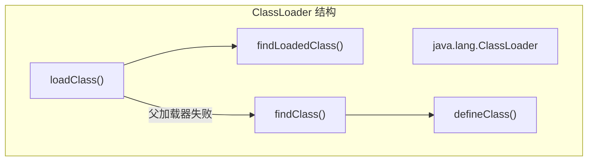

# 自定义类加载器

**目标级别**：P6/P7

## 面试官最关心的 3 个问题

1. 如何自定义一个类加载器？
2. 自定义类加载器有哪些应用场景？
3. 自定义类加载器需要注意什么？

---

## 一、自定义类加载器概述

面试官问：「你用过自定义类加载器吗？」你说「用过」——然后面试官追问「自定义类加载器怎么实现？findLoadedClass 为什么要先检查？」你愣住了。自定义类加载器是 Java 进阶知识，理解它才能理解类的动态加载机制。

### 类加载器结构



---

## 二、自定义类加载器的实现

### 最小实现

```java
public class CustomClassLoader extends ClassLoader {
    
    @Override
    protected Class<?> findClass(String name) throws ClassNotFoundException {
        // 1. 获取类的字节数组
        byte[] bytes = loadClassData(name);
        
        // 2. 调用 defineClass 定义类
        return defineClass(name, bytes, 0, bytes.length);
    }
    
    private byte[] loadClassData(String name) {
        // 从自定义路径加载字节码
        String fileName = name.replace('.', '/') + ".class";
        InputStream is = getClass().getResourceAsStream(fileName);
        // ... 读取字节码
    }
}
```

### 完整实现

```java
public class FileClassLoader extends ClassLoader {
    
    private String classPath;
    
    public FileClassLoader(String classPath) {
        this.classPath = classPath;
    }
    
    @Override
    protected Class<?> findClass(String name) throws ClassNotFoundException {
        // 1. 检查是否已加载
        Class<?> clazz = findLoadedClass(name);
        if (clazz != null) {
            return clazz;
        }
        
        // 2. 加载字节码
        byte[] classData = loadClassData(name);
        if (classData == null) {
            throw new ClassNotFoundException(name);
        }
        
        // 3. 定义类
        return defineClass(name, classData, 0, classData.length);
    }
    
    private byte[] loadClassData(String name) {
        String fileName = classPath + File.separator + 
            name.replace('.', File.separatorChar) + ".class";
        try {
            FileInputStream fis = new FileInputStream(fileName);
            ByteArrayOutputStream bos = new ByteArrayOutputStream();
            byte[] buffer = new byte[1024];
            int len;
            while ((len = fis.read(buffer)) != -1) {
                bos.write(buffer, 0, len);
            }
            fis.close();
            return bos.toByteArray();
        } catch (IOException e) {
            return null;
        }
    }
}
```

---

## 三、使用自定义类加载器

### 加载类

```java
public class ClassLoaderTest {
    public static void main(String[] args) throws Exception {
        // 1. 创建类加载器
        CustomClassLoader loader = new CustomClassLoader("/path/to/classes");
        
        // 2. 加载类
        Class<?> clazz = loader.loadClass("com.example.MyClass");
        
        // 3. 创建实例
        Object obj = clazz.newInstance();
        System.out.println(obj.getClass().getName());
        
        // 4. 获取类加载器信息
        System.out.println(clazz.getClassLoader());
    }
}
```

### 多个 ClassLoader 实例

```java
public class MultiClassLoaderTest {
    public static void main(String[] args) throws Exception {
        // 两个不同的 ClassLoader 实例
        ClassLoader loader1 = new FileClassLoader("/path1");
        ClassLoader loader2 = new FileClassLoader("/path2");
        
        // 加载同一个类
        Class<?> c1 = loader1.loadClass("com.example.MyClass");
        Class<?> c2 = loader2.loadClass("com.example.MyClass");
        
        // 不同 ClassLoader 加载的类是不同的
        System.out.println(c1 == c2);  // false
        System.out.println(c1.getClassLoader() == c2.getClassLoader());  // false
    }
}
```

---

## 四、应用场景

### 1. 热部署

```java
public class HotDeployClassLoader extends ClassLoader {
    
    public Class<?> reloadClass(String name, byte[] bytes) throws Exception {
        // 创建新的 ClassLoader
        HotDeployClassLoader newLoader = new HotDeployClassLoader();
        return newLoader.defineClass(name, bytes, 0, bytes.length);
    }
}
```

### 2. 加密解密

```java
public class DecryptClassLoader extends ClassLoader {
    
    @Override
    protected Class<?> findClass(String name) throws ClassNotFoundException {
        byte[] encrypted = loadEncryptedData(name);
        if (encrypted == null) {
            throw new ClassNotFoundException(name);
        }
        
        // 解密
        byte[] decrypted = decrypt(encrypted);
        return defineClass(name, decrypted, 0, decrypted.length);
    }
    
    private byte[] decrypt(byte[] data) {
        // 解密算法
        // ...
    }
}
```

### 3. 模块隔离

```java
public class ModuleClassLoader extends ClassLoader {
    
    private String moduleId;
    
    @Override
    protected Class<?> findClass(String name) {
        // 只加载本模块的类
        if (!name.startsWith("com.module." + moduleId)) {
            return null;
        }
        // 加载本模块类
        // ...
    }
}
```

### 4. 类版本隔离

```java
public class VersionClassLoader extends ClassLoader {
    
    private Map<String, byte[]> versionedClasses = new HashMap<>();
    
    @Override
    protected Class<?> findClass(String name) {
        // 检查特定版本
        String versionedName = getVersionedName(name);
        if (versionedClasses.containsKey(versionedName)) {
            return defineClass(name, versionedClasses.get(versionedName), 0, 
                versionedClasses.get(versionedName).length);
        }
        // 委派给父加载器
        return super.findClass(name);
    }
}
```

---

## 五、高频面试题

### 🔴 第一层：如何自定义类加载器

**问题**：如何自定义一个类加载器？

**标准答案**：

1. 继承 `ClassLoader` 类
2. 重写 `findClass()` 方法
3. 在 `findClass()` 中读取字节码
4. 调用 `defineClass()` 定义类

```java
public class MyClassLoader extends ClassLoader {
    @Override
    protected Class<?> findClass(String name) throws ClassNotFoundException {
        byte[] bytes = loadClassData(name);
        return defineClass(name, bytes, 0, bytes.length);
    }
}
```

> **第二层追问**：为什么要先检查 findLoadedClass？
>
> `findLoadedClass()` 检查类是否已被当前 ClassLoader 加载过。如果不检查，同一个 ClassLoader 可能重复加载同一个类，导致类不一致。

> **第三层追问**：loadClass 和 findClass 的区别？
>
> `loadClass()` 是完整的类加载流程：先检查已加载 → 委派父加载器 → 调用 findClass 加载。自定义 ClassLoader 通常只重写 `findClass()`，而不重写 `loadClass()`。

---

### 🟡 自定义类加载器的常见问题

**问题**：自定义类加载器有哪些常见问题？

**标准答案**：

| ��题 | 原因 | 解决方案 |
|------|------|----------|
| **类找不到** | 路径错误或字节码损坏 | 检查路径和字节码 |
| **重复加载** | 未检查已加载类 | 先调用 findLoadedClass |
| **父加载器问题** | 默认使用父加载器加载 | 设置父加载器或覆盖 loadClass |
| **类卸载问题** | ClassLoader 引用未断开 | 清除引用触发 GC |

---

### 🟢 类加载器的命名空间

**问题**：什么是类加载器的命名空间？

**标准答案**：

每个 ClassLoader 实例有自己的命名空间，不同命名空间中的类是不同的：

```java
ClassLoader loader1 = new CustomClassLoader();
ClassLoader loader2 = new CustomClassLoader();

Class<?> c1 = loader1.loadClass("com.example.User");
Class<?> c2 = loader2.loadClass("com.example.User");

System.out.println(c1 == c2);  // false
System.out.println(c1.getClassLoader() == c2.getClassLoader());  // false
```

---

## 六、常见错误与陷阱

### ⚠️ 陷阱 1：忘记设置父加载器

```java
// 错误：没有设置父加载器
public CustomClassLoader(String classPath) {
    this.classPath = classPath;
    // 没有调用 super(parent)
}

// 正确：设置父加载器
public CustomClassLoader(String classPath, ClassLoader parent) {
    super(parent);
    this.classPath = classPath;
}
```

### ⚠️ 陷阱 2：字节码验证失败

自定义类加载器加载的字节码需要通过验证：

```java
// 解决方案：使用不验证的方式定义类
protected final Class<?> defineClass(String name, byte[] b, int off, int len, ProtectionDomain protectionDomain, boolean verify) {
    // 可以通过设置保护域来控制验证
}
```

### ⚠️ 陷阱 3：内存泄漏

ClassLoader 持有类的引用，导致类无法卸载：

```java
// 解决方案
// 1. 不要持有 ClassLoader 的引用
// 2. 使用弱引用
// 3. 主动置空引用
```

---

## 七、对比总结表

| 方面 | JDK8 | JDK9+ |
|------|------|-------|
| **ClassLoader** | `java.lang.ClassLoader` | `java.lang.ClassLoader` |
| **findClass** | 重写此方法 | 重写此方法 |
| **模块化** | 无 | Java Module System |
| **强封装** | 较弱 | 强化（exports vs opens） |

---

## 八、加分回答

### 💡 阿里面试常问：热部署实现

```java
public class HotDeployManager {
    private final Map<String, ClassLoader> classLoaders = new ConcurrentHashMap<>();
    
    public void deploy(String moduleId, String path) throws Exception {
        // 1. 卸载旧 ClassLoader
        ClassLoader oldLoader = classLoaders.get(moduleId);
        if (oldLoader != null) {
            // 清除引用，等待 GC
        }
        
        // 2. 创建新的 ClassLoader
        ClassLoader newLoader = new URLClassLoader(
            new URL[] { new URL(path) }, 
            getClass().getClassLoader()
        );
        classLoaders.put(moduleId, newLoader);
    }
    
    public Class<?> loadClass(String moduleId, String className) throws Exception {
        ClassLoader loader = classLoaders.get(moduleId);
        if (loader == null) {
            throw new IllegalStateException("Module not deployed: " + moduleId);
        }
        return loader.loadClass(className);
    }
}
```

### 💡 加密类加载器示例

```java
public class SecureClassLoader extends ClassLoader {
    
    private static final String KEY = "secret_key";
    
    @Override
    protected Class<?> findClass(String name) throws ClassNotFoundException {
        // 1. 加载加密字节码
        byte[] encrypted = getEncryptedClass(name);
        if (encrypted == null) {
            throw new ClassNotFoundException(name);
        }
        
        // 2. 解密
        byte[] decrypted = decrypt(encrypted, KEY);
        
        // 3. 定义类
        return defineClass(name, decrypted, 0, decrypted.length);
    }
    
    private byte[] decrypt(byte[] data, String key) {
        // 使用 AES 解密
        // ...
    }
}
```

---

## 九、扩展思考

自定义类加载器和 OSGi 模块化有什么区别？

> **答案**：
>
> | 方面 | 自定义类加载器 | OSGi |
> |------|---------------|------|
> | **实现复杂度** | 简单 | 复杂 |
> | **标准化** | 无 | OSGi 标准 |
> | **动态更新** | 手动实现 | 内置支持 |
> | **依赖管理** | 无 | 有 |
> | **作用域控制** | 粗粒度 | 细粒度 |
> | **适用场景** | 简单场景 | 企业级插件系统 |
>
> 如果只是简单的类隔离，自定义 ClassLoader 足够；如果需要完整的模块化系统，考虑 OSGi 或 Java Module System。
