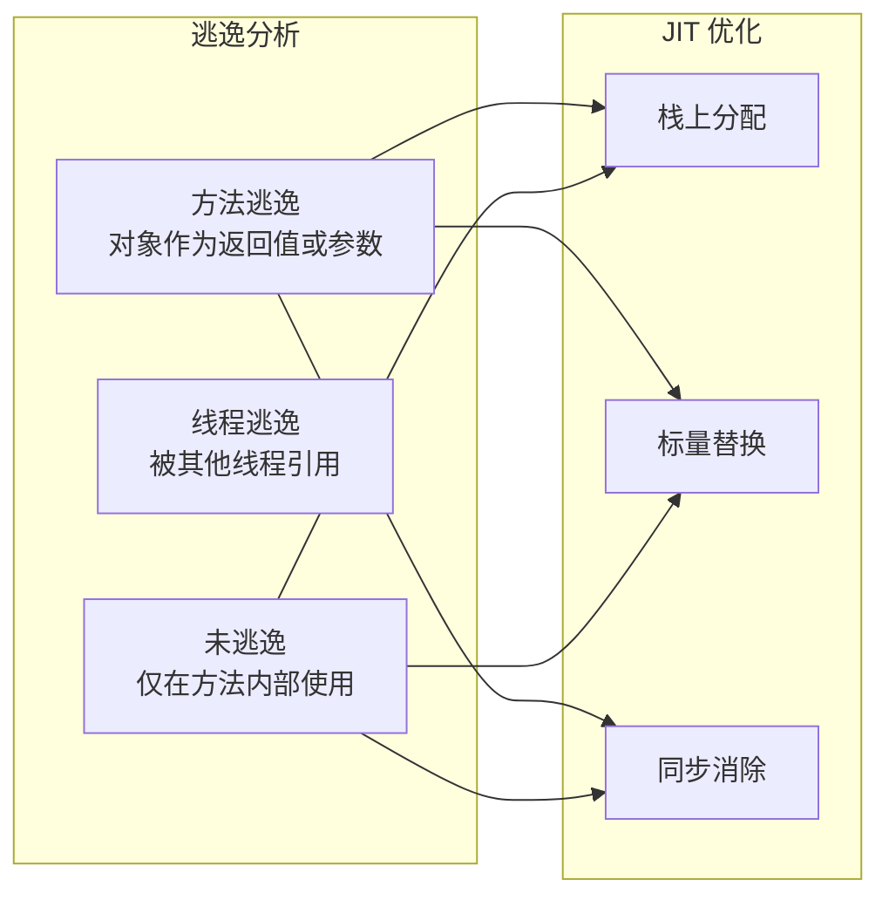
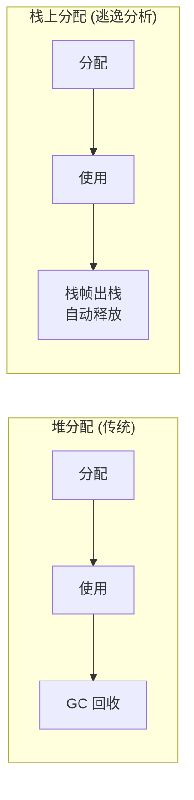
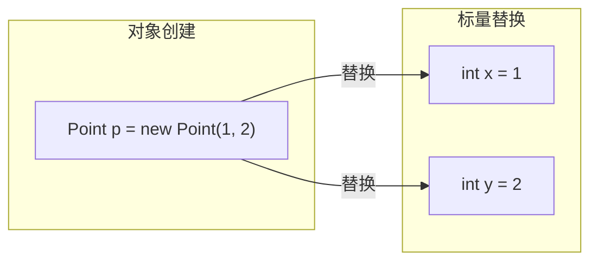
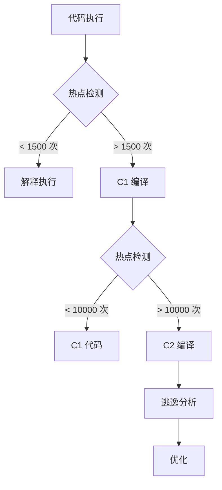

# 逃逸分析与栈上分配

**目标级别**：P6/P7

## 面试官最关心的 3 个问题

1. 什么是逃逸分析？它分析什么？
2. 逃逸分析有哪些优化手段？
3. 为什么栈上分配能提升性能？

---

## 一、逃逸分析概述

面试官问：「对象一定在堆上分配吗？」你说「不是」——然后面试官追问「逃逸分析是如何工作的？它能完全消除堆分配吗？」你愣住了。逃逸分析是 JVM 的高级优化技术，很多人只知其名，不知其原理。

逃逸分析（Escape Analysis）是 JIT 编译器在**编译期**分析对象的**作用域**，判断对象是否「逃逸」出方法或线程。



---

## 二、逃逸的判断标准

### 三种逃逸状态

```java
public class EscapeAnalysis {
    
    // 未逃逸：仅在方法内使用
    public void notEscape() {
        User user = new User();
        user.setName("test");
        user.process();
    }
    
    // 方法逃逸：作为返回值
    public User methodEscape() {
        User user = new User();
        return user;  // 逃逸到方法外部
    }
    
    // 方法逃逸：作为参数
    public void methodEscape(User user) {
        user.setName("test");  // 逃逸
    }
    
    // 线程逃逸：被类变量引用
    private User globalRef;  // 线程逃逸
    
    public void threadEscape() {
        User user = new User();
        globalRef = user;  // 逃逸到其他线程
    }
}
```

### 逃逸状态对照表

| 逃逸状态 | 触发条件 | 影响 |
|----------|----------|------|
| **未逃逸** | 仅在方法内使用 | 可栈上分配、标量替换、同步消除 |
| **方法逃逸** | 作为返回值或参数 | 不能栈上分配 |
| **线程逃逸** | 被类变量或线程共享 | 不能栈上分配 |

---

## 三、逃逸分析优化

### 1. 栈上分配（Stack Allocation）

未逃逸的对象可以直接在**栈**上分配，随栈帧出栈自动销毁，无需 GC。



| 维度 | 堆分配 | 栈上分配 |
|------|--------|----------|
| **分配位置** | 堆内存 | 虚拟机栈 |
| **回收方式** | GC 回收 | 栈帧出栈自动释放 |
| **回收时机** | 不确定（GC 时机） | 确定（方法返回时） |
| **内存开销** | 需要额外的 GC 标记 | 无额外开销 |
| **适用场景** | 所有对象 | 未逃逸对象 |

### 2. 标量替换（Scalar Replacement）

如果一个对象未逃逸，JIT 可以将其拆解为分散的**基本类型变量**，直接在寄存器或栈上存储。

```java
// 原始代码
public void scalarReplacement() {
    Point p = new Point(1, 2);  // 创建对象
    int sum = p.x + p.y;
    System.out.println(sum);
}

// JIT 优化后（概念等价）
public void scalarReplacement() {
    // 替换为标量（原始类型）
    int x = 1;
    int y = 2;
    int sum = x + y;
    System.out.println(sum);
}
```



### 3. 同步消除（Lock Elision）

如果一个对象只在同一线程内使用（未逃逸），synchronized 锁是无意义的，可以消除。

```java
public void lockElision() {
    Object lock = new Object();  // 锁对象未逃逸
    
    synchronized (lock) {
        // 同步代码
        process();
    }
    
    // JIT 可能优化为：
    // process();  // 锁被消除
}
```

---

## 四、逃逸分析的实现

### 分析时机

逃逸分析在 JIT 编译时进行，需要**热点代码**才会触发 JIT 编译。



| 阈值 | 说明 |
|------|------|
| 1500 | 方法进入 C1 编译的热点阈值 |
| 10000 | 方法进入 C2 编译的热点阈值 |

### 分析算法

逃逸分析基于**数据流分析**，跟踪对象的引用关系：

```java
public void escapeAnalysis() {
    // 节点 1: 创建对象
    User user = new User();  // user 未逃逸
    
    // 节点 2: 仅方法内调用
    user.setName("test");    // user 未逃逸
    
    // 节点 3: 作为返回值
    return user;             // user 逃逸
}
```

JVM 通过**静态单赋值（SSA）**形式和**数据流方程**迭代计算每个变量的逃逸状态，直到收敛。

---

## 五、高频面试题

### 🔴 第一层：什么是逃逸分析

**问题**：什么是逃逸分析？它解决了什么问题？

**标准答案**：

逃逸分析是 JIT 编译器在编译期分析对象的作用域，判断对象是否会逃逸出方法或线程。

解决的问题：
1. **减少 GC 压力**：未逃逸对象可在栈上分配，方法返回时自动释放
2. **提升内存访问效率**：标量替换减少对象创建
3. **减少同步开销**：未逃逸对象的同步锁可以消除

> **第二层追问**：逃逸分析在什么时候进行？
>
> 在 JIT 编译时进行。只有热点代码（执行次数超过阈值）才会触发 JIT 编译，逃逸分析是 JIT 编译的一部分。

> **第三层追问**：为什么逃逸分析能优化同步？
>
> 如果对象只在同一线程内使用，其他线程不可能访问它，synchronized 锁是多余的。JIT 可以安全消除这个锁。

---

### 🟡 栈上分配 vs 堆分配

**问题**：栈上分配和堆分配有什么区别？

**标准答案**：

| 维度 | 栈上分配 | 堆分配 |
|------|----------|--------|
| **内存来源** | 虚拟机栈 | 堆内存 |
| **生命周期** | 方法结束即释放 | GC 决定 |
| **分配速度** | 极快（指针移动） | 较慢（需要同步） |
| **回收方式** | 无需回收 | GC 回收 |
| **对象大小** | 受栈大小限制 | 受堆大小限制 |

---

### 🟢 为什么栈上分配能提升性能？

**问题**：为什么栈上分配比堆分配更快？

**标准答案**：

1. **分配速度**：栈上分配只需要移动栈指针（类似 push），堆分配需要从空闲列表分配
2. **无 GC 开销**：栈上对象随栈帧出栈自动销毁，不触发 GC
3. **缓存友好**：栈是连续的内存空间，访问模式更利于 CPU 缓存预取

---

## 六、常见错误与陷阱

### ⚠️ 陷阱 1：认为栈上分配是默认行为

栈上分配依赖逃逸分析的结果。如果对象逃逸，JVM 不会栈上分配。而且 HotSpot 默认未开启完整的栈上分配（开启需 `-XX:+DoEscapeAnalysis`）。

### ⚠️ 陷阱 2：忽略逃逸分析的局限性

逃逸分析的计算成本很高，JVM 不会对所有代码都进行完整的逃逸分析。对于短命对象，分析成本可能超过优化收益。

### ⚠️ 陷阱 3：混淆标量替换和内联

标量替换是对象被拆解为基本类型，内联是将方法调用展开。两者是独立的优化手段。

---

## 七、对比总结表

| 优化手段 | 条件 | 效果 |
|----------|------|------|
| **栈上分配** | 对象未逃逸 | 减少堆分配，无需 GC |
| **标量替换** | 对象未逃逸 | 减少对象创建，寄存器存储 |
| **同步消除** | 对象未逃逸或仅单线程访问 | 减少锁开销 |

---

## 八、加分回答

### 💡 逃逸分析的权衡

逃逸分析不是免费的午餐：

1. **分析成本**：逃逸分析需要额外编译时间
2. **预测准确性**：编译期的逃逸状态可能不准确（如反射调用）
3. **优化保守性**：JVM 对逃逸分析采用保守策略，宁可不优化也不出错

### 💡 G1 的逃逸分析支持

G1 在 JDK9+ 增强了逃逸分析支持，可以与 G1 的 Region 分配机制配合，进一步减少内存碎片。

---

## 九、扩展思考

逃逸分析是 JIT 优化，AOT 编译（如 GraalVM）是否也有逃逸分析？

> **答案**：
> 是的。逃逸分析是编译优化技术，不仅限于 JIT。GraalVM Native Image 在编译期进行**全局逃逸分析**，可以更激进地优化。但由于编译期可见性更强，分析可以更准确，优化空间更大。
