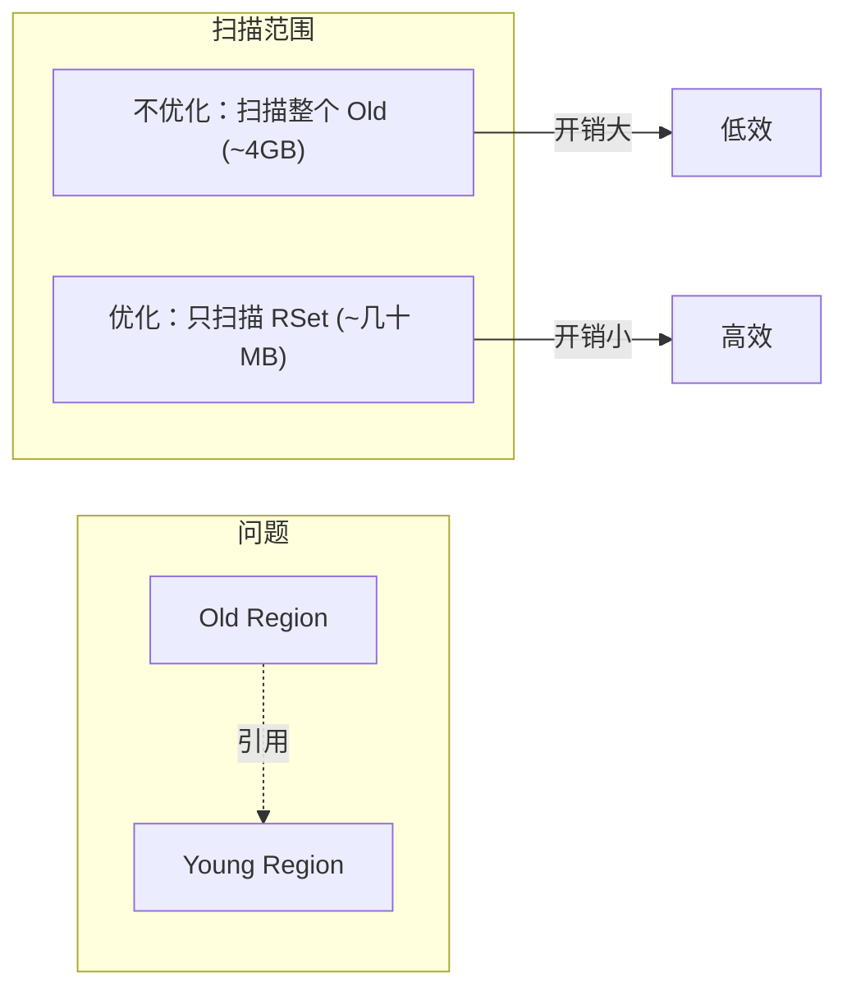
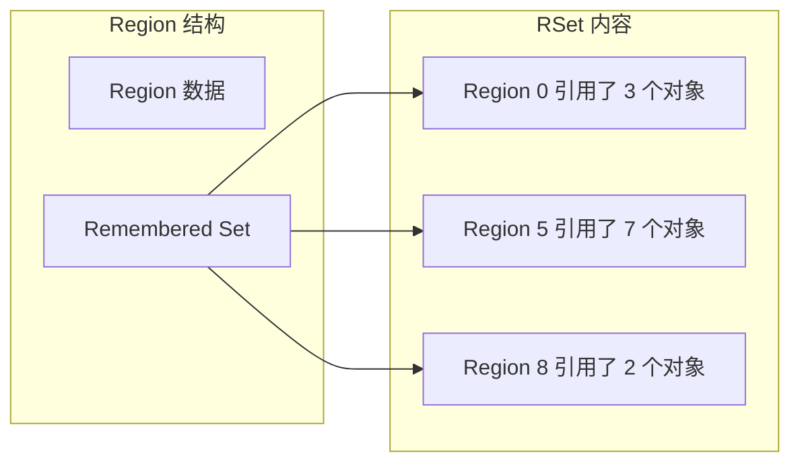
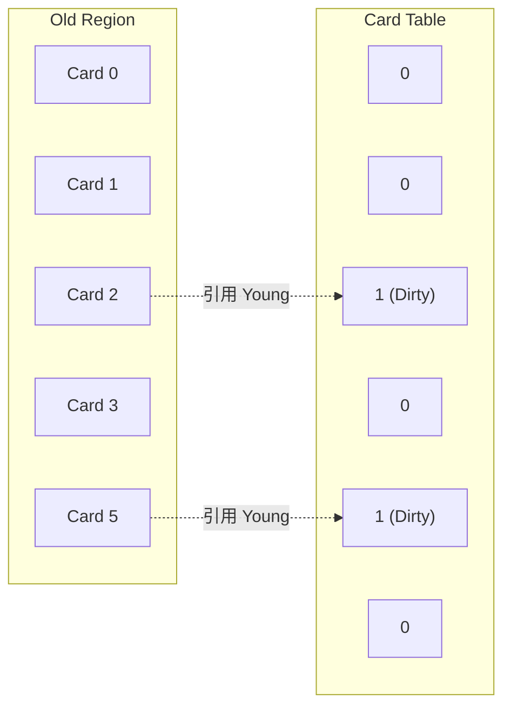
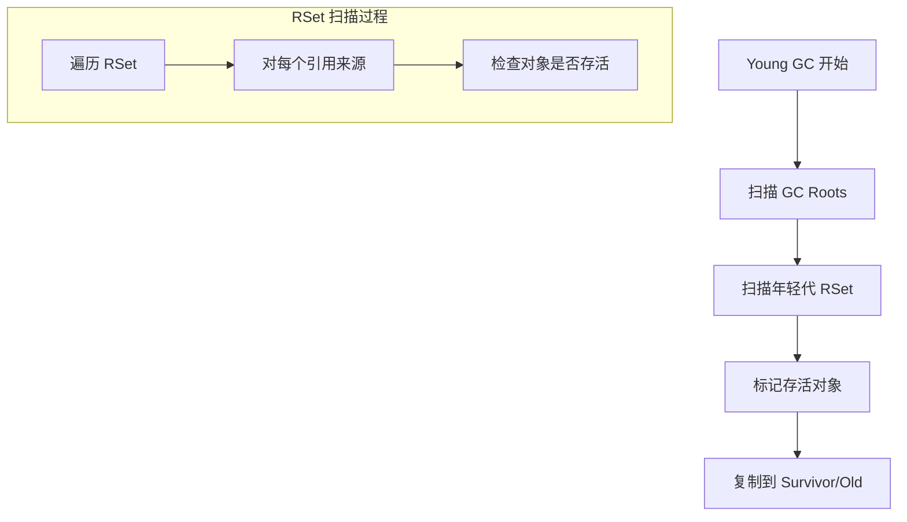

# G1 Region 与 Remembered Set

**目标级别**：P6/P7

## 面试官最关心的 3 个问题

1. G1 的 Remembered Set 是什么？它解决什么问题？
2. Card Table 和 RSet 的关系是什么？
3. RSet 会不会占用大量内存？

---

## 一、Remembered Set 概述

面试官问：「G1 如何处理跨 Region 引用？」你说「RSet」——然后面试官追问「RSet 是怎么工作的？为什么它能减少扫描范围？」你愣住了。Remembered Set 是 G1 高效回收的关键数据结构。

### 为什么需要 RSet？



**问题**：Young GC 时，需要知道哪些 Old Region 引用了 Young 对象。如果扫描整个 Old 区，开销巨大。

**解决方案**：RSet 记录其他 Region 对本 Region 对象的引用。

---

## 二、RSet 的结构

### Region 内的 RSet



### RSet 的实现

```java
// RSet 存储结构
class RememberedSet {
    // Point-in-time 结构：记录引用来源
    Map<Integer, List<Object>> references;  // Region ID -> 对象列表
    
    // Per-Region 结构：记录引用关系
    Map<Object, Set<Integer>> pointedBy;    // 对象 -> 来源 Region 列表
}
```

---

## 三、Card Table

### Card 的划分



**Card 大小**：512 字节（固定）

### 写屏障触发

```java
// 写屏障：当修改引用时
void writeBarrier(Object src, Field field, Object dst) {
    // 执行正常写入
    src.field = dst;
    
    // 检查是否跨 Region 引用
    if (isDifferentRegion(src, dst)) {
        // 标记 Card 为 Dirty
        cardTable[cardIndex(src)] = DIRTY;
        
        // 更新 RSet
        rsetOf(src.region).addReference(dst);
    }
}
```

---

## 四、RSet 的工作流程

### Young GC 时的 RSet 扫描



### RSet 的更新

```java
// 写屏障中的 RSet 更新
void updateRSet(Object src, Object dst) {
    // 获取目标对象所在的 Region
    Region dstRegion = getRegion(dst);
    
    // 获取源对象所在的 Region
    Region srcRegion = getRegion(src);
    
    // 如果跨 Region，更新目标 Region 的 RSet
    if (srcRegion != dstRegion) {
        RSet rset = dstRegion.getRSet();
        rset.add(srcRegion, getObjectOffset(dst));
    }
}
```

---

## 五、RSet 的空间开销

### 空间占用估算

```bash
# G1 参数
-XX:G1HeapRegionSize=4m        # Region 大小
-XX:G1RSetRegionCache=128k     # RSet 缓存大小

# RSet 空间估算
# RSet 大小 ≈ 堆大小 × 引用比例 × RSet 效率系数
# 通常占堆的 5%~10%
```

| 堆大小 | Region 大小 | Region 数量 | RSet 开销 |
|--------|------------|-------------|-----------|
| 4GB | 2MB | 2048 | ~200MB |
| 32GB | 4MB | 8192 | ~1.6GB |
| 64GB | 8MB | 8192 | ~3.2GB |

:::warning 大内存场景
RSet 在大内存场景下占用显著，需要评估：
1. 减小 Region 大小（增加 Region 数量，增加 RSet 开销）
2. 增大 Region 大小（减少 Region 数量，减少 RSet 开销）
3. 考虑 ZGC（无 RSet）
:::

---

## 六、高频面试题

### 🔴 第一层：RSet 的作用

**问题**：G1 的 Remembered Set 是什么？它解决什么问题？

**标准答案**：

Remembered Set（RSet）是 G1 每个 Region 的组成部分，记录**其他 Region 对本 Region 对象的引用**。

**解决的问题**：

- **跨 Region 引用**：G1 的堆被划分为多个 Region，对象可能跨 Region 引用
- **减少扫描范围**：Young GC 时不需要扫描整个堆，只需扫描 RSet

> **第二层追问**：RSet 怎么保证正确性？
>
> 通过**写屏障**维护。当引用发生变化时（跨 Region），写屏障捕获这个变化并更新 RSet。

> **第三层追问**：RSet 会不会占用大量内存？
>
> RSet 通常占堆的 **5%~10%**。在极端场景（如对象互相引用复杂）下可能更高。可以通过调整 Region 大小来平衡。

---

### 🟡 Card Table 与 RSet 的关系

**问题**：Card Table 和 RSet 有什么关系？

**标准答案**：

| 结构 | 作用 | 粒度 |
|------|------|------|
| **Card Table** | 记录老年代的 Card 是否 Dirty | 512 字节 |
| **RSet** | 记录具体哪些对象被其他 Region 引用 | 对象级别 |

**关系**：

1. Card Table 用于快速定位**可能有跨 Region 引用**的 Card
2. RSet 记录**精确的引用关系**
3. 两者配合提高 RSet 更新和查询效率

---

### 🟢 G1 的 Remembered Set 优化

**问题**：G1 如何优化 RSet 的性能？

**标准答案**：

1. **合并引用**：RSet 只记录哪个 Region 引用了本 Region，而非每个引用
2. **后向更新**：被引用方记录引用方，而非引用方记录所有引用
3. **并行更新**：并发标记阶段可以并行更新 RSet
4. **增量更新**：使用 SATB 追踪引用变化

---

## 七、常见错误与陷阱

### ⚠️ 陷阱 1：RSet 是完美的

RSet 需要通过写屏障维护，写屏障有性能开销。在极端高频引用修改场景下，可能成为瓶颈。

### ⚠️ 陷阱 2：G1 不需要考虑跨代引用

G1 仍然有年轻代和老年代的概念，只是用 Region 实现。跨代引用仍然存在，RSet 仍然需要。

### ⚠️ 陷阱 3：Region 越小越好

Region 越小，RSet 越多，管理开销越大。需要根据堆大小选择合适的 Region 大小。

---

## 八、对比总结表

| 维度 | 传统分代 | G1 Region |
|------|---------|-----------|
| **跨代引用处理** | Card Table | Card Table + RSet |
| **引用粒度** | Card（512 字节） | 对象级别 |
| **扫描范围** | 整代扫描 | 仅 RSet |
| **内存开销** | 低 | 中等（5%~10%） |
| **复杂度** | 简单 | 复杂 |

---

## 九、加分回答

### 💡 ZGC 为什么不需要 RSet？

ZGC 使用**颜色指针**和**读屏障**，在读取引用时直接检查引用是否有效，无需预先记录跨 Region 引用。

```bash
# ZGC 读屏障伪代码
Object load(Object* addr) {
    // 检查指针颜色
    if (needsReload(addr)) {
        reload(addr);  // 重新加载有效引用
    }
    return *addr;
}
```

这种设计将维护成本从**写屏障**转移到**读屏障**，减少了写操作的开销，但增加了读操作的开销。

### 💡 G1 的混合回收策略

混合回收时，G1 会选择回收价值最高的 Region：

```java
// 回收价值排序
class Region implements Comparable<Region> {
    long reclaimableSize;  // 可回收空间
    long回收时间估算;
    
    double value() {
        return reclaimableSize / estimatedTime;
    }
}
```

---

## 十、扩展思考

如果一个对象的引用频繁变化，G1 的 RSet 会怎样？

> **答案**：
>
> RSet 可能出现以下问题：
>
> 1. **写入放大**：每次引用变化都要更新 RSet，写屏障开销增加
> 2. **RSet 膨胀**：如果引用关系复杂，RSet 可能膨胀
> 3. **GC 效率下降**：扫描膨胀的 RSet 需要更多时间
>
> **优化建议**：
> - 评估应用场景，避免频繁的跨 Region 引用修改
> - 考虑 ZGC（无 RSet，但有读屏障开销）
> - 调整 Region 大小
