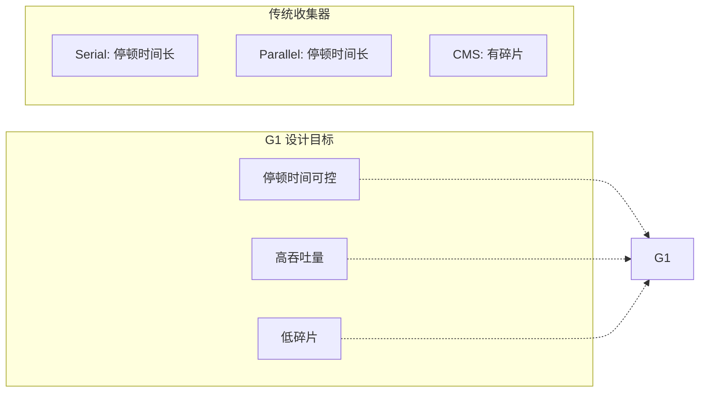
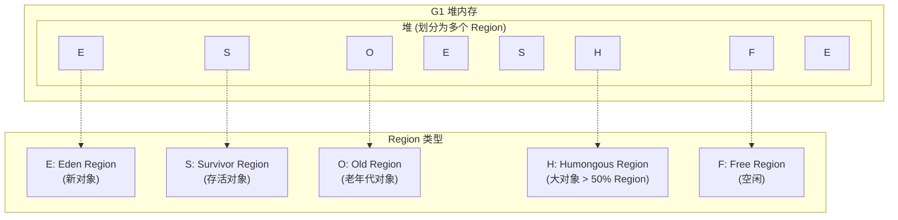
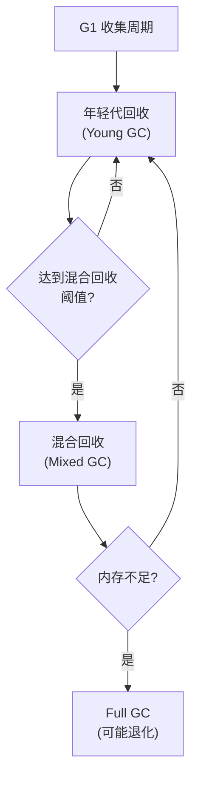
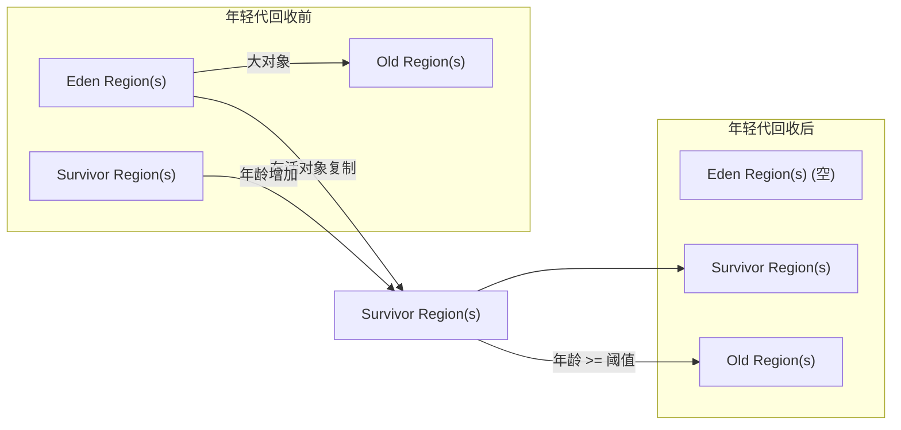
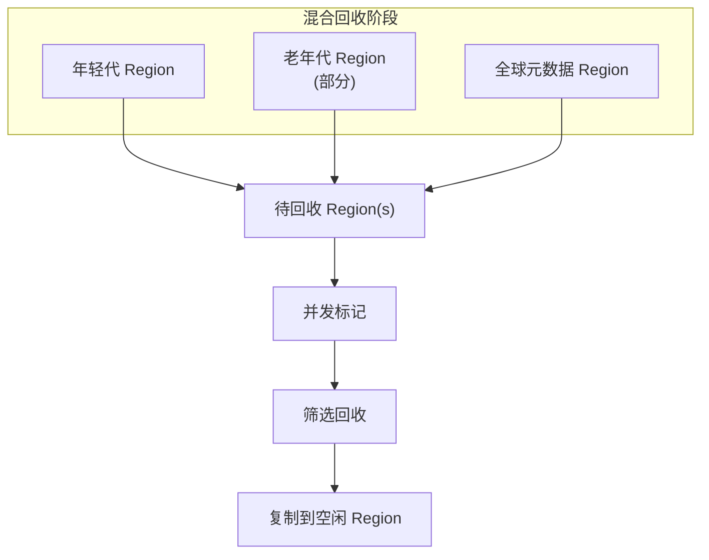
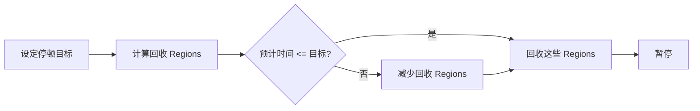
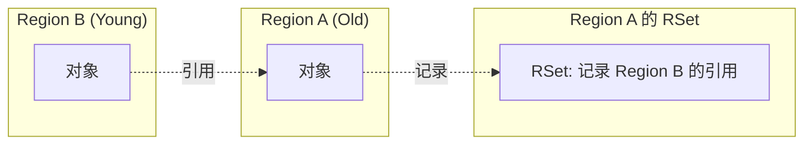
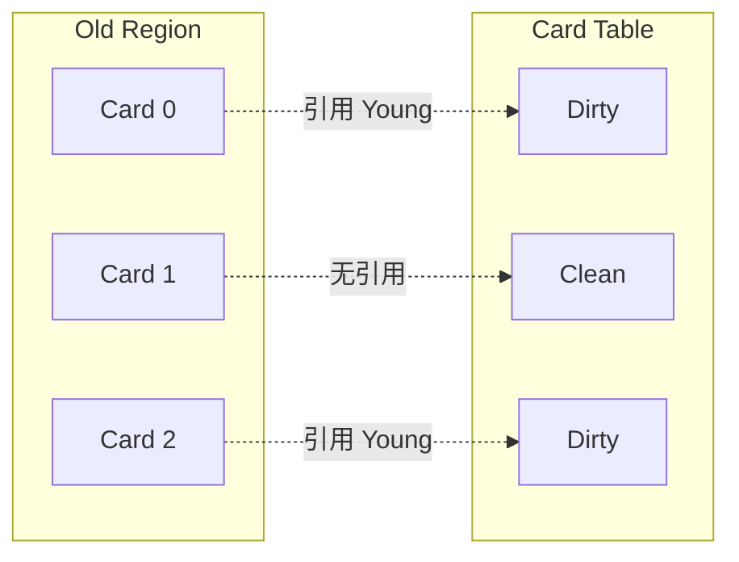

# G1 收集器原理

**目标级别**：P6/P7

## 面试官最关心的 3 个问题

1. G1 收集器的工作原理是什么？
2. G1 和 CMS 的核心区别是什么？
3. 为什么 G1 可以指定停顿时间目标？

---

## 一、G1 概述

面试官问：「G1 收集器是怎么工作的？」你说「分区回收」——然后面试官追问「分区和传统的分代有什么区别？为什么 G1 可以控制停顿时间？」你愣住了。G1 是 JDK9+ 的默认收集器，理解它的原理是现代 Java 开发的必备知识。

### G1 的设计目标



### G1 vs 传统收集器

| 维度 | 传统收集器 | G1 |
|------|-----------|-----|
| **内存结构** | 固定分代 | 分区 Region |
| **回收方式** | 整代回收 | 分区回收 |
| **停顿时间** | 不可控 | 可指定目标 |
| **碎片问题** | CMS 有碎片 | 无碎片 |
| **回收阶段** | 串行/并行 | 并发+并行 |

---

## 二、G1 的内存结构

### Region 分区

G1 将堆划分为多个大小相等的 **Region**：



### Region 大小

```bash
# 默认自动计算，可手动设置
-XX:G1HeapRegionSize=4m  # 必须是 2 的幂，范围 1MB~32MB
```

| 堆大小 | Region 大小 | Region 数量 |
|--------|------------|-------------|
| 4GB | 2MB | ~2000 |
| 32GB | 4MB | ~8000 |
| 64GB | 8MB | ~8000 |

---

## 三、G1 的回收过程

### G1 的收集周期



### 年轻代回收（Young GC）



### 混合回收（Mixed GC）



### G1 的四个阶段

| 阶段 | STW | 并发 | 说明 |
|------|-----|------|------|
| **初始标记** | ✅ | | 标记 GC Roots 直接引用 |
| **并发标记** | | ✅ | 从 GC Roots 追踪存活对象 |
| **最终标记** | ✅ | | 修正并发标记变化 |
| **筛选回收** | ✅ | | 筛选回收价值高的 Region |

---

## 四、G1 的停顿时间控制

### MaxGCPauseMillis

```bash
# 设置目标停顿时间（默认 200ms）
-XX:MaxGCPauseMillis=200
```

### G1 如何实现停顿时间控制？



**原理**：G1 根据历史 GC 数据，预测每个 Region 的回收价值（回收空间/回收时间），优先回收价值最高的 Region，直到达到停顿目标。

### 回收价值计算

```java
// 回收价值计算公式
回收价值 = 回收空间 / 回收时间

// 优先回收：
// - 死亡对象多的 Region
// - 存活对象少的 Region
// - 回收时间短的 Region
```

---

## 五、G1 参数配置

### 常用参数

```bash
# 启用 G1
-XX:+UseG1GC

# 设置目标停顿时间
-XX:MaxGCPauseMillis=200

# 设置 Region 大小
-XX:G1HeapRegionSize=4m

# 设置触发 Mixed GC 的阈值
-XX:InitiatingHeapOccupancyPercent=45

# 设置每次 Mixed GC 的最大 Region 数
-XX:G1MixedGCCountTarget=8

# 设置 Mixed GC 时老年代 Region 的比例
-XX:G1OldCSetRegionThresholdPercent=10
```

### JDK11+ 最佳实践

```bash
java -Xmx4g -Xms4g \
     -XX:+UseG1GC \
     -XX:MaxGCPauseMillis=200 \
     -XX:G1HeapRegionSize=4m \
     -XX:InitiatingHeapOccupancyPercent=45 \
     -XX:G1MixedGCCountTarget=8 \
     Application
```

---

## 六、高频面试题

### 🔴 第一层：G1 的工作原理

**问题**：请描述 G1 收集器的工作原理。

**标准答案**：

G1（Garbage First）是一款面向服务端的垃圾收集器，主要特点是将堆划分为多个大小相等的 **Region**。

**回收过程**：

1. **年轻代回收**（Young GC）：回收所有年轻代 Region，存活对象复制到 Survivor 或晋升老年代
2. **并发标记**：标记所有老年代 Region
3. **混合回收**（Mixed GC）：回收年轻代 + 部分老年代 Region
4. **筛选回收**：根据回收价值选择 Region，优先回收价值高的

> **第二层追问**：为什么 G1 可以控制停顿时间？
>
> G1 通过**回收价值计算**实现停顿时间控制。每次回收时，计算每个 Region 的回收价值（回收空间/回收时间），优先回收价值高的 Region，直到达到停顿目标。

> **第三层追问**：G1 和 CMS 的核心区别是什么？
>
> | 区别 | CMS | G1 |
> |------|-----|-----|
> | 算法 | 标记清除 | 标记整理 |
> | 内存结构 | 新生代/老年代 | Region |
> | 碎片问题 | 有碎片 | 无碎片 |
> | 停顿时间 | 不可控 | 可指定目标 |

---

### 🟡 G1 的 Region 类型

**问题**：G1 有哪些类型的 Region？Humongous Region 是什么？

**标准答案**：

| 类型 | 说明 | 大小 |
|------|------|------|
| **Eden Region** | 新对象分配区域 | 1~32 个 |
| **Survivor Region** | 年轻代存活对象 | 1~32 个 |
| **Old Region** | 老年代对象 | 多个 |
| **Humongous Region** | 大对象（> 50% Region） | 连续多个 |
| **Free Region** | 空闲区域 | 多个 |

**Humongous Region** 用于存储超过 Region 50% 的大对象，如果对象超过整个 Region，会使用连续的多个 Humongous Region。

---

### 🟢 G1 的 Full GC

**问题**：G1 什么时候会触发 Full GC？

**标准答案**：

G1 在以下情况可能退化 Full GC：

1. **内存分配失败**：没有足够的空闲 Region 分配新对象
2. **并发模式失败**：Mixed GC 无法跟上对象分配速度
3. **巨型对象分配失败**：Humongous Region 空间不足

Full GC 使用 **单线程标记整理**算法，停顿时间较长。

---

## 七、常见错误与陷阱

### ⚠️ 陷阱 1：G1 不需要调优

G1 虽然是自适应收集器，但仍需要根据应用特性调整参数。

### ⚠️ 陷阱 2：MaxGCPauseMillis 是保证

MaxGCPauseMillis 是**目标**，不是**保证**。如果设置过小，可能导致 G1 无法达到目标，反而影响性能。

### ⚠️ 陷阱 3：G1 完全没有碎片

G1 使用标记整理算法，长期运行后仍可能有轻微碎片，但比 CMS 好得多。

---

## 八、对比总结表

| 维度 | CMS | G1 |
|------|-----|-----|
| **设计目标** | 低停顿 | 可控停顿 + 高吞吐 |
| **内存结构** | 新生代/老年代 | Region |
| **GC 算法** | 标记清除 | 标记整理 |
| **停顿时间控制** | ❌ | ✅ |
| **内存碎片** | 有 | 无 |
| **大对象处理** | 直接老年代 | Humongous Region |
| **JDK 版本** | JDK5-14 | JDK9+ 默认 |

---

## 九、加分回答

### 💡 G1 的 Remembered Set

每个 Region 都有一个 **Remembered Set (RSet)**，记录其他 Region 对本 Region 对象的引用。



RSet 解决了跨 Region 引用问题，Minor GC 时只需扫描 RSet，而非整个堆。

### 💡 G1 的 Card Table

G1 使用 **Card Table** 优化 RSet：



---

## 十、扩展思考

G1 的停顿时间控制策略有什么局限性？

> **答案**：
>
> G1 的停顿时间控制基于历史数据和预测模型，有以下局限：
>
> 1. **预测准确性**：如果应用行为突然变化，历史数据可能不准确
> 2. **混合回收复杂度**：Mixed GC 需要平衡年轻代和老年代回收时间
> 3. **大对象影响**：Humongous Region 回收成本高，可能影响停顿时间
> 4. **并发阶段时间**：并发标记阶段的预估时间可能不准确
>
> 如果需要更精确的停顿时间控制，可以考虑 ZGC 或 Shenandoah。
