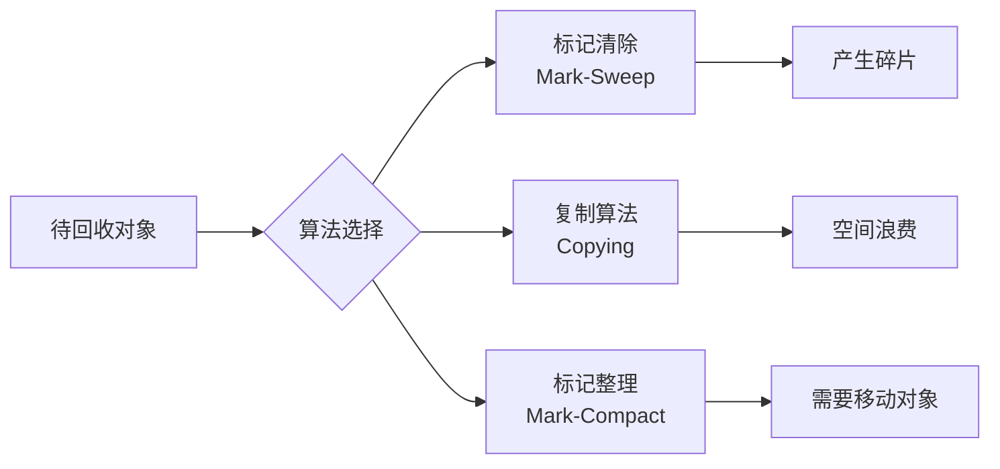
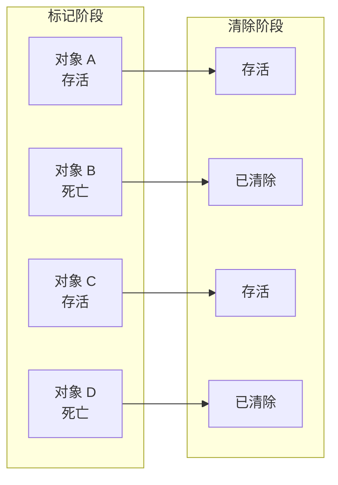
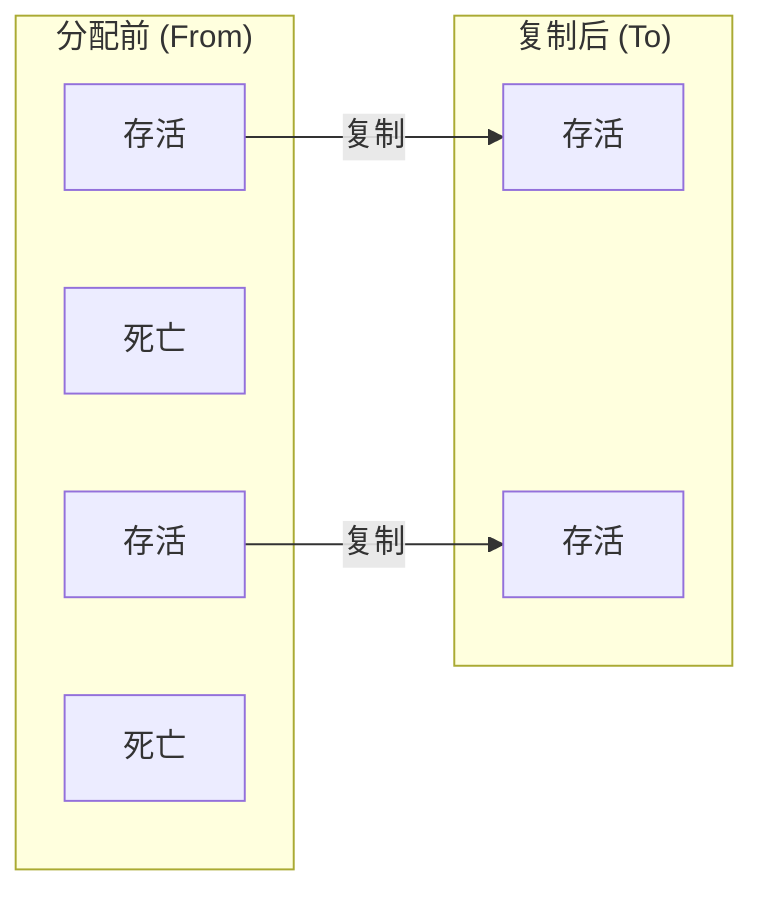
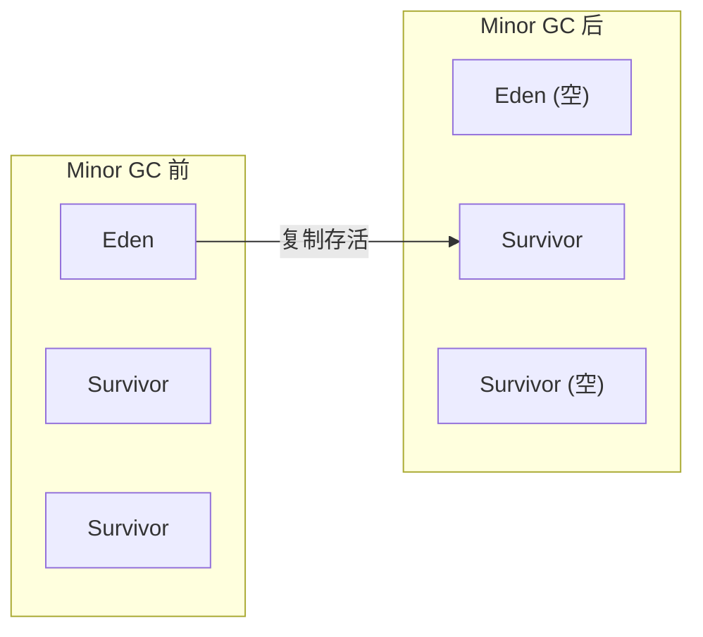
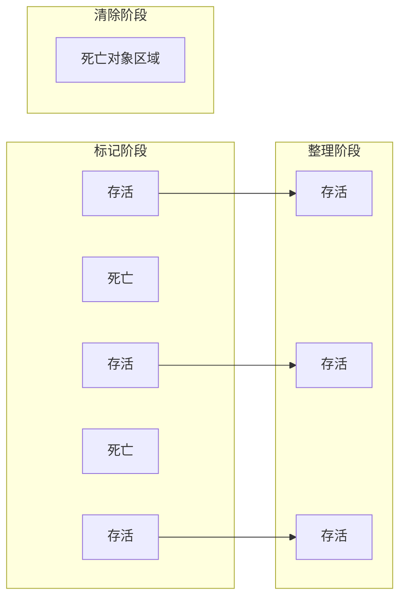
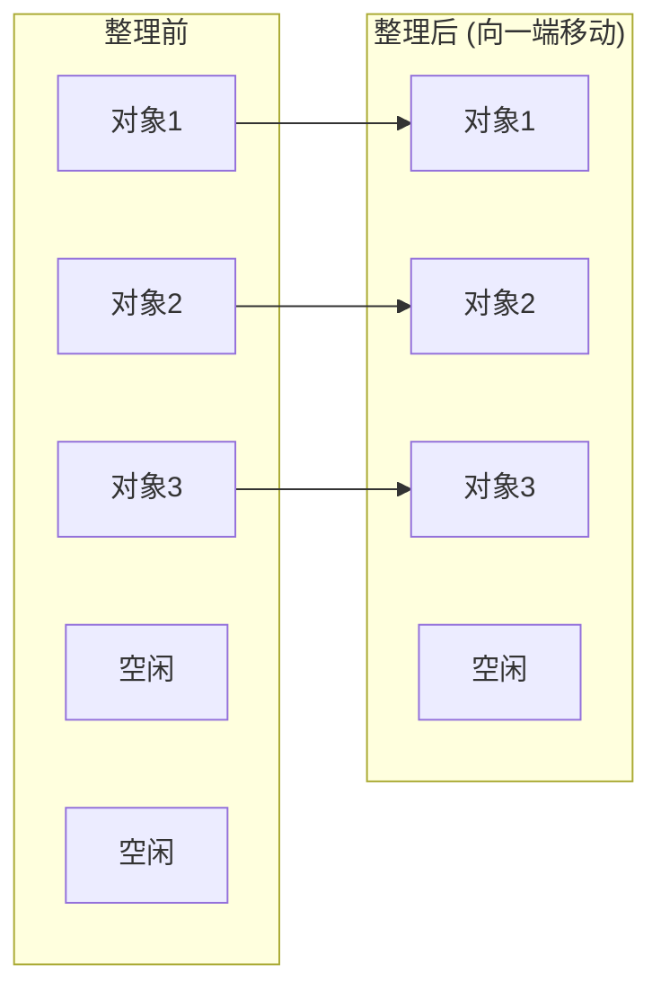
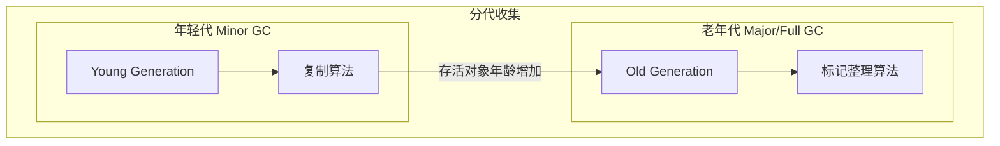

# 垃圾回收算法

**目标级别**：P5/P6

## 面试官最关心的 3 个问题

1. JVM 有哪些垃圾回收算法？各有什么优缺点？
2. 为什么新生代使用复制算法，老年代使用标记整理？
3. 什么是 Stop The World？哪些阶段会产生 STW？

---

## 一、垃圾回收算法概述

面试官问：「你了解哪些垃圾回收算法？」你说「标记清除、复制、标记整理」——然后面试官追问「为什么新生代用复制算法，老年代用标记整理？CMS 用的是什么算法？」你答不上来。理解算法原理是理解 GC 收集器的基础。



---

## 二、标记清除算法（Mark-Sweep）

### 算法步骤



### 实现原理

```java
// 标记阶段：从 GC Roots 出发，标记所有存活对象
void mark() {
    for (Object obj : gcRoots) {
        markObject(obj);
    }
}

// 清除阶段：遍历堆，回收未标记对象
void sweep() {
    for (Object obj : heap) {
        if (obj.isMarked()) {
            obj.unmark();
        } else {
            obj.recycle();
        }
    }
}
```

### 优缺点

| 优点 | 缺点 |
|------|------|
| 实现简单 | 产生内存碎片 |
| 适用于老年代 | 分配速度慢（需要空闲列表） |
| 不需要额外空间 | 效率低（两次遍历） |

---

## 三、复制算法（Copying）

### 算法原理

将内存分为两块，每次只使用一块。GC 时将存活对象复制到另一块，然后直接清除原块。



### JVM 的实际应用

JVM 将年轻代分为 **Eden** 和 **Survivor**：



### 优缺点

| 优点 | 缺点 |
|------|------|
| 无内存碎片 | 空间利用率低（最多 50%） |
| 分配效率高（指针碰撞） | 需要复制存活对象 |
| 实现简单 | 不适用于老年代 |

:::tip 为什么年轻代用复制算法
年轻代对象大多朝生夕死，存活对象很少（通常 `<` 10%）。复制少量对象的开销远小于整理大量碎片的开销。
:::

---

## 四、标记整理算法（Mark-Compact）

### 算法步骤



### 整理方向



### 优缺点

| 优点 | 缺点 |
|------|------|
| 无内存碎片 | 移动对象开销大 |
| 空间利用率高 | 需要 Stop The World |
| 适合老年代 | 实现复杂 |

---

## 五、分代收集算法

### 分代假说

分代收集算法基于两个假设：

1. **弱分代假说**：大部分对象朝生夕死
2. **强分代假说**：熬过多次 GC 的对象倾向于继续存活

### 各代使用不同算法



### 各代 GC 策略

| 区域 | 算法 | GC 频率 | STW 时间 |
|------|------|---------|----------|
| **年轻代** | 复制算法 | 高（几秒~几十秒） | 短（几十毫秒） |
| **老年代** | 标记整理 | 低（几十秒~几分钟） | 长（几百毫秒~几秒） |

---

## 六、高频面试题

### 🔴 第一层：三大 GC 算法对比

**问题**：请比较标记清除、复制、标记整理三种算法。

**标准答案**：

| 算法 | 优点 | 缺点 | 适用场景 |
|------|------|------|----------|
| **标记清除** | 实现简单，不移动对象 | 产生碎片，效率低 | 老年代（CMS 初始/最终标记） |
| **复制算法** | 无碎片，分配快 | 空间利用率低（50%） | 年轻代 |
| **标记整理** | 无碎片，空间利用率高 | 移动对象开销大 | 老年代 |

> **第二层追问**：为什么新生代用复制算法，老年代用标记整理？
>
> 新生代对象存活率低（`<` 10%），复制少量对象开销小。老年代存活率高，复制成本高，且老年代需要无碎片的空间。

> **第三层追问**：CMS 用的是什么算法？
>
> CMS 使用**标记清除**算法，初始标记和重新标记使用 STW，并发标记和并发清除与应用线程并发执行。标记清除会产生碎片，所以 CMS 需要定期 Full GC 整理。

---

### 🟡 Stop The World

**问题**：什么是 Stop The World？哪些 GC 阶段会产生 STW？

**标准答案**：

Stop The World（STW）是 JVM 暂停所有应用线程进行 GC 的阶段。

| 收集器 | STW 阶段 | STW 时间 |
|--------|----------|----------|
| **Serial** | 全程 STW | 最长 |
| **ParNew/CMS** | 初始标记、重新标记 | 较短 |
| **G1** | 初始标记、最终标记、筛选回收 | 可控 |
| **ZGC** | 初始标记、最终标记 | 极短（`<` 1ms） |

---

### 🟢 对象年龄与晋升

**问题**：对象在年轻代多少次 GC 后进入老年代？

**标准答案**：

默认情况下，对象年龄达到 **15**（`-XX:MaxTenuringThreshold`）后进入老年代。

```java
// 年龄增长规则
public class AgeTest {
    public static void main(String[] args) {
        // 对象创建后年龄为 0
        // 每次 Minor GC 后年龄 +1
        // 年龄 >= MaxTenuringThreshold 时进入老年代
    }
}
```

---

## 七、常见错误与陷阱

### ⚠️ 陷阱 1：混淆标记清除和标记整理

标记清除**不移动**存活对象，标记整理**移动**存活对象。CMS 使用的是标记清除，所以会产生碎片。

### ⚠️ 陷阱 2：认为复制算法空间利用率是 50%

实际 JVM 中，Eden : Survivor = 8 : 1 : 1，复制算法的空间利用率是 **90%**（Eden 区），因为 Survivor 可以复用。

### ⚠️ 陷阱 3：忽略跨代引用

分代收集时需要处理跨代引用（如老年代引用年轻代）。JVM 使用 Card Table 优化，避免扫描整个老年代。

---

## 八、对比总结表

| 维度 | 标记清除 | 复制算法 | 标记整理 |
|------|----------|----------|----------|
| **是否移动对象** | 否 | 是 | 是 |
| **空间碎片** | 有 | 无 | 无 |
| **空间利用率** | 高 | 低（50%/90%） | 高 |
| **分配速度** | 慢（空闲列表） | 快（指针碰撞） | 快（指针碰撞） |
| **GC 开销** | 低 | 低 | 高（移动对象） |
| **适用区域** | 老年代 | 年轻代 | 老年代 |

---

## 九、加分回答

### 💡 G1 的混合回收

G1 将堆分为多个 Region，不再严格区分年轻代和老年代。G1 的回收过程：

1. **Young GC**：回收年轻代 Region（复制算法）
2. **Mixed GC**：回收年轻代 + 部分老年代 Region（标记整理）
3. **Full GC**：当 G1 无法跟上分配速度时（单线程标记整理）

### 💡 分配担保

如果 Survivor 区无法容纳存活对象，对象直接进入老年代。这称为**分配担保**（Handle Promotion）。

```bash
# 分配担保参数
-XX:+HandlePromotionFailure  # JDK6 Update 24 后默认开启
```

---

## 十、扩展思考

既然标记整理没有碎片，为什么 CMS 不使用标记整理？

> **答案**：
> 标记整理需要**移动对象**，而 CMS 的核心优势是**并发执行**（并发标记、并发清除）。如果使用标记整理，在整理阶段需要 STW 暂停所有线程，反而增加了停顿时间。
>
> CMS 选择标记清除，牺牲空间利用率换取**并发执行能力**。但这导致碎片化问题，最终需要 Serial Old 收集器进行 Full GC 整理。
