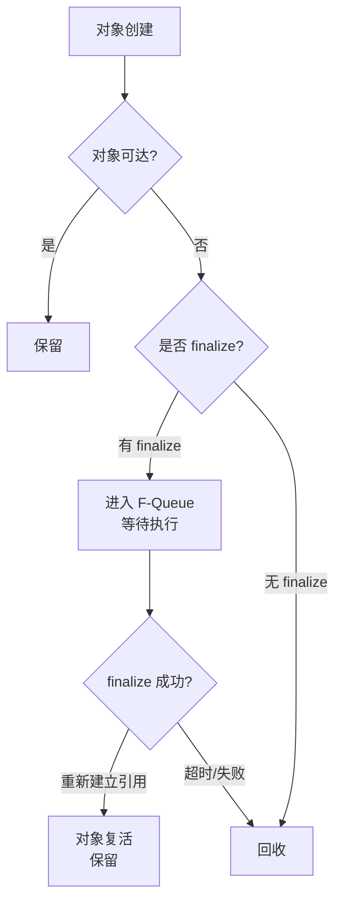
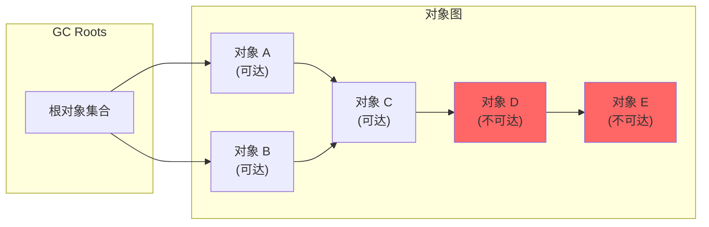
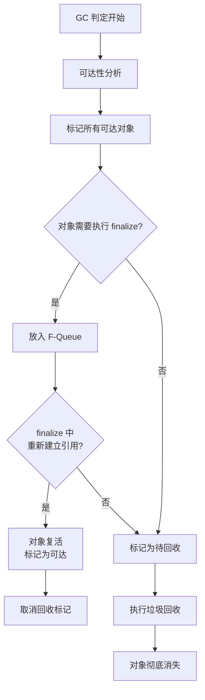
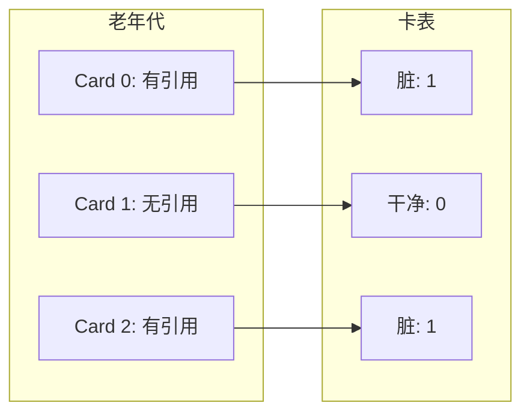

# GC 判定算法

**目标级别**：P5/P6

## 面试官最关心的 3 个问题

1. 如何判断对象是否需要回收？
2. 引用计数法有什么缺陷？为什么 JVM 不使用它？
3. 可达性分析的基本原理是什么？

---

## 一、GC 判定概述

面试官问：「哪些对象应该被回收？」你说「不再使用的对象」——然后面试官追问「怎么判断不再使用？有没有算法？」你愣住了。GC 判定是垃圾回收的第一步，判断哪些对象需要回收是整个 GC 的基础。



---

## 二、引用计数法

### 基本原理

每个对象有一个**引用计数器**，记录被引用的次数。引用失效时计数器减 1，计数器为 0 时对象可回收。

```java
public class ReferenceCounting {
    public static void main(String[] args) {
        // 对象 A 和 B 互相引用
        A a = new A();  // aRef = 1
        B b = new B();  // bRef = 1
        
        a.ref = b;      // bRef = 2
        b.ref = a;      // aRef = 2
        
        // 断开外部引用
        a = null;       // aRef = 1
        b = null;       // bRef = 1
        
        // 此时 A 和 B 实际上已不可达
        // 但引用计数仍为 1，无法回收
    }
}

class A {
    B ref;
}

class B {
    A ref;
}
```

### 引用计数法的缺陷

| 缺陷 | 说明 | 影响 |
|------|------|------|
| **无法处理循环引用** | 互相引用的对象引用计数永不为 0 | 内存泄漏 |
| **更新计数器开销** | 每次引用变化都要更新计数 | 性能损耗 |
| **无法处理弱引用** | 弱引用不应阻止回收 | 功能缺失 |

:::warning 为什么 JVM 不使用引用计数法
主要原因是**循环引用**。即使对象 A 和 B 都不再被外部引用，只要它们互相引用，引用计数就永远不为 0，无法被回收。
:::

---

## 三、可达性分析算法

### 基本原理

从 **GC Roots** 出发，沿着引用链向下搜索。所有能够到达的对象是**可达的**，不可达的对象可回收。



### GC Roots 的组成

| 类别 | GC Roots 对象 |
|------|---------------|
| **虚拟机栈** | 局部变量表中的引用对象 |
| **本地方法栈** | JNI 引用的对象 |
| **方法区** | 类静态属性引用的对象 |
| **方法区** | 常量引用的对象（如字符串常量池） |
| **活跃线程** | 正在执行的线程对象 |
| **JVM 内部** | Class 对象、异常对象、系统类加载器 |
| **同步锁** | synchronized 持有的对象 |

---

## 四、GC 判定流程

### 完整的 GC 判定流程



### finalize() 方法的特殊性

```java
public class FinalizeDemo {
    static FinalizeDemo instance;
    
    @Override
    protected void finalize() throws Throwable {
        System.out.println("finalize 被调用");
        instance = this;  // 重新建立引用，对象复活
    }
    
    public static void main(String[] args) throws InterruptedException {
        instance = new FinalizeDemo();
        
        // 断开引用
        instance = null;
        System.gc();
        Thread.sleep(500);
        
        if (instance != null) {
            System.out.println("对象复活了！");
        }
    }
}
```

:::warning finalize() 的问题
1. **执行时机不确定**：GC 时不一定立即执行
2. **只执行一次**：对象复活后再次 GC 时不会再调用
3. **性能问题**：finalize() 队列增加了 GC 复杂度
4. **已被废弃**：Java 9 标记为 `@Deprecated`
:::

---

## 五、高频面试题

### 🔴 第一层：如何判断对象可回收

**问题**：JVM 如何判断一个对象需要被回收？

**标准答案**：

JVM 使用**可达性分析**算法：

1. 从 GC Roots 出发，沿着引用链向下搜索
2. 所有能够到达的对象标记为**可达**
3. 不可达的对象在两次标记后被回收

> **第二层追问**：为什么不用引用计数法？
>
> 引用计数法无法处理循环引用问题。A 和 B 互相引用，即使没有外部引用，计数也不为 0，无法回收。

> **第三层追问**：GC Roots 为什么不会循环引用？
>
> GC Roots 是预定义的特殊对象集合（如虚拟机栈中的局部变量），它们是**固有的根节点**，不参与引用计数。

---

### 🟡 finalize() 的作用

**问题**：对象的 finalize() 方法有什么作用？为什么不推荐使用？

**标准答案**：

`finalize()` 是对象被回收前最后一次自救的机会。

```java
public class FinalizeRescue {
    static Resource resource;
    
    @Override
    protected void finalize() {
        resource = this;  // 重新引用自己
    }
}
```

**不推荐使用的原因**：

1. **执行时机不确定**：GC 并不保证立即执行
2. **只执行一次**：复活后再次 GC 时不会调用
3. **性能问题**：增加 GC 复杂度和延迟
4. **已被废弃**：Java 9 标记为 `@Deprecated`

**替代方案**：

- 使用 `try-with-resources` 管理资源
- 使用 `Reference` 系列类（弱引用、虚引用）

---

### 🟢 两次标记过程

**问题**：对象被判定为不可达后，还需要经过哪些步骤才被回收？

**标准答案**：

1. **第一次标记**：对象不在 GC Roots 引用链上
2. **筛选**：检查对象是否需要执行 finalize()
3. **放入 F-Queue**：如果需要，存入 `FinalizerQueue`
4. **第二次标记**：finalize() 执行后，检测对象是否重新建立引用
5. **回收**：如果仍未建立引用，标记为待回收

---

## 六、常见错误与陷阱

### ⚠️ 陷阱 1：混淆"引用"和"可达"

不是所有引用都参与可达性分析。**软引用、弱引用、虚引用**可能在某些 GC 中被忽略，导致对象被提前回收。

### ⚠️ 陷阱 2：忘记 finalize() 已被废弃

很多面试者还在讲 finalize() 的"自救"机制，但 Java 9 已经标记为废弃。面试时应该主动提及这一点。

### ⚠️ 陷阱 3：忽略方法区也需要 GC

很多人以为 GC 只发生在堆。方法区（尤其是 JDK7 的永久代）也需要垃圾回收，回收废弃的常量和无用的类。

---

## 七、对比总结表

| 判定算法 | 原理 | 优点 | 缺点 | JVM 使用 |
|----------|------|------|------|----------|
| **引用计数** | 计数器为 0 则回收 | 判定简单 | 无法处理循环引用 | ❌ |
| **可达性分析** | GC Roots 不可达则回收 | 能处理循环引用 | 需要停顿（Stop The World） | ✅ |

---

## 八、加分回答

### 💡 Stop The World 与可达性分析

可达性分析需要 GC Roots 在分析期间保持不变，因此需要**Stop The World（STW）**。所有应用线程暂停，JVM 进行 GC 根节点枚举。

```bash
# 使用 jstack 查看 GC 期间的停顿
jstack <pid> | grep -A 5 "World"
```

**减少 STW 时间的策略**：

1. **OopMap**：记录对象引用位置，避免全量扫描
2. **Card Table**：记录老年代对年轻代的引用，减少扫描范围
3. **并发标记**：部分标记阶段与应用线程并发执行

### 💡 跨代引用问题

年轻代对象可能被老年代引用，导致 Minor GC 时需要扫描整个老年代。

**解决方案**：Card Table（卡表）



---

## 九、扩展思考

如果一个对象的 finalize() 方法耗时很长，会发生什么？

> **答案**：
> - 该对象的回收会延迟
> - F-Queue 中的其他对象也无法被回收
> - 如果 finalize() 中创建新对象，可能导致内存持续增长
> - 这是 finalize() 性能问题的另一个体现
