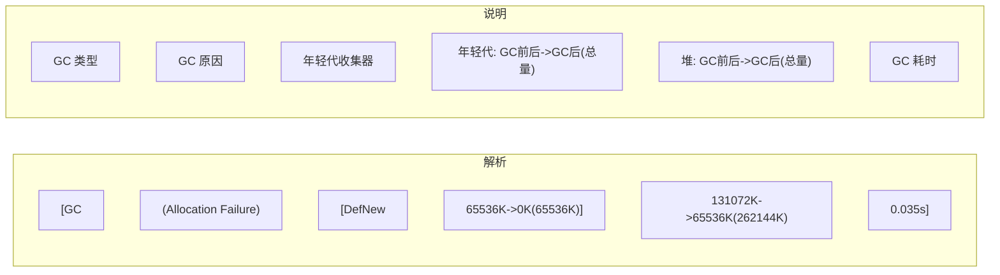

# GC 日志解读

**目标级别**：P5/P6

## 面试官最关心的 3 个问题

1. 如何开启 GC 日志？有哪些重要参数？
2. 如何从 GC 日志判断 GC 状态？
3. 如何通过 GC 日志发现性能问题？

---

## 一、GC 日志配置

### 常用参数

```bash
# 打印 GC 详细信息
-XX:+PrintGCDetails

# 打印 GC 时间戳
-XX:+PrintGCTimeStamps

# 打印 GC 原因
-XX:+PrintGCCause

# 输出到文件
-Xlog:gc*:file=gc.log

# JDK9+ 日志格式
-Xlog:gc*=info,gc+heap=trace:file=gc.log:time,uptime,level,tags
```

### JDK8 vs JDK9+ 日志参数

| JDK8 | JDK9+ | 说明 |
|------|-------|------|
| `-XX:+PrintGCDetails` | `-Xlog:gc*` | 详细信息 |
| `-XX:+PrintGCTimeStamps` | 内置 | 时间戳 |
| `-Xloggc:gc.log` | `-Xlog:gc*:file=gc.log` | 输出文件 |
| `-XX:+UseGCLogFileRotation` | `-Xlog:gc*:file=gc.log:filecount=10,filesize=100m` | 日志轮转 |

---

## 二、Serial GC 日志

### Minor GC 日志

```bash
[GC (Allocation Failure) [DefNew: 65536K->0K(65536K)] 131072K->65536K(262144K) 0.035s]
```



### Full GC 日志

```bash
[Full GC (Allocation Failure) [Tenured: 131072K->65536K(131072K)] 262144K->65536K(262144K) 0.102s]
```

| 字段 | 说明 |
|------|------|
| `Full GC` | Full GC 类型 |
| `Allocation Failure` | GC 原因 |
| `Tenured` | 老年代收集器 |
| `131072K->65536K` | 老年代 GC 前后使用量 |
| `262144K->65536K` | 堆内存 GC 前后使用量 |

---

## 三、Parallel GC 日志

### 年轻代收集

```bash
[GC (Allocation Failure) [PSYoungGen: 65536K->0K(65536K)] 131072K->65536K(262144K) 0.015s]
[Times: user=0.05 sys=0.01 real=0.02 s]
```

| 字段 | 说明 |
|------|------|
| `PSYoungGen` | Parallel Scavenge 年轻代 |
| `user=0.05` | 用户态 CPU 时间 |
| `sys=0.01` | 系统态 CPU 时间 |
| `real=0.02` | 实际耗时 |

### Full GC 日志

```bash
[Full GC (Allocation Failure) [PSYoungGen: 65536K->0K(65536K)] 
[ParOldGen: 131072K->65536K(131072K)] 262144K->65536K(262144K) 0.102s]
[Times: user=0.35 sys=0.02 real=0.10 s]
```

---

## 四、CMS 日志

### CMS 五个阶段日志

```bash
# 阶段1: 初始标记
[GC (CMS Initial Mark) [1 CMS-initial-mark: 262144K(524288K)] 262144K(524288K) 0.001s]

# 阶段2: 并发标记
[CMS-concurrent-mark-start]
[CMS-concurrent-mark: 0.123/0.456 s]

# 阶段3: 重新标记
[GC (CMS Final Remark) [YG occupancy: 65536K(262144K)] 
[Rescan (parallel) , 0.789s]
[weak refs processing, 0.012s]
[class unloading, 0.001s]
[scrub symbol table, 0.002s] 131072K->131072K(262144K) 0.802s]

# 阶段4: 并发清理
[CMS-concurrent-sweep-start]
[CMS-concurrent-sweep: 0.234/0.567 s]

# 阶段5: 并发重置
[CMS-concurrent-reset-start]
[CMS-concurrent-reset: 0.012/0.034 s]
```

### 并发模式失败

```bash
[Full GC (Allocation Failure) 
[CMS: 262144K->131072K(524288K), 1.234s]
[Times: user=1.23 sys=0.01 real=1.24 s]
```

---

## 五、G1 日志

### 年轻代收集

```bash
[GC pause (G1 Evacuation Pause) (young) 256M->256M(512M) 45.678ms]
```

### 混合回收

```bash
[GC pause (G1 Evacuation Pause) (young) (initial-mark) 
24M->24M(512M) 12.345ms]
[GC pause (G1 Humongous Allocation) (young) (mixed) 
32M->32M(512M) 15.678ms]
```

### 详细日志

```bash
[Ext Root Scanning (ms): 
  Update RS (ms): Avg: 1.2 Min: 0.8 Max: 2.1 Count: 5
  Scan RS (ms): Avg: 0.5 Min: 0.3 Max: 0.8 Count: 5
  Object Copy (ms): Avg: 3.2 Min: 2.1 Max: 4.5 Count: 5
]
```

---

## 六、ZGC 日志

### ZGC 日志格式

```bash
[2024-01-01T12:00:00.123+0800] GC(0) Garbage Collection
  Age 0 -> 1:  1024M (avg 0us, max 0us)
  Heap: 2048M(2048M) -> 512M(2048M)
  Allocate Rate: 1024M/s
  Collection Set: 1024M, 2 regions, 10ms
  Active Workers: 8
```

### JDK16+ 统一日志

```bash
[gc,start] GC(0) Garbage Collection 
[gc,phases,mark] GC(0) Concurrent Mark 10ms
[gc,phases,remark] GC(0) Final Mark 2ms
[gc,phases] GC(0) Pause 1ms
```

---

## 七、GC 日志分析方法

### 关键指标


### 计算公式

```bash
# GC 吞吐量
GC_吞吐量 = (应用运行时间 - GC时间) / 应用运行时间

# 例如
# 10分钟内，GC 总耗时 5 秒
# GC 吞吐量 = (600 - 5) / 600 = 99.17%
```

### 常见问题判断

| 问题 | 表现 | 原因 |
|------|------|------|
| **Minor GC 频繁** | 每秒多次 Minor GC | 年轻代太小 |
| **Full GC 频繁** | 每分钟多次 Full GC | 老年代空间不足 |
| **GC 停顿时间长** | 停顿时间 > 500ms | 对象太多，回收慢 |
| **内存持续增长** | 堆使用量持续上升 | 内存泄漏 |
| **GC 吞吐量低** | < 95% | GC 参数不当 |

---

## 八、高频面试题

### 🔴 第一层：GC 日志配置

**问题**：如何开启 GC 日志？

**标准答案**：

```bash
# JDK8
-XX:+PrintGCDetails
-XX:+PrintGCTimeStamps
-Xloggc:gc.log
-XX:+UseGCLogFileRotation
-XX:NumberOfGCLogFiles=5
-XX:GCLogFileSize=10m

# JDK9+
-Xlog:gc*:file=gc.log:time,uptime,level,tags:filecount=5,filesize=10m
```

> **第二层追问**：如何分析 GC 日志发现性能问题？
>
> 关注：GC 频率、GC 耗时、内存使用趋势。如果 Minor GC 频繁但耗时短，可能是年轻代太小；如果 Full GC 频繁且耗时增长，可能是内存泄漏。

---

### 🟡 GC 吞吐量计算

**问题**：如何计算 GC 吞吐量？

**标准答案**：

```bash
# 公式
GC_吞吐量 = (总运行时间 - GC总耗时) / 总运行时间 × 100%

# 日志示例
# 10分钟（600秒）内，Minor GC 总耗时 3秒
# GC 吞吐量 = (600 - 3) / 600 = 99.5%
```

---

### 🟢 G1 日志中的 Region 信息

**问题**：G1 日志中的 Eden、Survivor、Old 占比怎么算？

**标准答案**：

```bash
# G1 日志
[Eden: 128M(128M)->0B(128M) Survivors: 16M->16M Heap: 256M->128M(1024M)]
```

- Eden: 128M -> 0B（回收后立即被占用）
- Survivors: 16M（幸存区固定大小）
- Heap: 256M -> 128M（使用量下降）

---

## 九、常见错误与陷阱

### ⚠️ 陷阱 1：只看停顿时间

GC 停顿时间不是唯一指标。GC 频率和吞吐量同样重要。

### ⚠️ 陷阱 2：忽略 GC 原因

GC 日志中的原因是诊断问题的关键。如 `Allocation Failure`、`Metadata GC Threshold`。

### ⚠️ 陷阱 3：日志文件过大

生产环境应该配置日志轮转，避免磁盘空间耗尽。

---

## 十、加分回答

### 💡 使用工具分析 GC 日志

| 工具 | 特点 |
|------|------|
| **GCViewer** | 开源可视化工具 |
| **GCEasy** | 在线分析，图表丰富 |
| **GCPlot** | 支持实时监控 |
| **jstat** | 命令行快速查看 |

```bash
# 使用 jstat 实时查看 GC 状态
jstat -gcutil <pid> 1000

# 输出
S0 S1 E O M CCS YGC YGCT FGC FGCT GCT
0.00 21.42 25.00 58.33 96.45 91.39 123 2.345 5 1.234 3.579
```

### 💡 告警阈值建议

```bash
# GC 停顿时间告警
> 200ms (G1) / > 100ms (ZGC)

# GC 频率告警
> 10次/分钟 (Minor GC)
> 1次/分钟 (Full GC)

# 内存使用告警
> 80% 持续 5分钟
```

---

## 十一、扩展思考

如果 GC 日志显示 Full GC 频繁但堆内存使用率不高，是什么原因？

> **答案**：
>
> 这种情况通常发生在：
>
> 1. **元空间不足**：`Metadata GC Threshold`，检查 Metaspace 使用
> 2. **Direct Memory 不足**：NIO 分配堆外内存
> 3. **CMS 碎片化**：老年代空间足够但无连续空间
> 4. **JIT 编译缓存**：Code Cache 不足
>
> 建议使用 `jstat -gc` 和 `jstat -gccapacity` 详细分析。
