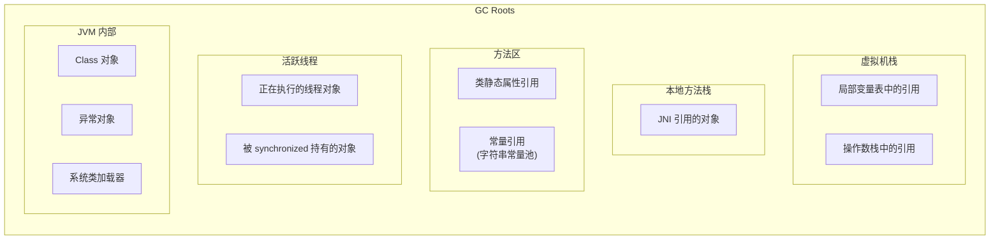
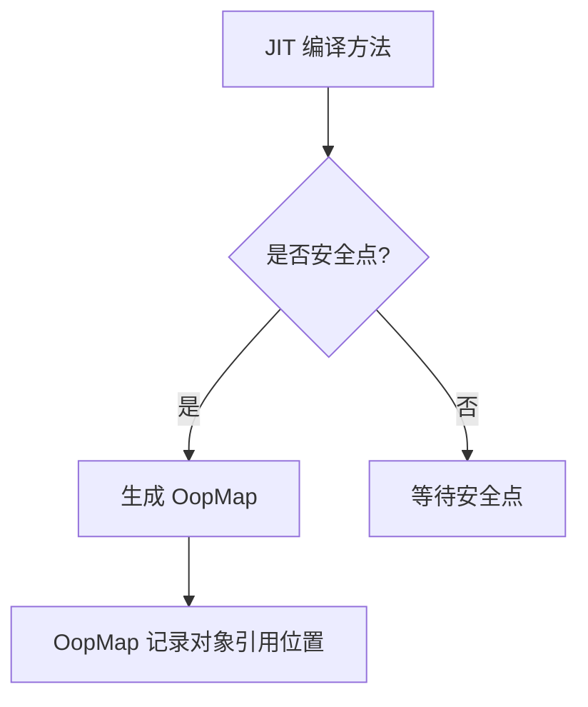
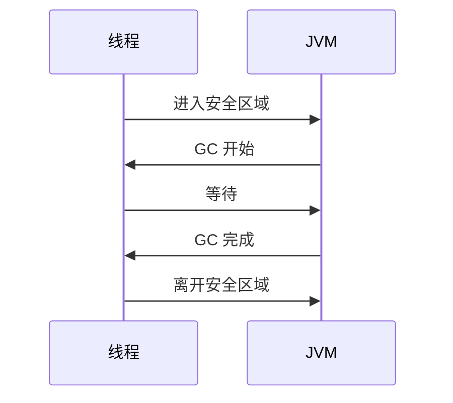
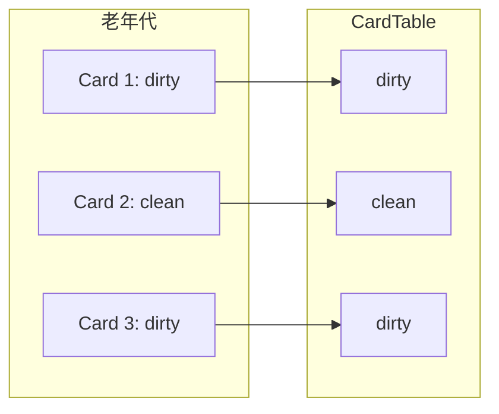

# GC Roots 有哪些

**目标级别**：P5/P6

## 面试官最关心的 3 个问题

1. 哪些对象可以作为 GC Roots？
2. 为什么 GC Roots 不会循环引用？
3. 什么是 OopMap？它如何加速 GC Roots 枚举？

---

## 一、GC Roots 概述

面试官问：「GC Roots 可以是哪些对象？」你说「栈上的变量」——然后面试官追问「为什么字符串常量池里的对象也是 GC Roots？为什么 Class 对象可以作为 GC Roots？」你答不上来。GC Roots 是可达性分析的起点，理解 GC Roots 是理解整个 GC 机制的基础。



---

## 二、GC Roots 详解

### 1. 虚拟机栈中的引用

方法执行时，局部变量表中的对象引用是 GC Roots。

```java
public void process() {
    User user = new User();  // user 是 GC Root
    // ...
}  // user 出栈，不再是 GC Root
```

### 2. 类静态属性引用的对象

静态变量存储在**方法区**，是 GC Roots。

```java
public class Cache {
    static Map<String, User> cache = new HashMap<>();  // cache 是 GC Root
    static User singleton = new User();                // singleton 引用的对象是 GC Root
}
```

:::warning 静态变量的生命周期
静态变量在类加载时创建，直到类被卸载才回收。如果静态变量引用大对象，可能导致内存泄漏。
:::

### 3. 常量引用的对象

字符串常量池中的对象是 GC Roots。

```java
public class StringConstant {
    public static final String CONST = "hello";  // "hello" 在常量池，是 GC Root
    
    public void test() {
        String s = "world";  // "world" 也是 GC Root
    }
}
```

### 4. 本地方法栈中 JNI 引用的对象

JNI 局部引用和全局引用都是 GC Roots。

```java
public class JNIExample {
    // native 方法中的引用是 JNI 引用
    public native void nativeMethod();
}
```

### 5. 活跃线程

正在执行的线程对象是 GC Roots。

```java
public class ThreadDemo {
    public static void main(String[] args) {
        Thread t = new Thread(() -> {
            // 当前线程对象是 GC Root
            while (true) {
                // ...
            }
        });
        t.start();
    }
}
```

### 6. synchronized 持有的对象

被 synchronized 持有的对象是 GC Roots。

```java
public class SyncDemo {
    private static final Object lock = new Object();
    
    public void process() {
        synchronized (lock) {
            // lock 对象是 GC Root
            // ...
        }
    }
}
```

---

## 三、GC Roots 的设计原理

### 为什么 GC Roots 不会循环引用？

GC Roots 是**预定义的根节点集合**，不参与垃圾回收本身：

```mermaid
flowchart LR
    subgraph GC_Roots["GC Roots (外部引用)"]
        ROOT["根节点集合"]
    end
    
    subgraph 对象图
        A["对象 A"]
        B["对象 B"]
        C["对象 C"]
    end
    
    ROOT --> A  # A 被 GC Root 引用
    ROOT --> B  # B 被 GC Root 引用
    A --> C     # A 引用 C
    
    style ROOT fill:#90EE90
```

GC Roots 的引用是**外部引用**，而对象之间的引用是**内部引用**。GC Roots 本身不参与引用计数，所以不会形成循环依赖。

---

## 四、OopMap：加速 GC Roots 枚举

### 为什么需要 OopMap？

枚举 GC Roots 需要扫描所有可能的引用位置。如果每次 GC 都扫描整个栈和堆，开销巨大。

**OopMap（Ordinary Object Pointer Map）** 记录了所有**对象引用的位置**，让 GC 可以快速定位。

```java
// 没有 OopMap：需要扫描整个栈帧
for (StackFrame frame : stack) {
    for (LocalVariable var : frame.locals) {
        if (var.isReference()) {
            // 标记引用对象
        }
    }
}

// 使用 OopMap：直接读取引用位置
for (OopMapEntry entry : oopMap) {
    Object ref = entry.getObject();
    // 直接标记
}
```

### OopMap 的生成时机



| 触发时机 | 说明 |
|----------|------|
| **方法入口** | 方法被 JIT 编译时 |
| **方法出口** | 方法返回前 |
| **循环回边** | 循环体执行前 |
| **异常跳转** | 异常处理跳转前 |

---

## 五、安全点与安全区域

### 安全点（Safe Point）

GC 只在安全点停顿。安全点是代码中能够让 JVM 停顿执行进行 GC 的位置。

```java
public class SafePointDemo {
    public void process() {
        // 安全点：方法返回前
        for (int i = 0; i < 1000; i++) {
            // 安全点：循环回边
            if (i % 100 == 0) {
                // ...
            }
        }
        // 安全点：方法返回
    }
}
```

### 安全区域（Safe Region）

线程处于 sleep 或 blocked 状态时，无法响应 JVM 的安全点请求。安全区域是线程可以安全进入 GC 的代码段。



---

## 六、高频面试题

### 🔴 第一层：GC Roots 有哪些

**问题**：请列举可以作为 GC Roots 的对象。

**标准答案**：

1. **虚拟机栈中的引用**：局部变量表、操作数栈中的对象引用
2. **本地方法栈中的引用**：JNI 局部引用和全局引用
3. **方法区中的引用**：类的静态属性引用的对象
4. **方法区中的常量**：字符串常量池中的对象
5. **活跃线程**：正在执行的线程对象
6. **同步锁对象**：被 synchronized 持有的对象
7. **JVM 内部对象**：Class 对象、异常对象、系统类加载器

> **第二层追问**：为什么字符串常量池可以作为 GC Roots？
>
> 字符串常量池存储字符串字面量，如果这些字符串被回收，可能导致代码中的字符串字面量失效。因此 JVM 保守地将常量池中的对象作为 GC Roots。

> **第三层追问**：为什么静态变量引用的对象是 GC Roots？
>
> 静态变量从类加载到类卸载期间始终存在，其引用的对象在类卸载前不会被回收。如果不将它们作为 GC Roots，可能导致这些对象无法被回收。

---

### 🟡 OopMap 的作用

**问题**：什么是 OopMap？为什么需要它？

**标准答案**：

OopMap 记录了程序执行过程中所有**对象引用的位置**。

**为什么需要**：
1. **快速枚举**：GC 时不需要扫描整个栈，只需读取 OopMap
2. **准确追踪**：记录引用变化，支持增量式 GC

---

### 🟢 安全点的设计

**问题**：为什么 GC 只能在安全点进行？

**标准答案**：

GC 需要枚举 GC Roots，这要求所有线程的执行状态是**一致的**。如果在任意位置停顿，栈上的对象引用可能处于不完整状态，无法准确枚举。

安全点是代码中**已知的、可以安全停顿的位置**（如方法返回前、循环回边），JVM 在这些位置生成 OopMap，支持 GC。

---

## 七、常见错误与陷阱

### ⚠️ 陷阱 1：忘记方法区也是 GC Roots 来源

很多人只知道栈上的引用是 GC Roots，忽略了方法区的类静态属性、常量等。

### ⚠️ 陷阱 2：混淆 GC Roots 和可达对象

GC Roots 是**枚举起点**，不是被枚举的对象。任何被 GC Roots 间接引用的对象都是可达的。

### ⚠️ 陷阱 3：忽略 OopMap 的空间开销

OopMap 需要记录每个方法的引用位置，如果方法过长，OopMap 会占用大量内存。JVM 只在安全点生成 OopMap 来平衡这个问题。

---

## 八、对比总结表

| GC Roots 类型 | 示例 | 生命周期 |
|--------------|------|----------|
| **虚拟机栈引用** | 局部变量 `User u = new User()` | 方法执行期间 |
| **本地方法栈引用** | JNI 局部引用 `NewLocalRef()` | native 方法调用期间 |
| **类静态属性引用** | `static User user` | 类加载到卸载 |
| **字符串常量** | `"hello"` | JVM 运行期间 |
| **活跃线程** | `Thread.currentThread()` | 线程存活期间 |
| **synchronized 对象** | `synchronized(obj)` | 锁持有期间 |

---

## 九、加分回答

### 💡 Card Table 与 GC Roots 枚举优化

对于跨代引用（如老年代引用年轻代），JVM 使用 Card Table 优化：

```bash
# JVM 参数
-XX:+UseCondCardMark  # 减少伪共享
```



Minor GC 时，只需扫描 dirty 的 card，减少扫描范围。

### 💡 Root Marking 的并发问题

如果应用线程在 GC Roots 枚举期间继续运行，可能导致引用关系变化。JVM 通过**安全点**暂停所有线程，确保枚举期间引用关系稳定。

---

## 十、扩展思考

如果一个对象 A 引用对象 B，对象 B 引用对象 A，但两者都不被 GC Roots 引用，它们会被回收吗？

> **答案**：
> 是的，它们会被回收。
>
> 这正是可达性分析的优势。只要 GC Roots 无法到达，即使 A 和 B 互相引用，它们仍然是不可达的。引用计数法无法处理这种情况，但可达性分析可以。
>
> 这种对象被称为**孤岛对象**（Island Objects），它们会在 GC 时被回收。
