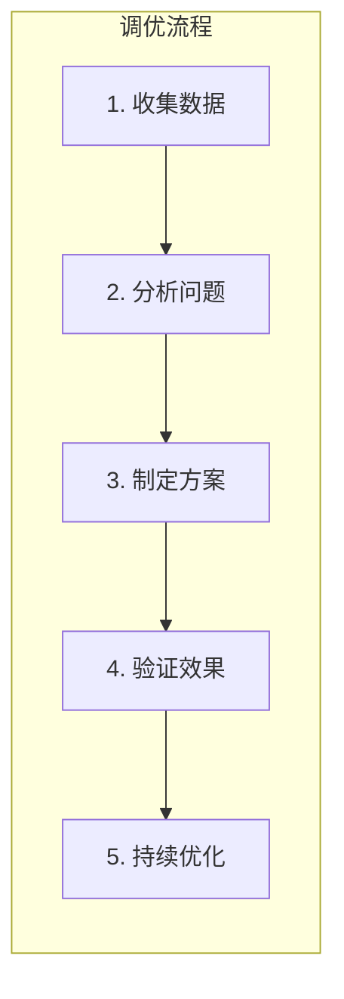
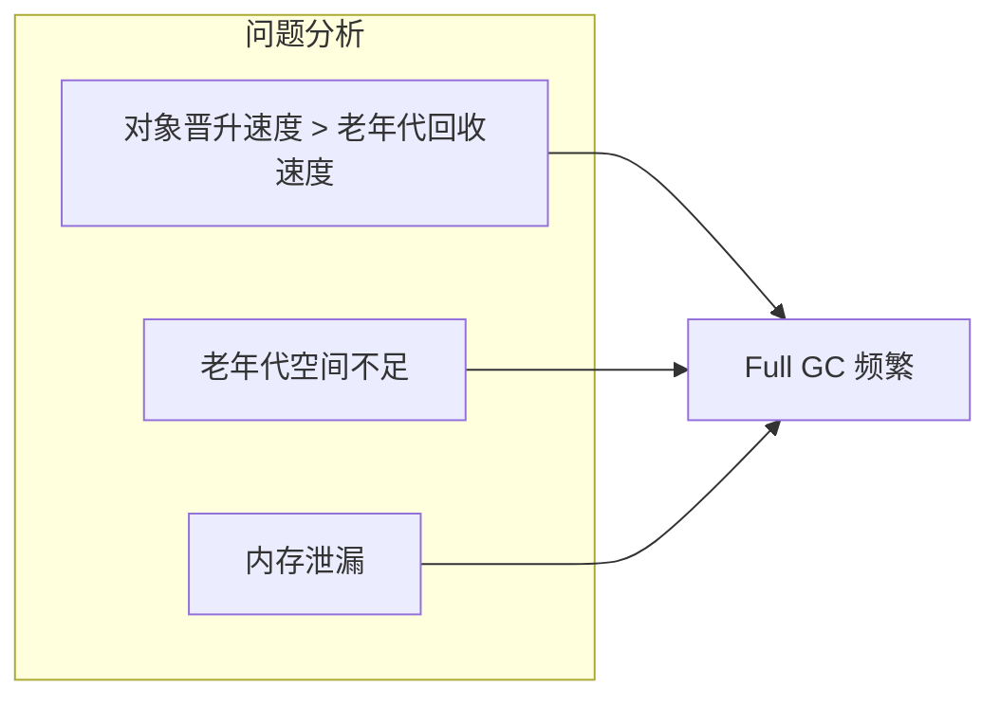
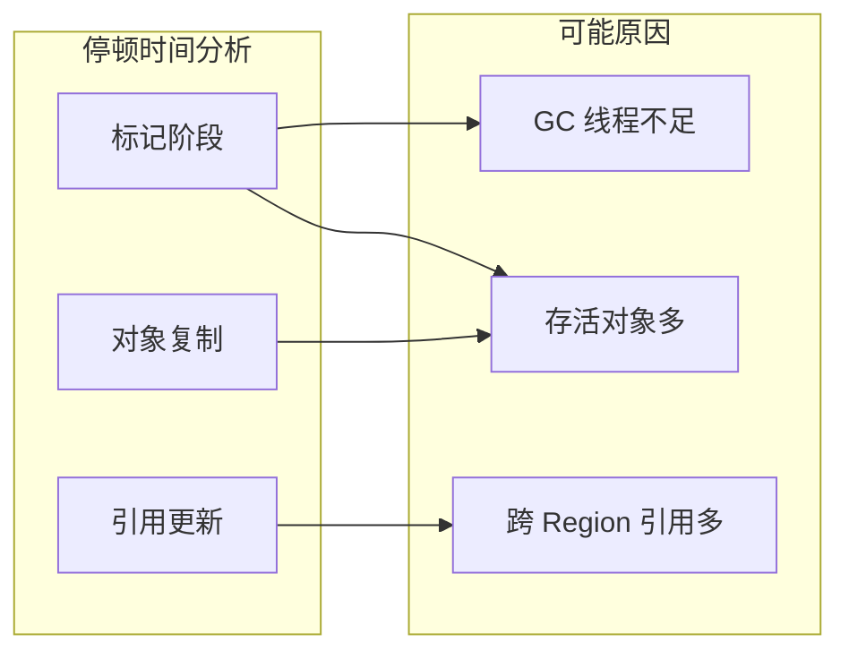

# GC 调优案例

**目标级别**：P6/P7

## 面试官最关心的 3 个问题

1. 常见的 GC 问题有哪些？
2. 如何诊断和解决 GC 问题？
3. 不同场景的 GC 参数应该如何设置？

---

## 一、GC 调优思维

### 调优原则

面试官问：「你的应用 GC 怎么调优？」你说「改参数」——然后面试官追问「为什么这样改？调优的步骤是什么？」你愣住了。GC 调优不是改参数那么简单，需要系统的分析和思考。



### 调优目标

| 目标 | 指标 | 说明 |
|------|------|------|
| **低延迟** | 停顿时间 < 200ms | 用户体验 |
| **高吞吐** | GC 吞吐量 > 95% | 系统效率 |
| **稳定** | 停顿时间波动小 | 可预测性 |

---

## 二、案例一：Minor GC 频繁

### 问题表现

```bash
# GC 日志
[GC (Allocation Failure) [PSYoungGen: 8192K->0K(9216K)] 32768K->28672K(131072K) 0.015s]
# 每秒 10+ 次 Minor GC
```

### 问题分析

| 检查项 | 结果 | 判断 |
|--------|------|------|
| Minor GC 频率 | 每秒 10+ 次 | 异常频繁 |
| Minor GC 耗时 | 15ms | 正常 |
| 年轻代大小 | 32MB | **太小** |
| 对象分配速率 | 高 | 正常业务 |

### 解决方案

```bash
# 增加年轻代大小
-Xms4g -Xmx4g
-XX:NewRatio=2      # 年轻代:老年代 = 1:2
-XX:SurvivorRatio=8 # Eden:Survivor = 8:1

# 或使用 G1
-XX:+UseG1GC
-XX:NewRatio=2
```

### 调优效果

```bash
# 调优后
[GC (Allocation Failure) [PSYoungGen: 65536K->0K(73728K)] 262144K->245760K(4194304K) 0.012s]
# 每秒 1-2 次 Minor GC
```

---

## 二、案例二：Full GC 频繁

### 问题表现

```bash
# GC 日志
[Full GC (Allocation Failure) [PSYoungGen: 32768K->0K(32768K)] 
[ParOldGen: 262144K->262144K(262144K)] 294912K->262144K(294912K) 1.234s]
# 每分钟 5+ 次 Full GC
```

### 问题分析



| 检查项 | 结果 | 判断 |
|--------|------|------|
| 老年代使用量 | 接近 100% | **空间不足** |
| 对象晋升年龄 | 15 | 正常 |
| 元空间使用 | 正常 | 排除 |
| 内存趋势 | 持续增长 | **可能泄漏** |

### 解决方案

```bash
# 方案1: 增加老年代空间
-Xms4g -Xmx4g
-XX:NewRatio=1  # 年轻代:老年代 = 1:1

# 方案2: 分析内存泄漏
-XX:+HeapDumpOnOutOfMemoryError
-XX:HeapDumpPath=/tmp/heap.hprof

# 方案3: 使用 G1
-XX:+UseG1GC
-XX:MaxGCPauseMillis=200
```

---

## 三、案例三：CMS 碎片化

### 问题表现

```bash
# GC 日志
[Full GC (Allocation Failure) 
[CMS: 262144K->131072K(524288K), 2.345s]
# 停顿时间逐渐增加：1s -> 2s -> 3s
```

### 问题分析

| 检查项 | 结果 | 判断 |
|--------|------|------|
| CMS 触发频率 | 正常 | - |
| Full GC 耗时 | 逐渐增加 | **碎片化** |
| 老年代使用量 | 60% | 空间足够 |
| 存活对象大小 | 较小 | - |

### 解决方案

```bash
# 方案1: 增加 Full GC 后整理
-XX:CMSFullGCsBeforeCompaction=3
-XX:+UseCMSCompactAtFullCollection

# 方案2: 迁移到 G1
-XX:+UseG1GC

# 方案3: 迁移到 ZGC
-XX:+UseZGC
```

---

## 四、案例四：GC 停顿时间过长

### 问题表现

```bash
# G1 日志
[GC pause (G1 Evacuation Pause) (young) 
256M->256M(512M) 850.123ms]
# 停顿时间 850ms，远超目标 200ms
```

### 问题分析



### 解决方案

```bash
# 方案1: 调整 G1 参数
-XX:MaxGCPauseMillis=200
-XX:G1HeapRegionSize=4m
-XX:InitiatingHeapOccupancyPercent=45

# 方案2: 增加 GC 线程
-XX:ParallelGCThreads=16
-XX:ConcGCThreads=8

# 方案3: 使用 ZGC
-XX:+UseZGC
-XX:MaxGCPauseMillis=10
```

---

## 五、案例五：ZGC 调优

### 问题表现

```bash
# ZGC 日志
[gc] GC(123) Max Pause: 15.678ms
# 目标 < 10ms，实际 15ms
```

### 解决方案

```bash
# 调整停顿目标
-XX:MaxGCPauseMillis=10

# 增加并发线程
-XX:ConcGCThreads=8

# 调整 GC 间隔
-ZCollectionInterval=30

# 使用分代 ZGC（JDK21+）
-XX:+UseZGC -XX:+ZGenerational
```

---

## 六、高频面试题

### 🔴 第一层：GC 调优步骤

**问题**：GC 调优的一般步骤是什么？

**标准答案**：

1. **收集数据**：开启 GC 日志，运行应用
2. **分析问题**：识别 GC 症状（频繁/耗时/碎片）
3. **确定目标**：低延迟/高吞吐/稳定
4. **制定方案**：选择收集器，调整参数
5. **验证效果**：对比调优前后的 GC 日志
6. **持续优化**：根据业务变化调整

> **第二层追问**：如何判断是否需要 GC 调优？
>
> - GC 频率：Minor GC > 10次/分钟，Full GC > 1次/分钟
> - 停顿时间：超过业务 SLA
> - 吞吐量：< 95%

> **第三层追问**：不同场景的调优策略是什么？
>
> | 场景 | 目标 | 推荐收集器 | 关键参数 |
> |------|------|-----------|----------|
> | Web 服务 | 低延迟 | G1/ZGC | MaxGCPauseMillis |
> | 批处理 | 高吞吐 | Parallel | GCTimeRatio |
> | 大内存 | 低延迟 | ZGC | MaxGCPauseMillis |

---

### 🟡 选择收集器

**问题**：如何选择 GC 收集器？

**标准答案**：

| 场景 | JDK8 | JDK11+ |
|------|------|--------|
| 低延迟 < 100ms | CMS | G1/ZGC |
| 高吞吐 | Parallel | Parallel |
| 大内存 > 64GB | G1 | ZGC |
| 极低延迟 < 10ms | - | ZGC |
| 简单应用 | Serial | G1 |

---

### 🟢 G1 参数调优

**问题**：G1 常用的调优参数有哪些？

**标准答案**：

```bash
# 停顿时间目标
-XX:MaxGCPauseMillis=200

# Region 大小
-XX:G1HeapRegionSize=4m

# 触发混合回收阈值
-XX:InitiatingHeapOccupancyPercent=45

# 每次混合回收的最大 Region 数
-XX:G1MixedGCCountTarget=8

# 预留年轻代空间
-XX:G1ReservePercent=10
```

---

## 七、常见错误与陷阱

### ⚠️ 陷阱 1：盲目调参

没有分析就改参数，可能适得其反。

### ⚠️ 陷阱 2：只看停顿时间

GC 频率和吞吐量同样重要。

### ⚠️ 陷阱 3：忽略业务特征

批处理和实时系统调优策略完全不同。

---

## 八、对比总结表

| 问题 | 症状 | 原因 | 解决方案 |
|------|------|------|----------|
| Minor GC 频繁 | 每秒 10+ 次 | 年轻代太小 | 增大年轻代 |
| Full GC 频繁 | 每分钟 5+ 次 | 老年代不足/泄漏 | 扩容/查泄漏 |
| 停顿时间过长 | > 500ms | 对象多/线程少 | 调整参数/换收集器 |
| CMS 碎片化 | 停顿递增 | 标记清除 | 定期整理/换 G1 |
| 内存持续增长 | 堆使用 > 90% | 内存泄漏 | Dump 分析 |

---

## 九、加分回答

### 💡 阿里面试常问场景

```bash
# 场景: 某接口 RT 抖动
# 原因: Full GC 导致停顿

# 排查:
# 1. GC 日志显示 Full GC 耗时 2s
# 2. 老年代使用量持续 > 90%
# 3. 元空间使用量正常

# 解决:
# -Xms4g -Xmx4g -XX:NewRatio=1 -XX:+UseG1GC
# -XX:MaxGCPauseMillis=100
```

### 💡 GC 调优工具推荐

| 工具 | 用途 |
|------|------|
| **GCViewer** | 本地 GC 日志分析 |
| **GCEasy** | 在线 GC 日志分析 |
| **Arthas** | 运行时 JVM 诊断 |
| **async-profiler** | CPU/内存性能分析 |

---

## 十、扩展思考

如果 GC 调优无法解决问题，应该怎么办？

> **答案**：
>
> GC 调优是最后的手段，之前应该：
>
> 1. **代码层面**：减少对象创建、使用对象池、避免大对象
> 2. **架构层面**：缓存、异步、拆分服务
> 3. **数据层面**：分页、限制查询范围
> 4. **基础设施**：扩容、增加内存、升级 JDK
>
> 真正的优化在于代码和架构，GC 调优只是缓解手段。
