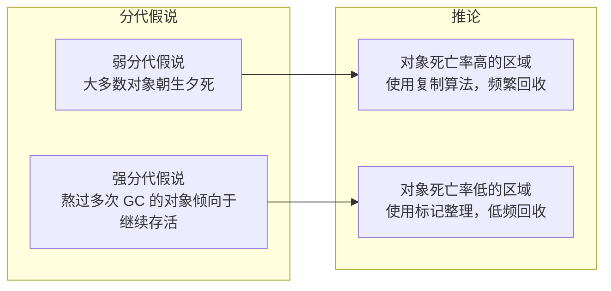
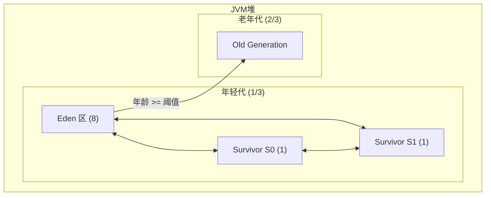
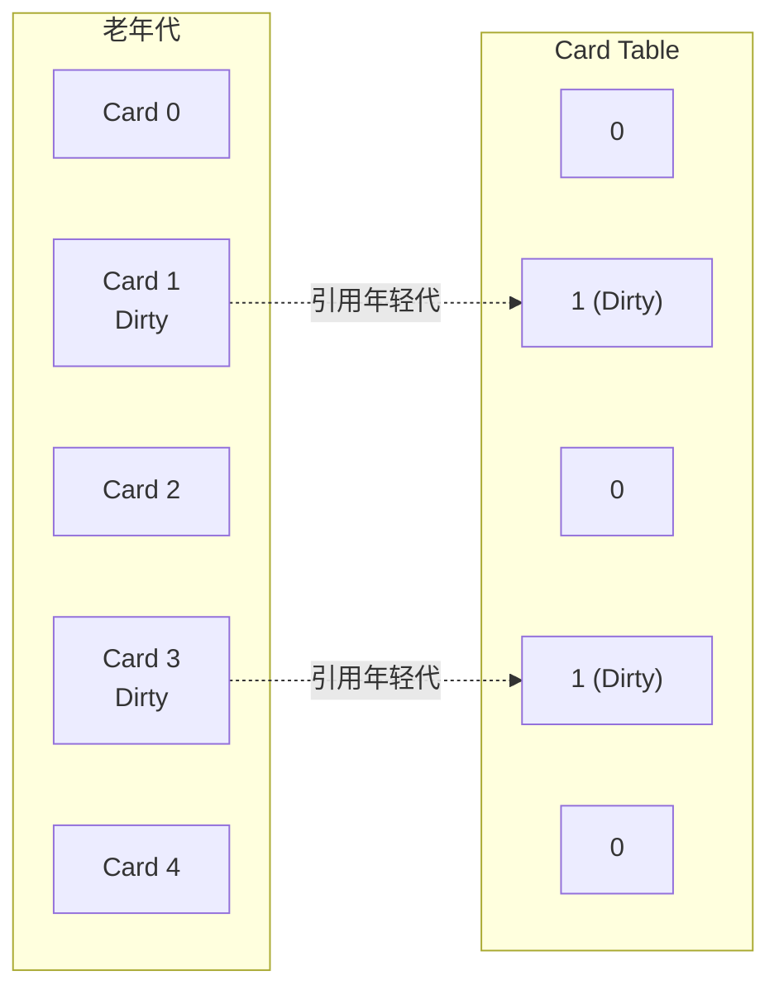

# 分代收集理论

**目标级别**：P5/P6

## 面试官最关心的 3 个问题

1. JVM 分代的理论依据是什么？
2. 为什么需要 Card Table？它解决什么问题？
3. 如何根据业务场景调整分代参数？

---

## 一、分代收集理论基础

面试官问：「为什么 JVM 要分代？」你说「为了提高 GC 效率」——然后面试官追问「具体是怎么提高的？有没有数据支撑？」你愣住了。分代收集不是拍脑袋的设计，而是基于大量实践验证的理论。

### 两个核心假设



### 实际数据支撑

研究表明，典型应用中的对象生命周期分布：

| 存活时间 | 对象占比 | GC 策略 |
|----------|----------|---------|
| 创建后立即死亡 | ~60% | 在 Eden 区回收 |
| 存活 1~2 次 Minor GC | ~25% | Survivor 区过滤 |
| 存活多次后死亡 | ~10% | 正常晋升老年代 |
| 长期存活 | ~5% | 老年代长期保留 |

---

## 二、分代划分与 GC 策略

### 内存布局



### 各代 GC 策略

| 区域 | 大小比例 | 算法 | GC 频率 | 对象来源 |
|------|----------|------|---------|----------|
| **Eden** | 8/10 | - | 每隔几秒 | 新对象 |
| **Survivor** | 1/10 × 2 | 复制 | 同 Eden | Eden/Survivor 存活 |
| **老年代** | 2/3 | 标记整理 | 几十秒~分钟 | Survivor 晋升 |

---

## 三、跨代引用问题

### 跨代引用的挑战

Minor GC 时，需要知道哪些老年代对象引用了年轻代对象。如果遍历整个老年代，开销巨大。

```mermaid
flowchart LR
    subgraph 老年代
        O["Old Generation<br/>[大量对象]"]
    end
    
    subgraph 年轻代
        E["Eden"]
        S["Survivor"]
    end
    
    O -->|跨代引用| E  # 年龄增加
    
    Note over O: 扫描整个老年代？
```

### Card Table 解决方案

Card Table 将老年代划分为固定大小的**卡片**（Card），每个卡片 512 字节。



### Dirty Card 的作用

```java
// 当老年代对象修改引用时，对应 Card 标记为 Dirty
class CardTable {
    byte[] cardTable;
    
    // 写屏障触发
    void cardWrite(long addr) {
        int index = (int) (addr >> 9);  // 512 字节对齐
        cardTable[index] = DIRTY;
    }
}

// Minor GC 时，只扫描 Dirty Card
void minorGC() {
    // 扫描所有 GC Roots
    for (Object obj : gcRoots) {
        scanObject(obj);
    }
    
    // 扫描 Dirty Cards
    for (int i = 0; i < cardTable.length; i++) {
        if (cardTable[i] == DIRTY) {
            scanCard(i);
        }
    }
}
```

---

## 四、分代参数配置

### 核心参数

```bash
# 年轻代 : 老年代 = 1 : 2（默认）
-XX:NewRatio=2

# Eden : Survivor = 8 : 1 : 1（默认）
-XX:SurvivorRatio=8

# 年龄阈值（默认 15）
-XX:MaxTenuringThreshold=15

# 大对象直接进入老年代（默认 0，表示禁用）
-XX:PretenureSizeThreshold=1048576

# Survivor 区动态计算（默认启用）
-XX:+UseAdaptiveSizePolicy
```

### 场景化配置

```bash
# 场景1：低延迟应用（如 RPC）
-XX:NewRatio=1           # 年轻代 : 老年代 = 1 : 1
-XX:SurvivorRatio=4      # 减少 Survivor 复制开销
-XX:MaxGCPauseMillis=50  # 目标停顿时间

# 场景2：高吞吐量应用（如批处理）
-XX:NewRatio=3           # 老年代更大，减少 GC 频率
-XX:+UseParallelGC       # Parallel GC 提高吞吐量

# 场景3：大内存应用（如缓存服务器）
-XX:NewRatio=4            # 年轻代更小，减少 Minor GC 开销
-XX:MetaspaceSize=512m   # 合理设置元空间
```

---

## 五、高频面试题

### 🔴 第一层：分代收集的理论依据

**问题**：JVM 分代的理论依据是什么？为什么分代能提高 GC 效率？

**标准答案**：

分代收集基于两个假设：

1. **弱分代假说**：大多数对象朝生夕死，创建后很快变得不可达
2. **强分代假说**：熬过多次 GC 的对象倾向于继续存活

**为什么能提高效率**：

| 策略 | 效果 |
|------|------|
| 年轻代高频回收 | 快速回收大量死亡对象 |
| 老年代低频回收 | 减少老年代扫描开销 |
| 复制算法用于年轻代 | 简单高效，适合高死亡率场景 |
| 标记整理用于老年代 | 无碎片，空间利用率高 |

> **第二层追问**：如果分代假设不成立会怎样？
>
> 如果大部分对象存活时间很长，年轻代的复制算法效率会降低，大量对象进入老年代，导致 Full GC 频繁。这是典型的 GC 调优场景。

> **第三层追问**：G1 为什么打破分代？
>
> G1 使用 Region 概念，不再严格区分年轻代和老年代。所有 Region 统一管理，通过设置停顿时间目标来平衡回收时间。

---

### 🟡 Card Table 的作用

**问题**：什么是 Card Table？它解决什么问题？

**标准答案**：

Card Table 是 JVM 用来记录**老年代对年轻代引用**的数据结构。

**解决的问题**：
- Minor GC 时，不需要扫描整个老年代
- 只需扫描 Dirty Card（标记了跨代引用的卡片）
- 将 O(n) 的扫描复杂度降低到 O(Dirty Card 数)

---

### 🟢 分配担保机制

**问题**：什么是分配担保？为什么需要它？

**标准答案**：

分配担保（Handle Promotion）是指当 Survivor 区无法容纳存活对象时，对象直接进入老年代。

```java
// 分配担保逻辑
if (survivorSpace.size() < objectSize) {
    // Survivor 不够，尝试晋升到老年代
    if (oldSpace.size() > objectSize) {
        promoteToOld(object);
    } else {
        // 老年代也不够，触发 Full GC
        fullGC();
    }
}
```

---

## 六、常见错误与陷阱

### ⚠️ 陷阱 1：NewRatio 设置不当

NewRatio 太小（年轻代太大）：老年代偏小，容易 Full GC
NewRatio 太大（年轻代太小）：对象容易直接进入老年代，Minor GC 频繁

### ⚠️ 陷阱 2：忽略 Survivor 比例

SurvivorRatio 决定年轻代中 Eden 和 Survivor 的比例。Survivor 太小会导致对象过早晋升老年代，Survivor 太大则浪费空间。

### ⚠️ 陷阱 3：UseAdaptiveSizePolicy 的不确定性

开启自适应大小策略后，JVM 会动态调整各代大小，可能导致 GC 行为不可预测。在生产环境中通常关闭或固定参数。

---

## 七、对比总结表

| 参数 | 默认值 | 含义 | 调优建议 |
|------|--------|------|----------|
| `-XX:NewRatio` | 2 | 年轻代:老年代 = 1:2 | 延迟敏感设为 1，吞吐设为 3-4 |
| `-XX:SurvivorRatio` | 8 | Eden:Survivor = 8:1 | 对象大时减小，死亡率低时增大 |
| `-XX:MaxTenuringThreshold` | 15 | 晋升年龄阈值 | CMS 建议 6，其他场景默认 |
| `-XX:PretenureSizeThreshold` | 0 | 大对象阈值 | 设为单个 Survivor 大小的 50%-80% |

---

## 八、加分回答

### 💡 ZGC 和 G1 的分代策略

ZGC 和 G1 不再严格分代，采用**动态分区**策略：

- **G1**：将堆分为多个大小相等的 Region，动态调整年轻代/老年代比例
- **ZGC**：将堆分为多个大小不等的 Page，支持并发颜色位标记

```bash
# G1 参数
-XX:MaxGCPauseMillis=200     # 目标停顿时间
-XX:G1HeapRegionSize=4m       # Region 大小
-XX:InitiatingHeapOccupancyPercent=45  # 触发 Mixed GC 阈值

# ZGC 参数（JDK11+）
-XX:+UseZGC
-XX:MaxGCPauseMillis=10       # 亚毫秒级停顿
-XX:ZCollectionInterval=600   # GC 间隔
```

### 💡 对象年龄的动态计算

Survivor 区的存活对象年龄不一定线性增长。当 Survivor 区相同年龄对象大小之和 > Survivor 一半时，年龄 >= 该年龄的对象直接晋升。

```java
// 动态年龄判断
if (sumOfAge >= survivorSpace.size() / 2) {
    // 该年龄及以上的对象晋升老年代
    promote(age);
}
```

---

## 九、扩展思考

如果应用的对象都是长期存活对象（如缓存），分代收集是否仍然有效？

> **答案**：
> 分代收集的效果会大打折扣：
> - 年轻代对象存活率高，复制算法效率低
> - 对象大量进入老年代，Full GC 频繁
> - 建议方案：
>   1. 调整 NewRatio，增大年轻代比例
>   2. 使用 G1/ZGC，通过停顿时间目标控制
>   3. 考虑堆外缓存（如 Redis）替代 JVM 缓存
