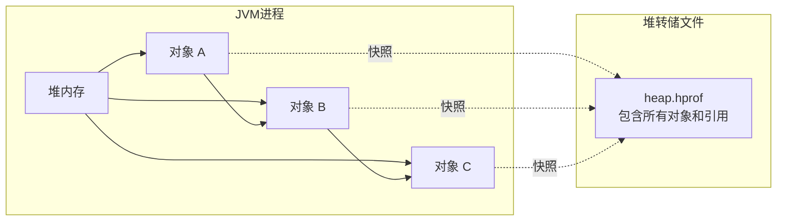
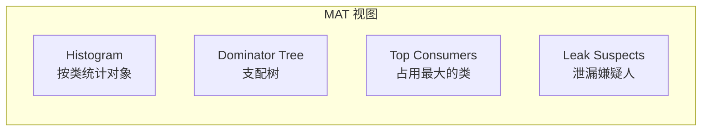
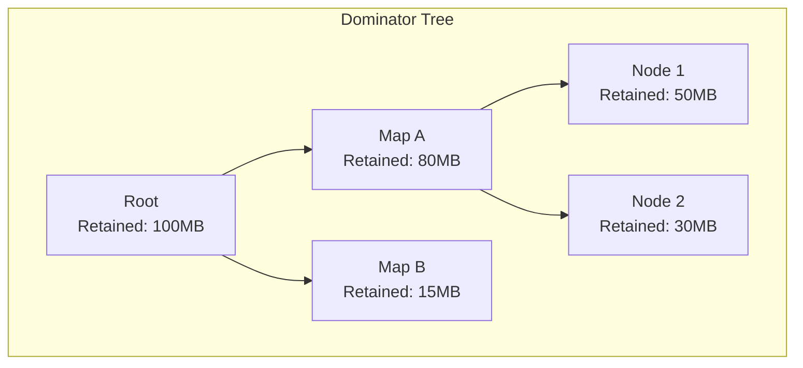
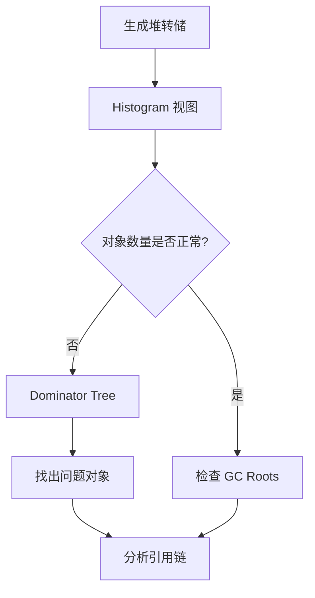

# 堆转储分析

**目标级别**：P6/P7

## 面试官最关心的 3 个问题

1. 如何生成堆转储文件？
2. 如何使用 MAT 分析堆转储？
3. 如何定位内存泄漏？

---

## 一、堆转储概述

面试官问：「你用过 MAT 吗？它是怎么分析内存的？」你说「用过」——然后面试官追问「Dominator Tree 和 Shallow Heap 是什么？」你愣住了。堆转储分析是定位内存问题的核心技术。

### 什么是堆转储

堆转储（Heap Dump）是 JVM 堆内存的快照，包含所有对象的引用关系。



---

## 二、生成堆转储

### 1. OOM 时自动生成

```bash
# JVM 参数
-XX:+HeapDumpOnOutOfMemoryError
-XX:HeapDumpPath=/var/log/java/heap.hprof
```

### 2. jmap 生成

```bash
# 生成堆转储
jmap -dump:format=b,file=/tmp/heap.hprof <pid>

# format=b: 二进制格式
# file: 输出文件路径
# pid: 进程 ID
```

### 3. jcmd 生成

```bash
# JDK11+ 推荐使用 jcmd
jcmd <pid> GC.heap_dump /tmp/heap.hprof
```

### 4. Arthas 在线生成

```bash
# Arthas 命令
heapdump /tmp/heap.hprof

# 也可以生成带参考的转储
heapdump --live /tmp/heap_live.hprof
```

---

## 三、MAT 使用指南

### 1. 下载和安装

```bash
# 下载地址
https://eclipse.org/mat/downloads.php

# 解压后运行
./MemoryAnalyzer
```

### 2. 核心视图



### 3. Histogram 视图

按类分组统计对象数量和内存占用：

| 列 | 说明 |
|----|------|
| **Class Name** | 类名 |
| **Objects** | 对象数量 |
| **Shallow Heap** | 对象自身内存 |
| **Retained Heap** | 对象及引用对象总内存 |

```bash
# Histogram 示例
Class Name                  | Objects | Shallow Heap | Retained Heap
--------------------------|---------|--------------|---------------
java.lang.String           |  12345  |    493,800   |   15,234,567
java.util.HashMap$Node     |  34567  |    829,608   |   12,345,678
com.example.User           |   4567  |    365,360   |   8,765,432
```

### 4. Dominator Tree 视图

展示对象间的支配关系：



**支配关系**：如果对象 A 持有的引用能阻止对象 B 被回收，则 A 支配 B。

### 5. Shallow Heap vs Retained Heap

| 类型 | 说明 | 计算方式 |
|------|------|----------|
| **Shallow Heap** | 对象自身占用的内存 | 对象头 + 实例字段 |
| **Retained Heap** | 对象 + 引用对象总内存 | Shallow Heap + GC 可回收的对象 |

---

## 四、内存泄漏分析

### 分析步骤



### 典型泄漏模式

```java
// 模式1: 静态集合持有对象引用
public class Leak1 {
    static List<Object> cache = new ArrayList<>();  // 静态集合
}

// 模式2: 监听器未注销
public class Leak2 {
    public void register() {
        service.addListener(listener);  // 未注销
    }
}

// 模式3: 缓存未设置过期
public class Leak3 {
    static Map<String, Object> cache = new WeakHashMap<>();  // 应使用 WeakHashMap
}
```

---

## 五、VisualVM 使用

### 功能特点

| 功能 | 说明 |
|------|------|
| **CPU 分析** | 方法执行时间 |
| **内存分析** | 堆转储分析 |
| **线程分析** | 线程状态 |
| **采样** | 采样分析 |

### 生成堆转储

```bash
# VisualVM 中
# 1. 选择进程
# 2. 右键 -> Heap Dump
# 3. 保存为 .hprof 文件
```

### OQL 查询

```sql
-- 查询大字符串
SELECT * FROM java.lang.String 
WHERE length() > 1000

-- 查询特定类型的对象
SELECT * FROM com.example.User

-- 查询集合
SELECT * FROM java.util.HashMap WHERE size() > 100
```

---

## 六、Arthas 使用

### 常用命令

```bash
# 查看内存
dashboard

# 生成堆转储
heapdump /tmp/heap.hprof

# 查看对象
ognl '@com.example.Cache@map.size()'

# 查看类加载器
sc -d com.example.User

# 反编译类
jad com.example.User
```

### 在线分析

```bash
# 使用 Arthas 分析
$ ognl '@java.lang.System@getProperty("java.version")'
"1.8.0_271"

$ heapdump --live /tmp/heap_live.hprof
Dumping heap to /tmp/heap_live.hprof...
```

---

## 七、高频面试题

### 🔴 第一层：如何生成和分析堆转储

**问题**：如何生成堆转储文件？如何分析内存泄漏？

**标准答案**：

**生成方式**：

```bash
# OOM 时自动生成
-XX:+HeapDumpOnOutOfMemoryError

# jmap 生成
jmap -dump:format=b,file=/tmp/heap.hprof <pid>
```

**分析步骤**：

1. **Histogram**：按类统计对象数量，找出异常类
2. **Dominator Tree**：找出占用内存最大的对象
3. **Path to GC Roots**：分析引用链，找出泄漏点

> **第二层追问**：Shallow Heap 和 Retained Heap 的区别？
>
> Shallow Heap 是对象自身占用的内存；Retained Heap 是对象及其引用对象占用的总内存。

> **第三层追问**：如何定位内存泄漏？
>
> 1. 生成多个堆转储文件
> 2. 对比对象数量变化
> 3. 找出持续增长的对象
> 4. 分析 GC Root 引用链

---

### 🟡 MAT 分析技巧

**问题**：MAT 有哪些常用的分析功能？

**标准答案**：

| 功能 | 说明 |
|------|------|
| **Histogram** | 按类统计对象数量和内存 |
| **Dominator Tree** | 支配树，找出占用内存最大的对象 |
| **Top Consumers** | 占用内存最大的类 |
| **Leak Suspects** | 自动分析可能的泄漏点 |
| **Path to GC Roots** | 到 GC Roots 的引用路径 |

---

### 🟢 OQL 查询

**问题**：什么是 OQL？如何使用？

**标准答案**：

OQL（Object Query Language）是 MAT 提供的对象查询语言：

```sql
-- 查询所有 HashMap
SELECT * FROM java.util.HashMap

-- 查询大集合
SELECT * FROM java.util.HashMap WHERE size() > 1000

-- 查询特定包的对象
SELECT * FROM "com.example.*"

-- 查询字符串
SELECT s.value.toString() FROM java.lang.String s WHERE s.count > 100
```

---

## 八、常见错误与陷阱

### ⚠️ 陷阱 1：只分析 Shallow Heap

Retained Heap 才是真正需要关注的，它包含了对象及其引用对象的总内存。

### ⚠️ 陷阱 2：忽略 ClassLoader

如果类加载器无法回收，即使类对象很小，也可能导致元空间泄漏。

### ⚠️ 陷阱 3：只分析一个堆转储

应该生成多个堆转储，对比对象数量变化，才能发现泄漏趋势。

---

## 九、对比总结表

| 工具 | 特点 | 适用场景 |
|------|------|----------|
| **MAT** | 功能强大，免费 | 离线分析 |
| **VisualVM** | JDK 自带，图形界面 | 快速分析 |
| **Arthas** | 在线诊断，命令行 | 生产环境 |
| **JProfiler** | 商业软件，功能全面 | 专业分析 |

---

## 十、加分回答

### 💡 内存泄漏排查实战

```java
// 场景: 缓存未清理导致内存泄漏
public class CacheDemo {
    static Map<String, User> cache = new HashMap<>();
    
    public static void main(String[] args) {
        while (true) {
            String key = UUID.randomUUID().toString();
            cache.put(key, new User());
            // cache 无限增长
        }
    }
}
```

**MAT 分析流程**：

1. 生成堆转储
2. Histogram 视图：发现 HashMap$Node 数量异常
3. Dominator Tree：找出 cache 对象占用内存大
4. Path to GC Roots：发现是静态变量，无法回收

**解决方案**：

```java
// 方案1: 使用 WeakHashMap
static Map<String, User> cache = new WeakHashMap<>();

// 方案2: 添加过期机制
static Map<String, User> cache = new LRUCache<>(1000);
```

### 💡 循环引用问题

```java
// 循环引用示例
class Node {
    Node next;
}

Node a = new Node();
Node b = new Node();
a.next = b;
b.next = a;

// MAT 分析：虽然 a 和 b 循环引用
// 但如果没有外部引用，两者都是不可达的
// 可达性分析能正确处理
```

---

## 十一、扩展思考

如果堆转储文件很大，MAT 分析很慢怎么办？

> **答案**：
>
> 1. **使用压缩格式**：`.gz` 压缩可达 10 倍
> 2. **只分析活跃对象**：`--live` 参数
> 3. **使用命令行工具**：`jhat`（已废弃）或 `jvmtop`
> 4. **分区分析**：只分析特定范围的堆
> 5. **升级硬件**：更多内存更快分析
