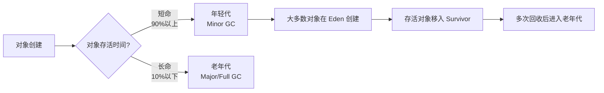
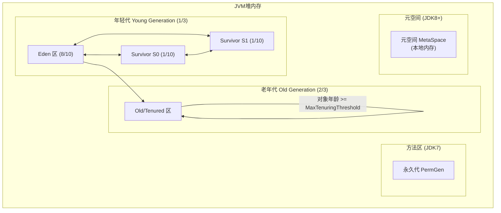
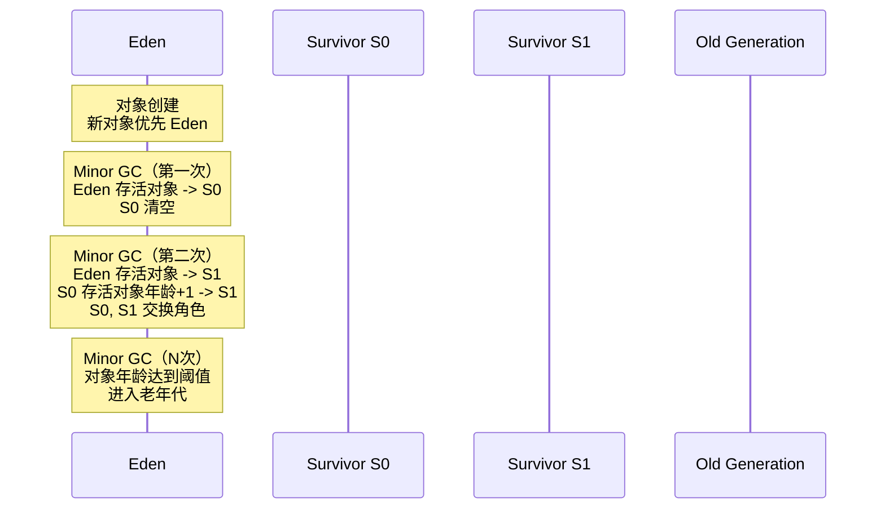

# 堆内存分代结构

**目标级别**：P5/P6

## 面试官最关心的 3 个问题

1. 为什么要分代？年轻代和老年代的比例是多少？
2. 对象在年轻代中的流转过程是什么？
3. 什么时候对象会进入老年代？

---

## 一、分代收集理论

面试官问：「为什么 JVM 要分年轻代和老年代？」你说「因为这样 GC 效率更高」——然后面试官追问「具体高在哪里？有没有数据支撑？」你答不上来。很多人知道分代，但不知道分代背后的设计哲学。

JVM 的分代收集理论基于一个核心假设：**大多数对象都是短命的**。



### 分代假设的数据支撑

研究表明：

- **大量对象创建后很快变得不可达**：如循环中的临时对象、方法的局部变量
- **存活时间符合幂律分布**：少数对象长期存活，大部分对象朝生夕死
- **GC 频率与存活时间成正比**：短命对象应该被频繁回收，但回收成本低

---

## 二、堆内存结构详解



### 年轻代内部结构

| 区域 | 占比（默认） | 作用 |
|------|--------------|------|
| **Eden** | 8/10 | 新对象创建区域 |
| **Survivor S0** | 1/10 | From Survivor |
| **Survivor S1** | 1/10 | To Survivor |

### 默认比例（JDK8）

```java
// 年轻代 : 老年代 = 1 : 2（默认）
// 即年轻代占堆的 1/3，老年代占 2/3

// Survivor 比例：Eden : S0 : S1 = 8 : 1 : 1
// -XX:NewRatio=2          设置年轻代:老年代比例
// -XX:SurvivorRatio=8     设置 Eden:Survivor 比例
```

---

## 三、对象在年轻代的流转

### 对象流转生命周期



### 详细流转步骤

```java
public class ObjectLifecycle {
    public static void main(String[] args) {
        // 步骤1: 对象在 Eden 创建
        User user = new User();  // 优先在 Eden 分配
        
        // 步骤2: 如果方法执行完毕，局部变量出栈
        // user 引用消失，对象变得不可达
        
        // 步骤3: Minor GC 时，Eden 中不可达对象被回收
        // 存活对象（user 仍被引用）移入 Survivor S0
        process(user);
    }
    
    static void process(User user) {
        // 步骤4: 多次 Minor GC 后，对象年龄增加
        // 年龄达到 MaxTenuringThreshold（默认15），进入老年代
    }
}
```

### Survivor 的作用

Survivor 区是**年轻代回收（Minor GC）幸存者的暂存区**，解决了 Minor GC 后直接进入老年代导致老年代快速填满的问题。

| 场景 | 无 Survivor | 有 Survivor |
|------|-------------|-------------|
| Minor GC 存活对象 | 直接进入老年代 | 暂存 Survivor，达到年龄再进入老年代 |
| 短命对象 | 频繁进入老年代 | 在 Survivor 区被过滤 |
| 老年代压力 | 快速增长 | 增长平缓 |

### 年龄阈值（MaxTenuringThreshold）

```bash
# 年龄阈值范围：1~15（JDK8）
# -XX:MaxTenuringThreshold=15

# 对象年龄计算规则
# 1. 经历一次 Minor GC，年龄 +1
# 2. 年龄达到阈值后，移入老年代
# 3. Survivor 区空间不足时，提前进入老年代
```

---

## 四、对象何时进入老年代

| 进入老年代的条件 | 说明 |
|-----------------|------|
| **年龄达到阈值** | `age >= MaxTenuringThreshold`（默认15岁，CMS 是6岁） |
| **Survivor 空间不足** | Survivor 相同年龄所有对象大小之和 > Survivor 一半 |
| **大对象直接分配** | `-XX:PretenureSizeThreshold` 设置，直接在老年代分配 |
| **动态年龄判断** | 如果 Survivor 区相同年龄对象大小之和 > Survivor 一半 |

```java
// 大对象示例 - 直接进入老年代
// -XX:PretenureSizeThreshold=1048576 (1MB)
byte[] largeArray = new byte[2 * 1024 * 1024]; // 2MB，超过阈值
// 直接在老年代分配，跳过年轻代
```

---

## 五、高频面试题

### 🔴 第一层：年轻代和老年代的比例

**问题**：JVM 堆的年轻代和老年代比例是多少？

**标准答案**：

默认情况下，年轻代占堆内存的 **1/3**，老年代占 **2/3**。

- `-XX:NewRatio=2` 表示年轻代 : 老年代 = 1 : 2
- 年轻代内部，Eden : Survivor = 8 : 2（两个 Survivor 各占 1/10）

> **第二层追问**：为什么要这样分配？
>
> 基于分代假设：大多数对象是短命的。如果年轻代太小，大部分对象还没死就被移到老年代，增加 Major GC 压力。

> **第三层追问**：如何调整这个比例？
>
> `-XX:NewRatio=3`（年轻代:老年代=1:3）、`-XX:SurvivorRatio=6`（Eden:Survivor=6:4）

---

### 🔴 对象在年轻代的流转过程

**问题**：请描述对象在年轻代的流转过程。

**标准答案**：

1. 新对象在 **Eden 区** 分配内存
2. Eden 区满时触发 **Minor GC**
3. Eden 和 Survivor From 中的存活对象复制到 **Survivor To**
4. 对象年龄 +1，Survivor From 清空
5. **交换 Survivor From 和 Survivor To**（角色互换）
6. 重复步骤 2-5，当对象年龄达到 **MaxTenuringThreshold**（默认15）时，复制到**老年代**
7. 老年代满时触发 **Major GC** 或 **Full GC**

---

### 🟡 对象何时进入老年代？

**问题**：什么情况下对象会直接进入老年代？

**标准答案**：

1. **大对象**：超过 `-XX:PretenureSizeThreshold` 阈值的对象
2. **年龄达标**：Survivor 区中相同年龄所有对象大小之和 > Survivor 一半时，年龄 >= 该年龄的对象
3. **空间担保失败**：Minor GC 时 Survivor 空间不足，对象直接进入老年代

---

## 六、常见错误与陷阱

### ⚠️ 陷阱 1：认为 Survivor 区是多余的

有些人认为直接让存活对象进入老年代更简单。但 Survivor 区的作用是**过滤短命对象**，避免它们污染老年代，延长 Full GC 间隔。

### ⚠️ 陷阱 2：年龄阈值越大越好

如果阈值设置过大，年轻代对象迟迟无法进入老年代，可能导致 Survivor 区溢出。相反，阈值过小会导致大量短命对象过早进入老年代。

### ⚠️ 陷阱 3：忽略动态年龄判断

即使年龄未达阈值，如果 Survivor 区相同年龄对象大小之和 > Survivor 一半，对象也会提前进入老年代。这是 JVM 的动态适应机制。

---

## 七、对比总结表

| 维度 | 年轻代 | 老年代 |
|------|--------|--------|
| **默认比例** | 堆的 1/3 | 堆的 2/3 |
| **GC 类型** | Minor GC | Major GC / Full GC |
| **GC 频率** | 高（通常几秒~几十秒） | 低（通常几十秒~几分钟） |
| **对象来源** | 新创建的对象 | 长期存活的对象 |
| **回收算法** | 复制算法 | 标记-清除 / 标记-整理 |
| **停顿时间** | 短（STW 几十毫秒） | 长（STW 几百毫秒~几秒） |

---

## 八、GC 日志中的分代信息

```bash
# GC 日志解读
[GC (Allocation Failure) [DefNew: 65536K->0K(65536K)] 65536K->65536K(196608K) 0.046s]
#           分代       年轻代 GC 前->GC 后(年轻代总大小) 堆 GC 前->GC 后(堆总大小) 耗时

[Full GC (Metadata GC Threshold) [CMS: 131072K->131072K(262144K)] 196608K->131072K(262144K) 0.102s]
#            分代                                          堆 GC 前->GC 后(堆总大小) 耗时
```

| 关键字 | 含义 |
|--------|------|
| `DefNew` | Serial 收集器的年轻代 |
| `ParNew` | ParNew 收集器的年轻代 |
| `PSYoungGen` | Parallel Scavenge 的年轻代 |
| `CMS` | CMS 收集器的老年代 |
| `Allocation Failure` | Eden 区分配失败，触发 Minor GC |

---

## 九、加分回答

### 💡 为什么 Survivor 比例是 1:1？

Eden 区对象的存活率通常很低（`<` 10%），所以 Survivor 不需要和 Eden 等大。两个 Survivor 轮流使用，1/10 的比例是经验值，平衡了空间和复制成本。

### 💡 ZGC 和 G1 的分代策略

ZGC 和 G1 不再严格区分年轻代和老年代，采用**分区（Region）**概念：

- G1 将堆划分为多个大小相等的 Region
- ZGC 将堆划分为多个大小不等的 Region
- 对象分配和回收都基于 Region，而非固定的分代

这种设计让 GC 可以**并发执行**，避免 Full GC 的长时间停顿。
