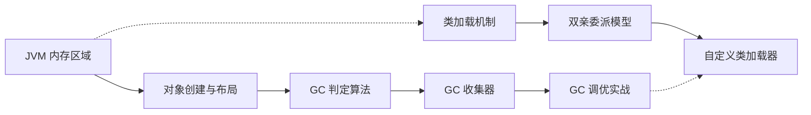

# JVM 核心面试题 30 道

**目标级别**：P5/P6/P7

---

面试官问：「JVM 调优怎么做？」你脱口而出「改 Xmx」——然后面试官紧接着追问「那 CMS 和 G1 的区别是什么？为什么阿里规范建议 G1 作为默认收集器？」你沉默了。这道题 10 个面试者里有 8 个答不完整，但它其实是 Java 面试里性价比最高的题目之一。

本文档涵盖 JVM 核心面试题 30 道，分为六大模块：

## 快速导航

| 模块 | 题数 | 核心内容 |
|------|------|----------|
| **内存区域** | 6 题 | 运行时数据区、堆分代、对象布局、栈帧、逃逸分析 |
| **GC 判定与算法** | 5 题 | GC Roots、四种引用、垃圾回收算法、分代收集理论 |
| **GC 收集器** | 10 题 | Serial/Parallel、CMS、G1、ZGC、Shenandoah |
| **类加载机制** | 4 题 | 类加载过程、双亲委派、打破场景、自定义类加载器 |
| **调优与排查** | 3 题 | GC 日志解读、GC 调优案例、OOM 排查、堆转储分析 |
| **综合应用** | 2 题 | JVM 参数配置、内存模型与性能优化 |

## 模块一：内存区域

| 题号 | 题目 | 频率 |
|------|------|------|
| 1 | JVM 运行时数据区 | 🔴 高频 |
| 2 | 堆内存分代结构 | 🔴 高频 |
| 3 | 栈帧结构 | 🟡 中频 |
| 4 | 程序计数器作用 | 🟢 低频 |
| 5 | 方法区与元空间 | 🔴 高频 |
| 6 | 对象内存布局 | 🔴 高频 |
| 7 | 对象创建流程 | 🔴 高频 |
| 8 | 逃逸分析与栈上分配 | 🟡 中频 |

## 模块二：GC 判定与算法

| 题号 | 题目 | 频率 |
|------|------|------|
| 9 | 可达性分析算法 | 🔴 高频 |
| 10 | GC Roots 有哪些 | 🔴 高频 |
| 11 | 四种引用类型 | 🔴 高频 |
| 12 | 垃圾回收算法 | 🔴 高频 |
| 13 | 分代收集理论 | 🔴 高频 |

## 模块三：GC 收集器

| 题号 | 题目 | 频率 |
|------|------|------|
| 14 | Serial 与 Parallel 收集器 | 🟡 中频 |
| 15 | CMS 收集器原理 | 🔴 高频 |
| 16 | CMS 并发标记与三色标记 | 🔴 高频 |
| 17 | CMS 优缺点与碎片问题 | 🔴 高频 |
| 18 | G1 收集器原理 | 🔴 高频 |
| 19 | G1 Region 与 Remembered Set | 🟡 中频 |
| 20 | ZGC 收集器原理 | 🟡 中频 |
| 21 | ZGC 染色指针与读屏障 | 🟡 中频 |
| 22 | Shenandoah GC | 🟢 低频 |

## 模块四：类加载机制

| 题号 | 题目 | 频率 |
|------|------|------|
| 23 | 类加载机制 | 🔴 高频 |
| 24 | 双亲委派模型 | 🔴 高频 |
| 25 | 打破双亲委派场景 | 🟡 中频 |
| 26 | 自定义类加载器 | 🟡 中频 |

## 模块五：调优与排查

| 题号 | 题目 | 频率 |
|------|------|------|
| 27 | GC 日志解读 | 🟡 中频 |
| 28 | GC 调优案例 | 🟡 中频 |
| 29 | 内存溢出排查 | 🔴 高频 |
| 30 | 堆转储分析 | 🟡 中频 |

---

## 学习路线建议

### 面试官最关心的 3 个问题

1. **GC Roots 有哪些？哪些对象可以作为 GC Roots？**
2. **CMS 和 G1 的核心区别是什么？为什么 G1 能指定停顿时间？**
3. **双亲委派模型是什么？为什么需要破坏它？**

### 级别差异

| 级别 | 期望回答深度 |
|------|-------------|
| P5 | 能回答基本概念：堆/栈/方法区，Serial/CMS/G1 的区别 |
| P6 | 能回答原理：GC Roots、卡表、OopMap、三色标记、对象头结构 |
| P7 | 能回答设计权衡：不同 GC 的 trade-off、JVM 底层实现、性能调优 |

:::tip 学习提示
每篇文章都包含面试题分级、追问链设计、陷阱警示和加分回答。建议按模块顺序学习，每个模块完成后做一次自测。
:::

:::warning 重要提示
JDK 不同版本对 JVM 实现有较大影响。本文档默认基于 JDK8，部分内容会标注 JDK11+ 的变化。
:::
