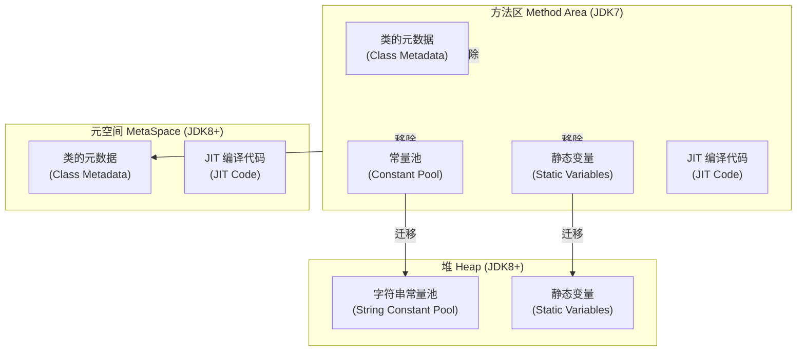
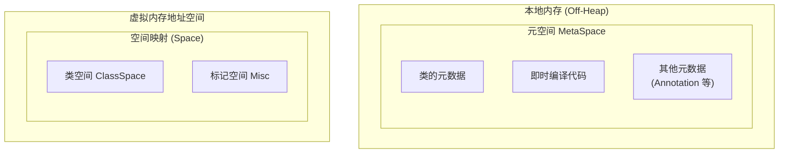

# 方法区与元空间

**目标级别**：P5/P6

## 面试官最关心的 3 个问题

1. 方法区存储哪些数据？
2. JDK7 和 JDK8 的方法区有什么区别？
3. 为什么会发生 Metaspace OOM？如何排查？

---

## 一、方法区概述

面试官问：「JDK8 为什么要移除永久代？」你说「因为内存溢出」——然后面试官追问「具体怎么溢出的？为什么元空间不会溢出？」你答不上来。方法区和元空间是 JDK 面试的经典考点，很多人分不清两者的边界。



---

## 二、方法区存储内容（JDK7）

### 核心组成部分

| 组成部分 | 存储内容 | 示例 |
|----------|----------|------|
| **类的元数据** | 类的结构信息 | 类名、父类名、字段表、方法表 |
| **常量池** | 编译期生成的字面量和符号引用 | `"hello"`, `#12: setName()` |
| **静态变量** | 类的静态字段（不含常量） | `static Map cache` |
| **方法字节码** | JIT 编译前的原始字节码 | - |
| **即时编译代码** | JIT 编译后的机器码 | - |
| **运行时常量池** | 运行时解析的符号引用 | 动态生成的 String |

### 类的元数据结构

```java
public class User {
    private Long id;
    private String name;
    
    public void setName(String name) { ... }
    public String getName() { ... }
}
```

对应的元数据包括：

- 类的访问修饰符（public）
- 类的直接父类（Object）
- 字段表：id（Long）、name（String）
- 方法表：setName()、getName()
- 常量池引用

---

## 三、元空间详解（JDK8+）

### 元空间 vs 永久代

| 维度 | 永久代 PermGen | 元空间 MetaSpace |
|------|----------------|------------------|
| **位置** | JVM 堆内存的一部分 | 本地内存（Native Memory） |
| **大小限制** | `-XX:MaxPermSize` | `-XX:MetaspaceSize` / `-XX:MaxMetaspaceSize` |
| **OOM 类型** | `OutOfMemoryError: PermGen space` | `OutOfMemoryError: Metaspace` |
| **GC** | Full GC 时回收 | 可独立触发 Metaspace GC |
| **灵活性** | 固定大小 | 可动态扩展 |

### 元空间内存结构



### 常用参数

```bash
# JDK8 元空间参数
-XX:MetaspaceSize=256m        # 初始元空间大小（触发 Metaspace GC 的阈值）
-XX:MaxMetaspaceSize=512m     # 最大元空间大小（无限制时设为 -1）
-XX:MinMetaspaceFreeRatio=40  # GC 后最小空闲比例
-XX:MaxMetaspaceFreeRatio=70  # GC 后最大空闲比例

# 对比 JDK7 永久代参数
-XX:PermSize=256m             # 初始永久代大小
-XX:MaxPermSize=512m           # 最大永久代大小
```

---

## 四、常量池的迁移（JDK8）

### 字符串常量池

JDK7 将字符串常量池从方法区迁移到**堆**：

| 版本 | 位置 | OOM 处理 |
|------|------|----------|
| JDK6 | 方法区 | 增加永久代大小 |
| JDK7 | 堆 | 堆内存自动调整 |
| JDK8 | 堆 | 堆内存自动调整 |

```java
public class StringConstant {
    public static void main(String[] args) {
        // 字符串常量池中的对象
        String s1 = "hello";
        String s2 = "hello";
        System.out.println(s1 == s2); // true，共用常量
        
        // new 创建的对象在堆中
        String s3 = new String("hello");
        System.out.println(s1 == s3); // false，堆对象
    }
}
```

### 静态变量的迁移

| 版本 | 位置 | 说明 |
|------|------|------|
| JDK6 | 方法区 | 静态变量在永久代 |
| JDK7 | 堆 | 静态变量迁移到堆 |
| JDK8 | 堆 | 静态变量仍在堆 |

```java
public class StaticDemo {
    static Map<String, Object> cache = new HashMap<>();
    static final int MAX_SIZE = 100; // 常量，仍在字符串常量池
    
    public static void main(String[] args) {
        // cache 在 JDK7+ 中存储在堆，不在方法区
    }
}
```

---

## 五、高频面试题

### 🔴 第一层：方法区存储什么

**问题**：方法区存储哪些数据？

**标准答案**：

方法区存储类相关的元数据，包括：

1. **类的元数据**：类的名称、修饰符、父类、实现的接口、字段表、方法表
2. **常量池**：编译期生成的各种字面量和符号引用
3. **静态变量**：类的静态字段（JDK7 在永久代，JDK8 在堆）
4. **即时编译代码**：JIT 编译后的机器码
5. **运行时常量池**：运行时解析的符号引用

> **第二层追问**：JDK8 的方法区在哪里？
>
> JDK8 移除了永久代，但方法区概念仍然存在。类的元数据存储在**元空间**（本地内存），字符串常量池和静态变量迁移到**堆**。

> **第三层追问**：为什么需要元空间？
>
> 永久代大小固定，容易出现 OOM。元空间使用本地内存，不受堆大小限制，更灵活。但需要监控元空间大小，避免耗尽本地内存。

---

### 🔴 JDK7 与 JDK8 的方法区变化

**问题**：JDK8 移除永久代后，永久代存储的数据去哪了？

**标准答案**：

| 数据类型 | JDK7 位置 | JDK8 位置 | 原因 |
|----------|-----------|-----------|------|
| **类元数据** | 永久代 | 元空间 | 元空间使用本地内存，更灵活 |
| **字符串常量池** | 永久代 | 堆 | 统一内存管理，便于 GC |
| **静态变量** | 永久代 | 堆 | 统一内存管理，便于 GC |
| **即时编译代码** | 永久代 | 元空间 | 代码缓存独立管理 |

---

### 🟡 Metaspace OOM 的原因

**问题**：为什么会发生 Metaspace OOM？

**标准答案**：

1. **频繁动态生成类**：如 Spring、CGLIB 动态代理、JSP 编译
2. **类加载器泄漏**：大量自定义类加载器未回收
3. **元空间设置过小**：`-XX:MaxMetaspaceSize` 设置过小
4. **JVM 进程内存限制**：64 位进程也有虚拟内存限制

```java
// 导致 Metaspace OOM 的典型场景
public class DynamicClassLoading {
    public static void main(String[] args) {
        // 模拟动态生成大量类
        for (int i = 0; i < 100000; i++) {
            // 每次循环创建新类加载器
            ClassLoader loader = new URLClassLoader(new URL[0]);
            // 生成类
            byte[] classBytes = generateClass();
            loader.defineClass("Class_" + i, classBytes, 0, classBytes.length);
        }
    }
}
```

---

## 六、常见错误与陷阱

### ⚠️ 陷阱 1：混淆方法区和元空间

方法区是 JVM 规范中的概念，元空间是 HotSpot 对方法区的实现（JDK8+）。JDK7 的永久代也是方法区的一种实现。

### ⚠️ 陷阱 2：认为元空间不会 OOM

元空间有 `-XX:MaxMetaspaceSize` 限制，默认无限制，但如果不设置，当类加载过多时会耗尽本地内存（虚拟地址空间）。

### ⚠️ 陷阱 3：忽略字符串常量池的变化

JDK7 将字符串常量池从方法区移到堆，这是一个容易被忽略的重大变化。面试时主动提及会加分。

---

## 七、对比总结表

| 维度 | JDK7 永久代 | JDK8 元空间 |
|------|-----------|-------------|
| **位置** | JVM 堆内 | 本地内存 |
| **大小控制** | `-XX:PermSize` | `-XX:MetaspaceSize` |
| **最大值控制** | `-XX:MaxPermSize` | `-XX:MaxMetaspaceSize` |
| **OOM 类型** | PermGen OOM | Metaspace OOM |
| **字符串常量池** | 方法区 | 堆 |
| **静态变量** | 方法区 | 堆 |
| **GC 频率** | Full GC 时回收 | Metaspace GC（独立） |

---

## 八、Metaspace 监控与排查

### 查看 Metaspace 使用

```bash
# 使用 jstat 查看 Metaspace 使用
jstat -gc <pid>

# 输出示例
MC       MU      CCSC     CCSU       YGC    FGC    CGCT
4352.0   4234.0   512.0    480.0      456    12     0.234
# MC: Metaspace 容量
# MU: Metaspace 使用量
# CCSC: 压缩类空间容量
# CCSU: 压缩类空间使用量
```

### 排查 Metaspace OOM

```bash
# 1. 添加参数，打印 Metaspace 相关日志
-XX:+TraceClassLoading
-XX:+TraceClassUnloading
-XX:+PrintGCDetails

# 2. 使用 MAT 分析堆转储
jmap -dump:format=b,file=heap.hprof <pid>

# 3. 使用 jcmd 查看类加载统计
jcmd <pid> GC.class_stats
```

---

## 九、加分回答

### 💡 为什么 JDK8 选择元空间？

1. **字符串常量池统一管理**：避免与堆的 GC 互相影响
2. **类元数据按需分配**：元空间支持动态增长，永久代大小固定
3. **避免 PermGen OOM**：永久代大小受堆限制，容易溢出
4. **简化 GC**：元空间使用独立的 GC 策略

### 💡 元空间的未来演进

JDK9 引入了 **Jigsaw 模块化系统**，进一步规范化了类加载和元数据管理。元空间的设计为 Java 模块化奠定了基础。

---

## 十、扩展思考

既然元空间使用本地内存，那么它和直接内存（NIO 的 DirectByteBuffer）有什么区别？

> **答案**：
> - 元空间：存储类元数据和 JIT 编译代码，JVM 自动管理
> - 直接内存：应用程序显式分配，存储 I/O 数据，需要手动管理
> - 两者都在本地内存，但用途和管理方式不同
> - `-XX:MaxMetaspaceSize` 限制元空间，但不会限制直接内存（通过 `-XX:MaxDirectMemorySize`）
