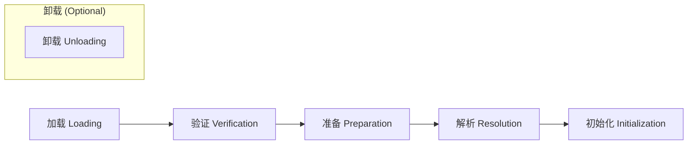
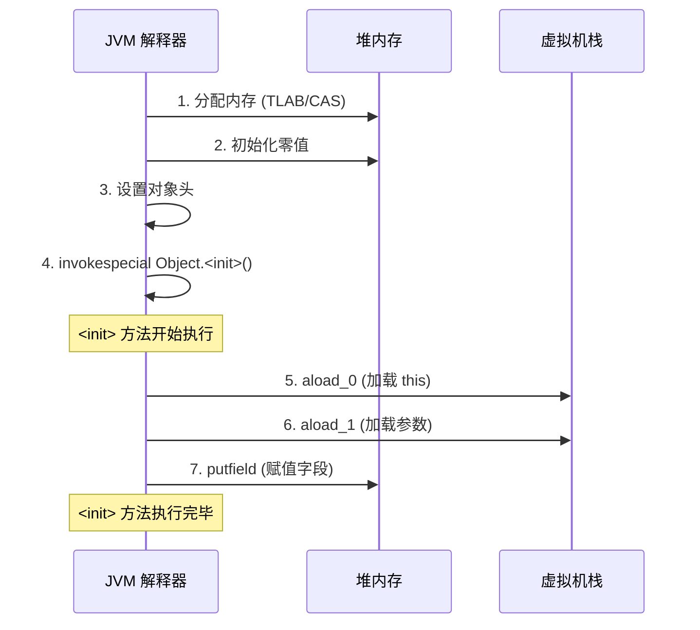

# 对象创建流程

**目标级别**：P5/P6

## 面试官最关心的 3 个问题

1. new Object() 的创建过程是什么？
2. 对象内存分配的两种方式是什么？各有什么优缺点？
3. 对象的构造函数在什么时候被调用？

---

## 一、对象创建概述

面试官问：「创建一个对象需要几步？」你说「new 一下就好了」——然后面试官追问「new 的时候内存从哪里来？并发创建对象时如何保证线程安全？」你愣住了。对象创建是 Java 运行时最频繁的操作，JVM 对此做了大量优化。

```mermaid
flowchart TB
    A["new Object()"] --> B{"类是否已加载?"}
    B -->|否| C["类加载检查"]
    C --> D["加载/验证/准备/解析"]
    D --> E["分配内存"]
    
    B -->|是| E
    
    E --> F{"内存分配方式?"}
    F -->|规整内存| G["指针碰撞<br/>(Bump the Pointer)"]
    F -->|非规整内存| H["空闲列表<br/>(Free List)"]
    
    G --> I["并发安全?"}
    H --> I
    
    I -->|CAS| J["CAS 分配"]
    I -->|本地缓存| K["TLAB 分配"]
    
    J --> L["初始化零值"]
    K --> L
    
    L --> M["设置对象头"]
    M --> N["执行构造函数"]
    N --> O["对象创建完成"]
```

---

## 二、完整创建流程

### 第一步：类加载检查

执行 `new` 指令时，JVM 首先检查：

1. **符号引用是否已解析**：类的全限定名对应的类是否已加载
2. **类是否已完成加载**：若未加载，触发类加载过程

```java
public class ObjectCreate {
    public static void main(String[] args) {
        // 触发类加载检查
        User user = new User(); // User 类必须已加载
    }
}
```

类加载的完整过程：



### 第二步：分配内存

#### 内存分配方式

根据堆内存是否规整，有两种分配方式：


| 方式 | 适用场景 | GC 收集器 |
|------|----------|-----------|
| **指针碰撞** | 内存规整（无碎片） | Serial、ParNew、G1 |
| **空闲列表** | 内存不规整（有碎片） | CMS、基于空闲链表的收集器 |

#### 并发安全问题

分配内存是高频操作，多线程环境下需要解决并发问题：

| 解决方案 | 原理 | 优点 | 缺点 |
|----------|------|------|------|
| **CAS + 重试** | 乐观锁，失败重试 | 简单通用 | CPU 开销大 |
| **TLAB** | 线程本地分配缓冲 | 避免同步 | 内存浪费 |

```java
// TLAB 分配流程
public Object allocate() {
    // 1. 检查 TLAB 是否够用
    if (remaining >= size) {
        // 2. 在 TLAB 内分配
        pointer += size;
        return old_pointer;
    } else {
        // 3. TLAB 不够，分配新 TLAB 或直接分配
        refillAndAllocate();
    }
}
```

### 第三步：初始化零值

分配内存后，JVM 将内存区域初始化为零值（不包括对象头）：

| 类型 | 零值 |
|------|------|
| int / long / float / double | 0 / 0L / 0.0f / 0.0 |
| boolean | false |
| reference | null |
| byte / char / short | 0 |

:::tip 为什么初始化零值
确保对象的实例字段在构造函数执行前已有默认值，避免未初始化访问。这是 Java 安全性的体现。
:::

### 第四步：设置对象头

```java
// 对象头设置
object.markWord = mark;           // Mark Word: 锁状态、GC 年龄等
object.klassPointer = klass;      // 指向类元数据的指针
object.arrayLength = 0;           // 数组长度（仅数组对象）
```

### 第五步：执行构造函数

```java
public class User {
    private String name;
    private int age;
    
    public User(String name, int age) {
        this.name = name;  // 构造函数执行
        this.age = age;
    }
}
```

构造函数执行前，对象已经存在（内存已分配、零值已设置）。构造函数负责设置对象的实际初始值。

---

## 三、字节码视角

### new 指令的执行过程

```java
public class User {
    private String name;
    
    public User(String name) {
        this.name = name;
    }
}
```

对应的字节码：

```java
public <init>(Ljava/lang/String;)V
   0: aload_0                  // 加载 this
   1: invokespecial #1          // 调用 Object.<init>()
   4: aload_0                   // 加载 this
   5: aload_1                   // 加载参数 name
   6: putfield #2               // 赋值 this.name = name
   9: return                    // 返回
```

### 字节码执行顺序



---

## 四、高频面试题

### 🔴 第一层：对象创建步骤

**问题**：请描述 new Object() 的完整创建过程。

**标准答案**：

1. **类加载检查**：检查类是否已加载，未加载则先加载
2. **分配内存**：在堆中分配对象内存（指针碰撞或空闲列表）
3. **初始化零值**：将内存区域初始化为零值
4. **设置对象头**：设置 Mark Word 和 Klass Pointer
5. **执行构造函数**：调用 `<init>` 方法初始化字段

> **第二层追问**：内存分配时如何保证线程安全？
>
> 两种方式：CAS + 重试（乐观锁）或 TLAB（线程本地分配缓冲）。TLAB 通过每个线程预分配一块内存，避免同步。

> **第三层追问**：为什么需要初始化零值？
>
> 保证对象的实例字段在构造函数执行前有默认值，避免未初始化访问。这是 Java 安全性的设计选择。

---

### 🟡 内存分配方式选择

**问题**：什么情况下使用指针碰撞，什么情况下使用空闲列表？

**标准答案**：

| 方式 | 触发条件 | 原因 |
|------|----------|------|
| **指针碰撞** | Serial、ParNew、G1 | 使用压缩算法，内存规整 |
| **空闲列表** | CMS（无法压缩时）、其他无法规整的 GC | 内存碎片化，存在不连续空闲块 |

---

### 🟢 构造函数执行顺序

**问题**：子类构造函数的执行顺序是什么？

**标准答案**：

```java
class Parent {
    Parent() { System.out.println("Parent 构造"); }
}

class Child extends Parent {
    Child() { System.out.println("Child 构造"); }
}

// 执行顺序：
// 1. 父类静态初始化块
// 2. 子类静态初始化块
// 3. 父类实例初始化块
// 4. 父类构造函数
// 5. 子类实例初始化块
// 6. 子类构造函数
```

---

## 五、常见错误与陷阱

### ⚠️ 陷阱 1：混淆分配内存和初始化

分配内存（allocation）和初始化（initialization）是两个独立的步骤。先分配内存、设置零值，然后才执行构造函数。很多面试者以为构造函数是第一个执行的。

### ⚠️ 陷阱 2：忘记 TLAB

TLAB 是 JVM 优化分配性能的重要手段。如果面试问到并发分配，应该主动提及 TLAB。

### ⚠️ 陷阱 3：忽略对象头的设置

对象头设置容易被忽略，但它存储了对象的关键信息（锁状态、GC 信息）。面试时可以强调「对象头是对象与 GC、锁机制交互的关键」。

---

## 六、对比总结表

| 步骤 | 耗时 | 线程安全 | 说明 |
|------|------|----------|------|
| **类加载检查** | 首次较慢 | 单线程 | 类缓存避免重复加载 |
| **内存分配** | 极快 | CAS/TLAB | TLAB 大幅提升性能 |
| **初始化零值** | 极快 | 单线程 | 批量内存操作 |
| **设置对象头** | 极快 | 单线程 | 简单指针赋值 |
| **构造函数** | 取决于代码 | 单线程 | 用户代码执行 |

---

## 七、加分回答

### 💡 逃逸分析对对象分配的影响

通过逃逸分析，JVM 可以判断对象是否逃逸出方法作用域。未逃逸的对象可以：

1. **栈上分配**：对象随栈帧出栈自动销毁，无需 GC
2. **标量替换**：对象的字段拆解为分散变量，直接在栈上分配

```java
public void process() {
    // user 对象可能不逃逸
    User user = new User();
    user.setName("test");
    System.out.println(user.getName());
}
```

如果 `user` 未逃逸，JVM 可以直接在栈上分配 `name` 字段，而非创建完整对象。

### 💡 大对象直接进入老年代

超过 `-XX:PretenureSizeThreshold` 阈值的对象直接在老年代分配，绕过年轻代。这避免了年轻代内存碎片和频繁的 Minor GC。

---

## 八、扩展思考

既然对象创建涉及这么多步骤，为什么 Java 不说对象是「创建」的，而是「分配」的？

> **答案**：
> 从 JVM 视角看，对象创建的本质是**内存分配**。构造函数只是填充初始值，对象在构造函数执行前已经存在（内存已分配、零值已设置）。
>
> 这种设计的好处是：
> - 构造函数抛出异常时，对象仍存在于内存中（虽然状态不完整）
> - GC 可以在构造函数执行期间回收对象（如果引用丢失）
