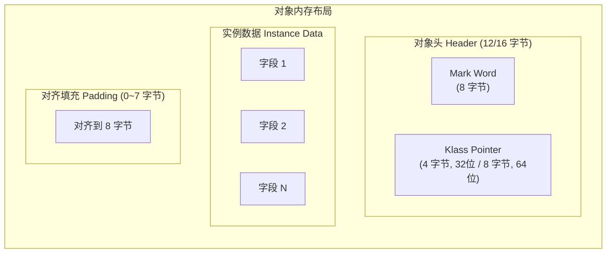
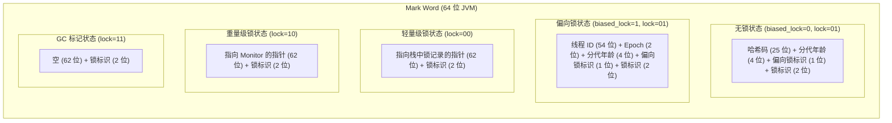
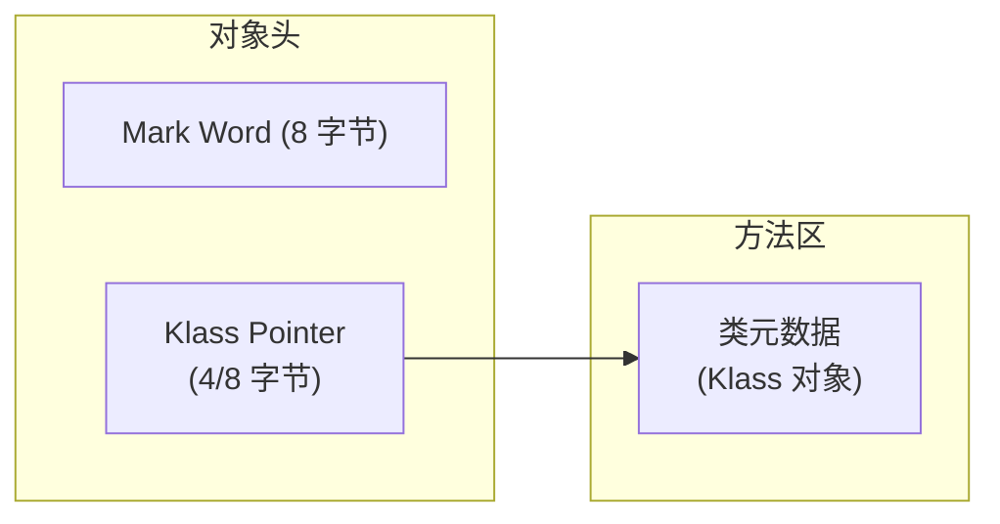
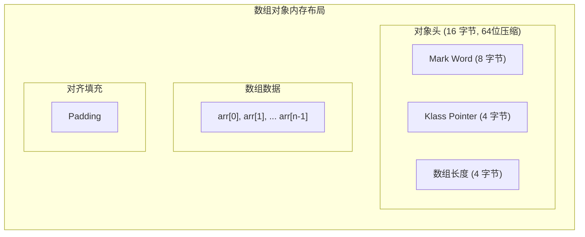

# 对象内存布局

**目标级别**：P6

## 面试官最关心的 3 个问题

1. 对象在内存中由哪几部分组成？
2. 对象头的 Mark Word 存储什么信息？
3. 为什么对象要 8 字节对齐？

---

## 一、对象内存布局概述

面试官问：「一个 Java 对象占用多少内存？」你说「看对象大小」——然后面试官追问「对象头包含什么？数组的对象头和普通对象有什么区别？」你愣住了。对象内存布局是理解 synchronized 锁升级、偏向锁、GC 状态的基础。



---

## 二、对象头（Object Header）

### Mark Word

Mark Word 存储对象的**运行时状态信息**，包括哈希码、GC 年龄、锁状态等。



### Mark Word 各状态

| 锁状态 |偏向锁标识|锁标识|存储内容 |
|--------|----------|------|----------|
| **无锁** | 0 | 01 | 哈希码(25) + 年龄(4) + 偏向(1) + 锁(2) |
| **偏向锁** | 1 | 01 | 线程ID(54) + Epoch(2) + 年龄(4) + 偏向(1) + 锁(2) |
| **轻量级锁** | - | 00 | 指向栈中锁记录的指针(62) + 锁(2) |
| **重量级锁** | - | 10 | 指向Monitor的指针(62) + 锁(2) |
| **GC标记** | - | 11 | 空(62) + 锁(2) |

### Klass Pointer



| JVM 类型 | Klass Pointer 大小 | 说明 |
|----------|-------------------|------|
| 32 位 JVM | 4 字节 | 指向 32 位地址空间 |
| 64 位 JVM (未压缩) | 8 字节 | 指向 64 位地址空间 |
| 64 位 JVM (压缩指针) | 4 字节 | `-XX:+UseCompressedOops`（默认开启） |

:::warning 压缩指针限制
开启压缩指针后，堆内存超过 ~32GB 时会失效。因为 4 字节只能寻址 2^34 字节 = 16GB（实际 ~35GB，含对象头偏移）
:::

---

## 三、实例数据（Instance Data）

### 字段排列规则

HotSpot 按**先父类后子类**、**同宽度优先**的顺序排列字段。

```java
public class Parent {
    long a;      // 8 字节
    int b;       // 4 字节
    int c;       // 4 字节
}

public class Child extends Parent {
    long d;      // 8 字节
    Object e;    // 4/8 字节 (引用)
}
```

字段排列（考虑压缩指针和 8 字节对齐）：

```java
// 最佳排列（字段紧凑）
public class ParentOptimized {
    int b;       // 4 字节
    int c;       // 4 字节
    long a;      // 8 字节（8 字节对齐）
}

// 字段交错排列（浪费空间）
public class ParentWaste {
    long a;      // 8 字节
    int b;       // 4 字节
    int c;       // 4 字节（会额外对齐）
}
```

### 不同类型字段大小

| 类型 | 大小 | 备注 |
|------|------|------|
| boolean | 1 字节 | JVM 以 byte 存储 |
| byte | 1 字节 | - |
| short | 2 字节 | - |
| char | 2 字节 | - |
| int | 4 字节 | - |
| float | 4 字节 | - |
| long | 8 字节 | - |
| double | 8 字节 | - |
| reference | 4/8 字节 | 32位/64位，开启压缩后 4 字节 |

---

## 四、对齐填充（Padding）

### 对齐规则

HotSpot 要求对象的起始地址是 **8 的倍数**。不足的部分通过填充补齐。

```java
public class PaddingDemo {
    int a;      // 4 字节
    long b;     // 8 字节（需要对齐到 8）
    // 填充 4 字节
}
```

### 对齐的原因

| 原因 | 说明 |
|------|------|
| **硬件要求** | 大多数 64 位 CPU 要求数据访问按自然边界对齐，否则有性能惩罚 |
| **指针压缩** | 8 字节对齐使得压缩指针可以寻址更大的内存范围 |
| **GC 效率** | 对齐减少了 GC 扫描的对象数量 |

---

## 五、数组对象布局

数组对象比普通对象多一个 **数组长度** 字段：



### 普通对象 vs 数组对象

| 维度 | 普通对象 | 数组对象 |
|------|----------|----------|
| **对象头大小** | 12/16 字节 | 16/24 字节（多 4 字节长度） |
| **额外开销** | 无 | 数组长度字段 |
| **Mark Word** | 锁状态、GC 信息 | 同左 |
| **Klass Pointer** | 指向类元数据 | 指向数组类元数据 |

---

## 六、高频面试题

### 🔴 第一层：对象由哪几部分组成

**问题**：一个对象在内存中由哪几部分组成？

**标准答案**：

对象由三部分组成：

1. **对象头（Header）**：
   - Mark Word：存储哈希码、GC 年龄、锁状态等
   - Klass Pointer：指向类元数据的指针（开启压缩指针为 4 字节）
2. **实例数据（Instance Data）**：对象的字段内容
3. **对齐填充（Padding）**：填充到 8 字节对齐

> **第二层追问**：Mark Word 在 64 位 JVM 中存储什么？
>
> 存储对象的哈希码、GC 年龄、偏向锁信息、锁状态。不同锁状态下存储内容不同，总共 8 字节。

> **第三层追问**：为什么需要对齐填充？
>
> 64 位 CPU 访问未对齐的数据有性能惩罚，且对齐后压缩指针可以寻址更大范围。

---

### 🟡 对象大小计算

**问题**：一个空对象占用多少内存？

**标准答案**：

在 64 位 JVM（开启压缩指针）下：

| 对象类型 | 对象头 | 实例数据 | 对齐 | 总大小 |
|----------|--------|----------|------|--------|
| **普通空对象** | 12 字节 | 0 | 4 字节 | **16 字节** |
| **数组对象** | 16 字节 | 0 | 0 | **16 字节** |

```java
// 验证对象大小
import java.lang.instrument.Instrumentation;

public class ObjectSize {
    private static Instrumentation instrumentation;
    
    public static void premain(String args, Instrumentation inst) {
        instrumentation = inst;
    }
    
    public static long sizeOf(Object obj) {
        return instrumentation.getObjectSize(obj);
    }
}
```

---

### 🟢 字段重排序优化

**问题**：为什么 JVM 会对字段进行重排序？

**标准答案**：

JVM 按照**字段宽度**降序排列，减少对齐填充，提高内存利用率。

```java
// 原始定义
class User {
    int age;          // 4 字节
    long id;          // 8 字节
    String name;      // 4/8 字节引用
    byte flag;        // 1 字节
}

// JVM 实际排列（可能）
class UserOptimized {
    long id;          // 8 字节（宽字段在前）
    int age;          // 4 字节
    String name;      // 4/8 字节引用
    byte flag;        // 1 字节
    // +3 填充字节对齐
}
```

---

## 七、常见错误与陷阱

### ⚠️ 陷阱 1：混淆对象头大小

64 位 JVM 未开启压缩指针时，对象头是 16 字节（Mark Word 8 + Klass Pointer 8）。开启压缩指针后是 12 字节（Mark Word 8 + Klass Pointer 4）。

### ⚠️ 陷阱 2：忘记数组长度字段

数组对象比普通对象多 4 字节存储数组长度，这是面试中容易被忽略的细节。

### ⚠️ 陷阱 3：忽略字段重排序

JVM 会对字段进行重排序以优化内存布局。如果你按照宽度降序声明字段，可能已经是最优排列，但 JVM 仍会检查。

---

## 八、对比总结表

| 组件 | 大小 (64位压缩) | 存储内容 |
|------|-----------------|----------|
| **Mark Word** | 8 字节 | 锁状态、GC 信息、哈希码、年龄 |
| **Klass Pointer** | 4 字节 | 指向方法区类元数据 |
| **数组长度** | 4 字节 | 仅数组对象有 |
| **实例数据** | 字段总和 | 对象的实际数据 |
| **对齐填充** | 0~7 字节 | 对齐到 8 的倍数 |

---

## 九、加分回答

### 💡 Mark Word 与锁升级的关系

Mark Word 的设计是为了**让对象头同时存储锁信息和 GC 信息**，避免额外占用内存。这是一种空间优化：

- 无锁状态：存储对象哈希码
- 偏向锁：存储偏向线程 ID
- 轻量级锁：存储指向栈中锁记录的指针
- 重量级锁：存储指向 Monitor 的指针

### 💡 对象头窥探（Header Heuristics）

GC 扫描对象时，可以通过对象头直接判断对象的存活状态和代际，无需读取完整的对象数据。这种设计让 GC 扫描非常高效。

---

## 十、扩展思考

为什么 Mark Word 没有地方存储对象的哈希码时还能通过 `System.identityHashCode()` 获取？

> **答案**：
> - 对象的哈希码在第一次调用 `hashCode()` 时计算并存储到 Mark Word
> - 如果对象已经偏向某线程，哈希码会存储到**线程栈**的锁记录中
> - 如果对象已膨胀为重量级锁，哈希码会存储到 **Monitor** 中
> - 因此，即使 Mark Word 被锁信息占用，哈希码仍可通过其他途径获取
