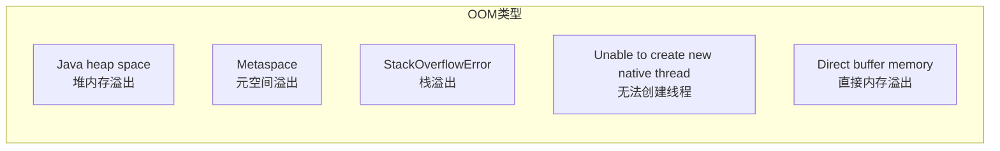

# 内存溢出排查

**目标级别**：P6/P7

## 面试官最关心的 3 个问题

1. 常见的 OOM 类型有哪些？
2. 如何排查 OOM？
3. 如何避免 OOM？

---

## 一、常见 OOM 类型

面试官问：「你遇到过 OOM 吗？怎么排查的？」你说「遇到过」——然后面试官追问「是堆 OOM 还是元空间 OOM？怎么定位的？」你愣住了。OOM 是生产环境最常见的问题之一，排查能力是高级 Java 开发的必备技能。



---

## 二、堆内存溢出（Java heap space）

### 原因

| 原因 | 说明 |
|------|------|
| **内存泄漏** | 对象无法被 GC 回收 |
| **内存溢出** | 确实需要大量内存 |
| **配置不当** | 堆大小设置过小 |

### 排查步骤

```bash
# 1. 添加 OOM 时生成堆转储
-XX:+HeapDumpOnOutOfMemoryError
-XX:HeapDumpPath=/tmp/heap.hprof

# 2. 查看 GC 日志
-XX:+PrintGCDetails
-XX:+PrintGCTimeStamps
-Xloggc:/var/log/gc.log

# 3. 使用 jmap 查看堆内存
jmap -heap <pid>

# 4. 生成堆转储文件
jmap -dump:format=b,file=/tmp/heap.hprof <pid>
```

### 典型案例

```java
// 内存泄漏示例
public class MemoryLeak {
    static List<Object> cache = new ArrayList<>();
    
    public static void main(String[] args) {
        while (true) {
            // 对象不断添加到缓存，无法释放
            cache.add(new Object());
        }
    }
}
```

---

## 三、元空间溢出（Metaspace）

### 原因

| 原因 | 说明 |
|------|------|
| **类加载过多** | 动态代理、反射生成大量类 |
| **元空间过小** | -XX:MaxMetaspaceSize 设置过小 |
| **类卸载失败** | 类加载器泄漏 |

### 排查步骤

```bash
# 1. 查看元空间使用
jstat -gc <pid> | grep M

# 输出示例
# MC: 元空间容量
# MU: 元空间使用量

# 2. 添加 OOM 时生成堆转储
-XX:+HeapDumpOnOutOfMemoryError

# 3. 查看类加载统计
jcmd <pid> GC.class_stats
```

### 典型案例

```java
// CGLIB 动态代理导致类加载过多
public class ClassLeakDemo {
    public static void main(String[] args) {
        while (true) {
            // 每次创建新的类加载器
            Enhancer enhancer = new Enhancer();
            enhancer.setSuperclass(UserService.class);
            enhancer.setCallback(new MethodInterceptor() {
                @Override
                public Object intercept(Object obj, Method method, 
                        Object[] args, MethodProxy proxy) throws Throwable {
                    return proxy.invokeSuper(obj, args);
                }
            });
            // 创建新类，类加载器持有类的引用
            enhancer.create();
        }
    }
}
```

---

## 四、栈溢出（StackOverflowError）

### 原因

| 原因 | 说明 |
|------|------|
| **递归调用过深** | 方法调用栈太深 |
| **线程过多** | 每个线程都分配栈内存 |
| **栈帧过大** | 局部变量过多 |

### 排查步骤

```bash
# 1. 添加参数，查看栈溢出详情
-XX:+PrintStackTraceAtFullGC

# 2. 调整栈大小
-Xss1m     # 默认 1MB
-Xss512k   # 减小栈大小

# 3. 查看线程
jstack <pid> | grep "java.lang.Thread.State"
```

### 典型案例

```java
// 递归调用导致栈溢出
public class StackOverflowDemo {
    public static int count = 0;
    
    public static void recursive() {
        count++;
        recursive();  // 递归调用
    }
    
    public static void main(String[] args) {
        try {
            recursive();
        } catch (StackOverflowError e) {
            System.out.println("递归次数: " + count);
        }
    }
}
```

---

## 五、无法创建线程（Unable to create new native thread）

### 原因

| 原因 | 说明 |
|------|------|
| **线程数过多** | 超过系统限制 |
| **栈内存过大** | -Xss 设置过大 |
| **进程内存不足** | 进程内存耗尽 |

### 排查步骤

```bash
# 1. 查看线程数
jstack <pid> | grep "Thread" | wc -l

# 2. 查看系统限制
ulimit -u

# 3. 查看进程内存使用
ps aux | grep java

# 4. 调整参数
-Xss512k           # 减小栈大小
-XX:MaxJavaThreads=10000  # 限制线程数
```

---

## 六、直接内存溢出（Direct buffer memory）

### 原因

| 原因 | 说明 |
|------|------|
| **NIO 使用过多** | ByteBuffer.allocateDirect() |
| **Netty 使用不当** | 直接内存泄漏 |
| **内存未释放** | Buffer 未释放 |

### 排查步骤

```bash
# 1. 添加参数
-XX:MaxDirectMemorySize=1g

# 2. 查看直接内存
jcmd <pid> VM.native_memory

# 3. 使用 NMT 分析
jcmd <pid> VM.native_memory summary
```

---

## 七、高频面试题

### 🔴 第一层：如何排查 OOM

**问题**：遇到 OOM 如何排查？

**标准答案**：

1. **添加 OOM 时生成堆转储**
   ```bash
   -XX:+HeapDumpOnOutOfMemoryError
   -XX:HeapDumpPath=/tmp/heap.hprof
   ```

2. **查看 GC 日志**，分析 GC 行为
   ```bash
   -XX:+PrintGCDetails -Xloggc:/var/log/gc.log
   ```

3. **使用 MAT 分析堆转储文件**
   - 找出内存占用最大的对象
   - 分析 GC Root 引用链
   - 定位内存泄漏点

4. **使用 Arthas 等工具在线诊断**
   ```bash
   dashboard   # 查看 JVM 状态
   heapdump   # 在线生成堆转储
   ognl       # 查看对象值
   ```

> **第二层追问**：如何定位内存泄漏？
>
> 1. 生成多个堆转储文件
> 2. 对比对象数量变化
> 3. 找出持续增长的对象类型
> 4. 分析 GC Root 引用链

> **第三层追问**：如何避免 OOM？
>
> 1. 合理设置堆大小
> 2. 使用对象池管理高频创建的对象
> 3. 及时清理缓存
> 4. 监控内存使用

---

### 🟡 GC 日志分析

**问题**：如何通过 GC 日志判断是否有内存问题？

**标准答案**：

| 症状 | 判断 |
|------|------|
| Minor GC 后年轻代使用量不变 | 对象直接进入老年代 |
| Full GC 后老年代使用量不变 | 内存泄漏或空间不足 |
| GC 频率越来越高 | 对象创建速率过高 |
| GC 耗时越来越长 | 堆内存接近满 |

---

### 🟢 OOM 时生成转储

**问题**：如何在 OOM 时自动生成堆转储？

**标准答案**：

```bash
# JVM 参数
-XX:+HeapDumpOnOutOfMemoryError
-XX:HeapDumpPath=/var/log/java/heap.hprof

# 完整配置
java -Xmx2g -Xms2g \
     -XX:+HeapDumpOnOutOfMemoryError \
     -XX:HeapDumpPath=/var/log/java/oom.hprof \
     -XX:+PrintGCDetails \
     Application
```

---

## 八、常见错误与陷阱

### ⚠️ 陷阱 1：只增大堆内存

增大堆内存只是延迟 OOM，不是解决根本问题。应该定位内存泄漏。

### ⚠️ 陷阱 2：忽略元空间 OOM

JDK8 使用元空间存储类元数据，动态代理和反射会导致类加载过多。

### ⚠️ 陷阱 3：忽略直接内存

NIO 的直接内存不受堆大小限制，需要单独设置和监控。

---

## 九、对比总结表

| OOM 类型 | 原因 | 排查工具 | 解决方案 |
|----------|------|----------|----------|
| **堆溢出** | 内存泄漏/大对象 | MAT、VisualVM | 修复泄漏/增大堆 |
| **元空间溢出** | 类加载过多 | jstat、jcmd | 清理类/增大元空间 |
| **栈溢出** | 递归过深 | jstack | 修改代码/增大栈 |
| **线程溢出** | 线程数过多 | jstack | 线程池/减小栈 |
| **直接内存溢出** | NIO 使用 | NMT | 限制直接内存 |

---

## 十、加分回答

### 💡 使用 Arthas 排查 OOM

```bash
# 启动 Arthas
java -jar arthas-boot.jar <pid>

# 查看内存
dashboard

# 生成堆转储
heapdump /tmp/heap.hprof

# 查看对象
ognl '@com.example.Cache@map.size()'
```

### 💡 MAT 分析技巧

1. **Histogram**：按类型统计对象数量
2. **Dominator Tree**：找出占用内存最大的对象
3. **Top Consumers**：找出占用内存最大的类
4. **Leak Suspects**：自动分析泄漏嫌疑

---

## 十一、扩展思考

如果 OOM 无法复现，如何提前发现潜在问题？

> **答案**：
>
> 1. **监控内存使用**：Prometheus + Grafana 监控堆内存、元空间使用趋势
> 2. **分析 GC 日志**：通过 GCViewer、GCEasy 分析 GC 行为
> 3. **定期 Heap Dump**：定期生成堆转储，对比分析对象增长
> 4. **代码审查**：审查可能导致泄漏的代码模式
