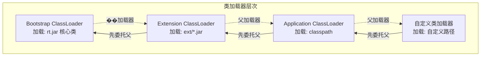
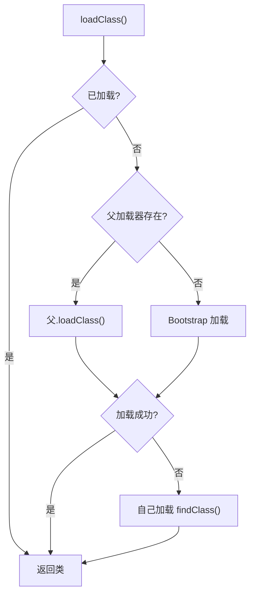
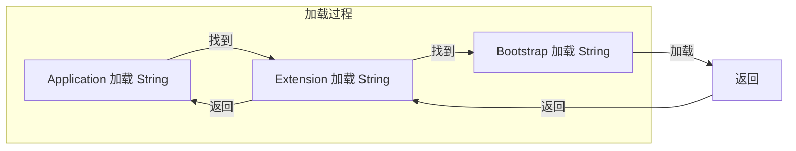
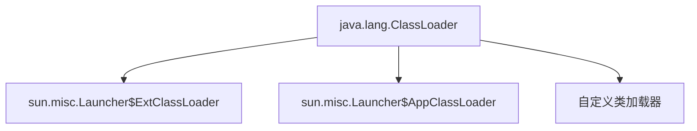

# 双亲委派模型

**目标级别**：P5/P6

## 面试官最关心的 3 个问题

1. 什么是双亲委派模型？为什么需要它？
2. 双亲委派模型的执行流程是什么？
3. 为什么需要打破双亲委派？

---

## 一、双亲委派模型概述

面试官问：「什么是双亲委派模型？」你说「先让父加载器加载」——然后面试官追问「如果父加载器加载不了，子加载器加载的类能替换核心类吗？」你愣住了。双亲委派是 Java 安全体系的基石，理解它才能理解类加载的深层机制。



---

## 二、双亲委派执行流程

### 源码分析

```java
// ClassLoader.loadClass() 核心代码
protected Class<?> loadClass(String name, boolean resolve) throws ClassNotFoundException {
    // 1. 检查是否已加载
    Class<?> c = findLoadedClass(name);
    if (c != null) {
        return c;
    }
    
    try {
        // 2. 委托给父加载器
        ClassLoader parent = getParent();
        if (parent != null) {
            c = parent.loadClass(name, false);
        } else {
            // 3. Bootstrap 加载器
            c = findBootstrapClassOrNull(name);
        }
    } catch (ClassNotFoundException e) {
        // 父加载器找不到
    }
    
    if (c == null) {
        // 4. 自己加载
        c = findClass(name);
    }
    
    return c;
}
```

### 流程图解



---

## 三、双亲委派的优势

### 1. 安全性

防止核心类被篡改

```java
// 恶意尝试：自定义 Object 类
// 会被 Bootstrap ClassLoader 加载的 Object 拦截
class Object {
    void malicious() { ... }
}
```

### 2. 避免重复加载

父加载器加载后，子加载器无需再次加载



### 3. 保证类的唯一性

同一个类不会被多个类加载器加载，避免类冲突

---

## 四、类加载器的关系

### 继承关系



### 加载范围

| 类加载器 | 加载路径 |
|----------|----------|
| **Bootstrap** | `$JAVA_HOME/jre/lib/rt.jar`、`resources.jar`、`sunrsasign.jar` |
| **Extension** | `$JAVA_HOME/jre/lib/ext/*.jar`、`java.ext.dirs` |
| **Application** | `classpath` 环境变量、`-cp` 参数 |

---

## 五、高频面试题

### 🔴 第一层：双亲委派模型

**问题**：什么是双亲委派模型？请描述其执行流程。

**标准答案**：

**定义**：类加载时，先委托父加载器加载，只有父加载器无法加载时才自己加载。

**执行流程**：

1. 检查类是否已加载（`findLoadedClass()`）
2. 委托父加载器（`parent.loadClass()`）
3. 父加载器不存在，使用 Bootstrap 加载
4. 父加载器找不到，自己加载（`findClass()`）

> **第二层追问**：为什么需要双亲委派模型？
>
> 1. **安全性**：防止核心类被自定义类覆盖
> 2. **避免重复**：父加载器加载后子加载器无需重复加载
> 3. **唯一性**：保证同一个类不被多个加载器重复加载

> **第三层追问**：如果父加载器加载失败会怎样？
>
> 父加载器加载失败后，才会调用子加载器的 `findClass()` 方法加载类。这是「先委派再自己加载」的含义。

---

### 🟡 Bootstrap ClassLoader 的特殊性

**问题**：Bootstrap ClassLoader 是用什么语言实现的？

**标准答案**：

Bootstrap ClassLoader 使用 **C/C++** 实现，是 JVM 的一部分，不是 Java 代码。

```java
// 获取 Bootstrap ClassLoader
ClassLoader loader = String.class.getClassLoader();
System.out.println(loader);  // null

// 说明 String 类由 Bootstrap 加载
```

---

### 🟢 为什么 String 类由 Bootstrap 加载？

**问题**：为什么 String 类由 Bootstrap ClassLoader 加载而不是 Application ClassLoader？

**标准答案**：

双亲委派模型的加载顺序是：

1. Application ClassLoader 收到加载 `java.lang.String` 的请求
2. 委托给 Extension ClassLoader
3. 委托给 Bootstrap ClassLoader
4. Bootstrap 找到 `rt.jar` 中的 `String.class` 并加载

如果 Bootstrap 没有加载，才会由子加载器加载。这保证了 Java 核心类的安全性。

---

## 六、常见错误与陷阱

### ⚠️ 陷阱 1：混淆父加载器和继承关系

父加载器是 `ClassLoader.getParent()` 返回的加载器，不是类继承关系中的父类。

### ⚠️ 陷阱 2：认为双亲委派是强制性的

双亲委派是 ClassLoader 的默认行为，可以自定义类加载器打破它。

### ⚠️ 陷阱 3：忘记 findLoadedClass 检查

JVM 先检查类是否已加载，避免重复加载。这是双亲委派模型高效的关键。

---

## 七、对比总结表

| 方面 | 说明 |
|------|------|
| **模型名称** | 双亲委派模型（Parent-Delegation Model） |
| **核心原则** | 先委托父加载器，父无法加载才自己加载 |
| **安全性** | 防止核心类被篡改 |
| **唯一性** | 保证类的唯一性 |
| **可打破性** | 可通过自定义 ClassLoader 打破 |

---

## 八、加分回答

### 💡 类加载器的命名空间

每个类加载器有自己的命名空间，同一个类被不同类加载器加载后会是不同的类：

```java
ClassLoader loader1 = new CustomClassLoader();
ClassLoader loader2 = new CustomClassLoader();

Class<?> c1 = loader1.loadClass("com.example.User");
Class<?> c2 = loader2.loadClass("com.example.User");

System.out.println(c1 == c2);  // false
// 不同命名空间，类是不同的
```

### 💡 热部署与双亲委派

双亲委派模型在热部署场景下可能成为障碍：

1. 同一个类已由父加载器加载
2. 子加载器无法重新加载（如 Web 应用更新）
3. 解决方案：使用 OSGi、自定义 ClassLoader 隔离
