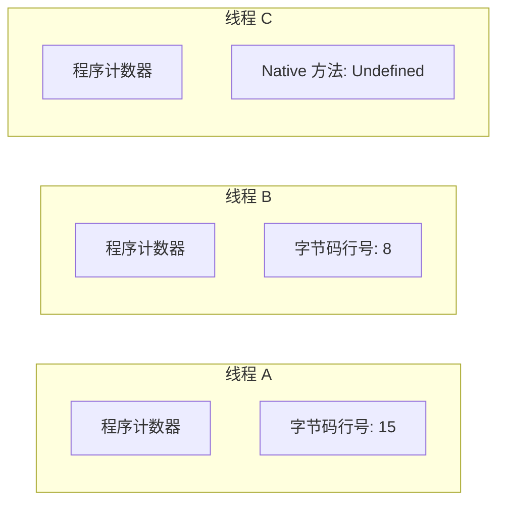
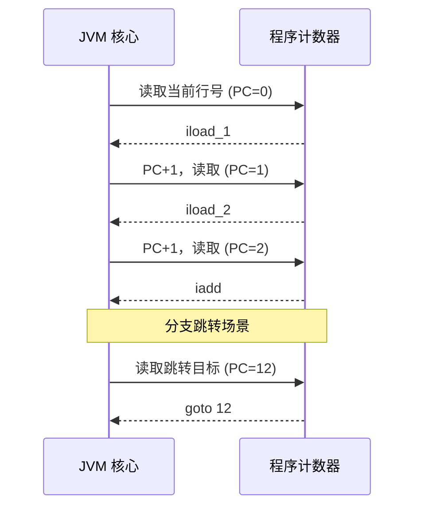
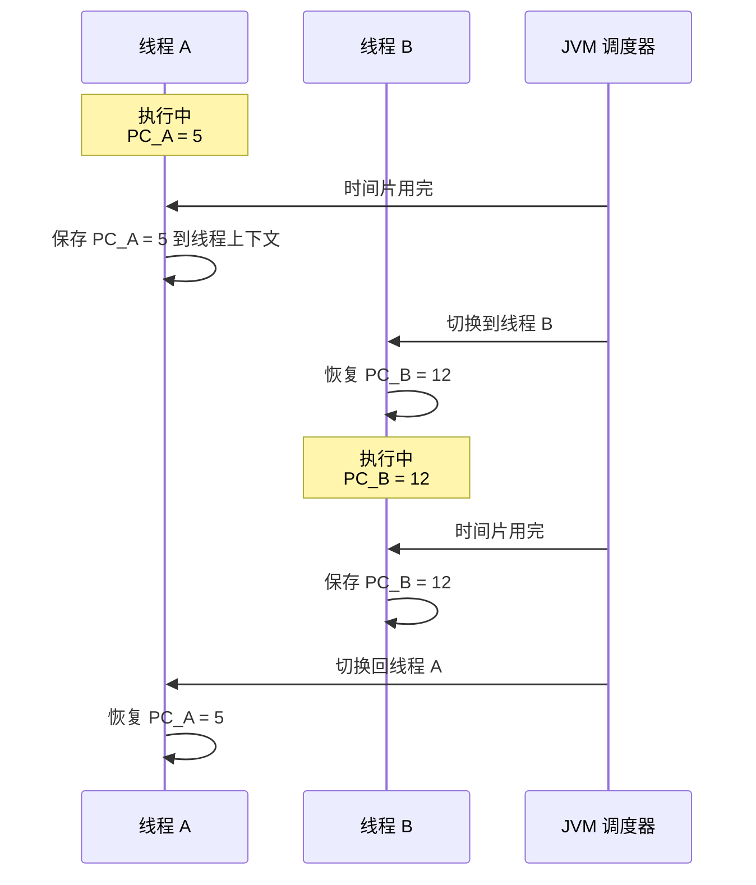

# 程序计数器作用

**目标级别**：P5/P6

## 面试官最关心的 3 个问题

1. 程序计数器的作用是什么？
2. 为什么它是线程私有的？
3. 为什么它是唯一不会 OOM 的区域？

---

## 一、程序计数器概述

面试官问：「JVM 执行字节码时，靠什么知道下一条指令是什么？」你脱口而出「程序计数器」——然后面试官追问「为什么执行 Native 方法时计数器是 Undefined？」你答不上来。程序计数器是 JVM 最简单的组件，但面试官喜欢从这里入手考察你对线程并发的理解。



### 核心特点

| 特性 | 说明 |
|------|------|
| **线程私有** | 每个线程独立持有，互不影响 |
| **唯一无 OOM** | JVM 规范中唯一不会 OutOfMemoryError 的区域 |
| **记录行号** | 当前线程执行的字节码行号 |

---

## 二、字节码执行与程序计数器

### 字节码执行流程

```java
public int calculate(int a, int b) {
    int c = a + b;
    int d = c * 2;
    return d;
}
```

对应的字节码：

```java
public calculate(II)I
   0: iload_1           // PC=0，  加载局部变量 a
   1: iload_2           // PC=1，  加载局部变量 b
   2: iadd              // PC=2，  计算 a+b
   3: istore_3          // PC=3，  存入局部变量 c
   4: iload_3           // PC=4，  加载 c
   5: iconst_2          // PC=5，  压入常量 2
   6: imul              // PC=6，  计算 c*2
   7: istore 4          // PC=7，  存入局部变量 d
   8: iload 4           // PC=8，  加载返回值
   9: ireturn           // PC=9，  返回
```

### 程序计数器的变化



### 分支跳转时的计数器

```java
public int max(int a, int b) {
    if (a > b) {
        return a;
    }
    return b;
}
```

字节码：

```java
public max(II)I
   0: iload_1           // 加载 a
   1: iload_2           // 加载 b
   2: if_icmpgt 7       // 若 a>b，跳转到 PC=7
   3: iload_2           // 否则加载 b
   4: istore_3          // 存入 temp
   5: goto 9            // 跳转到 return
   7: iload_1           // 加载 a
   9: ireturn           // 返回
```

分支跳转时，程序计数器被设置为**跳转目标的行号**，而非简单地 +1。

---

## 三、多线程与程序计数器

### 线程切换机制



### 线程私有设计的原因

| 问题 | 回答 |
|------|------|
| 为什么不能共享？ | 多线程并发执行，每个线程需要独立记录执行位置 |
| 为什么不放在堆/方法区？ | 这些区域需要同步机制，会成为性能瓶颈 |
| 为什么放在 CPU 寄存器？ | 高速访问，符合高频读取的需求 |

---

## 四、Native 方法与程序计数器

### Native 方法的特殊性

执行 Native 方法时，程序计数器的值为 **undefined**：

```java
public class Thread {
    private native void start0();
    private native void stop0(Object o);
    
    public synchronized void start() {
        start0(); // Native 方法调用
    }
}
```

| 方法类型 | 程序计数器 |
|----------|------------|
| **Java 方法** | 保存当前字节码行号 |
| **Native 方法** | Undefined（由本地实现管理） |

:::warning 面试陷阱
面试官可能会问：「执行 Native 方法时，程序计数器是不是 null？」

正确答案是 **undefined** 而非 null。因为 JVM 规范没有规定这个值必须是什么，可能是一个特殊值如 -1。
:::

---

## 五、高频面试题

### 🔴 程序计数器��作用

**问题**：程序计数器在 JVM 中起什么作用？

**标准答案**：

程序计数器是当前线程正在执行的字节码的行号指示器。在 JVM 中，每个线程都有独立的程序计数器，用于：

1. **记录执行位置**：告诉 JVM 下一条要执行的字节码指令
2. **支持分支跳转**：实现 if/while/for 等控制流
3. **线程恢复**：线程切换后能恢复到正确的执行位置
4. **异常处理**：通过异常表跳转到对应的异常处理代码

> **第二层追问**：为什么需要线程私有？
>
> 因为多线程并发执行时，每个线程的指令执行进度不同。如果共享程序计数器，线程切换时就无法知道其他线程执行到哪里了。

> **第三层追问**：执行 Native 方法时计数器是什么？
>
> 是 Undefined（未定义）。因为 Native 方法的执行由本地代码管理，JVM 不追踪其执行位置。

---

### 🟢 为什么程序计数器不会 OOM？

**问题**：为什么程序计数器是唯一不会 OutOfMemoryError 的区域？

**标准答案**：

1. **存储内容极小**：只存储当前执行位置的行号（一个整数）
2. **线程私有独立**：每个线程的程序计数器大小固定，不随数据增长
3. **规范规定**：JVM 规范明确表示程序计数器不会抛出 OOM

---

## 六、常见错误与陷阱

### ⚠️ 陷阱 1：认为程序计数器存储的是 CPU 寄存器

虽然实现上可能使用 CPU 寄存器，但概念上它是 JVM 的逻辑组件，不是物理 CPU 寄存器。面试时可以说「通常使用 CPU 寄存器实现」而非「就是 CPU 寄存器」。

### ⚠️ 陷阱 2：混淆异常处理与程序计数器

很多人以为异常处理是程序计数器的职责。实际上，异常处理是通过**异常表**实现的，程序计数器只负责记录当前指令位置。

### ⚠️ 陷阱 3：认为 Native 方法没有计数器

Native 方法的计数器是 undefined，而不是不存在。JVM 仍然为 Native 方法分配计数器空间，只是值由本地实现决定。

---

## 七、对比总结表

| 区域 | 线程私有 | OOM | 存储内容 | 大小 |
|------|----------|-----|----------|------|
| **程序计数器** | ✅ | 不会 | 字节码行号 | 固定（1个字） |
| **虚拟机栈** | ✅ | 会 | 栈帧 | 可配置 |
| **本地方法栈** | ✅ | 会 | 栈帧 | 可配置 |
| **堆** | ❌ | 会 | 对象实例 | 可配置 |
| **方法区** | ❌ | 会 | 类信息 | 可配置 |

---

## 八、加分回答

### 💡 程序计数器与 CPU 时间片

程序计数器的存在使得 CPU 时间片切换成为可能。当 OS 切换线程时：

1. 保存当前线程的 CPU 寄存器状态（包括程序计数器）
2. 恢复下一个线程的 CPU 寄存器状态
3. 线程从保存的程序计数器位置继续执行

### 💡 JIT 编译与程序计数器

在 JIT 编译后的代码中，程序计数器存储的是**机器码行号**而非字节码行号。这是因为 JIT 编译后的代码已经转换为本地机器码。

```java
// Java 字节码
public calculate(II)I
   0: iload_1
   1: iload_2
   ...

// JIT 编译后的机器码（x86）
mov eax, [ebp+8]    ; PC=0
mov ebx, [ebp+12]   ; PC=4
...
```

---

## 九、扩展思考

既然程序计数器只记录行号，为什么不直接使用 Java 代码行号？

> **答案**：字节码行号和源代码行号不同。字节码是编译后的产物，一条源代码可能对应多条字节码。异常堆栈中显示的行号需要通过字节码行号映射回源代码行号。
