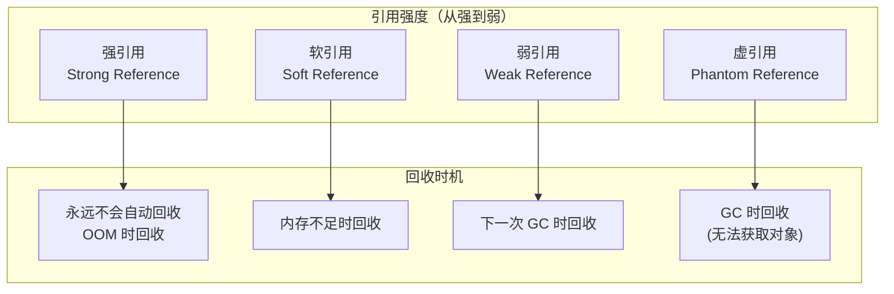
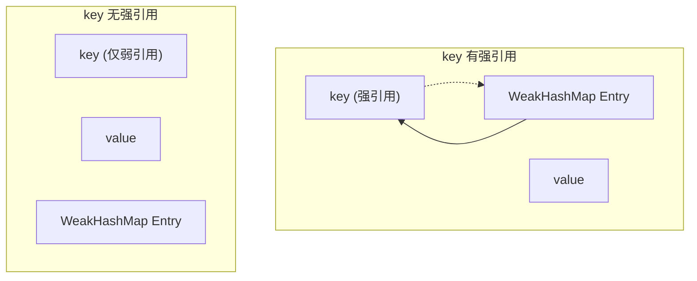

# 四种引用类型

**目标级别**：P5/P6

## 面试官最关心的 3 个问题

1. Java 有哪四种引用类型？它们的回收时机分别是什么？
2. 软引用适合用在什么场景？
3. WeakHashMap 的实现原理是什么？

---

## 一、引用类型概述

面试官问：「 WeakHashMap 和 HashMap 有什么区别？」你说「WeakHashMap 的 key 是弱引用」——然后面试官追问「弱引用的对象什么时候被回收？WeakHashMap 怎么实现的？」你愣住了。四种引用类型是理解缓存、内存泄漏、GC 机制的关键。



---

## 二、四种引用类型详解

### 1. 强引用（Strong Reference）

最常见的引用类型，只要强引用存在，对象就不会被回收。

```java
Object obj = new Object();  // 强引用
// 只要 obj 不为 null，对象就不会被回收
obj = null;  // 断开引用，对象可回收
```

### 2. 软引用（Soft Reference）

在**内存不足时**回收，适用于缓存场景。

```java
import java.lang.ref.SoftReference;

SoftReference<Object> ref = new SoftReference<>(new Object());

// 对象可能在内存不足时被回收
Object obj = ref.get();  // 可能返回 null
```

### 3. 弱引用（Weak Reference）

在**下一次 GC 时**回收，不在乎内存是否充足。

```java
import java.lang.ref.WeakReference;

WeakReference<Object> ref = new WeakReference<>(new Object());

// 下一次 GC 时对象必定被回收
Object obj = ref.get();  // 可能返回 null
```

### 4. 虚引用（Phantom Reference）

无法通过 `get()` 获取对象，仅用于追踪对象被回收的时机。

```java
import java.lang.ref.PhantomReference;
import java.lang.ref.ReferenceQueue;

ReferenceQueue<Object> queue = new ReferenceQueue<>();
PhantomReference<Object> ref = new PhantomReference<>(new Object(), queue);

// ref.get() 永远返回 null
// 对象被回收时，ref 被加入 queue
```

---

## 三、引用队列（Reference Queue）

软引用、弱引用、虚引用可以关联一个引用队列，对象被回收时引用会被加入队列。

```java
public class ReferenceQueueDemo {
    public static void main(String[] args) throws InterruptedException {
        ReferenceQueue<Object> queue = new ReferenceQueue<>();
        
        // 弱引用关联队列
        WeakReference<Object> ref = new WeakReference<>(new Object(), queue);
        
        System.out.println("引用对象: " + ref.get());
        System.out.println("引用是否入队: " + ref.isEnqueued());
        
        // 断开引用，触发 GC
        System.gc();
        Thread.sleep(100);
        
        System.out.println("GC 后引用对象: " + ref.get());
        System.out.println("GC 后是否入队: " + ref.isEnqueued());
        
        // 从队列中取出
        Reference<?> removed = queue.remove(1000);
        if (removed != null) {
            System.out.println("对象被回收，引用入队");
        }
    }
}
```

---

## 四、WeakHashMap 原理

### 为什么 WeakHashMap 的 key 是弱引用？

```java
import java.util.WeakHashMap;

public class WeakHashMapDemo {
    public static void main(String[] args) {
        WeakHashMap<String, String> map = new WeakHashMap<>();
        
        String key = new String("weakKey");  // key 是堆对象
        map.put(key, "value");
        
        System.out.println("引用断开前: " + map.get("weakKey"));
        
        key = null;  // 断开强引用
        System.gc();  // 触发 GC
        
        System.out.println("引用断开后: " + map.get("weakKey"));
    }
}
```

### WeakHashMap 的实现



```java
// WeakHashMap Entry 继承 WeakReference
private static class Entry<K,V> extends WeakReference<Object> {
    private final int hash;
    private final K key;
    private V value;
    
    // ...
}
```

### WeakHashMap vs HashMap

| 维度 | WeakHashMap | HashMap |
|------|-------------|---------|
| **key 引用类型** | 弱引用 | 强引用 |
| **key 回收时机** | 下一次 GC | 永不自动回收 |
| **value 引用类型** | 强引用 | 强引用 |
| **适用场景** | 缓存、注册表 | 普通键值对存储 |
| **内存泄漏风险** | 无（key 自动清理） | key 可能泄漏 |

:::warning WeakHashMap 的陷阱
WeakHashMap 的 value 是**强引用**。如果 key 和 value 互相引用，可能导致 entry 无法被回收：

```java
// 错误示例：value 持有 key 的引用
map.put(key, key);  // key 被 value 持有，无法回收

// 正确做法：使用弱引用包装 key
```
:::

---

## 五、应用场景

### 软引用：缓存

```java
import java.lang.ref.SoftReference;
import java.util.HashMap;
import java.util.Map;

public class ImageCache {
    // 软引用缓存：内存不足时自动清理
    private Map<String, SoftReference<byte[]>> cache = new HashMap<>();
    
    public byte[] getImage(String path) {
        SoftReference<byte[]> ref = cache.get(path);
        if (ref != null) {
            byte[] data = ref.get();
            if (data != null) {
                return data;
            }
            cache.remove(path);
        }
        
        // 加载图片
        byte[] data = loadImage(path);
        cache.put(path, new SoftReference<>(data));
        return data;
    }
}
```

### 弱引用：缓存 + 注册表

```java
import java.lang.ref.WeakReference;
import java.util.Map;
import java.util.concurrent.ConcurrentHashMap;

public class ListenerRegistry {
    // 弱引用缓存：自动清理
    private Map<Object, WeakReference<Listener>> listeners = new ConcurrentHashMap<>();
    
    public void register(Listener listener) {
        listeners.put(listener, new WeakReference<>(listener));
    }
    
    // 无需手动注销，监听器对象无外部引用时自动清理
}
```

### 虚引用：资源清理

```java
import java.lang.ref.PhantomReference;
import java.lang.ref.ReferenceQueue;
import java.nio.ByteBuffer;

public class DirectBufferCleaner {
    public static void clean(ByteBuffer buffer, ReferenceQueue<ByteBuffer> queue) {
        PhantomReference<ByteBuffer> ref = new PhantomReference<>(buffer, queue);
        
        // 对象被回收时，通过 queue 通知
        // 在 ReferenceHandler 线程中清理堆外内存
    }
}
```

---

## 六、高频面试题

### 🔴 第一层：四种引用类型及回收时机

**问题**：Java 有哪四种引用类型？它们的回收时机分别是什么？

**标准答案**：

| 引用类型 | 回收时机 | 典型用途 |
|----------|----------|----------|
| **强引用** | 永不自动回收 | 普通对象引用 |
| **软引用** | 内存不足时回收 | 缓存 |
| **弱引用** | 下一次 GC 时回收 | 缓存、注册表 |
| **虚引用** | GC 时回收，无法获取对象 | 对象生命周期追踪 |

> **第二层追问**：软引用在内存不足时一定被回收吗？
>
> 是的。软引用在 `抛出 OutOfMemoryError` 之前被回收。这是 JVM 的保守策略，确保不会因为软引用导致 OOM。

> **第三层追问**：虚引用有什么实际用途？
>
> 主要用于追踪对象被 GC 回收的时机，典型用途是清理堆外内存（如 DirectByteBuffer）。

---

### 🟡 WeakHashMap 的实现

**问题**：WeakHashMap 如何保证 key 弱引用被回收后自动删除 entry？

**标准答案**：

WeakHashMap 每次操作（get、put、resize 等）都会检查 entry 的 key 是否已被 GC 回收：

```java
private expungeStaleEntries() {
    for (Object o; (o = queue.poll()) != null; ) {
        synchronized (queue) {
            // 从 map 中移除被回收的 key
            expungeEntry((Reference<?>) o);
        }
    }
}
```

> **追问**：为什么 value 也是强引用？
>
> 这是 WeakHashMap 的设计权衡。如果 value 也是弱引用，可能导致 value 在 key 之前被回收，造成不一致状态。

---

### 🟢 ThreadLocal 的内存泄漏

**问题**：ThreadLocal 为什么会内存泄漏？如何避免？

**标准答案**：

ThreadLocal 的实现中，每个 Thread 持有一个 ThreadLocalMap，map 的 entry 继承 `WeakReference<ThreadLocal>`。

```java
static class Entry extends WeakReference<ThreadLocal<?>> {
    Object value;
    // ...
}
```

**泄漏原因**：如果 ThreadLocal 变量超出作用域，但 Thread 仍在运行（线程池场景），ThreadLocalMap 中的 entry（value 是强引用）无法被回收。

**避免方法**：
1. 使用后调用 `threadLocal.remove()`
2. 使用 `ThreadLocal.withInitial()` 简化初始化

---

## 七、常见错误与陷阱

### ⚠️ 陷阱 1：混淆软引用和弱引用的回收时机

软引用在**内存不足时**回收，弱引用在**下一次 GC 时**回收。两者回收时机不同，适用场景也不同。

### ⚠️ 陷阱 2：忘记 WeakHashMap 的 value 是强引用

WeakHashMap 只保证 key 被回收，但 value 仍是强引用。如果 value 引用了 key，可能导致 entry 无法回收。

### ⚠️ 陷阱 3：虚引用无法获取对象

`PhantomReference.get()` 永远返回 `null`，这是 Java 语言层面的保证，目的是防止通过虚引用"复活"对象。

---

## 八、对比总结表

| 引用类型 | get() 返回值 | 回收时机 | 适用场景 |
|----------|-------------|----------|----------|
| **强引用** | 对象引用 | 永不自动 | 普通对象 |
| **软引用** | 对象或 null | OOM 前 | 图片缓存 |
| **弱引用** | 对象或 null | 下次 GC | 注册表缓存 |
| **虚引用** | 永远 null | GC 时 | 堆外内存清理 |

---

## 九、加分回答

### 💡 Reference 对象的内部状态

每个 Reference 对象都有内部状态：

```java
public enum ReferenceState {
    ACTIVE,      // 活跃状态
    PENDING,     // 等待入队
    ENQUEUED,    // 已入队
    INACTIVE     // 失活，等待回收
}
```

ReferenceHandler 线程负责将 PENDING 状态的引用加入队列，并清理已回收对象的引用。

### 💡 Java 9 的 Reference 增强

Java 9 引入了 `Reference#reachabilityFence()` 方法，用于保证对象在指定点之前保持可达：

```java
public void process() {
    // 确保 obj 在这之前保持强引用
    Reference.reachabilityFence(obj);
    // 后续代码 obj 可能不再被引用
}
```

---

## 十、扩展思考

如果同时有软引用、弱引用指向同一个对象，回收顺序是什么？

> **答案**：
> 回收顺序取决于引用类型和 JVM 实现：
> 1. **虚引用**：GC 时必定被回收
> 2. **弱引用**：下一次 GC 时被回收
> 3. **软引用**：内存不足时回收
>
> 但实际上，同一个对象的多个引用中，只要有一个**强引用链**可达，对象就不会被回收。引用类型只影响**没有强引用时**的回收时机。
