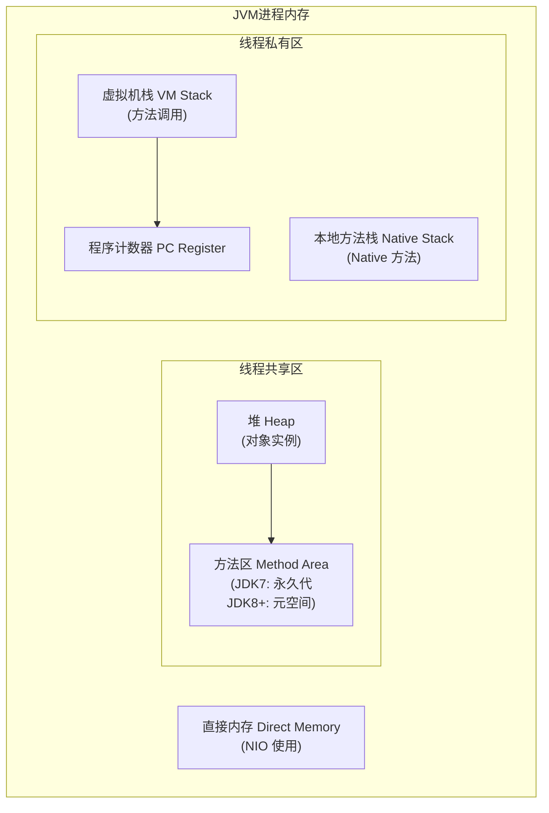
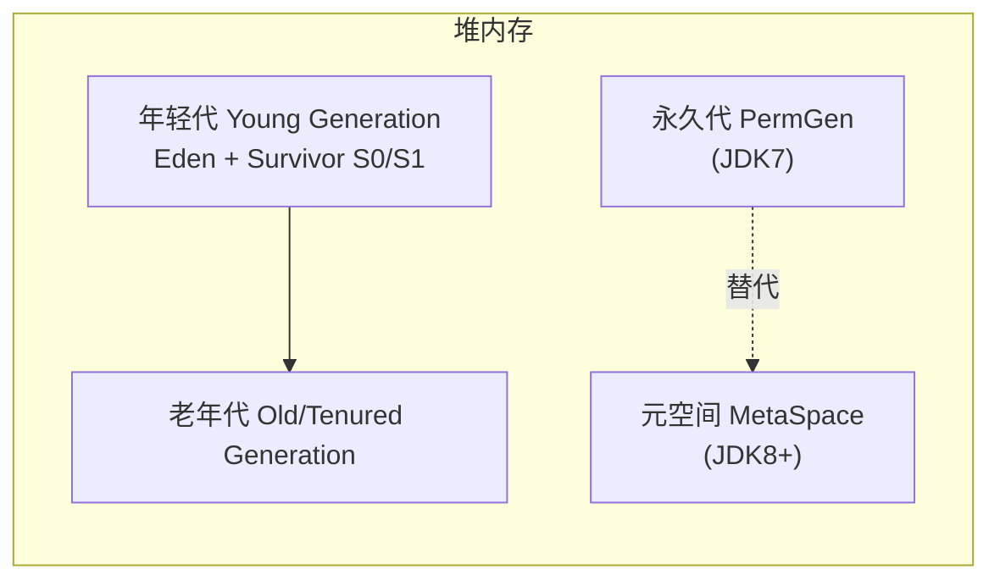
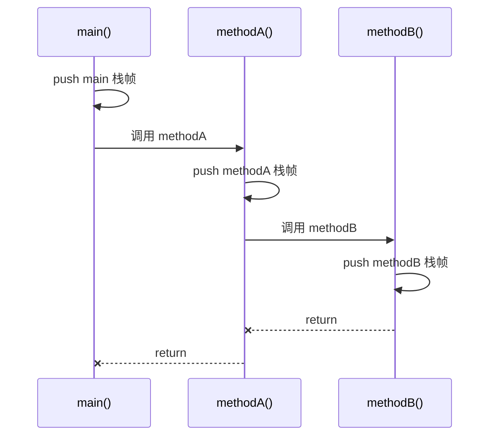

# JVM 运行时数据区

**目标级别**：P5/P6

## 面试官最关心的 3 个问题

1. JVM 有哪些运行时数据区？哪些是线程共享的，哪些是线程私有的？
2. 堆和栈的区别是什么？为什么需要区分？
3. 方法区在 JDK8 发生了什么变化？

---

## 一、运行时数据区全景图

面试官问：「JVM 内存结构是什么样的？」你画了一张图，但面试官紧接着追问：「哪些区域是线程安全的？」你愣住了。这道题看似简单，但真正的高手会在回答时展现对 JVM 设计的深层理解。



### 线程共享 vs 线程私有

| 区域 | 线程共享 | 线程私有 | 异常类型 |
|------|----------|----------|----------|
| **堆 Heap** | ✅ | | `OutOfMemoryError: Java heap space` |
| **方法区** | ✅ | | `OutOfMemoryError: Metaspace` (JDK8+) |
| **虚拟机栈** | | ✅ | `StackOverflowError` / `OutOfMemoryError` |
| **程序计数器** | | ✅ | 无（唯一没有 OOM 的区域） |
| **本地方法栈** | | ✅ | `StackOverflowError` / `OutOfMemoryError` |

---

## 二、各区域详解

### 1. 堆（Heap）—— 线程共享

堆是 JVM 管理的主要内存区域，用于存放**对象实例和数组**。



**核心特点**：

- 垃圾回收的主要管理区域
- 物理上不连续，逻辑上连续
- 可通过 `-Xms` / `-Xmx` 设置大小
- JDK8+ 彻底移除永久代，改用**元空间**（Metaspace）

:::tip JDK 版本差异
| 版本 | 字符串常量 | 静态变量 | 类元信息 |
|------|------------|----------|----------|
| JDK7 | 堆 | 堆 | 永久代 |
| JDK8+ | 堆 | 堆 | 元空间（本地内存） |
:::

### 2. 虚拟机栈（VM Stack）—— 线程私有

每个线程在创建时都会分配一个虚拟机栈，每个方法调用都会创建一个**栈帧（Stack Frame）**。



**核心特点**：

- 线程私有，生命周期与线程相同
- 存储局部变量、方法参数、方法返回值
- `-Xss` 设置栈大小（默认 1MB）
- 递归调用过深会导致 `StackOverflowError`

### 3. 程序计数器（Program Counter Register）—— 线程私有

每个线程都有独立的程序计数器，记录当前线程执行的**字节码行号**。

```java
public class BytecodeExample {
    public int calculate(int a, int b) {
        int c = a + b;  // 行号 0: iconst_0 ~ istore_3
        int d = c * 2; // 行号 3: iload_3 ~ istore 4
        return d;      // 行号 5: iload 4 ~ ireturn
    }
}
```

**核心特点**：

- 唯一没有 `OutOfMemoryError` 的区域
- 执行 Native 方法时，计数器值为 undefined
- 是 JVM 规范中唯一没有规定 OutOfMemoryError 的区域

### 4. 本地方法栈（Native Stack）—— 线程私有

与虚拟机栈类似，但服务于 **Native 方法**（如 `Thread.start()`、`Object.clone()`）。

```java
// 本地方法示例
public class Thread {
    private native void start0();   // native 方法
    private native void init0(...); // native 方法
}
```

### 5. 方法区（Method Area）—— 线程共享（JDK7）

存储类信息（类的元数据）、常量、静态变量、JIT 编译后的代码。

```java
// 存储在方法区的数据
public class User {
    static final int MAX_SIZE = 100;     // 静态常量
    static Map<String, String> cache;    // 静态变量
    public static void say() {...}       // 方法字节码
}
```

:::warning JDK8 重大变化
JDK8 彻底移除永久代，方法区数据迁移：
- **类元信息** → 元空间（Metaspace），使用本地内存
- **字符串常量池** → 堆（Heap）
- **静态变量** → 堆（Heap）
:::

### 6. 运行时常量池（Runtime Constant Pool）

方法区的一部分，存放编译期生成的各种**字面量和符号引用**。

```java
public class ConstantPool {
    public static void main(String[] args) {
        // 字符串常量池
        String s1 = "hello";
        String s2 = "hello";
        System.out.println(s1 == s2); // true，指向同一个常量
        
        // new 会在堆创建新对象
        String s3 = new String("hello");
        System.out.println(s1 == s3); // false，堆对象
    }
}
```

---

## 三、高频面试题

### 🔴 第一层：JVM 内存区域划分

**问题**：JVM 有哪些运行时数据区？

**标准答案**：

JVM 运行时数据区分为 6 个区域：

1. **堆（Heap）**：线程共享，存储对象实例和数组
2. **方法区（Method Area）**：线程共享，存储类信息、常量、静态变量（JDK7 永久代）
3. **虚拟机栈（VM Stack）**：线程私有，每个方法调用对应一个栈帧
4. **程序计数器（PC Register）**：线程私有，记录字节码行号
5. **本地方法栈（Native Stack）**：线程私有，服务 Native 方法
6. **运行时常量池**：方法区的一部分

> **第二层追问**：哪些区域会产生 OutOfMemoryError？
>
> 除程序计数器外，其他区域都可能抛出 OOM。

> **第三层追问**：为什么需要区分线程共享和线程私有区域？
>
> 线程私有区域不需要考虑线程同步，访问效率更高；线程共享区域需要 GC 管理，增加了复杂度。

---

### 🟡 GC Root 有哪些可以成为 GC Roots？

**问题**：哪些对象可以作为 GC Roots？

**标准答案**：

1. **虚拟机栈中引用的对象**：当前正在执行的方法中的局部变量
2. **本地方法栈中引用的对象**：Native 方法中的对象
3. **方法区中静态属性引用的对象**：类的静态变量
4. **方法区中常量引用的对象**：字符串常量池中的对象
5. **JVM 内部引用**：Class 对象、异常对象、系统类加载器
6. **持有同步锁的对象**：synchronized 关键字持有的对象

---

## 四、常见错误与陷阱

### ⚠️ 陷阱 1：混淆 JDK7 和 JDK8 的方法区

很多人以为「方法区就是永久代」，这是 JDK7 的认知。JDK8 移除了永久代，改用元空间。如果面试官问到 JDK8 的变化，一定要主动提及这个区别。

### ⚠️ 陷阱 2：认为所有区域都会产生 OOM

程序计数器是唯一不会产生 OOM 的区域，因为它只存储当前行号，不存储实际数据。

### ⚠️ 陷阱 3：忽略直接内存

直接内存（Direct Memory）是 NIO 使用的堆外内存，不属于运行时数据区，但常被面试官问到。设置 `-XX:MaxDirectMemorySize` 限制其大小。

---

## 五、对比总结表

| 区域 | 线程共享 | 存储内容 | 异常 | 大小设置 |
|------|----------|----------|------|----------|
| **堆** | ✅ | 对象实例、数组 | `OOM: heap` | `-Xms` `-Xmx` |
| **方法区** | ✅ | 类信息、常量、静态变量 | `OOM: metaspace` | `-XX:MetaspaceSize` |
| **虚拟机栈** | | 方法调用、局部变量 | `SOF` / `OOM` | `-Xss` |
| **程序计数器** | | 字节码行号 | 无 | 固定大小 |
| **本地方法栈** | | Native 方法调用 | `SOF` / `OOM` | `-Xss` |

---

## 六、加分回答

### 💡 为什么 JDK8 要移除永久代？

1. **字符串常量池迁移到堆**：永久代大小难以调优，容易出现 `PermGen OOM`
2. **元空间使用本地内存**：不再受 JVM 堆大小限制，更灵活
3. **支持更多类加载**：HotSpot 移除了 PermGen，释放了大量 Metaspace 元数据
4. **统一垃圾回收策略**：元空间使用 CMS 进行回收，不再单独管理

### 💡 逃逸分析与栈上分配

JVM 通过**逃逸分析**判断对象是否逃逸出方法作用域，未逃逸的对象可以分配在**栈上**而非堆上，避免 GC 开销。

```java
public void process() {
    // 如果 allocate() 返回的对象没有逃逸
    // JVM 可能直接在栈上分配，而非堆
    User user = allocate();
    user.process();
} // user 随栈帧出栈自动释放，无需 GC
```

---

## 七、扩展思考

既然线程私有区域不需要 GC 管理，为什么 JVM 还要保留线程共享区域？能否全部改成线程私有？

> **答案**：线程私有虽然高效，但会导致数据无法共享。每个线程都复制一份完整数据，内存占用会爆炸式增长。JVM 设计选择「线程私有 + 共享区域」的混合模式，在效率和灵活性之间取得平衡。
