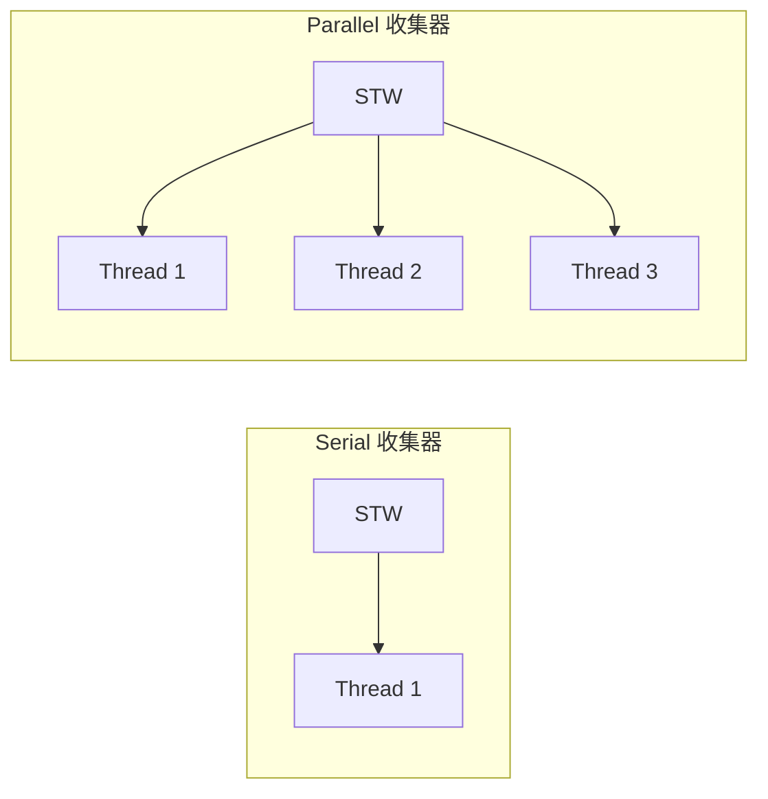

# Serial 与 Parallel 收集器

**目标级别**：P5/P6

## 面试官最关心的 3 个问题

1. Serial 和 Parallel 收集器的区别是什么？
2. Parallel 收集器有哪些关键参数？
3. Parallel 和 ParNew 有什么区别？

---

## 一、Serial 与 Parallel 概述

面试官问：「你用过哪些 GC 收集器？」你说「CMS、G1」——然后面试官追问「Serial 和 Parallel 呢？它们是什么原理？用在什么场景？」你愣住了。单线程收集器是理解其他收集器的基础，也是面试中的常见问题。



---

## 二、Serial 收集器

### 工作原理

Serial 是最古老的收集器，使用**单线程**进行垃圾回收。


### 配置参数

```bash
# 年轻代：Serial 收集器
-XX:+UseSerialGC

# 老年代：Serial Old 收集器
# （与 UseSerialGC 配合自动启用）
```

### 特点

| 特点 | 说明 |
|------|------|
| 单线程 | GC 时只有一个线程工作 |
| STW | 全程 Stop The World |
| 简单高效 | 无锁开销，适合小型应用 |
| 内存占用小 | 无额外线程开销 |

---

## 三、Parallel 收集器

### Parallel Scavenge（年轻代）

Parallel Scavenge 是 JDK8 默认的年轻代收集器，使用**多线程并行**进行垃圾回收。


### Parallel Old（老年代）

JDK8 默认的老年代收集器，使用**多线程并行**的**标记整理**算法。

### 关键参数

```bash
# 启用 Parallel 收集器
-XX:+UseParallelGC          # 年轻代：Parallel Scavenge
                            # 老年代：Parallel Old

# 设置并行线程数
-XX:ParallelGCThreads=8     # 默认 = CPU 核心数

# 设置吞吐量目标
-XX:GCTimeRatio=99          # GC 时间占比 = 1/(1+99) = 1%
                            # 即目标吞吐量 = 99%

# 设置最大停顿时间
-XX:MaxGCPauseMillis=200   # 目标最大停顿时间（毫秒）

# 开启自适应大小策略
-XX:+UseAdaptiveSizePolicy # JDK8 默认开启
```

### 吞吐量调优

```bash
# 高吞吐量场景（批处理、离线计算）
-XX:GCTimeRatio=19          # 吞吐量目标 = 95%
-XX:+UseParallelGC

# 低延迟场景（实时响应）
-XX:MaxGCPauseMillis=100   # 最大停顿时间 = 100ms
```

---

## 四、Serial vs Parallel

### 核心对比

| 维度 | Serial | Parallel Scavenge |
|------|--------|-------------------|
| **线程数** | 单线程 | 多线程并行 |
| **GC 算法** | 复制 | 复制 |
| **STW** | 全程 STW | 全程 STW |
| **吞吐量** | 低 | 高 |
| **停顿时间** | 长 | 可通过参数控制 |
| **CPU 开销** | 低 | 高（多线程） |
| **适用场景** | 小型应用、客户端 | 服务端、高吞吐应用 |

### GC 日志对比

```bash
# Serial 日志
[GC (Allocation Failure) [DefNew: 65536K->0K(65536K)] 131072K->65536K(262144K) 0.035s]

# Parallel Scavenge 日志
[GC (Allocation Failure) [PSYoungGen: 65536K->0K(65536K)] 131072K->65536K(262144K) 0.015s]
```

注意：`DefNew` vs `PSYoungGen` 标识不同。

---

## 五、Parallel Scavenge 的自适应策略

### UseAdaptiveSizePolicy

当开启自适应策略时，JVM 自动调整：

- 年轻代 Eden 和 Survivor 比例
- 对象晋升年龄
- 老年代大小

```bash
# 开启自适应策略（JDK8 默认）
-XX:+UseAdaptiveSizePolicy

# 关闭自适应策略
-XX:-UseAdaptiveSizePolicy
```

### 自适应调优的影响

| 参数 | 自适应开启 | 自适应关闭 |
|------|------------|------------|
| `-Xmn` | 可省略 | 推荐设置 |
| `-XX:SurvivorRatio` | 自动调整 | 使用指定值 |
| `-XX:MaxTenuringThreshold` | 自动调整 | 使用指定值 |

:::warning 生产环境建议
生产环境通常关闭自适应策略，通过显式参数控制 GC 行为，提高可预测性。
:::

---

## 六、高频面试题

### 🔴 第一层：Serial 和 Parallel 的区别

**问题**：Serial 和 Parallel 收集器有什么区别？

**标准答案**：

| 维度 | Serial | Parallel |
|------|--------|----------|
| **线程数** | 单线程 | 多线程并行 |
| **GC 算法** | 复制 | 复制 |
| **吞吐量** | 低 | 高 |
| **CPU 开销** | 低 | 高 |
| **适用场景** | 小型应用 | 服务端高吞吐 |

> **第二层追问**：Parallel Scavenge 的设计目标是什么？
>
> 目标是**吞吐量最大化**。通过 `-XX:GCTimeRatio` 参数控制 GC 时间占比，适合批处理、离线计算等场景。

> **第三层追问**：为什么 Serial 还在使用？
>
> Serial 简单高效、无锁开销，适合：
> - 客户端应用（CPU 通常只有 1-2 核）
> - 小型应用（堆内存 < 100MB）
> - 资源受限环境

---

### 🟡 Parallel 和 ParNew 的区别

**问题**：Parallel Scavenge 和 ParNew 有什么区别？

**标准答案**：

| 维度 | Parallel Scavenge | ParNew |
|------|-------------------|--------|
| **设计目标** | 吞吐量最大化 | 停顿时间最小化 |
| **与 CMS 配合** | ❌ | ✅ |
| **自适应策略** | ✅ | ❌ |
| **CPU 利用率** | 固定线程数 | 可动态调整 |

```bash
# ParNew + CMS（停顿时间优先）
-XX:+UseParNewGC
-XX:+UseConcMarkSweepGC

# Parallel Scavenge + Parallel Old（吞吐量优先）
-XX:+UseParallelGC
```

---

### 🟢 Parallel Old 收集器

**问题**：Parallel Old 是什么？和 Parallel Scavenge 的关系？

**标准答案**：

Parallel Old 是 Parallel Scavenge 的老年代版本，使用**多线程并行**的**标记整理**算法。

```bash
# 完整配置（吞吐量优先）
-XX:+UseParallelGC
# 自动启用 Parallel Old 作为老年代收集器
```

---

## 七、常见错误与陷阱

### ⚠️ 陷阱 1：混淆 Serial 和 Serial Old

Serial 是年轻代收集器（复制算法），Serial Old 是老年代收集器（标记整理）。Serial GC 组合指的是 Serial + Serial Old。

### ⚠️ 陷阱 2：Parallel 不能和 CMS 配合

Parallel Scavenge 不能和 CMS 配合，必须使用 ParNew 作为年轻代收集器。

### ⚠️ 陷阱 3：忽略 MaxGCPauseMillis 的影响

MaxGCPauseMillis 是**目标**，不是**保证**。如果设置过小，JVM 可能通过减小年轻代大小来满足，反而导致 GC 频繁。

---

## 八、对比总结表

| 收集器 | 作用区域 | 算法 | 线程数 | STW | 目标 |
|--------|----------|------|--------|-----|------|
| **Serial** | 年轻代 | 复制 | 1 | 全程 | 简单高效 |
| **Serial Old** | 老年代 | 标记整理 | 1 | 全程 | 简单高效 |
| **Parallel Scavenge** | 年轻代 | 复制 | 多 | 全程 | 吞吐量 |
| **Parallel Old** | 老年代 | 标记整理 | 多 | 全程 | 吞吐量 |

---

## 九、加分回答

### 💡 为什么 Parallel Scavenge 不能和 CMS 配合？

Parallel Scavenge 使用独占式的 GC 方式，而 CMS 是并发式的。两种 GC 模式冲突，无法同时工作。

ParNew 是为了配合 CMS 而设计的年轻代收集器，它的行为和 Parallel Scavenge 相似，但支持与 CMS 并发执行。

### 💡 Parallel GC 的适用场景

```bash
# 批处理场景
java -Xmx4g -Xms4g \
     -XX:+UseParallelGC \
     -XX:GCTimeRatio=19 \
     -XX:ParallelGCThreads=8 \
     BatchProcessor

# 实时响应场景（建议用 G1 或 ZGC）
```

---

## 十、扩展思考

如果一个应用 CPU 只有 2 核，应该用 Serial 还是 Parallel？

> **答案**：
> 取决于应用类型：
> - **低并发、低吞吐**：Serial 更合适，因为 Parallel 的多线程开销（线程切换、同步）可能抵消并行收益
> - **高并发、高吞吐**：Parallel 合适，即使只有 2 核，也能提升吞吐量
>
> 建议通过 `-XX:ParallelGCThreads=2` 限制线程数，避免过多上下文切换。
