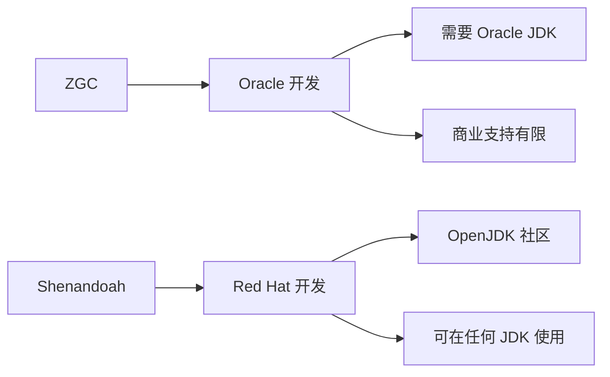
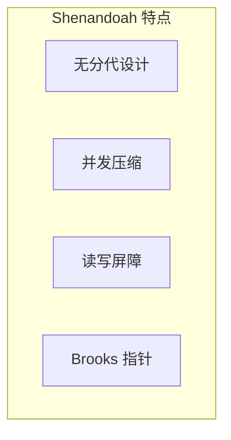
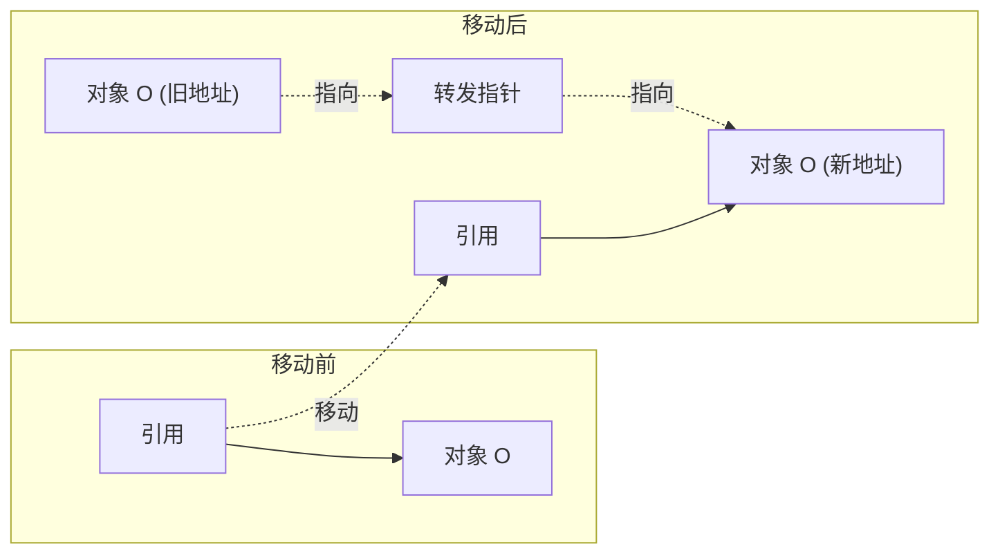
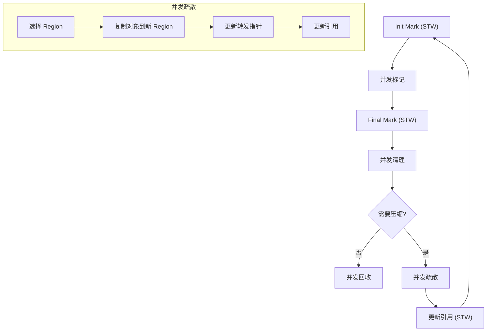
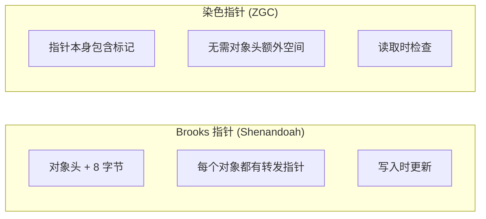

# Shenandoah GC

**目标级别**：P7

## 面试官最关心的 3 个问题

1. Shenandoah GC 是什么？它和 ZGC 有什么区别？
2. Shenandoah 为什么不需要分代？
3. Shenandoah 的 Brooms 是什么？

---

## 一、Shenandoah 概述

面试官问：「Shenandoah GC 是什么？」你说「和 ZGC 类似的低停顿收集器」——然后面试官追问「它和 ZGC 有什么不同？为什么 Red Hat 要开发它？」你愣住了。Shenandoah 是 OpenJDK 社区开发的低停顿收集器，有其独特的设计哲学。

### Shenandoah 的诞生背景



| 收集器 | 开发方 | 许可 | 开源 |
|--------|--------|------|------|
| **ZGC** | Oracle | 闭源（OpenJDK 实现） | 部分 |
| **Shenandoah** | Red Hat | OpenJDK | 完全 |

---

## 二、Shenandoah 的设计

### 核心特点



| 特点 | 说明 |
|------|------|
| **无分代设计** | 统一管理所有对象，不区分年轻代和老年代 |
| **并发压缩** | 移动对象时与应用并发进行 |
| **读写屏障** | 使用读写屏障保证并发正确性 |
| **Brooks 指针** | 每个对象有一个转发指针 |

---

## 三、Brooks 指针

### 转发指针原理

Shenandoah 使用 **Brooks Pointer**（转发指针）解决对象移动时的引用更新问题。



### 转发指针的作用

```java
// 转发指针结构
class Object {
    BrooksPointer fwd;  // 转发指针
    Object data;        // 对象数据
}

// 读取对象
Object load(Object* addr) {
    Object obj = *addr;
    if (obj.hasForwarding()) {
        obj = obj.forwardee();  // 获取实际地址
    }
    return obj;
}
```

---

## 四、Shenandoah 的收集过程

### 收集周期



### 各阶段说明

| 阶段 | STW | 说明 |
|------|-----|------|
| **Init Mark** | ✅ | 标记 GC Roots |
| **并发标记** | ❌ | 标记存活对象 |
| **Final Mark** | ✅ | 完成标记，准备压缩 |
| **并发清理** | ❌ | 清理死亡对象 |
| **并发疏散** | ❌ | 移动对象，更新引用 |
| **更新引用** | ✅（短） | 全局引用更新 |

---

## 五、Shenandoah vs ZGC

### 核心对比

| 维度 | Shenandoah | ZGC |
|------|------------|-----|
| **分代** | 无分代 | 无分代（JDK21+ 分代） |
| **并发机制** | Brooks 指针 | 染色指针 |
| **内存开销** | 每个对象 +8 字节 | 指针标记位 |
| **引用更新** | 转发指针 | 读屏障 |
| **GC 算法** | 标记-复制 | 标记-复制 |
| **OpenJDK 支持** | ✅ 完全 | 部分 |
| **JDK 版本** | JDK8+ (移植版) | JDK11+ |

### Brooks 指针 vs 染色指针



| 维度 | Brooks 指针 | 染色指针 |
|------|-------------|----------|
| **空间开销** | 对象头 +8 字节 | 指针标记位 |
| **维护方式** | 写入时更新 | 读取时检查 |
| **一致性保证** | 写入屏障 | 读屏障 |
| **实现复杂度** | 较高 | 中 |

---

## 六、Shenandoah 参数配置

### 启用 Shenandoah

```bash
# JDK11+ 启用 Shenandoah
-XX:+UseShenandoahGC

# JDK8 移植版
# 需要额外编译或使用 AdoptOpenJDK
```

### 常用参数

```bash
# 设置堆大小
-Xmx32g -Xms32g

# 设置 GC 模式
-XX:ShenandoahGCHeuristics=adaptive  # 自适应
-XX:ShenandoahGCHeuristics=static     # 静态
-XX:ShenandoahGCHeuristics=compact    # 激进压缩

# 设置停顿时间目标
-XX:MaxGCPauseMillis=10

# 设置并发线程数
-XX:ConcGCThreads=8
```

### 最佳实践

```bash
java -Xmx32g -Xms32g \
     -XX:+UseShenandoahGC \
     -XX:ShenandoahGCHeuristics=adaptive \
     -XX:MaxGCPauseMillis=10 \
     -XX:ConcGCThreads=8 \
     Application
```

---

## 七、高频面试题

### 🔴 第一层：Shenandoah 的原理

**问题**：Shenandoah GC 是如何工作的？

**标准答案**：

Shenandoah 使用 **Brooks 指针**（转发指针）实现并发压缩：

1. 每个对象有一个额外的转发指针
2. 对象移动时，旧位置保留转发指针指向新位置
3. 读取对象时，通过转发指针获取最新地址

**收集过程**：

- Init Mark（STW）：标记 GC Roots
- 并发标记：标记存活对象
- Final Mark（STW）：完成标记
- 并发清理：清理死亡对象
- 并发疏散：移动对象，更新转发指针

> **第二层追问**：Shenandoah 为什么使用 Brooks 指针而不是染色指针？
>
> Shenandoah 开发时，染色指针需要 JVM 层面的特殊支持。Brooks 指针可以在用户空间实现，更容易移植到不同 JDK 版本。

> **第三层追问**：Brooks 指针的开销是多少？
>
> 每个对象增加 8 字节开销（约 1%~3% 内存开销），加上读写屏障开销。

---

### 🟡 Shenandoah vs ZGC

**问题**：Shenandoah 和 ZGC 有什么区别？

**标准答案**：

| 维度 | Shenandoah | ZGC |
|------|------------|-----|
| **并发机制** | Brooks 指针 | 染色指针 |
| **空间开销** | 对象头 +8 字节 | 指针标记位 |
| **JDK 支持** | JDK8+ | JDK11+ |
| **OpenJDK 支持** | 完全 | 部分 |
| **分代支持** | 无 | JDK21+ 有 |

---

### 🟢 Shenandoah 的局限性

**问题**：Shenandoah 有什么局限性？

**标准答案**：

1. **无分代**：所有对象统一管理，GC 开销较大
2. **内存开销**：Brooks 指针每个对象 +8 字节
3. **吞吐略低**：读写屏障带来额外开销
4. **社区活跃度**：相比 ZGC 社区较小

---

## 八、对比总结表

| 维度 | CMS | G1 | ZGC | Shenandoah |
|------|-----|-----|-----|------------|
| **停顿时间** | 长 | 中 | **极短** | **极短** |
| **并发机制** | 写屏障 | 写屏障+RSet | 染色指针 | Brooks 指针 |
| **分代** | 有 | 有 | 无 | 无 |
| **内存开销** | 低 | 中 | 极低 | 中 |
| **JDK 版本** | 5-14 | 9+ | 11+ | 8+ |

---

## 九、加分回答

### 💡 Shenandoah 的 GC 策略

Shenandoah 支持多种 GC 策略：

```bash
# 自适应策略（默认）
-XX:ShenandoahGCHeuristics=adaptive

# 静态策略
-XX:ShenandoahGCHeuristics=static

# 激进压缩
-XX:ShenandoahGCHeuristics=compact

# 被动策略（低延迟优先）
-XX:ShenandoahGCHeuristics=passive
```

### 💡 为什么 Shenandoah 无分代

Red Hat 认为分代带来的复杂度超过收益：

1. 无需维护 RSet（高内存开销）
2. 简化 GC 算法
3. 适合大堆场景

---

## 十、扩展思考

如果需要同时使用 OpenJDK 和追求低停顿，应该选择 ZGC 还是 Shenandoah？

> **答案**：
>
> | 场景 | 推荐 |
> |------|------|
> | JDK11+ | ZGC |
> | JDK8+ | Shenandoah |
> | 需要商业支持 | ZGC（Oracle） |
> | 完全开源 | Shenandoah |
> | 超大堆（> 64GB） | ZGC |
>
> 总体建议：
> - JDK11+ 首选 **ZGC**（性能更好，社区更活跃）
> - JDK8 或需要完全开源选择 **Shenandoah**
