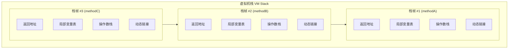
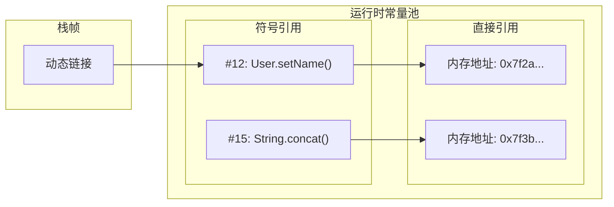

# 栈帧结构

**目标级别**：P6

## 面试官最关心的 3 个问题

1. 栈帧包含哪些部分？
2. 局部变量表和操作数栈的作用是什么？
3. 递归为什么会引发 StackOverflowError？

---

## 一、栈帧概述

面试官问：「方法调用的底层实现是什么？」你脱口而出「压栈」——然后面试官追问「栈帧里面具体存了什么？」你画了个框图，但说不清局部变量表和操作数栈的区别。栈帧是理解方法调用、参数传递、递归调用的基础。



### 栈帧组成

| 组成部分 | 作用 | 大小 |
|----------|------|------|
| **局部变量表** | 存储方法参数和方法内部局部变量 | 固定 |
| **操作数栈** | 方法执行过程中的临时数据存储 | 固定 |
| **动态链接** | 指向运行时常量池的符号引用 | 指针 |
| **返回地址** | 方法返回后继续执行的地址 | 指针 |

---

## 二、局部变量表

### 基本概念

局部变量表存储**方法参数**和**方法内部定义的局部变量**。

```java
public int calculate(int a, int b) {
    int c = a + b;        // 局部变量 c
    int d = c * a;        // 局部变量 d
    return d;
}
```

对应的字节码：

```java
public calculate(int, int)I
// 局部变量槽位分配
// 0: this（方法所属对象，非静态方法）    1: int a
// 2: int b                                  3: int c
// 4: int d
   0: iload_1        // 加载局部变量 a 到��作数栈
   1: iload_2        // 加载局部变量 b 到操作数栈
   2: iadd           // 弹出两个 int，相加，结果压栈
   3: istore_3       // 弹出结果，存入局部变量表槽位 3 (c)
   4: iload_3        // 加载 c
   5: iload_1        // 加载 a
   6: imul           // c * a
   7: istore 4       // 结果存入局部变量表槽位 4 (d)
   8: iload 4        // 加载返回值
   9: ireturn        // 返回
```

### 槽位分配规则

| 类型 | 占用槽位数 | 示例 |
|------|------------|------|
| double / long | 2 个槽位 | `long l;` |
| 基本类型 | 1 个槽位 | `int i;` |
| reference（引用） | 1 个槽位 | `Object obj;` |
| returnAddress | 1 个槽位 | - |

:::warning 槽位复用
局部变量表的槽位可以复用。一个局部变量在其作用域结束后，后续变量可以使用同一个槽位，减少内存占用。
:::

### 非静态方法的隐藏 this

```java
public class User {
    public void setName(String name) {
        this.name = name;  // this 存在，但未显式声明
    }
}
```

编译后的字节码：

```java
public setName(Ljava/lang/String;)V
   0: aload_0         // 加载 this 到操作数栈
   1: aload_1         // 加载参数 name
   2: putfield        // 将 name 赋值给 this.name
   5: return
```

局部变量表槽位 0 保存 `this`，非静态方法才能使用 `this`。

---

## 三、操作数栈

### 基本概念

操作数栈是一个 **LIFO（后进先出）** 栈，用于方法执行过程中的**临时计算**。

```java
public int calculate(int a, int b) {
    int c = a + b * 2;
    return c;
}
```

执行流程：

```mermaid
sequenceDiagram
    participant E as 操作数栈
    
    Note over E: iload_1 (加载 a=3)
    E->>E: push 3
    
    Note over E: iload_2 (加载 b=2)
    E->>E: push 2
    
    Note over E: bipush 2 (压入常量 2)
    E->>E: push 2
    
    Note over E: imul (b * 2)
    E--x>E: pop 2
    E--x>E: pop 2
    E->>E: push 4
    
    Note over E: iadd (a + 4)
    E--x>E: pop 4
    E--x>E: pop 3
    E->>E: push 7
    
    Note over E: istore_3 (存 c)
    E--x>E: pop 7
```

### 操作数栈与局部变量表配合

```java
public int max(int a, int b) {
    if (a > b) {
        return a;
    }
    return b;
}
```

字节码执行：

```java
public max(II)I
   0: iload_1        // 加载 a 到操作数栈
   1: iload_2        // 加载 b 到操作数栈
   2: if_icmpgt 7    // 弹出两个 int 比较，若 a>b，跳转 7
   3: iload_2        // 加载 b
   4: istore_3       // 存入局部变量表槽位 3
   5: goto 9         // 跳转到 return
   7: iload_1        // 加载 a
   9: ireturn        // 返回栈顶值
```

---

## 四、动态链接

### 符号引用与直接引用



### 动态链接的作用

```java
public class Service {
    public void process() {
        String result = "Hello".concat(" World");
        // 编译时：concat() 是符号引用 "#concat"
        // 运行时：动态链接将符号引用解析为直接引用
    }
}
```

类加载时，符号引用保存在常量池；运行时，JVM 通过动态链接将符号引用**解析**为实际内存地址。

---

## 五、返回地址

### 方法返回类型

| 返回类型 | 说明 | 字节码指令 |
|----------|------|------------|
| **正常返回** | 方法正常执行完毕 | `ireturn` / `lreturn` / `areturn` / `return` |
| **异常返回** | 方法抛出异常，未捕获 | 异常表决定跳转目标 |
| **同步方法退出** | synchronized 方法释放 monitor | `monitorexit` |

### 异常表结构

```java
public int divide(int a, int b) {
    return a / b;
}
```

编译生成的异常表：

```java
Exception table:
   from    to  target type
       0     3     3   Class java/lang/ArithmeticException
       0     3     3   Class java/lang/Exception
       0     3     3   Class java/lang/Throwable
```

当 `a / b` 发生除零异常时，跳转到字节码偏移量 3（抛出异常）。

---

## 六、高频面试题

### 🔴 第一层：栈帧包含哪些部分

**问题**：请描述栈帧的组成部分。

**标准答案**：

栈帧包含四个部分：

1. **局部变量表**：存储方法参数和方法内部局部变量
2. **操作数栈**：方法执行过程中的临时数据存储，用于计算
3. **动态链接**：指向运行时常量池的符号引用，支持方法调用
4. **返回地址**：方法返回后继续执行的地址

> **第二层追问**：局部变量表的大小是编译时确定的吗？
>
> 是的。局部变量表的大小在编译时确定，存储在 `Code` 属性中。运行时不改变大小，但槽位可以复用。

> **第三层追问**：操作数栈为什么需要栈结构？
>
> 因为方法执行是嵌套的，表达式求值遵循运算符优先级。栈的 LIFO 特性天然适合处理嵌套计算和子表达式。

---

### 🟡 递归与 StackOverflowError

**问题**：递归为什么会引发 StackOverflowError？

**标准答案**：

递归调用时，每个方法调用都会在栈上创建一个栈帧。当递归调用过深（通常是数万次），栈空间耗尽，新栈帧无法分配，抛出 `StackOverflowError`。

```java
public class StackOverflowDemo {
    static int count = 0;
    
    public static void recursive() {
        count++;
        recursive(); // 递归调用
    }
    
    public static void main(String[] args) {
        try {
            recursive();
        } catch (StackOverflowError e) {
            System.out.println("递归次数: " + count);
        }
    }
}
```

| 因素 | 对栈深度的影响 |
|------|----------------|
| 局部变量越多 | 每个栈帧越大，深度越小 |
| 参数越多 | 每个栈帧越大，深度越小 |
| `-Xss` 越大 | 栈深度越大 |

---

### 🟢 操作数栈如何执行表达式？

**问题**：请描述 `a + b * c` 在操作数栈上的执行过程。

**标准答案**：

```java
iload_1      // 加载 a
iload_2      // 加载 b
iload_3      // 加载 c
imul         // 弹出 b 和 c，计算 b*c，结果压栈
iadd         // 弹出 b*c 和 a，计算 a+(b*c)，结果压栈
```

---

## 七、常见错误与陷阱

### ⚠️ 陷阱 1：混淆局部变量表和操作数栈

局部变量表是**索引访问**的数组，操作数栈是**压栈/弹栈**的 LIFO 栈。它们的访问方式完全不同。

### ⚠️ 陷阱 2：认为所有局部变量都在栈上

**引用类型**的局部变量在栈上只存引用，真正的对象在**堆**上。如果对象只被局部变量引用，GC 时仍可能被回收。

### ⚠️ 陷阱 3：忽略栈帧的内存占用

-Xss 设置过小会导致栈溢出，但设置过大会减少可创建的线程数。例如 `-Xss=2MB`，100 个线程就要消耗 200MB 栈内存。

---

## 八、对比总结表

| 组成部分 | 数据结构 | 访问方式 | 生命周期 |
|----------|----------|----------|----------|
| **局部变量表** | 数组 | 索引访问 `istore_3` | 方法执行期间 |
| **操作数栈** | 栈 | 压栈/弹栈 `iload`/`istore` | 方法执行期间 |
| **动态链接** | 指针 | 间接引用 | 方法执行期间 |
| **返回地址** | 指针 | 跳转指令 | 方法执行期间 |

---

## 九、加分回答

### 💡 栈帧的内存布局

HotSpot JVM 实际上将局部变量表和操作数栈合并为**同一部件**，通过偏移量访问。这种设计更紧凑，减少了内存开销。

### 💡 逃逸分析对栈帧的影响

如果逃逸分析确定对象不逃逸，JVM 可以将对象**分配在栈上**而非堆上。这样对象随栈帧出栈自动销毁，无需 GC 回收。

```java
public void process() {
    // user 对象不逃逸，可以栈上分配
    User user = new User();
    user.process();
}
```

---

## 十、扩展思考

既然栈帧随着方法调用创建和销毁，为什么还需要垃圾回收？

> **答案**：栈帧本身的内存是线程私有的，自动释放。但栈帧中引用的**堆对象**不会自动释放，需要 GC 管理。即使方法执行完毕，局部变量表中的引用消失，堆对象可能仍被其他引用持有，需要 GC 判断是否可回收。
